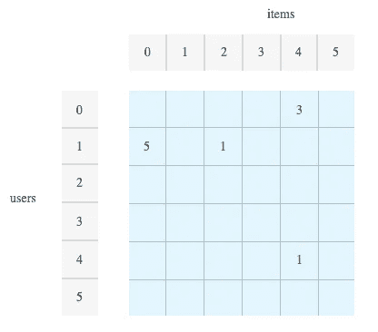
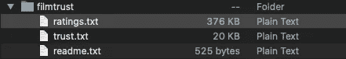
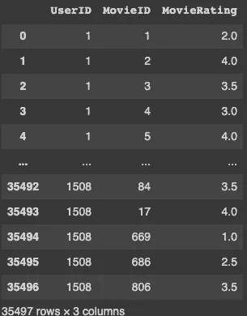

# 快速建立推荐系统

> 原文：<https://medium.com/geekculture/build-a-recommendation-system-quickly-ff2efc314af0?source=collection_archive---------13----------------------->


Photo by [Myke Simon](https://unsplash.com/@myke_simon?utm_source=medium&utm_medium=referral) on [Unsplash](https://unsplash.com?utm_source=medium&utm_medium=referral)

推荐系统告诉我们应该在社交网络上关注谁，应该在网上买什么，应该读什么文章，应该看什么电影。总的来说，如果你能给它排名，你就可以推荐它。在本文中，我们将演示如何用 Python 和 [Surprise](http://surpriselib.com/) 构建一个电影推荐系统。

# 我们怎么知道该推荐哪些电影？

我们将使用来自 Surprise 的奇异值分解(SVD)算法。首先，我们将数据集安排到一个矩阵中，其中每行对应一个用户，每列对应一部电影(项目)，矩阵中的每个值都是一个评级(蓝色区域)。



Source: [Google Cloud](https://cloud.google.com/solutions/machine-learning/recommendation-system-tensorflow-overview#matrix_factorization_for_collaborative_filtering)

SVD 假设数据集中的所有电影都有一组共同的属性。例如，*电影类型*可以被认为是一个属性。如果电影类型是我们唯一的属性，我们可以通过将用户喜欢某个电影类型的程度乘以该电影符合该类型的程度来预测用户的电影评级。例如，我们的算法会预测一个喜欢动作片的用户会给经典动作片 [*【不可能的任务】*](https://en.wikipedia.org/wiki/Mission:_Impossible_(film_series)) 很高的评价。


[Close Call Scene](https://www.youtube.com/watch?v=ar0xLps7WSY&ab_channel=Movieclips) — Mission Impossible (1996)

# 数据

[FilmTrust](https://guoguibing.github.io/librec/datasets.html) 数据集包含 1508 个用户对 2071 部电影的评级，这些评级包含在 *ratings.txt* 文件中。



You only need ratings.txt

我们将使用[熊猫](https://pandas.pydata.org/docs/getting_started/index.html)载入数据。

```
data = pd.read_csv('ratings.txt', sep=" ", header=None)data.columns = ['UserID', 'MovieID', 'MovieRating']print(data)
```

*ratings.txt* 文件由空格分隔，各列没有任何标题。加载数据后，我们在列中添加标题。



Our data in a pandas DataFrame

# 设置您的环境

接下来，您需要为您的环境安装惊喜库(我使用了 [Google Colab](https://colab.research.google.com/notebooks/intro.ipynb) )。

```
pip install scikit-surprise
```

如果你没有使用 Google Colab 或 Jupyter 笔记本，那么你需要知道一些依赖关系(我使用的版本在括号中)。

```
joblib>=0.11 (1.0.1) 
six>=1.10.0 (1.15.0)
numpy>=1.11.2 (1.19.5) 
scipy>=1.0.0 (1.4.1)
```

接下来，我们要导入以下内容

```
from collections import defaultdict
from surprise import SVD
from surprise import Dataset
```

# 获得最佳推荐

为了获得每个用户的最佳推荐，我们需要创建一个函数， *get_top_n.* 该函数有两个参数，*预测，*是由 SVD 算法生成的列表， *n* 是我们为每个用户显示的推荐数量。默认设置为 10，但您可以随意更改。

```
def get_top_n(predictions, n=10): # Stage 1: First map the predictions to each user. top_n = defaultdict(list) for uid, mid, true_r, est, _ in predictions: top_n[uid].append((mid, est)) # Stage 2: Sort the predictions for each user and retrieve the k highest ones. for uid, user_ratings in top_n.items(): user_ratings.sort(key=lambda x: x[1], reverse=True) top_n[uid] = user_ratings[:n] return top_n
```

我们从预测中提取四个变量， *uid* (用户 ID)*mid*(电影 ID)*true _ r*(我们的用户给出的电影评级)和 *est* (来自 SVD 的估计评级)。下划线相当于一些我们不会用到的预测信息，所以你可以忽略它。我们将用户 id、估计收视率和电影 id 链接在一起，并将结果存储在 *top_n* 变量中。

对于阶段 2，对估计的分级进行排序，以便只为每个用户选择最高分级的第 *n* 部电影。*用户评分*包括电影 id 和估计评分。返回的变量是一个字典，其中关键字是用户 id，值是包含电影 id 和估计收视率的元组列表。下面是一个例子，其中用户 65 对电影 432 的估计评级为 3.5。

```
Results >>>{65: [(432, 3.5)]}
```

# 利用惊喜

我们需要确保惊奇能理解我们的数据。需要*阅读器*是因为 FilmTrust 数据集使用 0.5-4 的评级标准，这是非标准的(默认为 1-5)。我们可以使用 *load_from_df* 方法，因为我们正在处理一个熊猫数据帧。

```
reader = surprise.Reader(rating_scale = (0.5,4.0))data = surprise.Dataset.load_from_df(data, reader)
```

接下来，我们创建一个训练和测试集。 *build_anti_testset* 方法用于确保训练集和测试集中的评级之间没有重叠。我们在训练集上拟合 SVD 算法，然后在测试集上运行它以获得我们的预测。然后，我们可以将这些预测输入到我们的 *get_top_n* 函数中，以获得每个用户的前 *n* 个推荐。

```
trainset = data.build_full_trainset()testset = trainset.build_anti_testset()algo = SVD()algo.fit(trainset)# Estimate ratings for all pairs (userID, movieID) that are NOT in the training set.predictions = algo.test(testset)top_n = get_top_n(predictions, n=10)
```

但是我们还没有完成。用户不需要看到我们的估计评级，所以我们隐藏他们从我们的最终结果。

```
# Print the recommended movies for each userfor uid, user_ratings in top_n.items():print(uid, [mid for (mid, _) in user_ratings]) >>> Results34 [805, 286, 728, 297, 675, 299, 770, 1173, 689, 52] 
```

我们的最终结果显示了向每个用户推荐了哪些电影，电影 805 是向用户 34 最高度推荐的电影，因此他们应该立即观看。

# 结论

现在你知道了如何建立一个推荐系统，你可以通过测试由 Surprise 提供的不同算法来做进一步的实验，并且你可以尝试其他数据集。然而，你可以确定你已经完成了最难的部分。