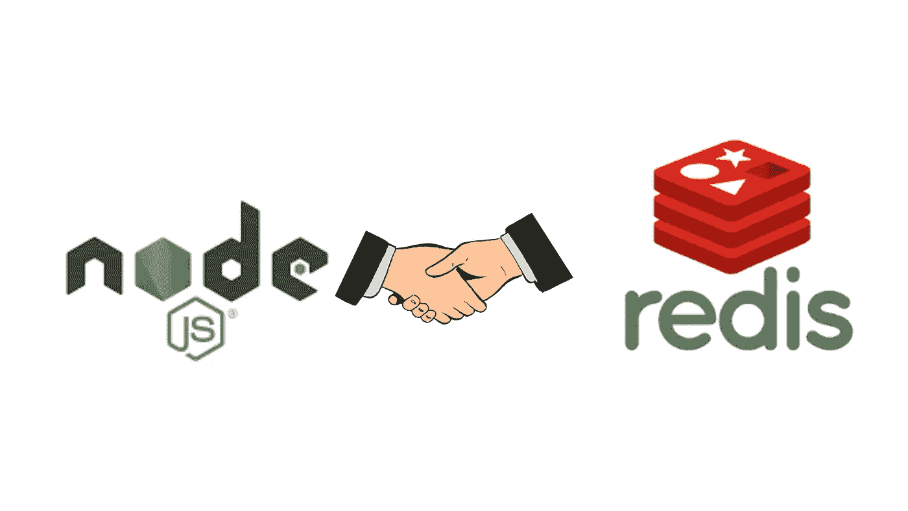
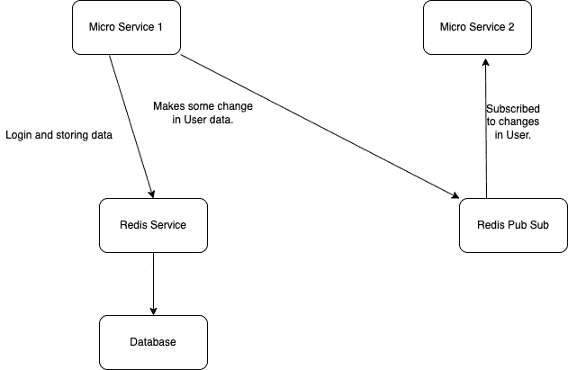
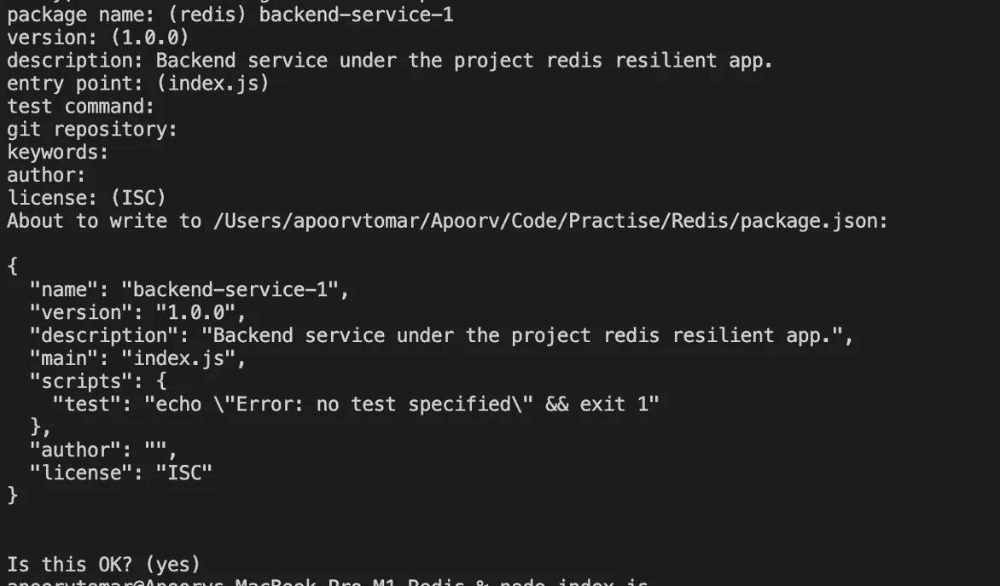
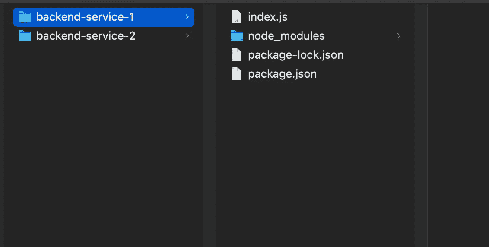
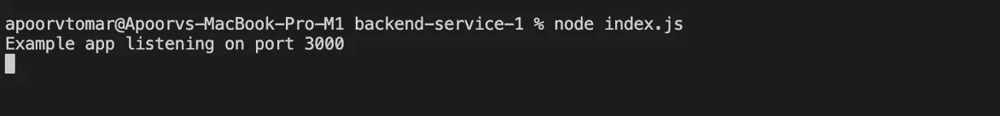
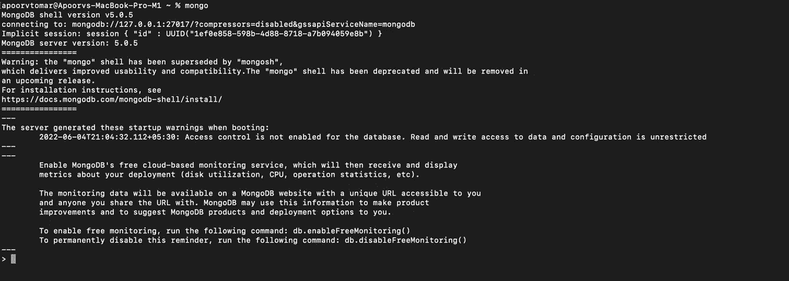
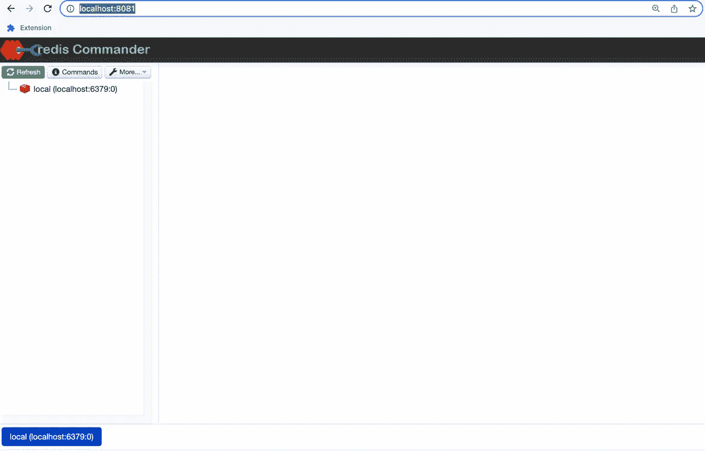

# 使用 Redis 产品构建弹性应用程序。

> 原文：<https://medium.com/geekculture/build-a-resilient-application-using-redis-offering-7145d2b2e1c?source=collection_archive---------22----------------------->

## 让我们尝试使用 Node Js 和 Redis 构建一个应用程序进行缓存，并利用 Redis 发布子模型。

让我们尝试使用 Node Js 和 Redis 构建一个应用程序，这些应用程序利用了缓存，并且还利用了 Redis 发布-订阅模式。



Icon showing NodeJs and Redis.

因此，在本文中，我们将探讨如何利用 Redis 作为一个缓存系统，并利用 Redis 提供的发布/订阅消息传递范例的能力。目前，我们使用 Node JS 作为我们的后端技术，但是 Redis 与大多数编程语言兼容。

# 介绍

首先，让我们试着了解我们计划构建的整个系统的概况。为了更好的视觉理解，我绘制了架构图，这将有助于我们关联不同服务之间的链接。还有 Redis 在整个系统中的作用。

如果你不了解基于微服务的架构，我建议你阅读这篇关于[微服务编排与编排|(技术)](https://apoorv-tomar.medium.com/microservices-orchestration-vs-choreography-technology-5dbe612cf7e9)的文章。这篇文章会让你对微服务有一个基本的了解。此外，它将告诉您微服务编排与编排之间的区别。



1\. Architecture Diagram

出于演示目的，我们计划使用 Node Js 技术构建两个微服务。发布我们将创建一个登录 API，在其中一个包含用户登录细节的服务中。微服务将检查数据是否存在于 Redis 中。如果它不能从 Redis 中找到数据，它将会去被选择的数据库，那将会是事实的最终来源。

一旦它找到数据，它将更新 Redis，在未来，Redis 将是我们的真理来源。

之后，第二个微服务将开始发挥作用。它将通过连接到同一个 Redis 实例，尝试按 ID 获取用户信息。我们将通过直接从数据库中获取数据来进行比较。虽然 Redis 代表远程词典服务，可以作为数据库使用。但是 Redis 数据库产品将在另一篇文章中讨论。否则，这只会使当前的文章变得混乱。

在发布登录逻辑的第二步中，我们将更新其中一个微服务中的用户信息，并让另一个微服务监听它，而不是轮询。我们将利用 Redis 提供的发布-订阅范例。这将是整个教程的议程。

# 教程的先决条件。

1.  理解 node，express 和 javascript。该节点应该安装在您的系统上。
2.  对 MongoDB 的理解。MongoDB 应该安装在您的系统上。
3.  微软 VS 代码编辑器。虽然任何编辑器都可以使用。

```
**Table of Content** 1\. Setting Up Two microservices using Node JS.
2\. Setting Up Mongo DB and connecting it with the microservices.
3\. Setting Up Redis and connecting them with microservices.
4\. Creating Login API in Microservice One.
5\. Setting Up Redis Pub-Sub and utilising it in our microservices.
6\. Redis Commander.
7\. Wrap Up and References.
```

# 1.使用 Node JS 设置两个微服务。

让我们从两个节点服务开始。为了设置这两个服务，我们需要执行以下步骤。

1.  使用 npm init 初始化项目
2.  创建一个“index.js”文件，并添加基本的 express 代码。
3.  使用 npm install express 命令安装快速软件包。

我们可以按照命令设置节点项目，这将初始化

使用以下命令创建节点项目。

```
> npm init
```

您将在您的终端中看到以下命令，填写以下细节，您可以在下图中看到。信息如名称，版本，描述，主要，脚本，作者，许可证等。让我们称这个服务为后端服务 1。



2\. Npm init screen

发布我们将创建一个文件 index.js 文件。我们可以通过添加以下命令来创建一个简单的 express 服务器。这个服务将在端口 3000 上启动您的 express 服务器，正如我们在代码中提到的。

```
**// index.js**const express = require('express')
const app = express()
const port = 3000app.get('/', (req, res) => {
    res.send('Hello World Service 1! ')
})app.listen(port, () => {
    console.log(`Example app listening on port ${port}`)
});
```

现在我们可以创建另一个类似于 backend-service-1 的服务，并将其命名为 backend-service-2。让我们为 backend-service-2 服务重复类似的过程。即

1.  从 npm 初始化开始
2.  创建 index.js 文件
3.  使用命令安装 express。npm 快速安装
4.  添加基本 express 代码并在端口 3001 上运行。通过更新端口变量。const port = 3001

提交这两个服务的创建，你的代码结构应该类似下图(图 3)。为了方便起见，下面是后端服务 1 的代码结构的扩展视图。后端服务 2 也有类似的结构。



3\. Code structure of Backed Service 1.

通过打开目标位置并使用以下命令，您可以为每个服务运行代码

```
> node index.js
```

发布此消息后，您将在终端上看到以下命令。



Node JS Application.

# 2.设置 Mongo DB 并将其与微服务连接。

发布设置微服务的步骤，我们需要连接 MongoDB 和我们的应用程序。为了将 MongoDB 与我们的应用程序连接起来，我们需要首先在我们的系统/服务器上安装并运行 MongoDB。

要安装和运行 MongoDB，您可以遵循本教程。在 OSX 上安装 MongoDB。

一般来说，我们在多台服务器上设置 MongoDB 集群，这有助于使它更加防摔。

但是出于教程的目的，单个实例将非常有效。本教程适用于 OSX，但如果你使用的是另一个操作系统，如 Windows 或 Ubuntu。您可以搜索相应的教程并继续安装。

您可以尝试以下命令，检查是否安装了 mongo，您将看到类似下面的内容。

```
> mongo
```



4\. Image showing mongo is installed.

一旦我们完成了安装和其他工作，现在我们可以使用 MongoDB npm 包将 mongo 与 NodeJS 微服务连接起来。

使用以下命令安装 npm 软件包。

```
> npm i mongodb
```

安装包之后，我们需要为 mongo 连接添加代码。通过创建一个名为 mongo.js 的文件，我们将在其中添加 mongo 代码。

*我们需要在你的 package.json 文件中添加{type: "module"}，这个文件可以在根目录下找到，它将帮助你使用 es6 语法。*

下面是连接 mongo DB 和你的应用程序的代码。在这里您可以看到我们已经连接了 mongo DB，它运行在 localhost:27017 上。

**Mongo DB 默认端口:27017**

这是一个全局函数，将创建与数据库的连接。使用该连接，我们将进行后续的 Db 查询。

```
**//mongo.js**import { MongoClient } from 'mongodb';export async function connectToCluster() {
    const uri = 'mongodb://localhost:27017';
    let mongoClient; try {
        mongoClient = new MongoClient(uri);
        console.log('Connecting to MongoDB');
        await mongoClient.connect();
        console.log('Successfully connected to MongoDB!'); return mongoClient;
    } catch (error) {
        console.error('Connection to MongoDB failed!', error);
        process.exit();
    }
}
```

我们可以为 backend-service-2 做一个类似的实现，并设置 mongo DB。

# 3.设置 Redis 并将其与微服务连接。

设置好 node 微服务并与 MongoDB 连接后。我们已经准备好期待我们的下一步，即安装 Redis 并将其与我们的微服务连接

对于 Mac OS，我们可以使用 brew 在我们的项目上安装和运行 Redis 服务。

```
brew install redis
```

**Redis 默认端口:6379**

现在，您可以使用以下任何命令启动 Redis 服务器。当然是后装。

```
redis-server
```

或者您可以将其作为 brew 服务启动，这将有助于此服务在后台持续运行。

```
brew services start redis
```

到目前为止，我们已经在本地系统上完成了 Redis 的设置。我们可以在云(AWS，G Cloud，Azure 等)上设置 Redis 的类似过程。).

现在让我们将 Redis 连接到我们的服务。因此，下一步是使用以下命令将 Redis npm 软件包安装到您的两个服务上。

```
npm i redis
```

安装 Redis 包后，我们需要创建一个 Redis 实例，我们将进一步使用它。

```
//redis.js
import redis from 'redis';export const client = redis.createClient();client.on('connect', () => {
    console.log('Connected to Redis Successfully.')
});
```

这里我们导出一个 Redis 实例，我们将用它来连接和进一步查询。

现在我们完成了基本的设置，下一步，我们将连接到 Redis 服务器。在建立了正确的连接之后，我们将利用缓存来处理 get 请求。

# 4.在微服务一中创建登录 API。

现在，一旦我们完成了 Redis 和 Mongo DB 连接，并将其与我们的应用程序连接，现在是时候通过一个简单的登录 API 使用 Redis 缓存了。

在这个 API 中，我们将创建一个简单的登录 API，其中我们将传递登录用户名和密码。

> *不建议用明文传递密码。但是出于辅导的目的，我们正在做这个活动。*

让我们添加登录 API 的代码，张贴我们将通过代码。下面是更新后的 index.js 文件。它包含一个登录 API，如果我们在 Redis 内存数据库中找不到数据，它会调用我们的数据库。

```
**// index.js**import express from 'express';
import { connectToCluster } from './mongo.js';
import { client } from './redis.js';const app = express()
const port = 3000
let mongoClient = null;app.get('/', async (req, res) => {
    res.send('Hello World Service 1! ')
}); app.get('/login/:name/:password', async (req, res) => {
    try { const { name, password } = req.params;
        // check if pass exist in redis.
        const tempPassword = await client.get(name);
        if (tempPassword) {
            if (tempPassword === password) {
                res.send('Login Success from Redis.');
            }
        } 
        else { // Mongo DB Query
            mongoClient = await connectToCluster();
            const dbName = 'test';
            const db = mongoClient.db(dbName);
            const collection = db.collection('user');
            const findResult = await collection.findOne({ name, password }) if (findResult) {
                await client.set(name, password);
                res.send('Login Success from DB.');
            } else {
                res.send('Login Failed.');
            } } } catch (err) {
        console.log(err)
        res.send('Login Failed.');
    }
    finally {
        await mongoClient.close();
    }
});app.listen(port, async () => {
    client.connect();
    console.log(`Example app listening on port ${port}`)
});
```

## 以上代码的解释。

```
app.get('/login/:name/:password'
```

这是我们定义的 API 端点，它期望用户将名称和密码作为参数传递。

```
const tempPassword = await client.get(name);
if (tempPassword) {
        if (tempPassword === password) {
            res.send('Login Success from Redis.');
        }
}
```

在这里，我们检查我们在 Redis 中有一些条目，它们的名称是关键字。

> 在 Redis 中，我们可以存储各种数据类型，从普通的字符串到散列映射。我们将数据存储为简单的键和值。其中密钥是用户名，值是密码。

再次强调，在生产中，我们不会以纯文本形式存储密码，这只是为了让我们理解 Redis。

接下来，我们将检查是否正在 Redis 中获取数据，我们只需比较密码。如果我们没有得到任何与传递的名称相匹配的键，我们就前进到 DB 调用。

```
else {
            // Mongo DB Query
            mongoClient = await connectToCluster();
            const dbName = 'test';
            const db = mongoClient.db(dbName);
            const collection = db.collection('user');
            const findResult = await collection.findOne({ name, password })
 if (findResult) {
                await client.set(name, password);
                res.send('Login Success from DB.');
            } else {
                res.send('Login Failed.');
            } }
```

下面是 else 的简单表示，以防我们在 Redis 存储中找不到该名称。在 else 块中，一旦我们能够找到一个成功的登录，我们就将用户名和密码添加到 Redis 内存缓存中。使用下面的代码。

```
if (findResult) {
                await client.set(name, password);
                res.send('Login Success from DB.');
} else {
                res.send('Login Failed.');
 }
```

我们将制作一个如下所示的 API，它需要一个用户名。一旦我们收到用户名，我们就将它发布到名为“user”的通道上的其他服务，将会有许多请求返回相同的数据，缓存似乎是一个很好的选择。

# 5.建立 Redis 发布订阅并在我们的微服务中使用它。

为了利用发布-订阅范式，我们正在创建一个 API 来更新后端服务-1 中的用户信息。并且另一个服务，即后端服务-2 将通过订阅该信道来监听这些变化。

我们将制作一个如下所示的 API，它需要一个用户名。一旦我们收到用户名，我们就将它发布到名为“user”的通道上的其他服务。基本上，这个消息是从我们的后端服务 1 广播的。现在，任何想听这个变化的人都可以简单地订阅这个频道，并利用消息广播。

```
app.get('/updateName/:name', async (req, res) => {
    const { name } = req.params; client.publish('user', name);
    res.send(`Name: ${name} is been published`)
});
```

我们已经在后端服务 2 中订阅了名为“用户”的频道。如前所述，一旦有人点击后端服务 1 上的更新名称 API，消息就会发布到用户通道。因为后端服务 2 预订了相同的信道，所以它将接收发送的消息，即要更新的名称。

现在，服务 2 可以自由地处理数据了。

```
app.listen(port, async () => {
    client.connect();
    await client.subscribe('user', (message) => {
        console.log(message); // 'message'
    });
    console.log(`Example app listening on port ${port}`)
});
```

类似地，我们可以使用发布-订阅范例来解决各种用例。

# 6.Redis 指挥官。

作为额外的提示，我们有一个名为 Redis commander 的工具。Redis commander 是一个用户界面，可以让你看到 Redis 中的数据。

要安装该工具，您可以使用以下命令。

```
> npm i -g redis-commander
// Post installation to run redis commander, use this command.
> redis-commander
```

将呈现如下所示的用户界面。这使得搜索和分析变得非常容易。

参考:[https://www.npmjs.com/package/redis-commander](https://www.npmjs.com/package/redis-commander)

# 7.总结和参考。



User Interface of Redis Commander.

在这篇教程中，我们探讨了 Redis 缓存机制和发布-订阅范式。Redis 提供的这些功能可用于各种目的。这些特性可以帮助您的应用程序更好地伸缩。

除了另一个好处，数据在内存中，随时可用。因此，与典型的数据库相比，延迟要小得多。

Redis 提供了各种各样的附加特性可以使用，比如将 Redis 用作完整的数据库、数据持久性等。但是将在接下来的教程中讨论这个主题。

同时，从他们的官方网站( [Redis](https://redis.io/) )上了解更多关于 Redis 的信息

其他参考。

*   [免费试用 Redis 云](https://redis.info/3NBGJRT)
*   [观看此视频，了解 Redis 云相对于其他 Redis 提供商的优势](https://redis.info/3Ga9YII)
*   如果可能，嵌入此视频
*   [Redis 开发者中心——关于 Redis 的工具、指南和教程](https://redis.info/3LC4GqB)
*   [RedisInsight 桌面 GUI](https://redis.info/3wMR7PR) Redis

*这篇文章是与 Redis 合作的。*

# 关于作者

Apoorv Tomar 是一名软件开发人员，也是[mind bake](https://mindroast.com/)的一员。你可以在 [Twitter](https://twitter.com/apoorvtomar_) 、 [Linkedin](https://www.linkedin.com/in/apoorvtomar/) 、 [Telegram](https://t.me/ApoorvTomar) 和 [Instagram](https://www.instagram.com/apoorvsinghtomar/) 上和他联系。订阅[简讯](https://www.mindroast.com/newsletter)获取最新策划内容。不要犹豫在任何平台上说“嗨”,只要说明你是在哪里找到我的资料的。