# 用 Django REST 框架构建 REST API

> 原文：<https://medium.com/geekculture/build-a-rest-api-with-django-rest-framework-a6088fdb6fa0?source=collection_archive---------1----------------------->

## 在 Django 中构建 REST API 非常简单。在本教程中，我们将逐步创建您的第一个 API。


image from realpython.com

# 为什么要使用 REST API？

在我们开始有趣的东西之前，最好知道为什么要创建 API。

rest API 是从我们的应用程序向其他应用程序提供数据的一种方式。那些其他应用程序可以以任何他们想要的方式使用它。通常，API 也允许应用程序修改数据。

一般来说，API 是一种通过请求编辑数据库内容的方式。您收到的是静态响应，通常是 JSON 格式的，无论您请求什么。

Rest APIs 是软件开发的必备技能，所以你必须知道它们是如何工作的。

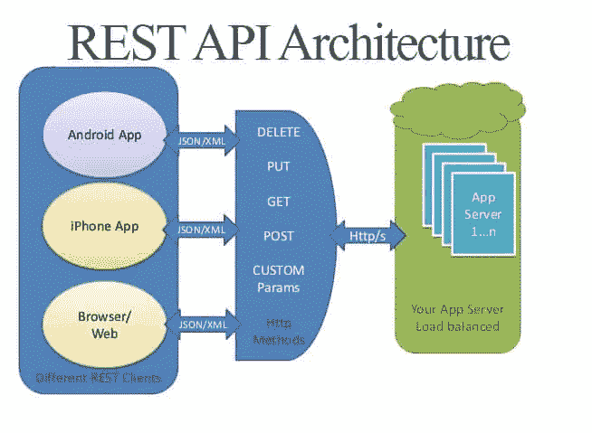

image from shareurcodes.com

# 为什么选择 Django REST 框架？

使用 Django REST 框架的最好理由是，它使序列化的艰苦工作变得非常容易！

# 我们在创造什么？

我们将创建一个图书 API 应用程序，在其中我们可以创建，读取，更新和删除(简称 CRUD)图书条目。

# 现在有趣的事情。

现在，我们将创建一个应用程序来测试所有这些东西。

# 安装 Django 和 Django rest 框架

```
$ pip install Django djangorestframework
```

# 建立 Django 项目

现在，让我们创建项目

```
$ django-admin startproject Books
```

我将命名姜戈计划书籍。

现在，让我们进入新创建的文件夹“Books”:

```
$ cd Books
```

现在让我们为 Django 项目创建应用程序。

```
$ python3 manage.py startapp main
```

App 名称为主。(叹气..)

在“书籍”文件夹的 settings.py 中注册应用程序名称。

```
INSTALLED_APPS = [
    'main',
    ...
]
```

现在测试服务器是否正常。运行以下命令启动 Django 服务器:

```
$ python3 manage.py runserver
```

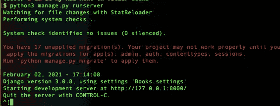

Ignore the warning. Image from the author

现在我们打开给定的 IP 地址 [http://127.0.0.1:8000/](http://127.0.0.1:8000/) 。

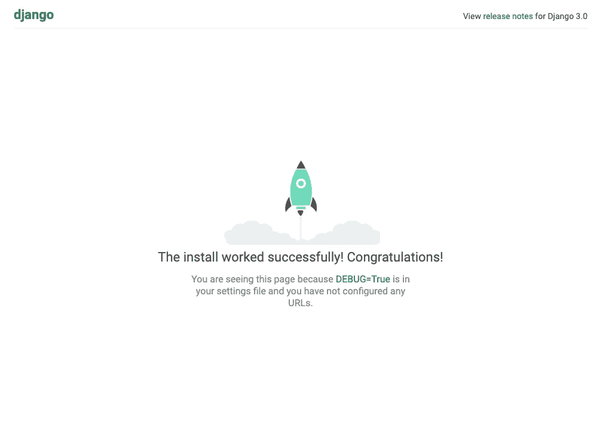

Image from the author

我们可以看到 Django 多么高兴地告诉我们 web 应用程序正在工作，我们可以确认服务器正在工作。

## 解决迁移错误:

为了解决我们第一次运行服务器时看到的错误，我们必须在终端上运行这个命令。

```
$ python3 manage.py migrate
```

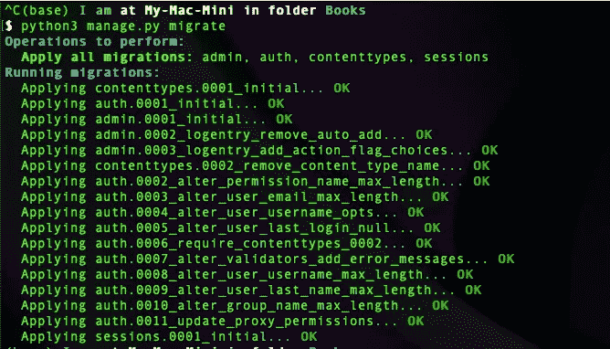

Image from the author

现在，当我们运行服务器时，我们不会看到这个错误。

## 创建超级用户

我们将要创建一些模型。如果我们想查看数据库中的书籍时，能够访问 Django 漂亮而经典的管理页面，那就太好了。

使用此命令创建全能的超级用户。

```
$ python3 manage.py createsuperuser
```

您将被要求填写如下几个字段，您只需回答它们，注意您需要记住用户名和密码，因为我们将需要它。

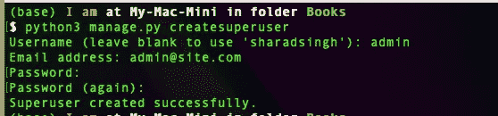

Image from the author

来验证它是否有效。让我们启动 Django 服务器，然后进入这个链接[http://127 . 0 . 0 . 1:8000/](http://127.0.0.1:8000/)admin/

现在，我们将受到这个登录表单的欢迎。

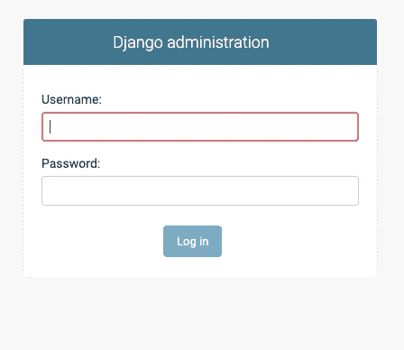

Image from the author

您应该输入刚才在终端中输入的用户名和密码

输入用户名和密码后，迎接你的将是这个非常专业的管理页面！

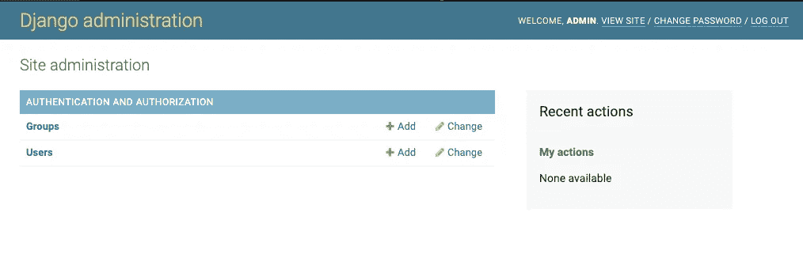

looks beautiful, doesn't it?

# 创建我们值得信赖的 Django ORM 将管理的图书模型

让我们创建图书模型！

现在让我们转到主文件夹中的 models.py 文件，并添加创建模型:

We have added the book class to the models.py file.

我们的 book 对象将只包含两个字段:书名和作者。

现在让我们将模型注册到主文件夹的 admin.py 文件中的管理页面。

运行迁移(按顺序运行命令)

```
$ python3 manage.py migrate
$ python3 manage.py makemigrations
$ python3 manage.py migrate
```

现在，让我们运行服务器并再次打开管理页面。

```
$ python3 manage.py runserver
```

现在，我们将在管理页面上看到另一个名为 main(我们的应用程序名称)的表。)

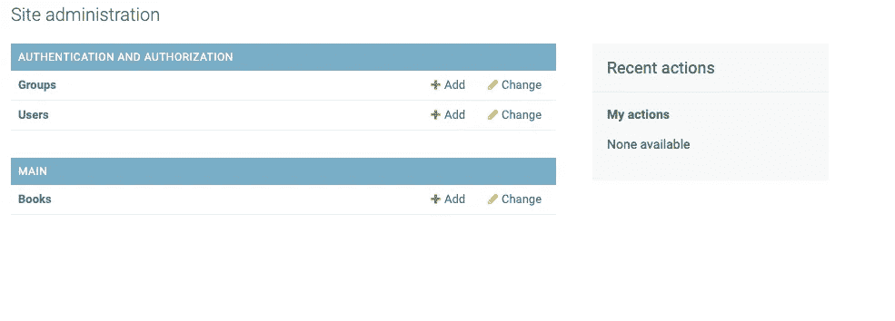

Image from the author

通过点击名为 main 的表格下的书籍，我们将看到这一点。

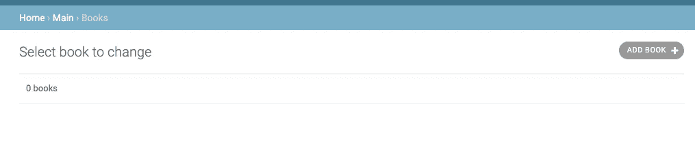

Image from the author

要创建一个新的 book 对象，我们需要单击 add book 按钮。我们需要填写如下表格，然后点击“保存”按钮:


Image from the author

当我们回去的时候，我们会看到一个新的物体。


Image from the author

通过单击对象，您可以选择删除和更新实例。如果需要，您可以创建更多的实例。

# 创建 REST API

现在，让我们使用 Django-rest-framework 来创建 API。

让我们将 rest_framework 追加到 INSTALLED_APPS 字典中。

‘…’ refers to Django's own apps

现在，让我们在主应用程序文件夹中创建一个名为“api”的文件夹，并创建名为['serializer.py '，' urls.py '的新文件。views.py']。

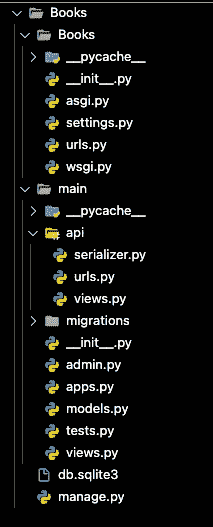

Folder structure by now and will remain. Image from the author

## 使用 ModelSerializer 序列化模型

序列化是将模型转换为 JSON 的过程。使用序列化器，我们可以指定模型的 JSON 表示中应该出现哪些字段。

序列化程序会将图书模型转换成 JSON 表示，这样 API 用户就可以解析它们，即使他们没有使用可信的 python。反过来，当用户向我们的 API 提交请求 JSON 数据时，序列化程序会将该 JSON 转换为 Book 模型，以便我们保存或验证。

在这里，我们传递要序列化的图书模型，并以' __all__ '的形式传递字段，因为我们需要显示 rest API 中的所有字段。__all__ '还包含显示图书实例 id 的 id 字段。

## 创建 rest API 视图集

将下面的代码粘贴到 API 文件夹的 views.py 文件中，

这里，我们已经创建了一个视图集，从数据库中传递了图书模型的所有实例或对象，

## URL 有效。

## 将路径添加到 API urls.py 文件

## 将 API urls.py 注册到项目 urls.py

将此代码粘贴到下面。

现在，我们已经将 API urls.py 文件链接到了 Books 文件夹下的主 urls.py 文件。

The path to API will be ‘books/’ as in line 7

任务代码完成。任务测试开始

# 检验和测试 API

因此，让我们运行服务器并打开[http://127 . 0 . 0 . 1:8000/books/](http://127.0.0.1:8000/books/)，迎接我们的将是:

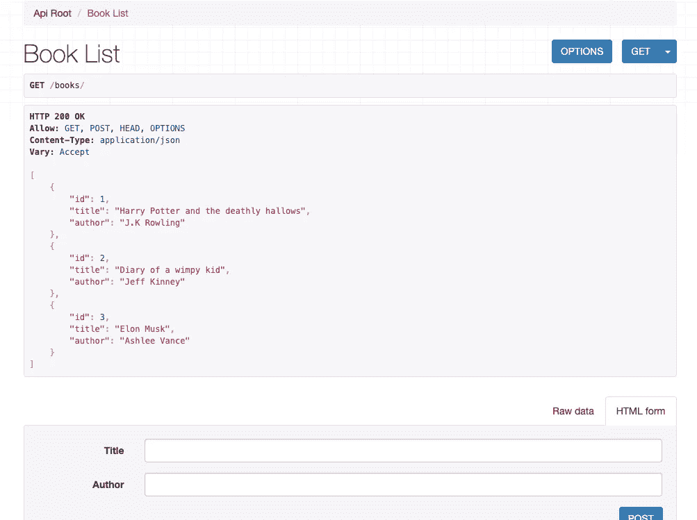

因此，在这个 URL 中，我们得到了一个我们创建的所有 book 实例的列表，以及一个创建新实例的选项，可以随意使用它们。

当我们转到这个 URL[http://127 . 0 . 0 . 1:8000/book](http://127.0.0.1:8000/books/)s/(任何实例 id)时，我们将可以选择获取、删除或更新(上传)实例

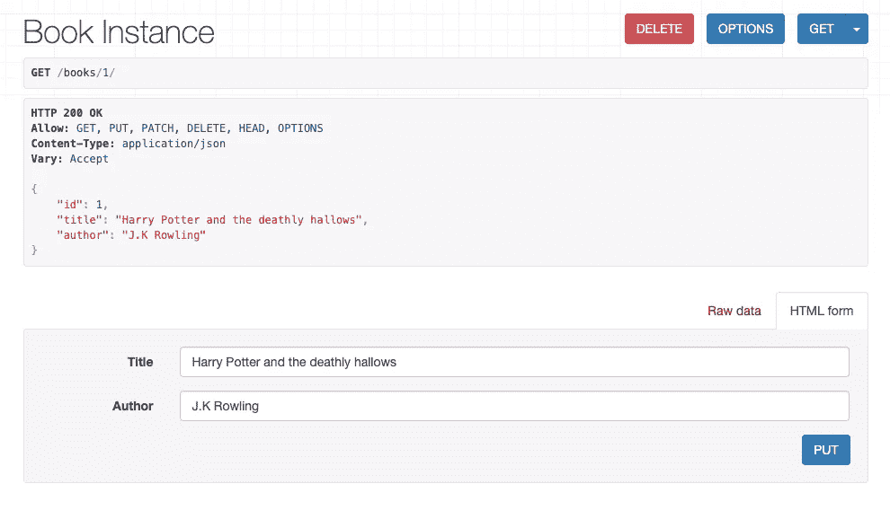

Option to do get, delete or put request.

## 奖金！

使用请求模块创建一个新的 book 实例。

注意:您将需要启动服务器，否则文件将抛出一个错误。

要安装请求模块，请在终端中键入以下内容:

```
$ pip install requests
```

在任何名为 requests.py 或 client.py 的文件夹中创建一个新文件，并复制这段代码。

在 create_new_book 方法中，我们可以看到，我们接受参数，将它们转换成一个字典，并向[http://127 . 0 . 0 . 1:8000/books/](http://127.0.0.1:8000/books/)发送请求

而在 get_all_books 中，它使用 get 请求来获取一个列表中的所有 book 实例。

当我们观察书籍实例列表时，它还显示了加来道雄新增加的书籍《平行世界》(我建议你应该读一读。)

这样，我们可以从服务器获取数据到我们自己的 python 文件中，并以任何我们想要的方式使用它。

# 告别

我希望你在本教程中玩得开心。当然，在 rest APIs 中事情会变得更复杂，但这是起点。

如果你有任何问题，请对这个帖子发表评论，我很乐意帮助你，或者我们有值得信赖的 StackOverflow。

# 再见。