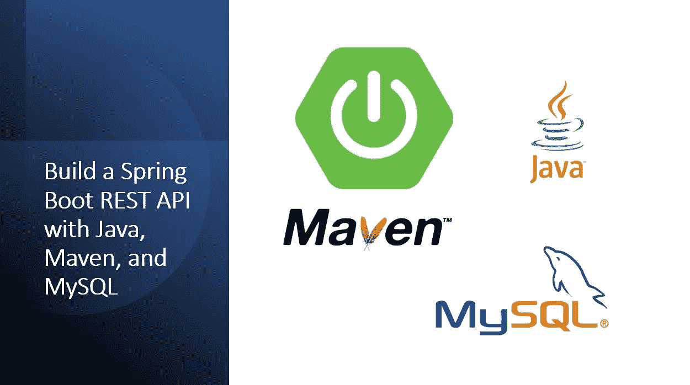

# 用 JPA、Maven 和 MySQL 构建一个 Spring Boot REST API

> 原文：<https://medium.com/geekculture/build-a-spring-boot-rest-api-with-java-maven-and-mysql-92bdb654caa9?source=collection_archive---------0----------------------->

在本教程中，我们将学习如何用 **Maven** 和 **MySQL** 构建一个 **Spring Boot** Rest API。Spring Boot 通过减少 Spring 项目的配置和设置时间来帮助您加速应用程序开发。

让我们看看使用 Spring Boot 建立一个 REST API 有多快。我们将在本教程中使用 **Eclipse** 和 [**Maven**](https://maven.apache.org/) 。maven 项目包含一个项目对象…