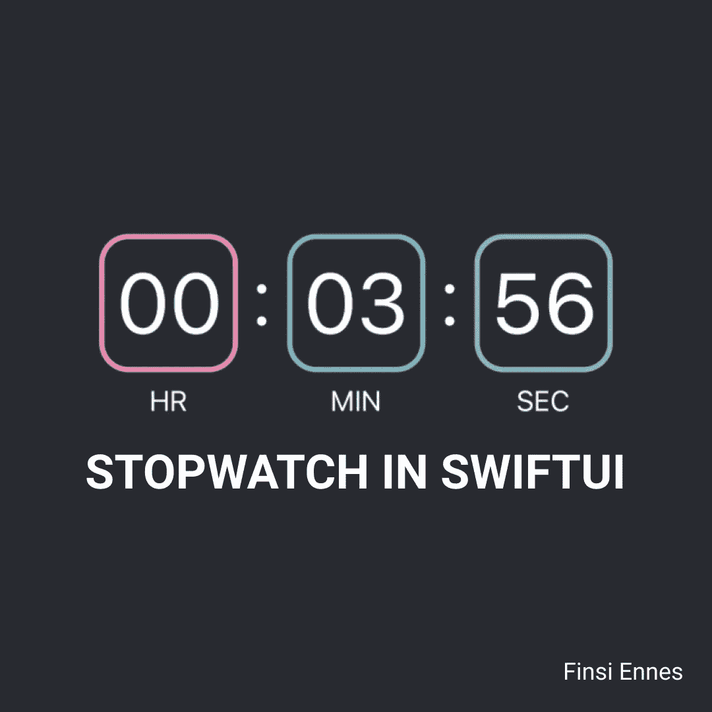

# 使用 SwiftUI，只需 3 个步骤即可制作秒表

> 原文：<https://medium.com/geekculture/build-a-stopwatch-in-just-3-steps-using-swiftui-778c327d214b?source=collection_archive---------4----------------------->

## 使用基础知识来建立一个功能齐全的秒表

SwiftUI 为我们提供了许多工具来编写用户界面。在本文中，我们将使用这个框架，通过三个简单的步骤来构建一个全功能的秒表组件。

这将是最终的结果: