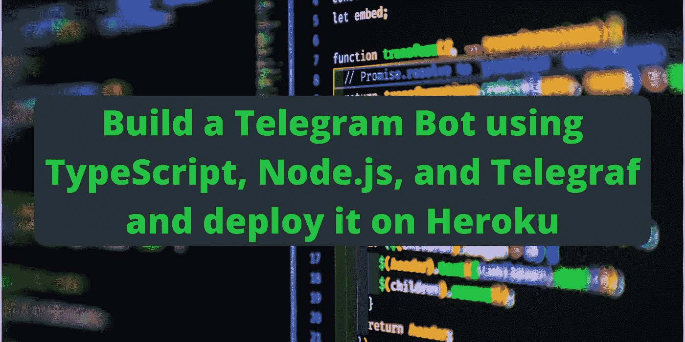
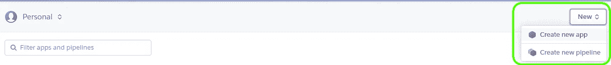
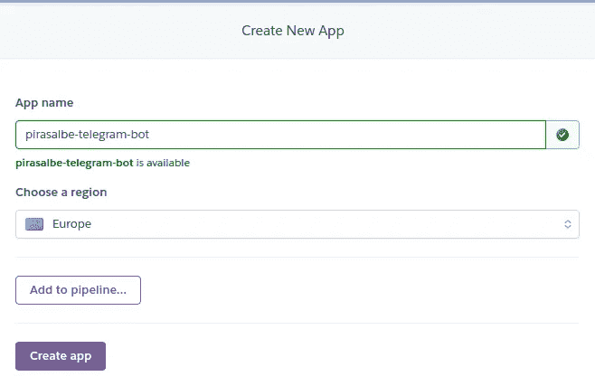
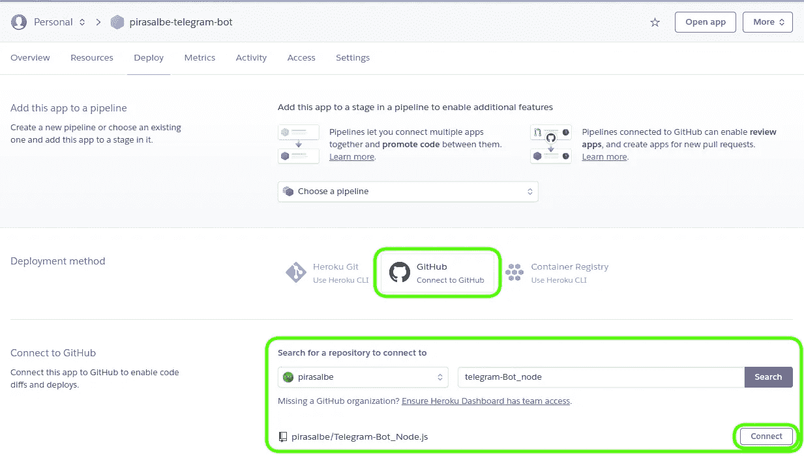
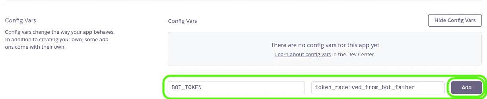
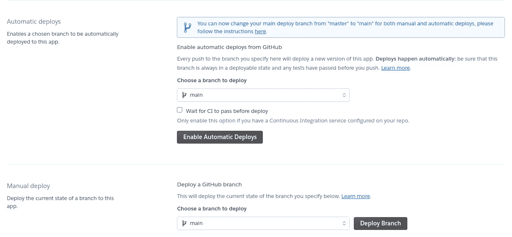
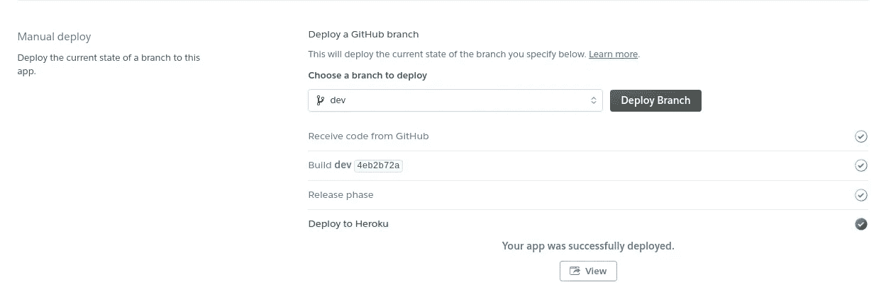
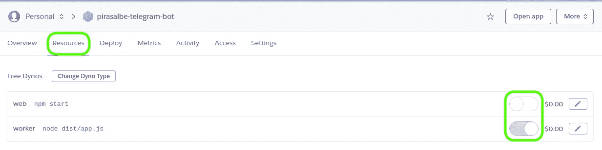

# 使用 TypeScript、Node.js 和 Telegraf 构建一个电报机器人，并将其部署在 Heroku 上

> 原文：<https://medium.com/geekculture/build-a-telegram-bot-using-typescript-node-js-and-telegraf-and-deploy-it-on-heroku-fcc28c15614f?source=collection_archive---------1----------------------->



Photo by [Joan Gamell](https://unsplash.com/@gamell?utm_source=unsplash&utm_medium=referral&utm_content=creditCopyText) on [Unsplash](https://unsplash.com/s/photos/node-js?utm_source=unsplash&utm_medium=referral&utm_content=creditCopyText)

Telegram 允许开发者构建第三方应用，并在其平台内运行。它提供了 Bot API，这是一个记录良好的基于 HTTP 的接口，并提供了许多用几种语言编写的示例 Bot，作为快速入门的例子。

然而，有很多不同的库，选择使用哪一个，了解它，然后找到一个主机来部署 bot 以随时访问它，这可能是压倒性的和耗时的。

在本文中，我将解释如何使用 Node.js 和 TypeScript 编写一个电报机器人，以及如何在 Heroku 上部署它。

## 发展环境

我正在使用一台装有 Linux Mint 20.2 和 Visual Studio Code 1.61.2 的计算机来编写这个机器人。

该项目将使用以下依赖项。我稍后会解释如何安装它们。

*   Node.js: 17.0.1
*   国家预防机制:8.1.0
*   `typescript` : 4.4.4
*   `telegraf` : 4.4.2
*   `@types/node` : 16.11.2
*   `eslint` : 8.1.0

你可以从这个 GitHub 库中看到并下载这个项目，如下所述。

# Node.js 项目

## 安装 Node.js

第一步，从其[官网](https://nodejs.org/en/download/)安装 Node.js。在 Linux 上，我使用了[节点版本管理器(nvm)](https://nodejs.org/en/download/package-manager/#nvm) 。

我使用以下命令安装了 *nvm* 。

```
curl -o- [https://raw.githubusercontent.com/nvm-sh/nvm/v0.39.0/install.sh](https://raw.githubusercontent.com/nvm-sh/nvm/v0.39.0/install.sh) | bash
```

然后安装下一个节点。

```
nvm install node
```

## 创建项目

第二步是开始一个新项目。为您的项目创建一个目录，打开它并在终端中运行以下命令来初始化它。

```
npm init
```

它将询问一些关于项目的信息。您可以在前面的命令中添加`-y`选项来使用默认值。

你可以在[入门指南](https://nodejs.org/en/docs/guides/getting-started-guide/)中找到更多关于如何创建 Node.js 项目的信息。

此时，项目应该看起来像[这个提交](https://github.com/pirasalbe/Telegram-Bot_Node.js/tree/d1b547ffc9f7e735073918561070b842a979da14)。

## 添加类型脚本

[TypeScript](https://www.typescriptlang.org/) 是一种基于 JavaScript 的强类型编程语言，在任何规模下都能为您提供更好的工具。

使用以下命令将 TypeScript 添加到项目中。

```
npm install -D typescript
npm install -D tslint
```

`-D`是`--save-dev`的快捷方式。这些命令安装最新的 TypeScript 版本；您可以通过在依赖名称的末尾添加`@version`来指定所需的名称，例如`npm install -D typescript@4.4.4`。

## 配置 TypeScript

下一步是配置编译器选项。在项目的根目录下添加一个文件`tsconfig.json`，并添加以下内容。

```
{
  "compilerOptions": {
    "module": "commonjs",
    "esModuleInterop": true,
    "target": "es2021",
    "moduleResolution": "node",
    "strict": true,
    "sourceMap": true,
    "lib": ["es2021"],
    "skipLibCheck": true,
    "rootDir": "src",
    "outDir": "dist"
  }
}
```

它定义了:

*   `*module*`:指定生成方式。节点使用`commonjs`。
*   `*esModuleInterop*`:如果为真，它会生成额外的文件来简化对导入 *CommonJS* 模块的支持。
*   `*target*`:发出的 JavaScript 文件的 JavaScript 语言版本。
*   `*moduleResolution*`:指定 TypeScript 如何从给定的模块说明符中查找文件。
*   `*strict*`:启用所有严格的类型检查选项。
*   `*sourceMap*`:为 true 时，它生成额外的 JavaScript 文件以使调试更容易。
*   `*lib*`:指定目标运行时环境中可用的库。
*   `*skipLibCheck*`:跳过所有`.d.ts`文件的类型检查，这些文件是关于用 JavaScript 编写的 API 的类型脚本信息。
*   `*rootDir*`:指定源文件夹。我将把我的源文件添加到`src`文件夹中。
*   `*outDir*`:指定生成的 JavaScript 文件的输出文件夹。

或者，也可以使用以下命令创建该文件。

```
tsc --init
```

你可以在 [TypeScript 文档](https://www.typescriptlang.org/docs/handbook/tsconfig-json.html)和 [JSON 模式](https://json.schemastore.org/tsconfig)上了解更多。

您可以选择为项目配置 TypeScript 林挺。TypeScript ESLint 文档描述了如何做以及如何工作。

也可以使用 [EditorConfig](https://editorconfig.org/) 为您的项目定义编辑器配置。这样，您的 IDE 将遵循在`.editorconfig`文件中定义的规则。

## 更新 Node.js 配置

下一步是配置 Node.js 项目来构建 TypeScript 代码。更新 *package.json* 如下。

```
{
  ...
  "main": "dist/app.js",
  "scripts": {
    "build": "tsc",
    "start": "node dist/app.js",
    ...
  },
  ...
}
```

*   `*main*` : TypeScript 在`outDir`内部生成 JavaScript 入口点。更新这个值，使它指向在输出目录中生成的 JS 文件。
*   `*scripts.build*`:包含编译打字稿文件的命令`tsc`。可以用`npm run build`运行这个脚本。
*   `*scripts.start*`:包含运行项目的命令。可以用`npm start`运行这个脚本。

此时，项目应该看起来像是[这个提交](https://github.com/pirasalbe/Telegram-Bot_Node.js/tree/489d987e8423e67de87442adb64e48e26384e08a)。

## Telegraf

Telegram 提供了允许开发者编写机器人的 API。你可以在[电报机器人 API](https://core.telegram.org/bots/api) 页面找到它们。

这些 API 需要一个令牌来与之交互。如[官方指南](https://core.telegram.org/bots#creating-a-new-bot)中所述，可以通过使用[机器人父亲](https://t.me/botfather)请求一个。你可以在我的另一个故事 [Tasker 和 Telegram integration](/geekculture/tasker-and-telegram-integration-278c53ab1d00#69d7) 中看到这个过程的截图。

[Telegraf](https://github.com/telegraf/telegraf) 是一个使用 Node.js 开发僵尸工具的文档丰富、用途广泛的库。与许多其他库一样，它使得与 API 的交互比发送 HTTP 请求更容易。你可以在[这个电报页面](https://core.telegram.org/bots/samples#node-js)上找到 Node.js 和其他语言的全部内容。

使用以下命令安装依赖项。

```
npm install telegraf
```

## 写一个简单的机器人

下一步是为机器人编写一些逻辑。你可以在 [telegraf.js](https://telegraf.js.org/#/) 页面上看到文档，你也可以从[速记方法](https://telegraf.js.org/#shorthand-methods)段落中复制一个例子。

最开始导入库，然后创建一个新的`Telegraf`对象，如下所示。

```
import { Context, Telegraf } from 'telegraf';
import { Update } from 'typegram';const bot: Telegraf<Context<Update>> = new Telegraf(process.env.BOT_TOKEN as string);
```

IDE 将显示一个关于`process`对象的错误。使用以下命令安装节点的类型定义以解决这些问题。

```
npm i --save-dev [@types/node](http://twitter.com/types/node)
```

通过使用`process.env.BOT_TOKEN`，可以通过环境变量提供报文令牌。这样，您就不需要将它写在代码中，并将其推送到您的存储库中。

此时，是时候定义消息处理程序了。你可以在 [Telegraf | telegraf.js](https://telegraf.js.org/classes/Telegraf.html#on) 页面上看到它们。一些例子是:

*   [*on*](https://telegraf.js.org/classes/Telegraf.html#on) :监听指定的事件。
*   [*开始*](https://telegraf.js.org/classes/Telegraf.html#start) :监听`/start`命令。
*   [*帮助*](https://telegraf.js.org/classes/Telegraf.html#help) :听从`/help`的命令。
*   [*命令*](https://telegraf.js.org/classes/Telegraf.html#command) :监听指定的命令。

下面是一个处理程序的例子。

```
bot.start((ctx) => {
  ctx.reply('Hello ' + ctx.from.first_name + '!');
});bot.help((ctx) => {
  ctx.reply('Send /start to receive a greeting');
  ctx.reply('Send /keyboard to receive a message with a keyboard');
  ctx.reply('Send /quit to stop the bot');
});bot.command('quit', (ctx) => {
  // Explicit usage
  ctx.telegram.leaveChat(ctx.message.chat.id);// Context shortcut
  ctx.leaveChat();
});bot.command('keyboard', (ctx) => {
  ctx.reply(
    'Keyboard',
    Markup.inlineKeyboard([
      Markup.button.callback('First option', 'first'),
      Markup.button.callback('Second option', 'second'),
    ])
  );
});bot.on('text', (ctx) => {
  ctx.reply(
    'You choose the ' +
      (ctx.message.text === 'first' ? 'First' : 'Second') +
      ' Option!'
  );
});
```

你可以在文档的[标记](https://telegraf.js.org/modules/Markup.html)和[标记>按钮](https://telegraf.js.org/modules/Markup.button.html)页面找到更多关于键盘的信息。

在声明了处理程序之后，就可以启动机器人了。

```
bot.launch();
```

在启动 bot 之前声明处理程序是很重要的。否则，它们将不会被注册，因此无法工作。

如果希望在停止 Node.js 进程时正常关闭 bot，请添加这些指令。

```
process.once('SIGINT', () => bot.stop('SIGINT'));
process.once('SIGTERM', () => bot.stop('SIGTERM'));
```

您也可以使用[电报机器人 API](https://core.telegram.org/bots/api#available-methods) 页面中描述的方法，使用[电报](https://telegraf.js.org/classes/Telegram.html)组件。这样，无需用户直接交互就可以发送消息。

```
import { Telegram } from 'telegraf';const telegram: Telegram = new Telegram(process.env.BOT_TOKEN as string);const chatId = '...';telegram.sendMessage(
    chatId,
    'This message was sent without your interaction!'
  );
```

请记住，Telegram 允许机器人只向与它交互过的用户发送消息。

你可以在 GitHub 仓库的[这个提交](https://github.com/pirasalbe/Telegram-Bot_Node.js/tree/e938cb3cd1ad68100262bb68e2c7473c6975fb56)中找到完整的`app.ts`。

## 构建项目

使用之前添加到`package.json`中的构建脚本来构建项目。

```
$:~/Telegram-Bot_Node.js$ npm run build> telegram-bot_node@1.0.0 build
> tsc
```

它会在`tsconfig.json`的`outDir`参数中定义的`dist`目录下创建一个`app.js`文件。

您还可以使用以下命令继续构建项目，如文档[中所述。](https://www.typescriptlang.org/docs/handbook/compiler-options.html)

```
tsc --watch
```

## 运行项目

bot 需要一个 **BOT_TOKEN** env 变量来运行。声明它并运行之前添加到`package.json`的启动脚本，如下所示。

```
BOT_TOKEN="110201543:AAHdqTcvCH1vGWJxfSeofSAs0K5PALDsaw" npm start
```

机器人将启动并允许你与之互动。

记得用你从*僵尸父*那里得到的令牌替换命令中**无效**的令牌。

# 赫罗库

你需要找到一个主机提供商来保持机器人一直运行。

真的有很多提供商，有不同的计划和服务。你可以在这个 [GitHub 库](https://github.com/dalisoft/awesome-hosting)和 [Node.js](https://github.com/dalisoft/awesome-hosting#nodejs) 部分找到一个提供 Node.js 托管的列表。

在我看来，免费方案最好的提供商是 [Heroku](https://www.heroku.com/) 。它允许你运行多达 5 个应用程序，并给你 550 dyno 小时/月。

有两种类型的动态:

*   Worker dyno :在后台执行任务，不响应 web 请求。只使用免费工作者 dyno 的应用程序不会休眠；他们全天候运行。
*   *Web dyno* :曝光一个网站，如果它在 30 分钟内没有收到网络流量就休眠。除了 web dyno 休眠之外， *worker dyno* (如果存在)也会休眠。免费*网络动态*睡眠时不消耗免费动态时间。

机器人是一个连续运行 550 小时/月(~22 天/月)的*工作者 dyno* 。如果您在帐户中添加了一张卡，限额将达到 1000 小时/月(约 42 天/月)。

当你在一个月内用完了所有的免费 dyno 小时，Heroku 会强制你的所有应用程序在这个月的剩余时间内休眠。

你可以在这里阅读更多关于免费计划的信息。

## 添加部署信息

Heroku 需要在项目中进行一些额外的配置来正确地部署它。

首先要添加的是`package.json`中的节点和 npm 版本。添加一个带有*节点*和 *npm* 键及其各自版本的*引擎*对象，如下所示。

```
{
  ...
  "engines": {
    "node": "17.0",
    "npm": "8.1"
  },
  ...
}
```

Heroku 在`package.json`中查找以下脚本。

*   构建脚本:让开发人员指定构建项目的步骤。
*   *启动*脚本:Heroku 用它来启动应用。

它还寻找一个名为`Procfile`的文件，该文件配置部署步骤，可选地包括*构建*和*启动*指令。您可以在 [Procfile 文档](https://devcenter.heroku.com/articles/procfile)中阅读其工作原理和配置方法。

将`Procfile`添加到您的项目的根中，内容如下。它指定应用程序是一个 worker dyno 以及如何启动它。

```
worker: node dist/app.js
```

此时，项目应该看起来像是[这个提交](https://github.com/pirasalbe/Telegram-Bot_Node.js/tree/2323eacdc1ec3d69284e92108bcf6f3e7779e828)。

您可以阅读 Heroku 文档上的[部署 Node.js 应用程序，以找到关于这些步骤的更多信息。](https://devcenter.heroku.com/articles/deploying-nodejs)

## 创建 Heroku 应用程序

如果你还没有帐号，创建一个帐号，然后登录 [Heroku](https://www.heroku.com/) 。

点击**新建**按钮，选择**新建 app** 。



键入您的 **App 名称**，选择您想要部署的地区，点击**创建 app** 按钮。



接下来，Heroku 展示了**部署**选项卡，它提供了三种部署方法。其中两个需要 [Heroku CLI](https://devcenter.heroku.com/articles/heroku-cli) ，而另一个部署了 GitHub 库。我将使用 GitHub 方法。

单击 GitHub 选项，一旦您连接了您的 GitHub 帐户，搜索并连接您想要部署的存储库。



在部署应用程序之前，有必要定义存储电报令牌的环境变量。打开**设置**选项卡，点击**显示配置变量**按钮。


定义一个新的由`BOT_TOKEN`键标识的环境变量，并将 *BotFather* 收到的令牌设置为其值。



## 部署

环境现在已经准备好了，所以下一步是部署应用程序。

返回到**部署**选项卡。您可以决定使用以下选项进行部署。

*   **自动部署** : Heroku 监控所选分支，并在每次提交时部署它。
*   **手动部署**:可以手动触发部署。



可以配置*自动展开*，也可以手动触发展开。我将手动部署我的 **dev** 分支。



在部署结束时，转到**资源**选项卡。禁用 *web* dyno，启用 *worker* 。



现在可以和机器人互动了。

