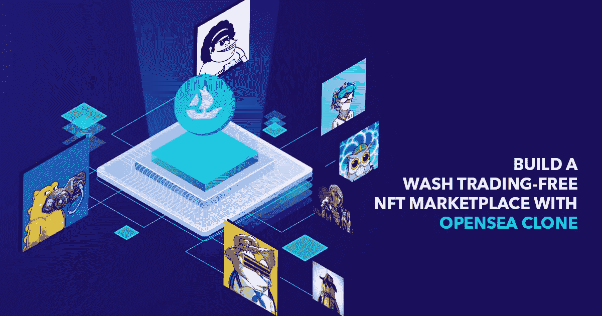

# 用 OpenSea clone 建立一个无 Wash 交易的 NFT 市场

> 原文：<https://medium.com/geekculture/build-a-wash-trading-free-nft-marketplace-with-opensea-clone-b23c665976b6?source=collection_archive---------15----------------------->

NFT 市场已经成为百万美元市场。然而，不可替代的代币(NFT)在很大程度上仍然不受监管。结果，问题到处出现，阻碍了大得多的 NFT 空间的增长。其中一个问题是与市场生态系统相关的清洗交易。这就引出了一个问题:

## **什么是 NFT 市场上的 Wash 交易？**

典型的 NFT 交易包括两方:买方和卖方。**当同一个人同时扮演买方和卖方角色**时，就会出现不公平交易。在区块链领域，这并不是什么新鲜事——加密货币交易平台传统上一直在进行清洗交易，以夸大其交易量。chain analysis 的一份[报告报道了 2019 年加密货币的清洗交易。](https://blog.chainalysis.com/reports/fake-trade-volume-cryptocurrency-exchanges/)

当 NFTs 在 2021 年初开始见顶时，Wash 交易变得很普遍。NFT 市场平台充斥着投机交易者，他们希望以高于他们应得的价格出售他们的代币！许多 NFT 市场平台要求他们的用户连接他们的钱包，开始交易(购买/出售)，没有任何审查程序。

## **一些洗盘交易事件**

洗盘交易导致误导市场信号，操纵资产价值。更多的交易者参与 wash 交易可能会导致更多的交易，为市场平台带来更多的收入。

**根据 Chainalysis 的数据，去年有 442 亿美元的比特币被传输到 NFT 相关的智能合约，而 2020 年仅为 1.06 亿美元。**然而，除了合法的 NFT 商业的巨大增长，Chainalysis 称其发现了通过购买 NFT 洗钱以人为提高其价值的行为者。

## **洗白交易创造不公平市场**

虽然 wash 交易在传统股票市场被认为是非法的，但 NFTs 中的 wash 交易尚未引起更多人的注意。

> 想象一下，一个新手第一次进入 NFT 市场，却只能看到人为抬高的 NFT 价格。这公平吗？这个法案对 NFT 空间的发展有什么好处吗？不幸的是，答案是否定的！

对那些购买人为夸大的代币的人来说，NFT 中的 Wash 交易会创造一个不公平的市场，它会侵蚀人们对 NFT 生态系统的信心，扼杀未来的增长。我们建议 NFT 市场尽一切努力禁止这种行为。使用区块链数据和分析，向自费地址出售 NFT 的用户可以很容易地发现。因此，市场可能会考虑对最大的违规者进行禁止或其他制裁。

***以下是受洗盘影响最严重的三方:***

*   **投资者**——投资决策变得越来越具有挑战性，因为投资者将不得不寻找可靠的统计数据。
*   收藏者/交易者——他们见证了做出购买决定的困难，因为误导性的统计数据可能会导致不利于投资的决定。
*   **全球社区** —受打击最大的是社区。监管机构和主流金融服务的支持者现在可以利用 Wash 交易来对抗去中心化。

## **使用 OpenSea 克隆的路边清洗(交易)实践**

> **OpenSea clone** 是一个预建的市场解决方案，包含与原版 OpenSea 相似的功能。总部位于纽约的 marketplace 平台是世界上最大的(如果不是最大的！).OpenSea 致力于授权创造者和企业家在未来建立一个 NFT 友好型经济。

*   **闭环贸易**——是一种限制进入，不与其他经济体互动的行为。虽然你可以将这个概念融入你的 NFT 市场，但要确保交易生态系统是自给自足的。
*   **(每周)升级** —每周更新平台以消除其弱点，从而根除清洗交易行为。幸运的是， [**预建的 OpenSea 克隆**](https://www.appdupe.com/opensea-clone?utm_source=Medium-GeekCulture&utm_medium=Blog&utm_campaign=Narmatha) 可以让你随时做出改变！
*   人工智能技术(AI Technology)——像 OpenSea 这样的人工智能驱动的 NFT 市场可以识别复杂的交易模式，这些模式代表着不正当的交易行为。该技术还减少了市场生态系统中的欺骗活动，以确保公平交易。

## **结论**

洗盘交易违背了密码和 NFT 空间背后的基本原理:***HODL——坚持到底*** *。贪婪的用户不持有资产，而是以清洗交易的形式走快速致富的路线，从而破坏了公平的交易领域。*

如果你是一个想成为企业家的人，读到这里，你可能会听到很多人说:**“在你的事业背后有一个正当的理由。”**

我认为，在 NFT，你找不到比清洗交易更好的理由或解决更重要的问题了。

你不用担心！ [**OpenSea 像 NFT 市场**](https://www.appdupe.com/opensea-clone?utm_source=Medium-GeekCulture&utm_medium=Blog&utm_campaign=Narmatha) 是现成的解决方案；你可以在几周内将它投入使用。