# 构建一个 Web 应用程序来与您的脸书页面用户聊天

> 原文：<https://medium.com/geekculture/build-a-web-application-to-chat-with-your-facebook-page-users-8daef45b3c26?source=collection_archive---------18----------------------->

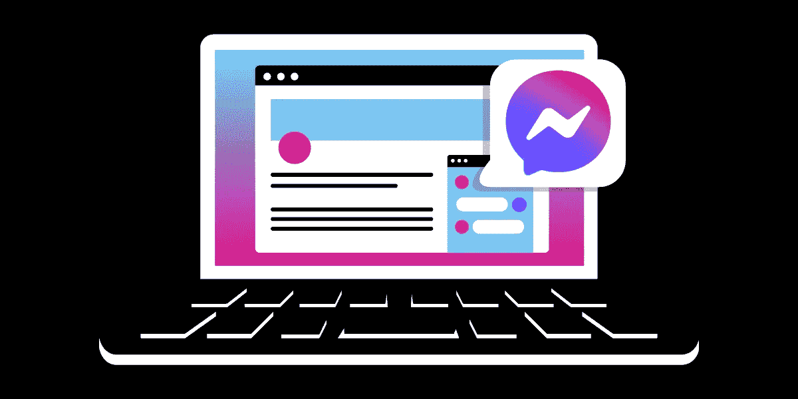

# 介绍

[消息 API](https://developer.nexmo.com/messages/overview) 正在被集成到[客户端 SDK](https://developer.nexmo.com/client-sdk/overview) 中。这将提供一个简单的方法，让你的客户可以通过 Facebook Messenger、WhatsApp、Viber 等等与你创建的应用程序进行交流。

在这篇博文结束时，您将拥有一个能够从您的脸书页面和页面信使发送和接收消息的 web 应用程序。将提供示例代码，并解释消息 API 集成的相关部分。

# 创建脸书页面

登录脸书和[创建一个测试脸书页面](https://www.facebook.com/pages/creation/)。您也可以使用已经存在的页面进行测试。

# 设置示例 web 应用程序

通过[重新混合这个小故障](https://glitch.com/edit/#!/remix/messages-inbound-demo)，制作您的示例 web 应用程序的副本。要设置应用程序，请按照自述文件中的步骤操作。示例应用程序遵循代理登录仪表板的场景，以及脸书页面客户和代理之间的当前对话。左侧是所有对话发生的地方，代理可以加入其中一个。

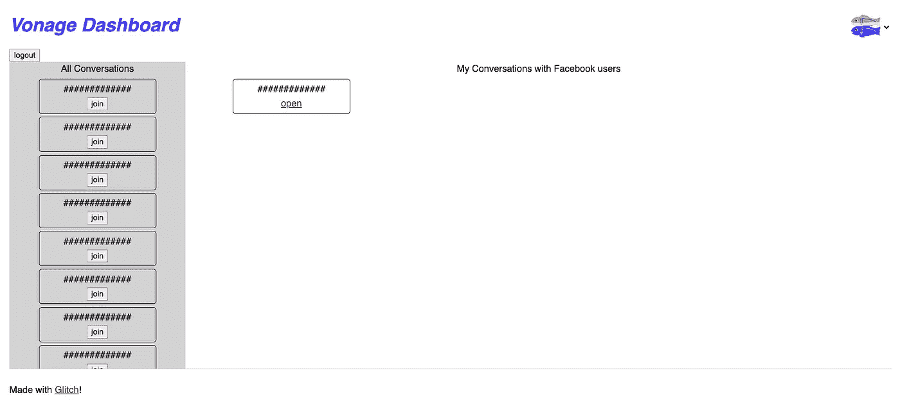

当代理单击一个对话时，与脸书用户的聊天应用程序将在一个新窗口中打开。聊天应用程序基于在[创建聊天应用程序教程](https://developer.nexmo.com/client-sdk/tutorials/in-app-messaging)中创建的应用程序。

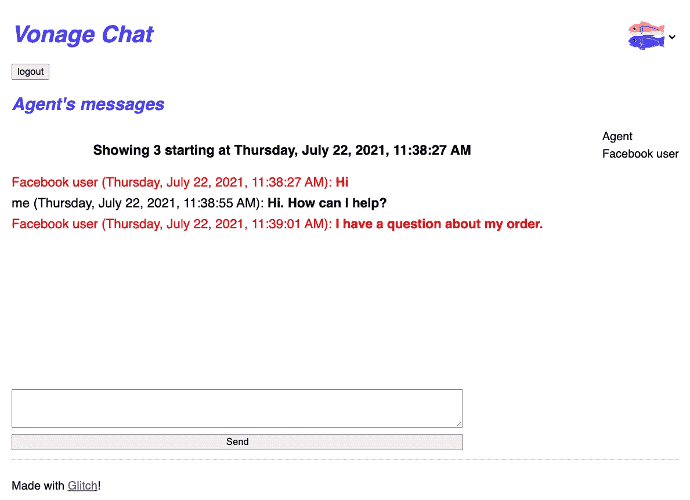

# 将您的脸书页面链接到您的 Vonage 应用程序

剩下的设置就是将您的脸书页面连接到 web 应用程序，以便它们可以相互通信。以下是步骤:

*   登录 [Vonage 仪表盘](https://dashboard.nexmo.com)
*   在“消息和调度”下，点击“社交渠道”

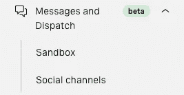

*   在“社交频道”页面，点击 Facebook Messenger

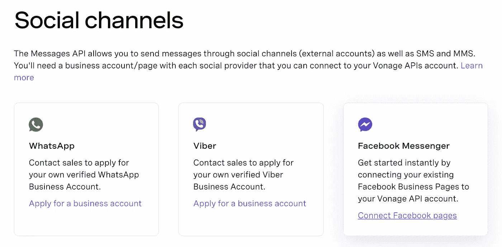

*   按照步骤将您的脸书页面连接到您的 Vonage 帐户

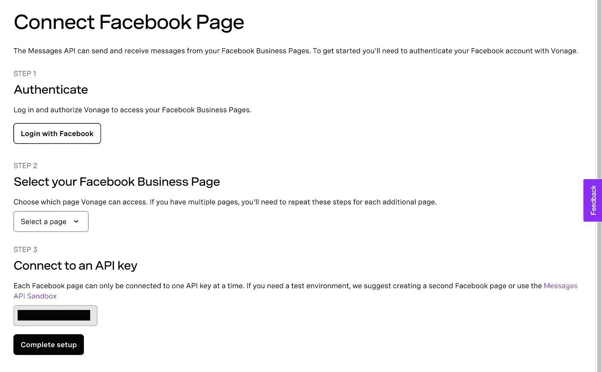

*   选择要连接到 Vonage 的脸书页面

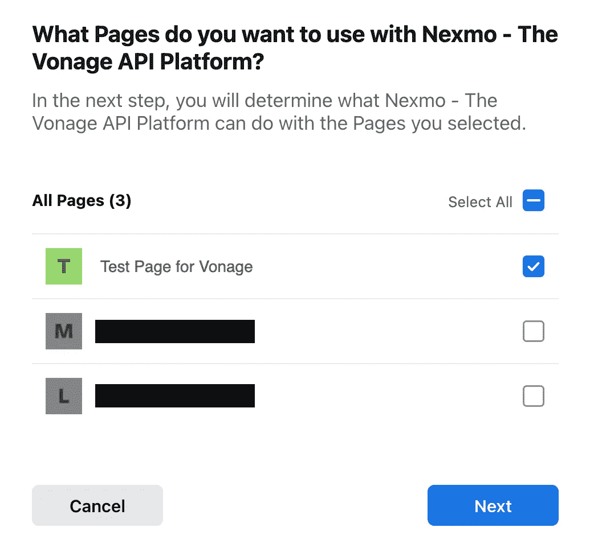

*   验证您使用的是正确的脸书帐户

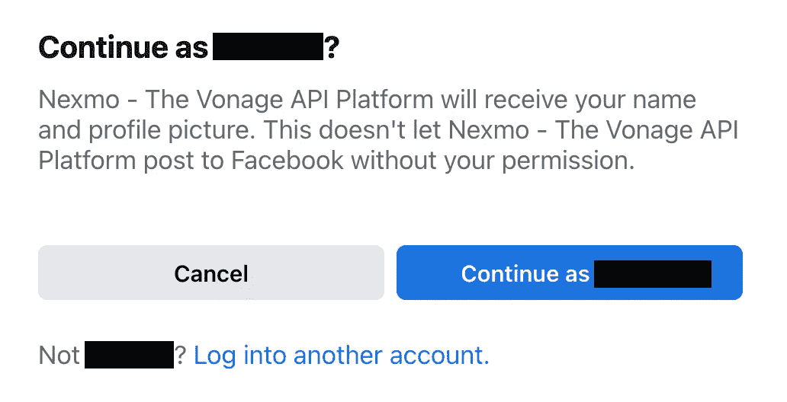

*   查看授予 Vonage 的权限

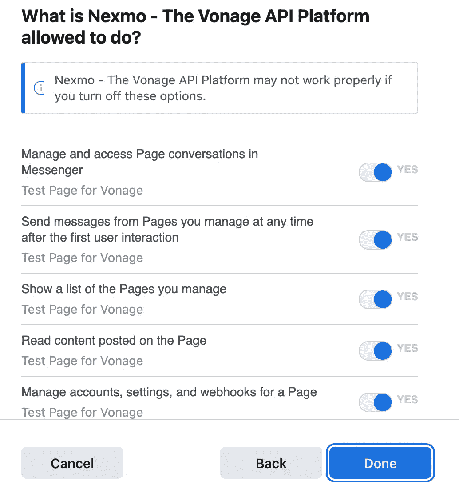

*   确认 Vonage 能够成功链接

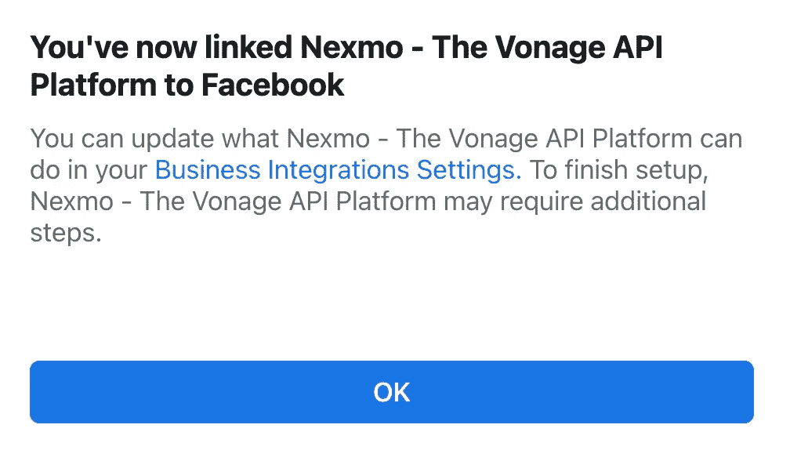

*   选择链接到 Vonage 的脸书页面并完成设置

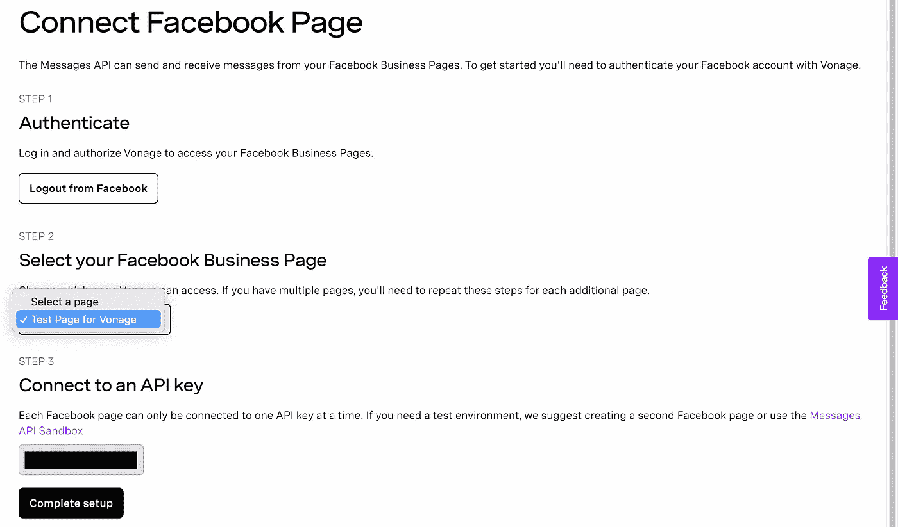

*   祝贺您，您的脸书页面已成功连接

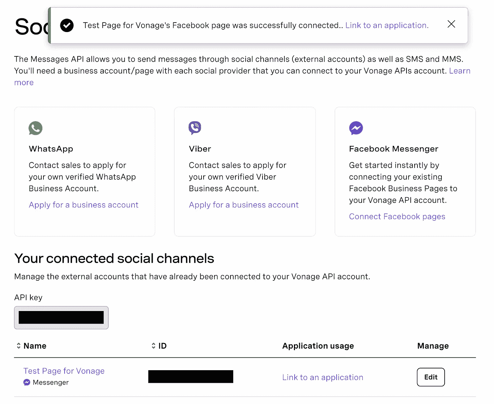

*   现在，Vonage 知道了您的脸书页面，让我们连接到您的 Vonage 应用程序，它是在您用 Glitch 设置示例时创建的。单击“链接到应用程序”或转到仪表板的“应用程序”部分。

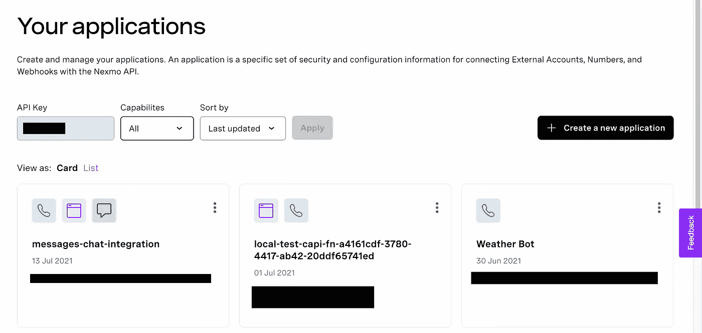

*   选择您在设置故障样本时创建的应用程序，然后单击“链接”。

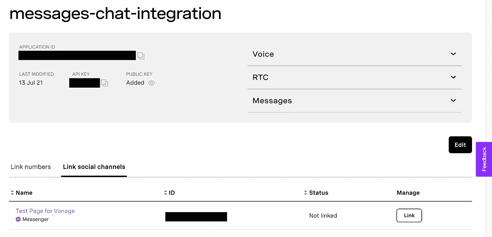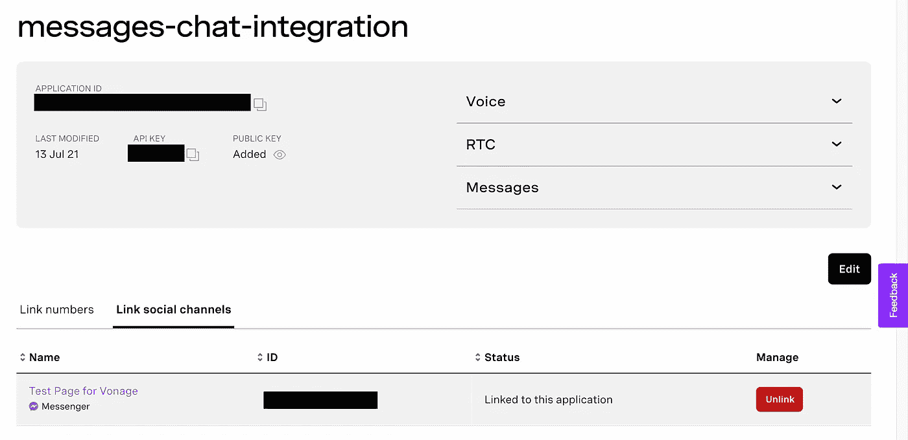

# 尝试一下

将网络应用程序放在一个浏览器窗口中，在另一个窗口中打开 [Facebook Messenger](https://messenger.com) ，并在必要时登录。如果您还没有，请在 web 应用程序中输入一个名称以进入仪表板。把这个当成你的名字或者代理的名字，只是一个简单的“登录”方式。现在，在 Messenger 中，找到您链接到该应用程序的脸书页面并发送消息。在 web 应用程序的窗口中,“所有对话”部分应该会出现一个小卡片。单击 join，将打开一个聊天应用程序，您应该会在聊天中看到该消息。从聊天应用程序发送消息，它应该会出现在您的 Facebook Messenger 中。

# 正在发生什么

让我们来看看实现上述功能所涉及的代码。当用户向您的脸书页面发送消息时，它会被 Vonage 发送到您的 web 应用程序的入站 webhook。webhook 返回一个对象，让 Vonage 知道如何处理消息。在这种情况下，我们发送回客户端 SDK 消息 API 集成将脸书用户与您的 web 应用程序连接起来进行对话所需的信息。这包括脸书用户的 id 和对话名称(我们将其设置为脸书用户的 id，这样它是唯一的)。

如果这是脸书用户第一次发送消息，则会创建一个新对话。这发出了一个我们在 events webhook 上监听的`conversation:created`事件。web 应用程序的后端接收该事件，并将其重新打包为一个定制事件`custom:new_conv`，该事件可用于通知代理的仪表板显示新的对话。

在聊天应用程序的代码中，有一个`message:received`事件监听器，当收到来自脸书用户的消息时会触发这个监听器。然后，它获取消息并将其添加到聊天显示中。

当代理回复脸书用户时，这是一条出站消息。客户端 SDK 中出站消息的完全实现将在未来的版本中完成。在此之前，就像监听何时创建新对话一样，我们可以监听何时将`custom:chat`事件发送到 events webhook。Vonage 节点 SDK 用于将代理的消息转发给脸书用户。

对于那些想知道的人，`FB_RECIPIENT_ID`也是脸书用户发送初始消息时设置的对话名称。获取脸书页面 Id`FB_SENDER_ID`的值稍微复杂一些。当一个代理打开一个聊天时，一个请求被发送到服务器的`getChatAppAccounts`端点，该端点使用管理员 JWT 调用 Vonage 的`chatapp-accounts` API。脸书页面 Id 在响应中，我们将其发送回客户端。好消息是，当出站消息被集成时，您将不必担心这些，客户端 SDK 会处理好一切。这是一个客户端 SDK 在开发应用程序时非常有用的例子。

# 小陷阱

如果您的出站消息突然停止工作，请检查您的服务器日志中是否有任何错误。如果您遇到这样的错误:

这意味着您的脸书页面令牌已过期，需要刷新。登录 Vonage 仪表盘，进入[消息和调度，然后进入社交频道](https://dashboard.nexmo.com/messages/social-channels)。在你的脸书页面旁边应该有一个按钮来刷新你的令牌。

# 结论

就是这样！有了集成到客户端 SDK 中的 Messages API，从您自己的 web 应用程序与脸书用户通信就容易多了。

# 后续步骤

请看看我们的[客户端 SDK 文档](https://developer.nexmo.com/client-sdk/overview)。还有更多关于创建代理仪表板的方法的信息，以及教程、指南等。演示应用程序遇到过任何问题吗？想增加新功能吗？任何问题、评论和/或反馈，请在我们的[社区 Slack 频道](https://developer.nexmo.com/slack)中告诉我们

*最初发布于*[*https://learn . vonage . com/blog/2021/10/14/build-a-web-application-to-chat-with-your-Facebook-page-users/*](https://learn.vonage.com/blog/2021/10/14/build-a-web-application-to-chat-with-your-facebook-page-users/)