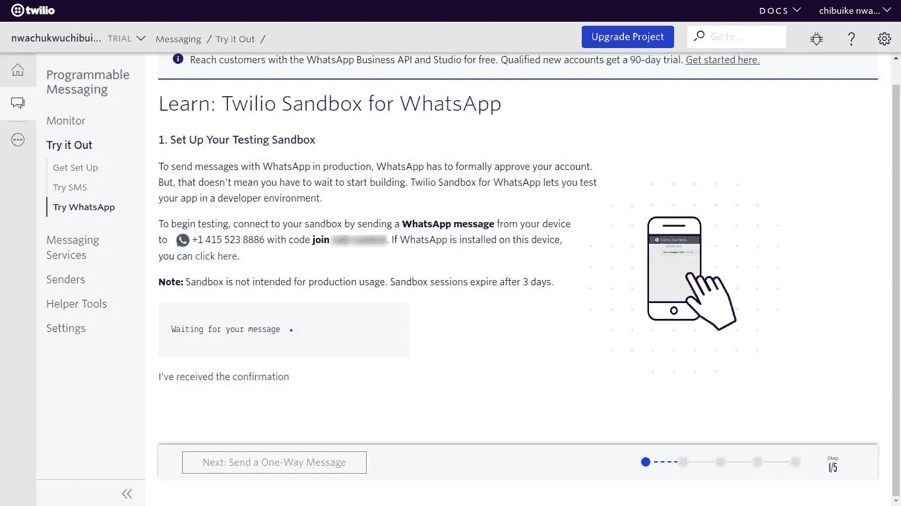
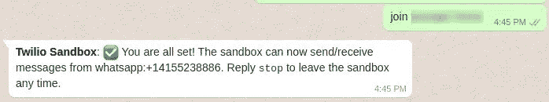
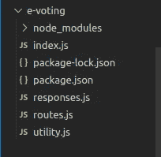
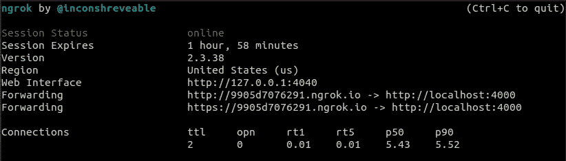
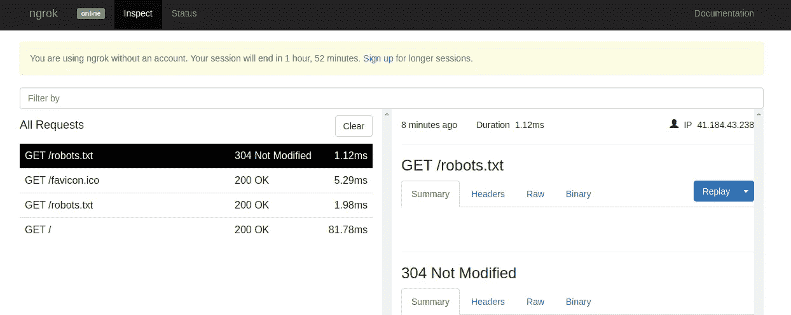
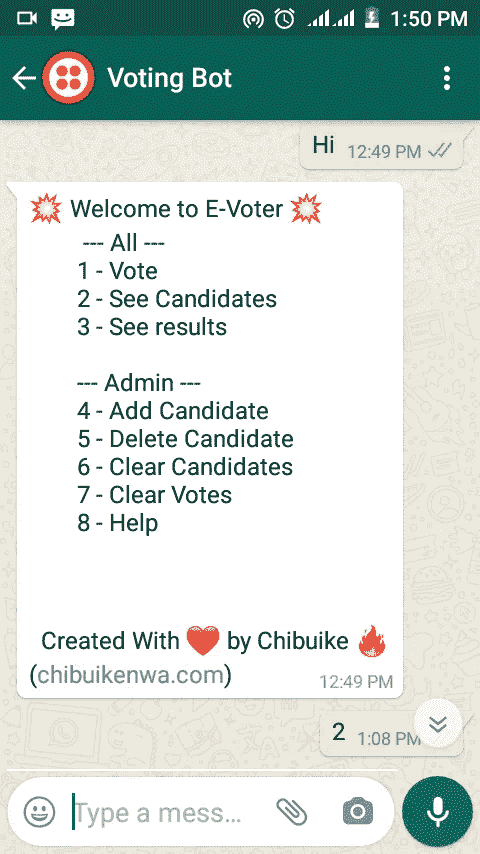
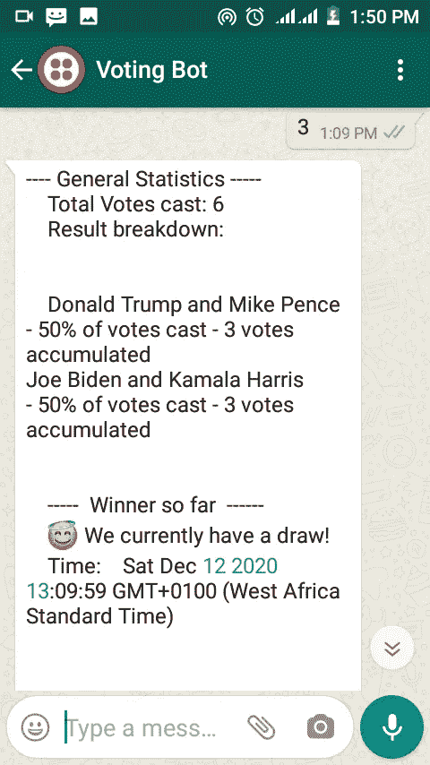

# 使用 NodeJs 和 Twilio 构建一个 WhatsApp 聊天机器人投票应用程序

> 原文：<https://medium.com/geekculture/build-a-whatsapp-chatbot-voting-application-using-nodejs-and-twilio-570c05324589?source=collection_archive---------14----------------------->

随着本世纪技术进步的速度，我们总是在寻找新的方法来自动化我们的任务，使我们的生活变得更好。聊天机器人帮助我们减少对手动沟通方式的依赖，同时也挑战我们实施解决方案的先入为主的方式。


Photo by [Owen Beard](https://unsplash.com/@owenbeard?utm_source=medium&utm_medium=referral) on [Unsplash](https://unsplash.com?utm_source=medium&utm_medium=referral)

# 什么是聊天机器人？

就其定义而言，它是一个软件应用程序，用于通过文本或文本到语音的方式进行在线聊天，而不是提供与真人代理的直接联系。它已经被用在不同的环境中，从客户支持，电影/表演的预定票，银行(UBA 利奥)等等。它的用途只能受到我们创造力的限制！

在本教程中，我们将通过使用 Twilio 平台构建一个带有 NodeJs 的投票 WhatsApp 聊天机器人，开始一段创意之旅。

成功完成本教程后，您将学会如何:

1.  回复发送到您 Twilio WhatsApp 号码的 WhatsApp 消息
2.  开发基于 Rest API 的投票应用程序
3.  使用 Twilio WhatsApp API 发送自由格式的消息

# 先决条件

要成功完成本教程，需要具备以下条件:

*   NodeJs 基础知识
*   您的计算机上安装的 NodeJs 和 Npm
*   一个支持 WhatsApp 的 Twilio 号码
*   Twilio 帐户
*   一个 [ngrok](https://ngrok.com/product) 的装置

# 设置和安装

我们会利用 Nodejs。首先创建一个目录，然后进入 cd 并运行这个命令

```
$ mkdir e-voting && cd e-voting
```

然后，我们通过创建 package.json 来初始化节点项目，该命令允许创建文件，而无需我们输入提示值。您可以稍后更改该文件中的值。

```
$ npm init -y 
```

接下来，我们继续安装我们将要使用的包

```
$ npm i express twilio
```

快速—我们用来设置我们的服务器

Twilio——我们用来发送消息的 Twilio 库

现在我们已经设置好了我们的环境，让我们继续进行我们的 Twilio [沙箱](https://www.twilio.com/console/sms/whatsapp/learn)的设置。

# 设置 WhatsApp 沙盒

为了让我们的聊天机器人访问来自 WhatsApp 的消息，Twilio 提供了一个非常强大的 [WhatsApp API](https://www.twilio.com/whatsapp) ，允许我们在应用程序中发送和接收 WhatsApp 消息。

然而，在我们可以开始在生产中使用 Twilio WhatsApp API 发送和接收消息之前，我们必须首先获得一个 [WhatsApp 批准的 Twilio 号码](https://www.twilio.com/whatsapp/request-access)，它将作为我们发送和接收消息的 WhatsApp 号码。在本教程中，我们不会让自己卷入这个过程，我们宁愿利用 Twilio 为开发和测试目的提供的安全[沙箱](https://www.twilio.com/console/sms/whatsapp/learn)。

要开始使用 Twilio WhatsApp 沙箱，我们进入 Twilio 仪表板上的 [WhatsApp 部分](https://www.twilio.com/console/sms/whatsapp/learn)，并向提供的沙箱号码发送一条消息；通常，`+14155238886`带有提供的代码，其格式为`join-{unique word}`:



加入后，您应该会收到类似下面的回复。如果你没有检查你所遵循的过程，以确保你没有错过任何一步。



# 构建应用程序

从安装开始，我们的项目中只有一个 package.json 文件。然后，我们将创建一个名为 index.js 的新文件，该文件将用于设置我们的应用服务器(使用 expressjs)

上面简单地使用了 express 来启动服务器，并使用了在第 2 行导入的路由文件。稍后，我们会将所有请求发送到指向这个外部路由文件的 **/vote** 路由上的服务器。

接下来，我们继续创建包含逻辑的 routes.js

我知道这个文件看起来很长，但是通过一些解释，你会发现它并没有那么复杂。为了使解释更容易，我将一节一节地解释。

从第 1 行到第 5 行的第一部分**是我们在应用程序中安装助手文件和方法的地方。在第 3 行，我们安装了 Twilio 官方 NodeJs 模块，我们将使用它发送回我们的响应。第 4 行我们导入了助手响应模块(这将有助于格式化我们的各种响应)。第 5 行，我们引入了实用程序模块，在这里我们存储了助手函数。**

第 7–25 行的第**部分**是我们定义文件变量和默认值的地方，比如投票和候选人。

**第三部分**从第 27–43 行开始，仅包含一个函数 showCandidates，我们简单地使用它来显示用户请求的候选列表。

**第四部分**跨越第 46–136 行，由四个功能组成，负责实际接受和验证用户投票，并向用户显示结果。前两个函数是实际的投票，后两个函数用于显示结果。它是这样工作的:

a) castVote ():它开始投票过程，并接受用户投票。一旦用户选择投票，并且通过线 218 第一次调用该方法，在它已经执行检查以确定有候选人要被投票(线 81)之后，它通过线 82 在服务器中为该特定用户创建跟踪器。

然后，它返回一个带有候选人列表及其 id 的响应，使用户能够知道如何在下一次聊天中为他们选择的候选人投票，它还包括一种取消投票过程的方法，并通过附加唯一值(0)从用户端删除跟踪器，用户应该使用该值退出投票过程(调用 list_of_candidate 的第 83 行接受 showCandidates 函数作为参数)。

当用户接下来用聊天进行响应时，我们通过将聊天值转换为一个数字并检查其值来进行检查，如果它是 0，我们知道用户想要取消投票过程(第 203 行)，然后我们取消该过程并向用户发送一个响应。如果用户发送任何其他值，那么我们调用带有所需参数的 **castVote** (第 207 行)。

当调用 castVote 并传递这些值时，我们转到第 75 行，确保用户之前没有投票，然后我们转到第 76 行，再次检查用户是否确实已经开始投票，最后我们在第 77 行确认实际上有候选人要投票。在这之后，我们用提供的参数调用第 78 行的 **addVote** 。

b) **addVote** ():这个函数负责实际接收用户的投票。首先，我们检查第 58 行，以确保用户提供的值实际上是候选人的 id。然后，我们继续添加用户投票，将他们从投票过程中删除，并发回一个成功的响应(第 61-63 行)。

c) **showResult()** :我们使用这个函数向用户显示结果。第 118–119 行只是用来验证和确保选票和候选人分别存在。在第 121 行，我们根据候选人对所有选票进行分组。然后在第 122 行，我们将从第 121 行得到的响应格式化，这样我们就可以向用户显示每个候选人的名字、他们累积的总票数以及他们的投票百分比。此外，我们在适用的地方显示了赢家或平局(第 95 行的 formatResult 函数帮助我们进行格式化和结果响应。

d) **formatResponse** ():如上所述，在第 95 行，它简单地获取候选人的分组投票，然后返回每个候选人的名字、他们的票数和投票百分比。它还检查平局或赢家，并返回这个格式化的结果作为它的响应。

**第五部分**从第 139-191 行开始，由显示和默认消息以及一个页脚组成，我们在每个响应中都包含了这个页脚。 **showDefaultMessage** ()用在开头，显示可以执行的动作列表。 **showHelp** () 无论何时调用都会显示帮助菜单，而**页脚**包括所有响应的附加消息。

从第 191–243 行开始的第六个也是最后一个部分是我们接受对服务器的 post 请求、解析主体内容、处理用户输入并发送响应的地方。第 197 行简单地给出了用户电话号码，这是每个用户的唯一标识符。我们使用 switch 语句来获得用户的响应并调用相应的函数。

这就是这个文件的基本功能，它是我们聊天机器人的引擎。

接下来，让我们添加将保存我们的助手文件的 utility.js 文件

这里我们只有 4 种方法，基本上可以帮助我们执行各种数据操作。

我们还包括我们的 responses.js 文件

现在我们已经完成了编码部分，您的项目结构应该如下所示:



Project Structure

然后我们有了一个功能服务器，我们现在将继续创建一个 webhook，它将允许我们重定向请求。

# 创建一个网页挂钩

这使得 Twilio API 能够将请求发送到我们的应用程序端点。这就是 ngrok.io。

如果您没有 [ngrok](https://ngrok.com) ，请在此处继续[操作](https://ngrok.com/download)以查看如何获取并设置它在您的系统中运行。我们将使用 ngrok 提供的 URL 作为我们的 webhook URL。

但是在此之前，我们需要启动我们的服务器，让我们在项目的根目录下打开一个终端并运行:

```
node index.js
```

这将加速我们的服务器并将其暴露给一个端口。在我们的例子中，端口是 4000。

接下来，我们打开一个不同的终端并运行

```
ngrok http 4000
```

然后你应该在你的终端上看到这个，Ngrok 正在做它的工作！



Port Forwarding with Ngrok

虽然不需要，但我们可以转到图像中提供的 Web 接口 URL(http://127.0.0.1:4040)来查看向端点发出的请求:



Request Dashboard

现在更新 Twilio 中的 webhook，指向 Ngrok 提供的公开 URL。这将把所有消息从 Twilio 重定向到我们系统上本地运行的 nodeJs 服务器。在这里输入从 Ngrok 获得的 URL，并附加/vote，因为这是我们的完整端点。然后用这个值更新标记为“当有消息进来时”的输入字段。

对于我们的例子，我们将输入[http://9905d7076291.ngrok.io/vote](http://9905d7076291.ngrok.io/vote)


Twilio Sandbox Configuration

# 测试

既然我们已经设置好了 webhook，让我们在 WhatsApp 上测试一下。Hi 消息用我们在代码中提供的默认消息来响应。我们可以看到工作正常:



当我们发送 3 到机器人，我们得到轮询结果回来，它的工作！：



Shows Result

# 演示

现场演示可以在[这里](https://www.youtube.com/watch?v=xls_7abY27I)找到。我进一步添加了更多的功能到项目中，完整的管理功能和功能项目可以在[这里](https://github.com/chyke007/e-voting)找到。

# 结论

我喜欢这个投票应用程序的一个主要原因是，它允许我参与投票过程，而不必离开我最好的消息平台。

技术进步使我们能够实现我们的想象，这在过去的一个世纪里是不可能的。我刚刚活出了我的一个！我等不及要看你造的东西了！