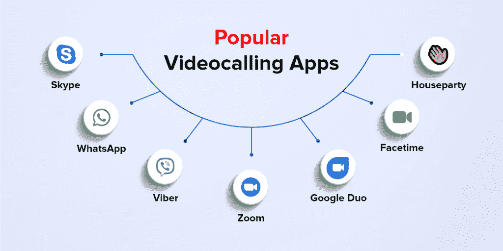
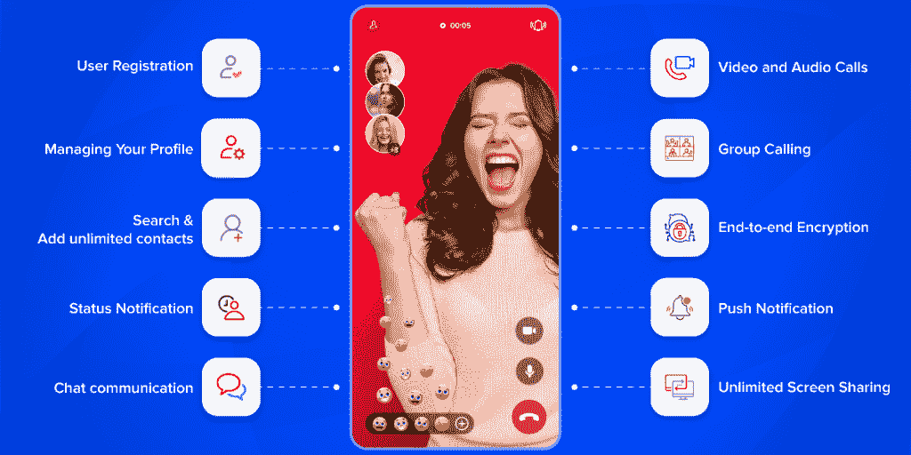
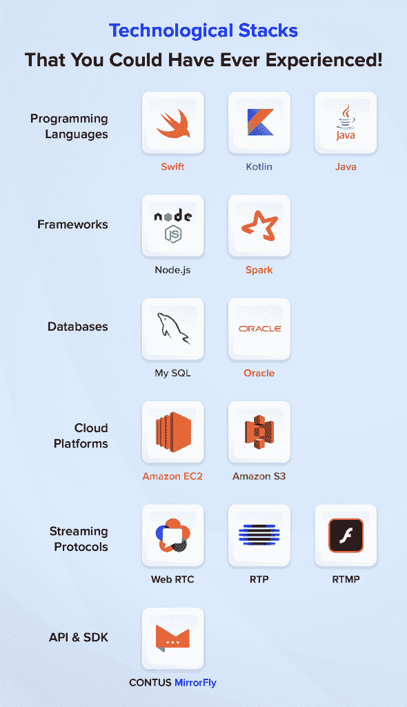
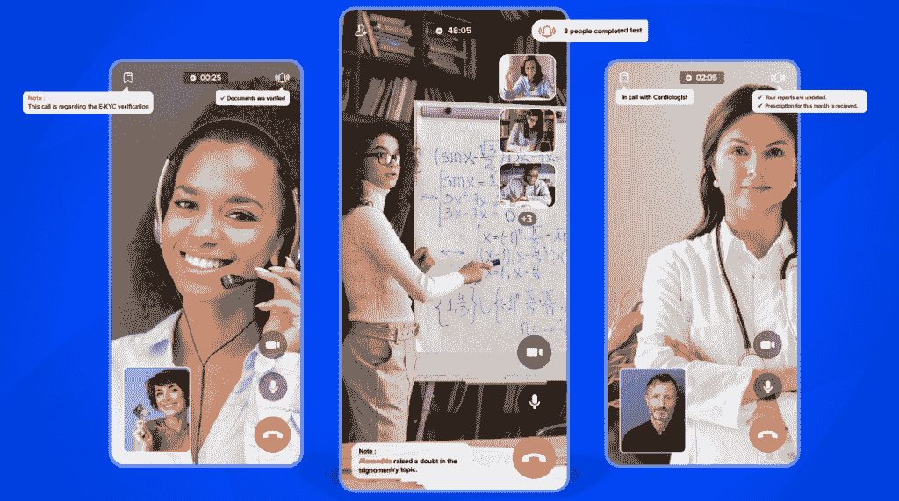

# 打造一款白标视频聊天应用:功能、类型和技术组合

> 原文：<https://medium.com/geekculture/build-a-white-label-video-chat-app-features-monitizations-types-techstack-8dccf7520386?source=collection_archive---------16----------------------->

从过去几年来，视频通话技术已经成为每个企业的重要组成部分，或者可以说，大多数企业实际上依靠其使用来满足其客户的需求。

这些视频通话应用不断增长的需求吸引了许多希望创建自己的视频通话应用的独立开发者的注意力。

综上所述，本文是一份完整的指南，涵盖了当前的市场状况、关键特性以及与[构建视频聊天应用](https://www.mirrorfly.com/build-video-chat-app.php)相关的开发策略，开发者在进一步开发之前必须了解这些内容。

**现在，让我们从目前的市场状况开始。**

# 现在的视频会议应用市场说，这是值得的！

**“实时视频聊天！我们震撼市场"**

今天，当前的形势使得这些公司在很大程度上依赖于视频会议应用程序进行商业和个人互动。最近的一项研究显示，视频聊天应用的使用量已经增加，2019 年价值 38.5 亿美元，预计 2020 年至 2027 年的 [CAGR 为 9.9%。](https://www.grandviewresearch.com/industry-analysis/video-conferencing-market)

此外，为了[构建聊天平台](https://www.mirrorfly.com/build-chat-platform.php) ，开发人员需要做大量与场景相关的研究，以根据跨任何领域的最终用户的需求增强特性和功能。

# 让我们来看看一些主要的市场参与者

## 1.Skype 是一个免费的工具，永远的选择

Skype 提供 iOS 和 Android 上最强大的视频通话 API 工具，可与每月超过 3 亿的活跃用户进行免费的面对面交谈。所有这一切都以安全加密的方式进行，并提供通话录音、屏幕共享等选项。

## 2.WhatsApp“最优雅但功能强大”

拥有超过 16 亿活跃用户的 WhatsApp 是市场上最著名的消息传递品牌，在消息传递、视频通话、语音通话和文件共享方面拥有最大的安全选项。

## 3.Viber —“一种巨大的方法”

自 2010 年以来，Viber 已经在市场上存在了十年，与 skype 相比，它被认为更具实质性，突出了视频会议呼叫的最大安全性，可以选择将呼叫转移到桌面/电话，转动摄像头等。

## 4.Zoom —“所有这些都在一个安全连接的单一平台下

缩放被认为是视频通话 app 最简单可靠的模式。它支持来自教育、商业领域的各种使用案例，活跃用户超过 430 万。

## 5.谷歌二人组“永久免费视频聊天平台”

Google Duo 是最简单的，但具有高端的无损质量，可用于 Android 、iOS 和网络平台等的视频聊天应用程序。，下载量超过 10 亿次。

## 6.“面对面”二合一，iOS

Face-time 是苹果公司在 2010 年开发的一款视频电话聊天应用。它支持用于 iOS 移动设备和带有任何前置摄像头的 Mac 的视频聊天应用。

## 7.家庭聚会应用程序“不间断社交聚会”

House-party 是第四大最受欢迎的面对面社交网络应用程序，在 App store 上具有最佳质量的视频会议通话功能，受到数百万喜欢社交媒体的用户的关注。

然而，以上只是视频通话应用提供商的一瞥，但在实时视频聊天平台中还有很多值得期待的。

提示:下一节课将讲述如何构建视频聊天应用程序所需的关键步骤

# 创建 Android、iOS 平台视频通话应用的关键步骤

**“视频通话如何融入网站之旅”**

如果你想在这个利润丰厚的市场上展开你的翅膀，那么你必须考虑以下关键步骤来创建一个视频聊天网络应用程序。

# 关键步骤 1:了解最终用户的想法

对于任何企业来说，都必须了解目标受众的需求，并分析他们真正希望从你这里得到什么？

根据一项调查发现，大约 36%的千禧一代在交流时通过表情符号、贴纸和过滤器使用视觉表达。但是，他们仍然在安全性和可扩展性方面优先考虑应用程序。他们更喜欢通过视频聊天来联系网站和企业的客户，以确保互动的保密性。医疗保健行业、法律事务所和网上银行就是这种情况。

因此，在计划推出或视频通话集成网站和移动应用程序时，沟通是不得不考虑的关键因素。

# 关键步骤 2:明确你的视频聊天应用需要哪些关键功能

当**开发 android 聊天应用**时，你必须清楚你的应用在特性和功能方面想要什么。这是因为有时太多功能的集成可能会影响用户体验。

因此，在创建视频聊天应用程序之前，最好准备一份基本组件列表。一些关键功能包括

## 1.用户注册

每个视频聊天平台都是从用户注册界面开始的。这是因为大多数情况下，用户对填写大型表单感到太不耐烦了。相反，该特征需要较少的信息来进行注册。即使在这里，您也可以添加最需要的字段，如姓名、电子邮件地址、联系电话等。此外，如果需要，可以将你的应用嵌入其他社交媒体网络，以获得更好、更简单的注册系统。

## 2.管理您的个人资料

这个特性讲述了在配置文件上显示基本的用户信息。该选项从识别用户的位置到提供简短的个人简介都有所不同。此外，它还提供了一个额外的选项，添加图像，联系方式，以及其他一些隐私方面的强制信息。

## 3.搜索并添加无限联系人

此功能允许您搜索联系人并将他们添加到您的视频聊天应用程序中。但是，这需要执行两个功能

*   需要执行搜索引擎，以便通过用户名或实名轻松导航和识别联系人
*   整合用户电话簿中的联系人

**4。状态通知** 该功能提供了用户的在线状态指示，如可用、理想、忙碌、正在工作等。甚至，它会用绿色通知指定用户的在线可见性，或者提供上次登录时间。

**5。聊天交流** 实时聊天功能谈到了最标准的选项“通过短信互动”每当出现网络问题时，企业都会使用该选项，因为发短信可以确保工作场所的效率。

**6。视频和音频通话** 除了消息传递之外，在实时视频聊天应用中提供视频和音频功能总是更好。任何实时消息应用程序必须同时具备语音和视频功能，才能与其他应用程序一起出现在页面上。然而，视频聊天功能和音频通话功能相互依赖。

**7。群组通话** 它使用户能够创建一个群组，并通过视频会议应用程序与全球约 50 名活跃用户参与者进行[群组视频聊天](https://www.mirrorfly.com/blog/best-group-video-call-apps/)。在视频会议期间，人们还可以同时通过文本消息进行通信，以使会话更具互动性。 **8。端到端加密** 端到端加密使用户能够以端到端的安全性进行交互。这些安全措施涉及诸如 AES-256 和 HMAC-SHA256 这样的协议，通过将它们分割成 256 位长的块，可以使任何对话成为最安全的对话。

**9。推送通知** 该功能会通过通知用户聊天中的新消息、未接来电、更新等来自动进行即时检查。这最终以最小的努力提高了用户的参与度。

**10。无限制的屏幕共享** 它使用户能够展示你的屏幕内容，而不会引起其他问题。借助商务会议应用，客户可以通过与客户共享报告和分析来进行互动。

# 关键步骤 4:演进和测试

*   **后端开发**是决定任何 app 核心功能的过程。大多数情况下，开发人员在应用服务器、web 服务器上构建他们的数据库。但是，该平台让您可以选择从头开始构建后端，支持高端灵活性以获得更好的最终结果。
*   **WebRTC** 是最实时的协议之一，允许用户连接或流式传输基于音频和视频的应用。换句话说，这是一种支持[移动实时通信](https://www.mirrorfly.com/blog/real-time-communication/)的技术，也支持具有各种 API 的网络应用。

总之，这些步骤是构建定制视频会议解决方案所需要的最重要的步骤。

# 您可能体验过的技术堆栈！

## “科技告诉我们，一切都有可能”

每当您想到构建一个白标签视频聊天应用程序时，您必须连续询问的下一个问题是“创建一个视频聊天应用程序需要哪些技术堆栈”。让我们详细地看一下

## 编程语言

1.  **Swift** — Swift 是一种直观的、多范例的编译编程语言，来自 macOS、iOS、watchOS、tacos 等等。
2.  **Kotlin** — Kotlin 是一种开源的“实用”编程语言，最初是为 Java 虚拟机和 Android 设计的。
3.  **Java** — Java 是一种高级面向对象的编程语言，其设计具有较少的实现依赖性。

## 结构

1.  node . js——node . js 是一个跨平台的后端 JavaScript 运行时，构建在 Chrome 的 V8 JavaScript 引擎之上。
2.  **Spark** — Spark 是围绕速度和流分析构建的最强大的开源统一分析引擎。

## 数据库

1.  **MySQL** —这是一个完全托管的数据库服务，部署云原生应用。它由支持各种后端的多线程 SQL server 组成。
2.  **Oracle** — Oracle 是一个云基础架构平台，专为寻求更高性能计算、轻松迁移内部托管的企业而打造。

## 云平台

*   **亚马逊 EC2** —亚马逊 EC2 在亚马逊网络服务(AWS)云中提供了高级别的可扩展计算能力。
*   **亚马逊 S3**——亚马逊 S3 是亚马逊网络服务提供的一项服务，通过网络服务接口提供对象存储

## 流媒体协议

*   WebRTC 是一个开源项目，为浏览器和移动应用程序提供实时通信。
*   RTP 是一种实时传输协议，旨在通过 IP 网络传输音频和视频。

## 第三方 API 和 SDK 提供商

一旦您完成了构建视频聊天应用程序的基本技术部分，现在是时候为您的应用程序检查最佳的应用内通信 API 和 SDK 了。确保您选择的视频通话 SDK 支持以下功能:

*   自托管解决方案
*   一次性许可证成本
*   白色标签解决方案
*   云上和内部部署
*   端到端加密标准

嗯，我们上面看到的是对开发者最友好的功能，它们的存在可以让你获得最好的视频聊天应用。令您惊讶的是，所有这些特性都可以通过下面的 API 提供程序获得:

## **1。挫伤 MirrorFly**

MirrorFly 是一家领先的视频聊天 SDK 提供商，提供 SaaS 和[自托管解决方案](https://www.mirrorfly.com/self-hosted-chat-solution.php)，用于构建跨 web 和移动应用的视频通话功能。

## **2。集市**

除了帮助用户将视频聊天设施添加到通信应用程序中，Agora 的视频通话 API 还通过音效和面膜等有趣的功能增强了社交应用程序。

## **3。**应用

Apphitect 是一款安全且完全可定制的视频通话 SDK 提供商，使开发人员能够根据业务需求轻松构建极具吸引力的交互式视频通话应用。

## **4。Enablex**

Enablex 的视频聊天 API 为开发人员提供了在任何应用程序或软件中构建卓越视频体验所需的一切。他们的视频 SDK 是完全可定制和灵活的。

## **5。仙鸟**

Sendbird 让您可以在任何应用程序之间建立无缝和可定制的应用内视频体验，其高度直观的视频通话 SDK 是以用户为中心构建的。

# 实时视频通话应用——行业的重要参与者

1.  电子学习系统:它以其不可思议的视频聊天应用程序功能彻底改变了教育流程。将它嵌入到学术和考试中允许学生不受限制地进行全球学习。
2.  **医疗保健&医院**:其远程医疗应用改变了患者接触医疗保健系统的方式。随着实时医疗保健应用的发展，它现在可以立即将世界各地的医生和患者联系起来。最终证明了它的聪明！
3.  **金融和银行服务**:它帮助员工在办公室和现场保持联系。还允许通过高端安全措施跟踪所有机密文件。

## 最终测试

**“最后一招是另一个开始打造视频聊天 app 的开始”**

测试是任何应用程序都会遇到的最后阶段。在这里，通过调试过程检查并完成代码。在这个阶段，应用程序的核心是接触目标受众，根据这种接触，其市场将被细分。

为所有平台开发一个**视频聊天应用的成本取决于某些标准**

*   要求应用程序的用例
*   开发应用程序所需的平台(iOS、Android 和 web 应用程序)
*   团队的整体规模，包括 UI/UX 设计师、开发人员、项目经理、后端等。
*   您需要一组特性和功能
*   项目技术堆栈

**结论**

总结整篇文章，现在你应该知道如何制作视频通话应用程序了。

希望文章有用！