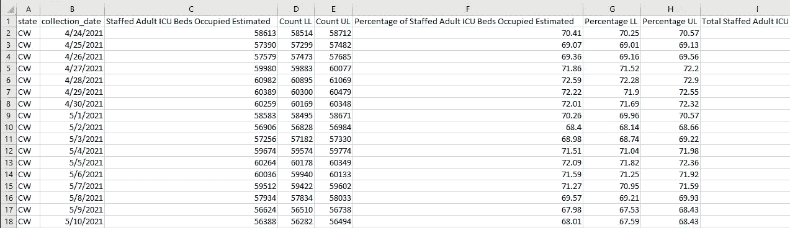
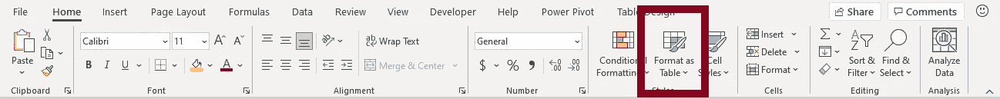
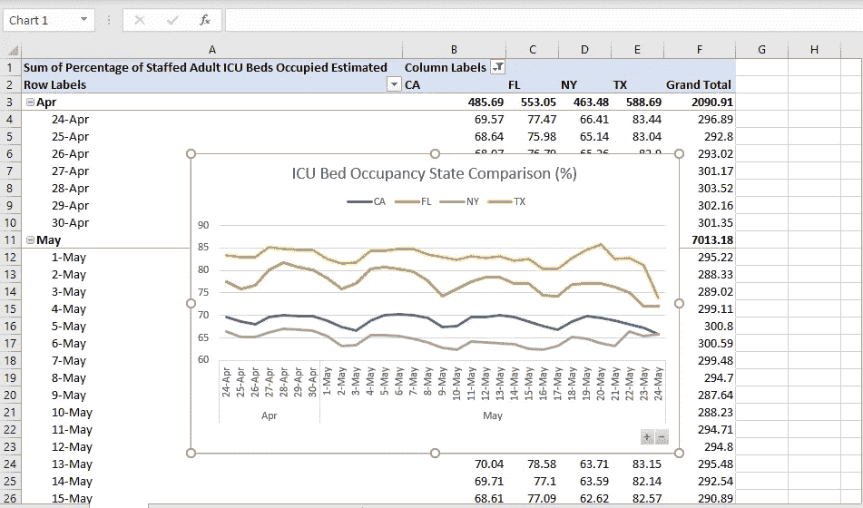
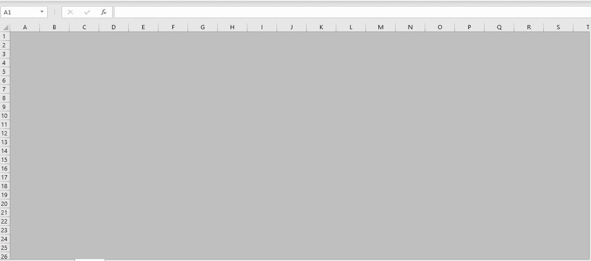
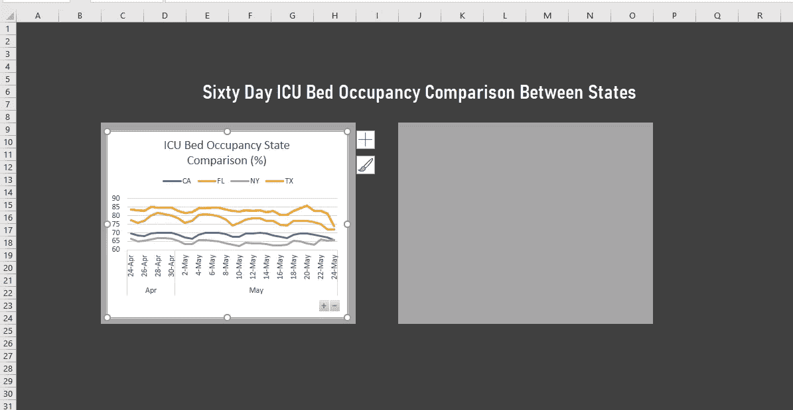

# 构建 Excel 仪表板…

> 原文：<https://medium.com/geekculture/build-an-excel-dashboard-eae4342b53d6?source=collection_archive---------57----------------------->

不到 5 分钟！

Image by [Pexels](https://pixabay.com/users/pexels-2286921/?utm_source=link-attribution&utm_medium=referral&utm_campaign=image&utm_content=1850613) from [Pixabay](https://pixabay.com/?utm_source=link-attribution&utm_medium=referral&utm_campaign=image&utm_content=1850613)

电子表格被严重低估了。当然，对于严肃的数据探索和 ML 项目，我会转向 python 或 R，但如果我只是想快速构建一个仪表板，为演示讲述一个故事，Excel 通常是一个合理的选择。因此，这里是如何在 5 分钟内建立一个仪表板。

数据来源:[各州 ICU 床位占用时间序列](https://healthdata.gov/dataset/COVID-19-Estimated-ICU-Beds-Occupied-by-State-Time/7ctx-gtb7)

初始数据集:

将它变成表格，以便于使用:

1.  选择您的所有数据
2.  从“主页”选项卡中单击“格式化为表格”

3.在新格式化的表格中选择一个单元格

4.选择“插入选项卡”，然后选择“数据透视图”

5.构建一个数据透视表图表。如果您对数据透视图感到不舒服，我有一篇未来的文章可以帮助您实现这一点。

6.打开一个新工作表，并将其命名为“仪表板”

7.选择所有单元格(ctrl+shift+向右箭头，ctrl+shift+向下箭头)

8.为你的背景选择一种填充颜色。

9.在页面布局选项卡中，取消选中“网格线视图”。您的仪表板应该如下所示:

10.添加标题，合并单元格以使标题大小合适，并选择合适的字体

11.选择一些着陆单元格，并使它们成为不同的填充颜色。

12.现在复制您的数据透视表并将其粘贴到您的仪表板中。

13.冲洗和重复你的下一个数据透视表，发挥美学和你的工作。

当然，这不是一个惊人的画面或 Qlik 仪表板。它不需要从 Plotly 或 Bokah 导入任何 python，但老实说，有时你只需要 5 分钟的解决方案就能理解要点。

直到下一次

-兆字节