# 使用 React Native 构建图片浏览应用程序

> 原文：<https://medium.com/geekculture/build-an-image-browsing-app-with-react-native-df303d222a0d?source=collection_archive---------8----------------------->

> React Native 为 iOS 和 Android 带来了 [React 的](https://reactjs.org/)声明式 UI 框架。使用 React Native，您可以使用原生 UI 控件，并拥有对原生平台的完全访问权限。[(https://github.com/facebook/react-native](https://github.com/facebook/react-native))

如今移动设备越来越受欢迎，因此构建自己的应用程序并从移动设备访问后端服务对许多公司来说至关重要。我们知道 iOS 和 Android 设备占据了大部分市场份额，iOS 和 Android 上的应用程序互不兼容。这意味着开发者需要在两个平台上用不同的技术栈开发两个不同的应用。开发可能不会太难，但是以相同的交付速度维护两个应用程序可能会很棘手。因此，一些开发人员希望选择一些跨平台的解决方案，如 Ionic、Flutter、Xamarin 来实现他们的应用程序。React Native 是开发这种跨平台 app 的另一种选择。

在本教程中，我们将介绍 React Native 的一些基本概念，并使用 React Native 构建一个图像应用程序。我们将涵盖 React 本机基础，React 挂钩，平面列表，搜索栏，导航。本教程将使用 TypeScript 编写，它非常类似于 JavaScript，但是类型检查是强制的。

我假设本教程的读者对 JavaScript / TypeScript、Android 和 iOS 有一些基本的了解。所以没有关于语法和开发工具的细节。

在本教程中，我们将建立一个两个屏幕的应用程序，第一个屏幕是一个主页，在这个主页上，我们将显示从后端 API 获取的图像列表，以及一个搜索栏，让用户输入图像的关键字；第二个屏幕是一个详细页面，用户可以通过单击列表中的单个图像导航到该页面。

# 先决条件

这个应用程序将从 [Pexels](https://www.pexels.com/) 获取图像，因此在开始构建应用程序之前，如果您没有 Pexels 帐户，我们需要创建一个。我们不会关注如何创建 Pexels 帐户，因为这超出了本教程的范围。但是根据 Pexels 上的说明创建一个新帐户是非常容易的。

我们需要将它们`Authorization Token`保存在一个安全的地方，这是访问 Pexels API 的关键，并将在应用程序中使用。

然后，我们可以用 Postman 对 Pexels API 进行一些测试，以确保我们的`Authorization Token`是正确的，并且我们能够为 Pexels 获取照片。

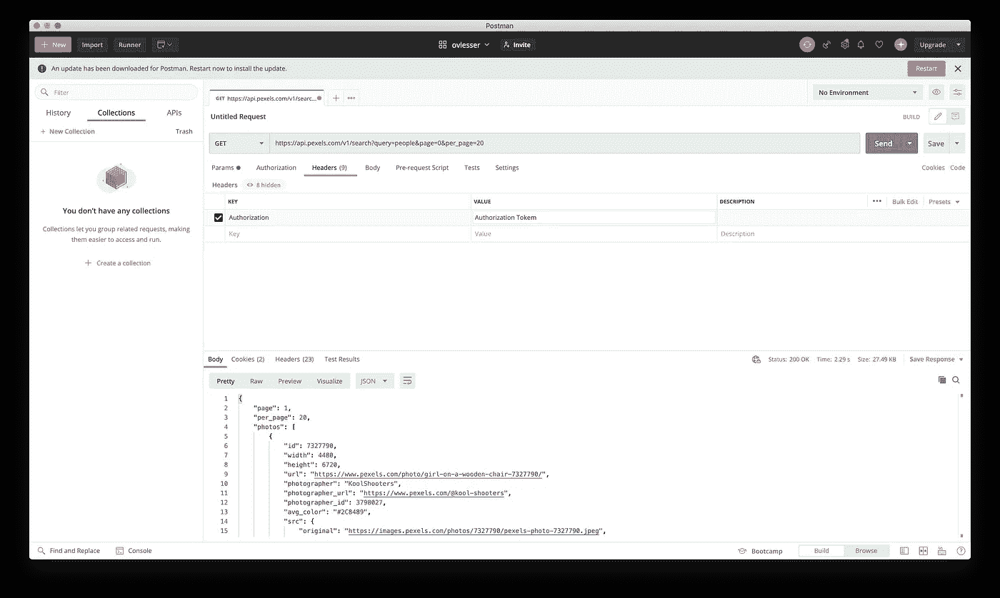

请注意，您需要将`Headers`中的`Authorization Token`替换为创建 Pexels 帐户时获得的实际值。

如果幸运的话，我们会得到如下 JSON 格式的响应:

```
{
  page: 1,
  per_page: 2,
  photos: [
    {
      id: 1105666,
      width: 6720,
      height: 4480,
      url: '[https://www.pexels.com/photo/people-at-concert-1105666/'](https://www.pexels.com/photo/people-at-concert-1105666/'),
      photographer: 'Vishnu R Nair',
      photographer_url: '[https://www.pexels.com/@vishnurnair'](https://www.pexels.com/@vishnurnair'),
      photographer_id: 426592,
      avg_color: '#543421',
      src: {
        original:
          '[https://images.pexels.com/photos/1105666/pexels-photo-1105666.jpeg'](https://images.pexels.com/photos/1105666/pexels-photo-1105666.jpeg'),
        large2x:
          '[https://images.pexels.com/photos/1105666/pexels-photo-1105666.jpeg?auto=compress&cs=tinysrgb&dpr=2&h=650&w=940'](https://images.pexels.com/photos/1105666/pexels-photo-1105666.jpeg?auto=compress&cs=tinysrgb&dpr=2&h=650&w=940'),
        large:
          '[https://images.pexels.com/photos/1105666/pexels-photo-1105666.jpeg?auto=compress&cs=tinysrgb&h=650&w=940'](https://images.pexels.com/photos/1105666/pexels-photo-1105666.jpeg?auto=compress&cs=tinysrgb&h=650&w=940'),
        medium:
          '[https://images.pexels.com/photos/1105666/pexels-photo-1105666.jpeg?auto=compress&cs=tinysrgb&h=350'](https://images.pexels.com/photos/1105666/pexels-photo-1105666.jpeg?auto=compress&cs=tinysrgb&h=350'),
        small:
          '[https://images.pexels.com/photos/1105666/pexels-photo-1105666.jpeg?auto=compress&cs=tinysrgb&h=130'](https://images.pexels.com/photos/1105666/pexels-photo-1105666.jpeg?auto=compress&cs=tinysrgb&h=130'),
        portrait:
          '[https://images.pexels.com/photos/1105666/pexels-photo-1105666.jpeg?auto=compress&cs=tinysrgb&fit=crop&h=1200&w=800'](https://images.pexels.com/photos/1105666/pexels-photo-1105666.jpeg?auto=compress&cs=tinysrgb&fit=crop&h=1200&w=800'),
        landscape:
          '[https://images.pexels.com/photos/1105666/pexels-photo-1105666.jpeg?auto=compress&cs=tinysrgb&fit=crop&h=627&w=1200'](https://images.pexels.com/photos/1105666/pexels-photo-1105666.jpeg?auto=compress&cs=tinysrgb&fit=crop&h=627&w=1200'),
        tiny:
          '[https://images.pexels.com/photos/1105666/pexels-photo-1105666.jpeg?auto=compress&cs=tinysrgb&dpr=1&fit=crop&h=200&w=280'](https://images.pexels.com/photos/1105666/pexels-photo-1105666.jpeg?auto=compress&cs=tinysrgb&dpr=1&fit=crop&h=200&w=280'),
      },
      liked: false,
    },
    {
      id: 15286,
      width: 2500,
      height: 1667,
      url:
        '[https://www.pexels.com/photo/person-walking-between-green-forest-trees-15286/'](https://www.pexels.com/photo/person-walking-between-green-forest-trees-15286/'),
      photographer: 'Luis del Río',
      photographer_url: '[https://www.pexels.com/@luisdelrio'](https://www.pexels.com/@luisdelrio'),
      photographer_id: 1081,
      avg_color: '#283419',
      src: {
        original: '[https://images.pexels.com/photos/15286/pexels-photo.jpg'](https://images.pexels.com/photos/15286/pexels-photo.jpg'),
        large2x:
          '[https://images.pexels.com/photos/15286/pexels-photo.jpg?auto=compress&cs=tinysrgb&dpr=2&h=650&w=940'](https://images.pexels.com/photos/15286/pexels-photo.jpg?auto=compress&cs=tinysrgb&dpr=2&h=650&w=940'),
        large:
          '[https://images.pexels.com/photos/15286/pexels-photo.jpg?auto=compress&cs=tinysrgb&h=650&w=940'](https://images.pexels.com/photos/15286/pexels-photo.jpg?auto=compress&cs=tinysrgb&h=650&w=940'),
        medium:
          '[https://images.pexels.com/photos/15286/pexels-photo.jpg?auto=compress&cs=tinysrgb&h=350'](https://images.pexels.com/photos/15286/pexels-photo.jpg?auto=compress&cs=tinysrgb&h=350'),
        small:
          '[https://images.pexels.com/photos/15286/pexels-photo.jpg?auto=compress&cs=tinysrgb&h=130'](https://images.pexels.com/photos/15286/pexels-photo.jpg?auto=compress&cs=tinysrgb&h=130'),
        portrait:
          '[https://images.pexels.com/photos/15286/pexels-photo.jpg?auto=compress&cs=tinysrgb&fit=crop&h=1200&w=800'](https://images.pexels.com/photos/15286/pexels-photo.jpg?auto=compress&cs=tinysrgb&fit=crop&h=1200&w=800'),
        landscape:
          '[https://images.pexels.com/photos/15286/pexels-photo.jpg?auto=compress&cs=tinysrgb&fit=crop&h=627&w=1200'](https://images.pexels.com/photos/15286/pexels-photo.jpg?auto=compress&cs=tinysrgb&fit=crop&h=627&w=1200'),
        tiny:
          '[https://images.pexels.com/photos/15286/pexels-photo.jpg?auto=compress&cs=tinysrgb&dpr=1&fit=crop&h=200&w=280'](https://images.pexels.com/photos/15286/pexels-photo.jpg?auto=compress&cs=tinysrgb&dpr=1&fit=crop&h=200&w=280'),
      },
      liked: false,
    },
  ],
  total_results: 8000,
  next_page: '[https://api.pexels.com/v1/search/?page=2&per_page=2&query=people'](https://api.pexels.com/v1/search/?page=2&per_page=2&query=people'),
}
```

如果我们分析 JSON 对象，我们会得到模式是

```
{
  page: number,
  per_page: number,
  photos: Array<Photo> ,
  total_result: number,
  next_page: string
}
```

而`Photo`的模式是

```
{
  id: number,
  width: number,
  height: number,
  url: string,
  photographer: string,
  photographer_url: string,
  photographer_id: number,
  avg_color: string,
  src: Src,
  liked: boolean,
}
```

而`Src`的模式是

```
{
  original: string,
  large2x: string,
  large: string,
  medium: string,
  small: string,
  portrait: string,
  landscape: string,
  tiny: string
}
```

当我们创建数据模型时，我们需要这些模式

一旦我们验证了 Pexels API 是可访问的，我们就可以开始构建应用程序了。

# 设置开发环境

然后我们需要根据官方文档设置开发环境([设置开发环境](https://reactnative.dev/docs/environment-setup))，创建新项目有两种方式，用 Expo 或者用 React Native CLI。我们将在教程中使用 React Native CLI。

因为我们需要 Xcode 来让应用程序在 iOS 设备上运行，所以我会按照 MacOS 上的说明操作。关于如何安装依赖项，我不会说太多细节，因为上面的官方文档已经说得很清楚了。

安装完所有依赖项后，让我们通过在终端中运行以下命令，使用 React Native CLI (React Native 命令行界面)创建一个新项目

```
npx react-native init Pexels --template react-native-template-typescript
```

这可能需要几分钟的时间，因为有许多依赖项需要安装。小心我们在命令中有一个参数`—-template react-native-template-typescript`。这意味着我们正在用 TypeScript 模板创建一个项目。

你会发现一个新的文件夹，Pexels 已经被创建在当前的工作目录中，这是整个 React 原生项目。

您可以选择任何首选的编辑器来打开这个项目，但我想使用 VSCode。所以让我们用 VSCode 打开这个文件夹。因此，我们会看到左边项目的整体结构

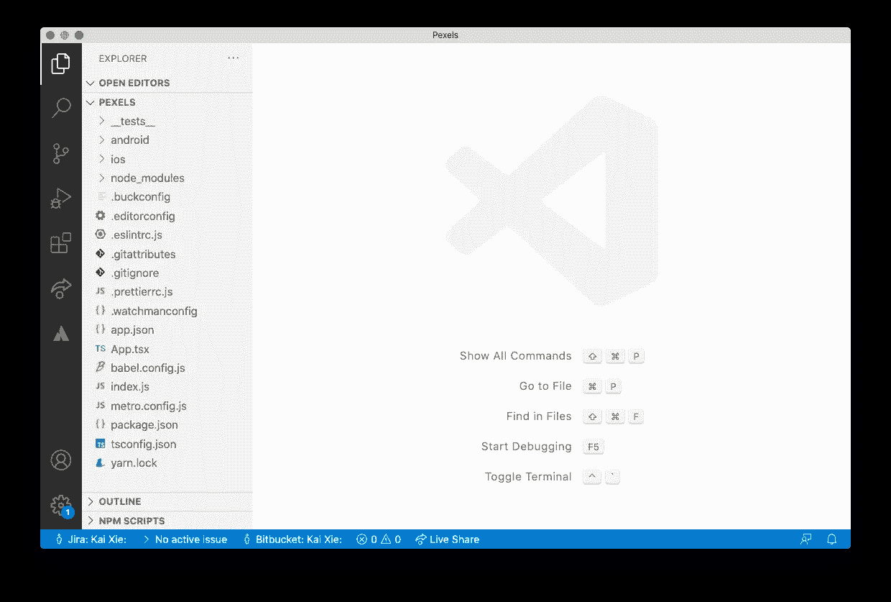

React Native CLI 已经为我们生成了项目的框架。`index.js`是项目的入口，`App.tsx`，在其中你可以找到一些示例组件来显示一些视图，`package.json`是项目的清单文件，在其中声明了一些运行脚本和依赖项。

好的。你可能很好奇如何运行这个 React 原生应用？所以让我们开始吧。

在终端中运行以下命令:

```
cd Pexels
npx react-native run-ios
```

您将在终端中看到如下输出:

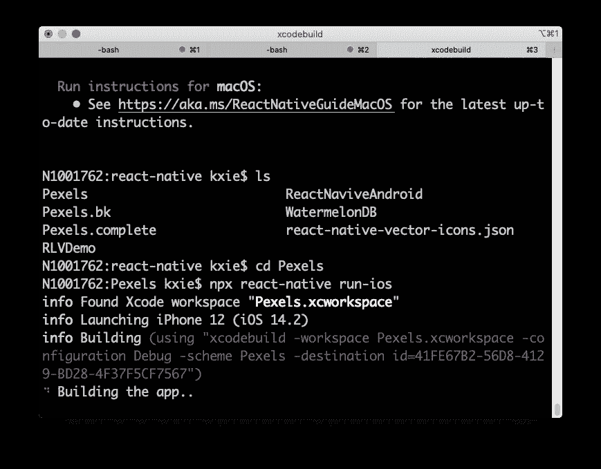

将启动一个 iOS 模拟器，并弹出一个新的终端，如下所示:

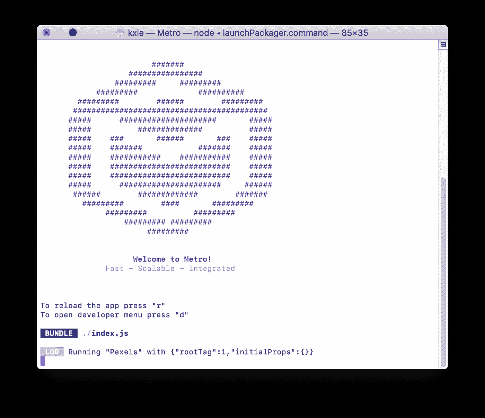

如果一切正常，您将在第一个终端中看到以下消息。

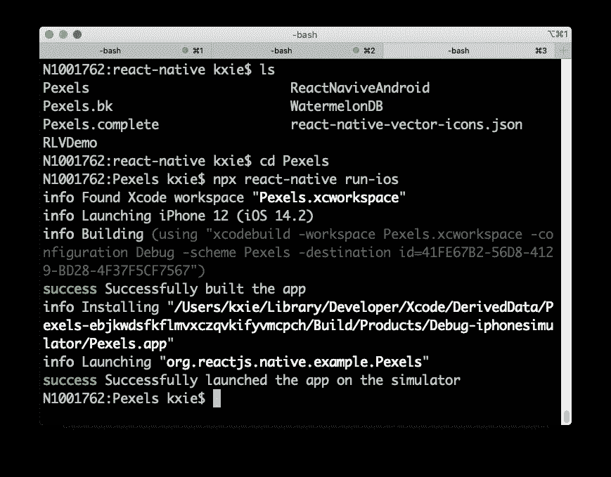

您会看到该应用程序正在 iOS 模拟器上运行，如下所示:

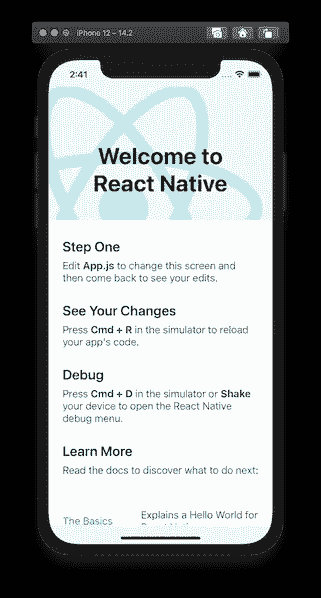

那么如果你熟悉 React，可以试着从`App.tsx`中找到这个 App 骨架的组件。

到目前为止一切顺利。然后让我们停止在第二个终端上运行的 Metro 服务器，关闭 iOS 模拟器上的 App 并基于这个 App 框架实现我们的 App。

# 清除棉绒问题

如果您已经在 VSCode 中安装了`eslint`插件，那么如果您打开`App.tsx`文件，您可能会看到许多 lint 问题。因此，让我们先解决这些问题，将鼠标光标放在一个 lint 问题上，当弹出菜单如下所示时，选择`Quick Fix`:

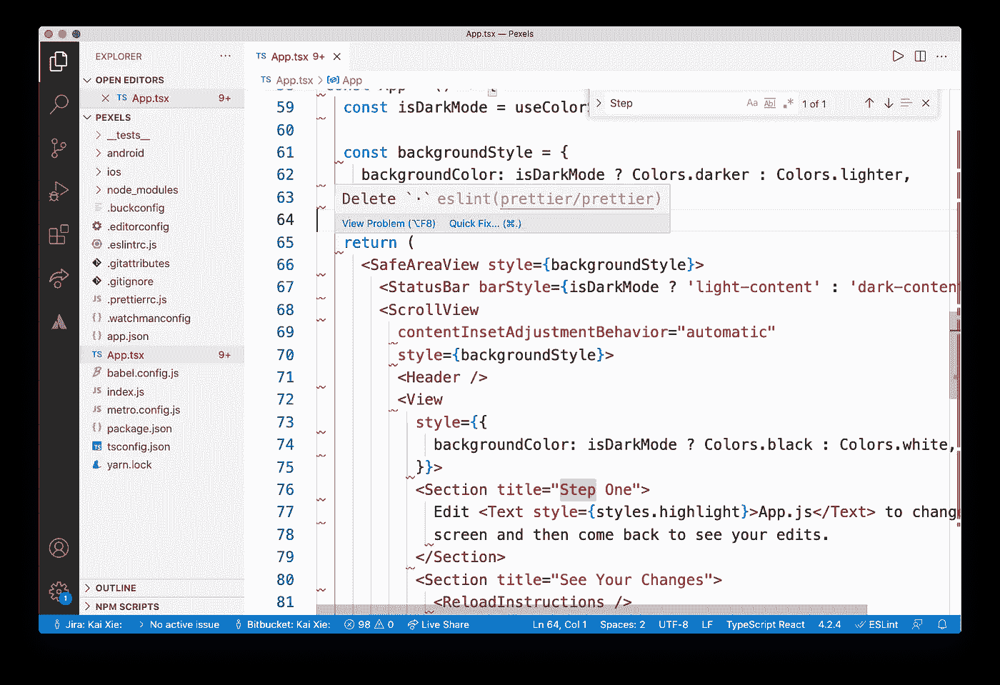

选择`Fix all auto-fixable problems`如下:

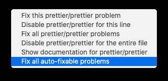

使用这个命令，可以解决所有格式问题，如间距、逗号等。会被修复。然后代码看起来更漂亮。当您在修改源代码或添加新代码后发现这样的 lint 问题时，您可以随时运行这个命令。

接下来让我们添加数据模型

# 添加数据模型

我建议先创建一个新的文件夹，`src`,把我们所有的代码放在里面，这样项目结构会更整洁。

并在`src`文件夹中创建另一个文件夹`@types`。我们将把所有类型的定义放在这个文件夹中。

然后，让我们在`@types`文件夹中创建一个新文件`Data.d.ts`，并在该文件中定义以下接口

```
interface Src {
 original: string;
 large2x: string;
 large: string;
 medium: string;
 small: string;
 portrait: string;
 landscape: string;
 tiny: string;
}interface Photo {
 id: number;
 width: number;
 height: number;
 url: string;
 photographer: string;
 photographer_url: string;
 photographer_id: number;
 avg_color: string;
 src: Src;
 liked: boolean;
 keyword: string;
}interface Data {
 page: number;
 per_page: number;
 photos: Array < Photo > ;
 total_results: number;
 next_page: string;
}
```

我们可以看到我们定义了一个名为`Data`的接口，它从后端映射整个响应 JSON；另一个接口`Photo`，它对应一张照片的 JSON 对象；第三个接口`Src`，它包含照片的所有 URL。这些接口匹配响应中 JSON 对象的模式。

# 构建主页组件

我们将构建一个新的组件，`Home`，在其中我们将显示一个照片列表。

我们需要做的第一步是通过将这个文件拖到 src 文件夹来将`App.tsx`移动到`src`文件夹。VSCode 会重构这个文件中引用的所有地方，所以您只需要接受这些更改。这一步将使项目结构更加清晰。我们之前说过，我们会把所有的源代码放在`src`一个文件夹里。

让我们在`src`文件夹下创建一个新文件夹，命名为`home`，我们将把所有与主页相关的文件，

在该文件夹中新建一个文件`Home.tsx`，新建一个功能组件`Home`，如下所示:

```
import React from 'react';
import {StyleSheet, StatusBar, SafeAreaView, Text} from 'react-native';
import List from './List';
import {sampleData} from './SampleData';const Home = () => {
  const data = sampleData;
  return data && !!data.photos ? (
    <SafeAreaView style={styles.container}>
      <List data={data.photos} />
    </SafeAreaView>
  ) : (
    <Text />
  );
};
const styles = StyleSheet.create({
  container: {
    flex: 1,
    paddingTop: StatusBar.currentHeight || 0 + 0,
    marginHorizontal: 0,
  },
});export default Home;
```

注意，我们还没有实现依赖项、`List`和`sampleData`，所以会有一些突出显示的警告。我们稍后将修复它们。

这是一个非常简单的函数组件 Home，如果有照片要显示，我们在`[SafeAreaView](https://reactnative.dev/docs/safeareaview)`中定义了`List`组件。`SafeAreaView`的目的是在设备的安全区域边界内呈现内容。目前仅适用于 iOS 11 版或更高版本的 iOS 设备。

先解决`sampleData`吧。因为我们还没有实现网络请求，所以我们将显示带有本地数据的列表。我们需要在`home`文件夹中创建一个文件`SampleData.ts`，并用如下所示的值定义一个变量`sampleData`:

```
export const sampleData = {
  page: 1,
  per_page: 2,
  photos: [
    {
      id: 1105666,
      width: 6720,
      height: 4480,
      url: '[https://www.pexels.com/photo/people-at-concert-1105666/'](https://www.pexels.com/photo/people-at-concert-1105666/'),
      photographer: 'Vishnu R Nair',
      photographer_url: '[https://www.pexels.com/@vishnurnair'](https://www.pexels.com/@vishnurnair'),
      photographer_id: 426592,
      avg_color: '#543421',
      src: {
        original:
          '[https://images.pexels.com/photos/1105666/pexels-photo-1105666.jpeg'](https://images.pexels.com/photos/1105666/pexels-photo-1105666.jpeg'),
        large2x:
          '[https://images.pexels.com/photos/1105666/pexels-photo-1105666.jpeg?auto=compress&cs=tinysrgb&dpr=2&h=650&w=940'](https://images.pexels.com/photos/1105666/pexels-photo-1105666.jpeg?auto=compress&cs=tinysrgb&dpr=2&h=650&w=940'),
        large:
          '[https://images.pexels.com/photos/1105666/pexels-photo-1105666.jpeg?auto=compress&cs=tinysrgb&h=650&w=940'](https://images.pexels.com/photos/1105666/pexels-photo-1105666.jpeg?auto=compress&cs=tinysrgb&h=650&w=940'),
        medium:
          '[https://images.pexels.com/photos/1105666/pexels-photo-1105666.jpeg?auto=compress&cs=tinysrgb&h=350'](https://images.pexels.com/photos/1105666/pexels-photo-1105666.jpeg?auto=compress&cs=tinysrgb&h=350'),
        small:
          '[https://images.pexels.com/photos/1105666/pexels-photo-1105666.jpeg?auto=compress&cs=tinysrgb&h=130'](https://images.pexels.com/photos/1105666/pexels-photo-1105666.jpeg?auto=compress&cs=tinysrgb&h=130'),
        portrait:
          '[https://images.pexels.com/photos/1105666/pexels-photo-1105666.jpeg?auto=compress&cs=tinysrgb&fit=crop&h=1200&w=800'](https://images.pexels.com/photos/1105666/pexels-photo-1105666.jpeg?auto=compress&cs=tinysrgb&fit=crop&h=1200&w=800'),
        landscape:
          '[https://images.pexels.com/photos/1105666/pexels-photo-1105666.jpeg?auto=compress&cs=tinysrgb&fit=crop&h=627&w=1200'](https://images.pexels.com/photos/1105666/pexels-photo-1105666.jpeg?auto=compress&cs=tinysrgb&fit=crop&h=627&w=1200'),
        tiny: '[https://images.pexels.com/photos/1105666/pexels-photo-1105666.jpeg?auto=compress&cs=tinysrgb&dpr=1&fit=crop&h=200&w=280'](https://images.pexels.com/photos/1105666/pexels-photo-1105666.jpeg?auto=compress&cs=tinysrgb&dpr=1&fit=crop&h=200&w=280'),
      },
      liked: false,
    },
    {
      id: 15286,
      width: 2500,
      height: 1667,
      url: '[https://www.pexels.com/photo/person-walking-between-green-forest-trees-15286/'](https://www.pexels.com/photo/person-walking-between-green-forest-trees-15286/'),
      photographer: 'Luis del Río',
      photographer_url: '[https://www.pexels.com/@luisdelrio'](https://www.pexels.com/@luisdelrio'),
      photographer_id: 1081,
      avg_color: '#283419',
      src: {
        original: '[https://images.pexels.com/photos/15286/pexels-photo.jpg'](https://images.pexels.com/photos/15286/pexels-photo.jpg'),
        large2x:
          '[https://images.pexels.com/photos/15286/pexels-photo.jpg?auto=compress&cs=tinysrgb&dpr=2&h=650&w=940'](https://images.pexels.com/photos/15286/pexels-photo.jpg?auto=compress&cs=tinysrgb&dpr=2&h=650&w=940'),
        large:
          '[https://images.pexels.com/photos/15286/pexels-photo.jpg?auto=compress&cs=tinysrgb&h=650&w=940'](https://images.pexels.com/photos/15286/pexels-photo.jpg?auto=compress&cs=tinysrgb&h=650&w=940'),
        medium:
          '[https://images.pexels.com/photos/15286/pexels-photo.jpg?auto=compress&cs=tinysrgb&h=350'](https://images.pexels.com/photos/15286/pexels-photo.jpg?auto=compress&cs=tinysrgb&h=350'),
        small:
          '[https://images.pexels.com/photos/15286/pexels-photo.jpg?auto=compress&cs=tinysrgb&h=130'](https://images.pexels.com/photos/15286/pexels-photo.jpg?auto=compress&cs=tinysrgb&h=130'),
        portrait:
          '[https://images.pexels.com/photos/15286/pexels-photo.jpg?auto=compress&cs=tinysrgb&fit=crop&h=1200&w=800'](https://images.pexels.com/photos/15286/pexels-photo.jpg?auto=compress&cs=tinysrgb&fit=crop&h=1200&w=800'),
        landscape:
          '[https://images.pexels.com/photos/15286/pexels-photo.jpg?auto=compress&cs=tinysrgb&fit=crop&h=627&w=1200'](https://images.pexels.com/photos/15286/pexels-photo.jpg?auto=compress&cs=tinysrgb&fit=crop&h=627&w=1200'),
        tiny: '[https://images.pexels.com/photos/15286/pexels-photo.jpg?auto=compress&cs=tinysrgb&dpr=1&fit=crop&h=200&w=280'](https://images.pexels.com/photos/15286/pexels-photo.jpg?auto=compress&cs=tinysrgb&dpr=1&fit=crop&h=200&w=280'),
      },
      liked: false,
    },
  ],
  total_results: 8000,
  next_page: '[https://api.pexels.com/v1/search/?page=2&per_page=2&query=people'](https://api.pexels.com/v1/search/?page=2&per_page=2&query=people'),
};
```

实际上，这个值是来自后端 API 的响应 JSON 对象。它具有与来自真实网络请求的响应相同的模式。因此，如果我们的代码能够处理这个样本数据，它就能够处理真实的响应。

让我们通过创建一个新文件`List.tsx`和一个新的函数组件`List`来实现`List`组件，如下所示:

```
import React from 'react';
import {
 StyleSheet,
 FlatList,
 StatusBar
} from 'react-native';
import Item from './Item';const List = ({
 data
}: {
 data: Array < Photo >
}): JSX.Element => {
 const renderItem = ({
  item
 }: {
  item: Photo
 }) => < Item photo = {
  item
 }
 />;
 return ( <
  FlatList style = {
   styles.container
  }
  data = {
   data
  }
  numColumns = {
   2
  }
  renderItem = {
   renderItem
  }
  keyExtractor = {
   (item: Photo) => item.id.toString()
  }
  />
 );
};const styles = StyleSheet.create({
 container: {
  flex: 1,
  // flexDirection: 'row',
  paddingTop: StatusBar.currentHeight || 0 + 0,
  marginHorizontal: 0,
 },
});export default List;
```

在这个文件中，我们用标准的 React 本地组件`FlatList`实现了一个函数组件`List`。我们将用两列显示照片，并在稍后添加的`Item`组件中呈现它们。

因此，让我们通过在`home`文件夹中创建一个新文件`Item.tsx`来实现`Item`组件，并在该文件中添加一个新的功能组件 Item，如下所示:

```
import React from 'react';
import {
 StyleSheet,
 Image,
 Dimensions
} from 'react-native';
const deviceWidth = Dimensions.get('window').width;const Item = ({
 photo
}: {
 photo: Photo
}): JSX.Element => {
 return ( <Image
   style = {styles.item}
   resizeMode = {'cover'}
   source = {{uri: photo.src.medium}}
  />
 );
};const styles = StyleSheet.create({
 container: {
  flexDirection: 'row',
  alignItems: 'center',
  justifyContent: 'center',
 },
 item: {
  backgroundColor: 'aqua',
  margin: 4,
  width: deviceWidth / 2 - 4 * 2,
  height: 200,
 },
});export default Item;
```

在这个`Item`组件中，我们用标准的`Image`组件显示照片，它支持用 URI 显示网络图像。

我们已经实现了`Home`组件、`List`组件和`Item`组件来显示列表中的照片，现在让我们将它们组装在一起。

让我们回到`App.tsx`,按如下方式替换它:

```
import React from 'react';
import {SafeAreaProvider} from 'react-native-safe-area-context';
import Home from './home/Home';const App = () => {
  return (
    <SafeAreaProvider>
      <Home />
    </SafeAreaProvider>
  );
};
export default App; 
```

这非常简单明了，只需在一个`SafeAreaProvider`中显示`Home`组件。如果您以前没有安装过`react-native-safe-area-context`包，您可能需要使用下面的命令来安装它。

```
yarn add react-native-safe-area-context
```

`SafeAreaProvider`将确保所有组件都显示在一个安全的区域，即使是在 iPhone X 和更高版本的设备上。

到目前为止，我们已经用本地数据构建了基本的 React 本地应用程序。你可能想运行它。但在运行应用程序之前，你可能需要将应用程序安装在模拟器或设备上。尽管您可以用命令行构建并运行它

```
npx react-native run-ios
```

我仍然认为值得用 Android 应用程序的`Android Studio`或 iOS 应用程序的`Xcode`来构建它。因此，在终端中运行以下命令:

```
cd ios/; pod install; cd ..
```

将`ios`文件夹拖到`Xcode`中，用 Xcode 打开`ios`项目，构建 App。

并在终端中使用以下命令运行 Metro 服务器

```
yarn start --reset-cache
```

并从设备运行 Pexels 应用程序，您会看到该应用程序是这样运行的:

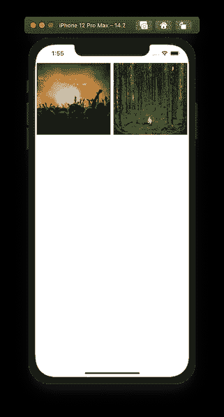

正如我们看到的，显示了两幅图像，它们来自本地样本数据，整个应用程序不会干扰系统区域。

到目前为止一切顺利。我们将在下一章显示从后端 API 获取的真实数据，而不是本地数据。

# 从后端 API 获取数据

实际上，用 React Native 从后端 API 获取数据非常简单。我们可以用[获取 API](https://developer.mozilla.org/en-US/docs/Web/API/Fetch_API) 来实现这个功能。所以我们只是在`Home`组件中添加了一个本地函数`fetchData`，如下所示:

```
const [data, setData] = useState<Data>();
const fetchData = async (
  query: string = 'panda',
  pageIndex: number = 0,
  perPage: number = 20,
) => {
  try {
    const url = `https://api.pexels.com/v1/search?query=${query}&page=${pageIndex}&per_page=${perPage}`;
    const response = await fetch(url, {
      headers: {
        Authorization:
          '<*authorization token>*',
      },
    });
    const json = await response.json();
    setData(json);
  } catch (error) {
    console.error(error);
  }
};
```

请将`authorization token`更改为您的，这是您注册 Pexels 帐户时获得的。

正如我们看到的，我们将函数`fetchData`定义为异步函数，这样我们可以避免回调，使代码易于阅读。这个函数非常简单，只需用 Fetch API 获取数据，并将响应保存在本地。

你可能会注意到我们在这里使用的是`React Hooks`。请在[https://reactjs.org/docs/hooks-intro.html](https://reactjs.org/docs/hooks-intro.html)查阅官方文件。一旦我们从后端获得数据，我们就用`setData`设置`data`。

然后我们还需要在适当的时候调用这个`fetchData`函数，所以我们需要在`Home`组件中添加以下代码:

```
useEffect(() => {
  if (!data) {
    (async () => await fetchData())();
  }
});
```

正如我们所看到的，我们将在`Effect`钩子中调用`fetchData`函数，如果没有数据被提取。

您还可以添加一些新的导入

```
import React, {useState, useEffect} from 'react';
```

并移除未使用的`sampleData`相关代码和依赖项。

然后让我们再次运行应用程序，它将显示来自后端 API 的真实数据，如下所示:

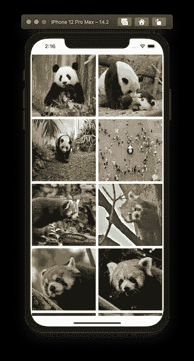

为什么是熊猫？这是因为我们使用了一个硬编码的关键字，`panda`来从后端 API 获取图像。我们稍后会更新。

# 添加网络错误图标

在网络获取的补充部分，如果数据获取失败，我们还需要显示一个错误图标，让用户知道发生了什么。

我会介绍`react-native-vector-icon`包，因为这个包里有很多现代设计的图标。因此请按照[https://www.npmjs.com/package/react-native-vector-icons](https://www.npmjs.com/package/react-native-vector-icons)中的说明进行安装。

安装完`react-native-vector-icons`包后，你需要运行

```
cd ios/; pod install; cd ..
```

你会看到这样的信息

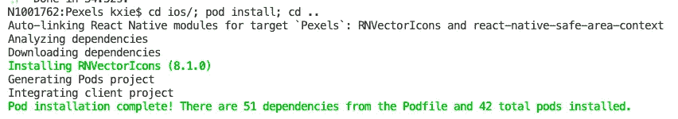

而且你还需要用`Xcode`重新构建 App，因为 App 里需要安装一些字体库。

我们还需要如下更新`Home`组件:

首先，让我们添加一个关于网络错误的新状态挂钩

```
const [error, setError] = useState<Error>();
```

如果抓取失败，调用`setError()`,如图:

```
} catch (error) {
  setError(error);
}
```

然后添加一个新的组件，`icon`像

```
const icon = error ? (
   <Icon name={'cloud-off'} style={styles.icon} size={160} color={'grey'} />
) : undefined;
```

并将`list`组件包装在一个变量中，如

```
const list =
  data && !!data.photos && data.photos.length > 0 ? (
    <List data={data.photos} />
  ) : undefined;
```

并按如下方式更新`Home`组件

```
return (
  <SafeAreaView style={styles.container}>
    {list}
    {icon}
  </SafeAreaView>
);
```

并且在`styles`对象中添加一个新的样式，如图所示:

```
icon: {
  position: 'absolute',
  alignItems: 'center',
  alignSelf: 'center',
  justifyContent: 'center',
  top: '40%',
},
```

并按如下方式添加依赖项:

```
import Icon from 'react-native-vector-icons/MaterialIcons';
```

现在，我们可以打开设备的飞行模式并运行应用程序，它会显示一个`cloud-off`图标，而不是列表，如

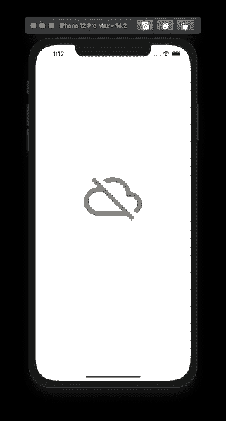

到目前为止，我们已经实现了网络访问，但仍然有一个致命的问题，那就是总共显示 20 张照片，即使我们滚动到底部，也不会加载更多的照片。我们将在下一章添加分页。

# 添加分页

让我们打开`List.tsx`并将以下代码行添加到`List`组件中

```
const List = ({
  data,
  **nextPage,**
}: {
  data: Array<Photo>;
  **nextPage: () => void;**
}): JSX.Element => {
  const renderItem = ({item}: {item: Photo}) => <Item photo={item} />;
  return (
    <FlatList
      style={styles.container}
      data={data}
      numColumns={2}
      renderItem={renderItem}
      keyExtractor={(item: Photo) => item.id.toString()}
      **onEndReached={nextPage}**
    />
  );
};
```

我们给`List`组件的 props 添加了一个新参数`nextPage`，它是一个函数，并将这个`nextPage`函数设置为`FlatList`组件的`onEndReached`props。所以当用户滚动到列表底部时，这个函数就会被触发。

然后让我们在`Home.tsx`中实现这个`nextPage`函数如下:

```
const nextPage = () => {
  const key = 'page';
  if (data?.next_page) {
    const page = decodeURIComponent(
      data.next_page.replace(
        new RegExp(
          '^(?:.*[&\\?]' +
            encodeURIComponent(key).replace(/[\.\+\*]/g, '\\$&') +
            '(?:\\=([^&]*))?)?.*$',
          'i',
        ),
        '$1',
      ),
    );
    fetchData('panda', parseInt(page, 10) || 0, 20);
  }
};
```

正如我们看到的，我们从响应 JSON 中的`next_page`字段提取了`pageIndex`，并发送了另一个获取下一页数据的请求。

我们还需要修改`Home`组件和`fetchData`功能如下:

```
const Home = () => {
  const [data, setData] = useState<Data>();
  const [error, setError] = useState<Error>();
  **const requests = new Set();**
  const fetchData = async (
    query: string = 'panda',
    pageIndex: number = 0,
    perPage: number = 20,
  ) => {
 **const url = `https://api.pexels.com/v1/search?query=${query}&page=${pageIndex}&per_page=${perPage}`;
    try {
      if (requests.has(url)) {
        return;
      }
      requests.add(url);
      console.log(`fetch from: ${url}`);**      const response = await fetch(url, {
        ......
      });
      const json = await response.json();
 **const photos =
        data && data.photos ? data?.photos.concat(json.photos) : json.photos;
      setData({...json, photos});**    } catch (error) {
      setError(error);
    **} finally {
      requests.delete(url);
    }
**  };
......
  const list =
    data && !!data.photos && data.photos.length > 0 ? (
      <List data={data.photos} **nextPage={nextPage}** />
    ) : undefined;
  };
```

我们将`nextPage`函数作为道具传递给了`List`组件。

如果当前列表中有一些照片，我们还会将新照片连接到当前照片列表中。

我们还添加了一个集合`requests`，用来记住哪些请求已经被发送，以避免发送重复的请求。

更新代码后，我们可以再次运行应用程序，向下滚动到列表的底部，然后它会加载下一页的照片，并将它们添加到列表中。

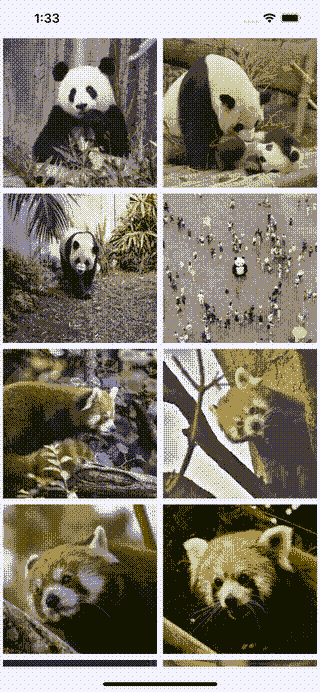

我们已经建立了一个图像应用程序，它从后端 API 获取照片，并支持分页。但是它能够获取`panda`图片只是因为我们硬编码了查询关键字。让我们添加一个新组件，用户可以使用它输入查询关键字。

# 添加搜索栏

在本章中，我们将添加一个搜索栏，用户可以通过它输入关键字来查询图像。但是我们不打算在 [react native elements](https://reactnativeelements.com/docs/searchbar/) 中使用`SearchBar`，因为它会在每次用户继续输入时被触发。但是在我们的场景中，我们需要它只在用户点击搜索按钮时被触发。

因此，我们将通过运行如下所示的命令引入一个名为`react-native-search-bar`的包:

```
yarn add react-native-search-bar
```

然后跑

```
cd ios/; pod install; cd ..
```

并使用`Xcode`重新构建应用程序，因为搜索栏需要一些原生依赖项。

我们需要在主文件夹中创建一个新文件`Search.tsx`，并实现`Search`组件，如下所示:

```
import React from 'react';
import SearchBar from 'react-native-search-bar';const Search = ({
  onSearch,
}: {
    onSearch: (query: string) => void;
}): JSX.Element => {
  return (
    <SearchBar placeholder={'Type Here...'} onSearchButtonPress={onSearch} />
  );
};
export default Search; 
```

而`Search`组件有 props，`onSearch`，当用户键入一个关键字并开始搜索时会被触发。

然后让我们将`Home`组件更新如下:

```
import React, {useState, useEffect} from 'react';
import {StyleSheet, StatusBar, SafeAreaView, Text} from 'react-native';
import List from './List';
import Search from './Search';const Home = () => {
  const [data, setData] = useState<Data>();
  const [error, setError] = useState<Error>();
  **const [keyword, setKeyword] = useState<string>();**
  const requests = new Set();
  const fetchData = async (
    **query: string = '',**
    pageIndex: number = 0,
    perPage: number = 20,
  ) => {
    ...... const nextPage = () => {
    ......
      fetchData(**keyword**, parseInt(page, 10) || 0, 20);
    }
  }; **const onSearch = (query: string) => {
    setKeyword(query);
    setData(undefined);
  };** useEffect(() => {
 **if (keyword) {
      (async () => await fetchData(keyword, 0, 20))();
    }
  }, [keyword]);
  ......
  const search = <Search onSearch={onSearch} />;** return (
 **<SafeAreaView style={styles.container}>
      {search}
      {list}
      {icon}
    </SafeAreaView>**  );
};
......
```

不要忘记添加`Search`组件的导入。

正如我们看到的，我们为关键字更改添加了一个新的钩子`useState`。我们还增加了一个新的功能`onSearch`，它将设置`keyword`，并清除当前的`data`，当前的图像列表。我们也使用`useEffect`来监控`keyword`的变化。一旦`keyword`改变，我们将使用新的关键字调用`fetchData`。而且我们还在`fetchData`函数和`nextPage`函数内部做了一些修改，让它们使用关键字作为查询字符串。

现在让我们运行应用程序，您会看到如下内容:

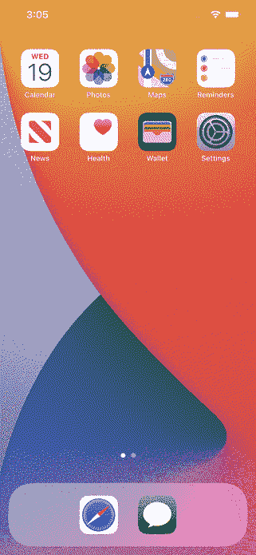

到目前为止一切顺利，我们已经实现了图像浏览应用程序的大部分功能。在下一章中，我们将添加一个详细页面来显示单张照片的详细信息。我们将学习如何用`[react-navigation](https://reactnavigation.org/)`实现导航。

# 导航至详细页面

> 通过 react-navigation，我们可以轻松地为您的 react 原生应用程序实现路由和导航。(【https://reactnavigation.org/】T21)

在本章中，我们将添加另一个页面来显示单个图像的细节，用户可以通过从主页上的列表中选择一个项目来导航到细节页面。

首先，我们需要通过运行以下命令来添加一些包:

```
yarn add [@react](http://twitter.com/react)-navigation/nativeyarn add react-native-reanimated react-native-gesture-handler react-native-screens react-native-safe-area-context [@react](http://twitter.com/react)-native-community/masked-viewyarn add [@react](http://twitter.com/react)-navigation/stack
```

如我们所见，有很多依赖。

我们也需要跑步

```
cd ios/; pod install; cd ..
```

因为有些 iOS pods 是必须的。

我们会看到如下消息

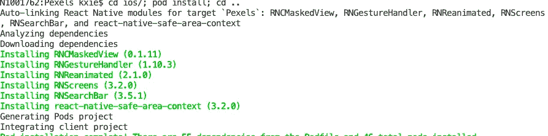

并用`Xcode`重新构建 App。

然后让我们创建一个新的组件，`Detail`。

放弃项目的整洁，让我们在`src`中创建一个新文件夹`detail`，并在其中创建一个新的源文件`Detail.tsx`，并将以下代码放入该文件中:

```
import React, {useEffect} from 'react';
import {StyleSheet, StatusBar, Text, Dimensions, Image} from 'react-native';
import {SafeAreaView} from 'react-native-safe-area-context';
const deviceWidth = Dimensions.get('window').width;const Detail = ({
  navigation,
  route,
}: {
  navigation: any;
  route: any;
}): JSX.Element => {
  const {photo}: {photo: Photo} = route.params;

  styles.image = {
    ...styles.image,
    height: (styles.image.width * photo.height) / photo.width,
  }; useEffect(() => navigation.setOptions({title: photo.id})); return (
    <SafeAreaView style={styles.container}>
      <Image
        style={styles.image}
        resizeMode={'contain'}
        source={{uri: photo.src.medium}}
      />
      <Text style={styles.text}>{photo.photographer}</Text>
      <Text style={styles.text}>{photo.photographer_url}</Text>
      <Text style={styles.text}>{`${photo.width} * ${photo.height}`}
      </Text>
    </SafeAreaView>
  );
};const styles = StyleSheet.create({
  container: {
    flex: 1,
    paddingTop: StatusBar.currentHeight || 0 + 0,
    marginHorizontal: 0,
    alignSelf: 'center',
  },
  image: {
    backgroundColor: 'transparent',
    margin: 24,
    width: deviceWidth * 0.8,
    height: 200,
  },
  text: {
    backgroundColor: 'transparent',
    margin: 8,
    width: deviceWidth * 0.8,
  },
});export default Detail; 
```

这个组件非常简单，只有一个`Image`视图和几个`Text`视图来显示图像的细节。但是有两个问题需要解决，一个是它有一个属性，`navigation`，因为我们需要用下面的代码更新详细页面的标题

```
useEffect(() => navigation.setOptions({title: photo.id}));
```

正如我们所看到的，屏幕的标题将通过参数`title`用`navigation.setOptions`更新。

另一个问题是，我们在渲染图像之前动态地改变了`Image`视图的`height`，因为照片的高度可能不同。

然后我们需要建立导航栈。让我们打开`App.tsx`，添加以下代码

```
import 'react-native-gesture-handler';
import {NavigationContainer} from '@react-navigation/native';
import {createStackNavigator} from '@react-navigation/stack';
import Detail from './detail/Detail';
```

并创建新的堆栈导航器

```
const Stack = createStackNavigator();
```

把这些纸叠成一叠，就像

```
const App = () => {
  return (
    <NavigationContainer>
      <SafeAreaProvider>
        <Stack.Navigator initialRouteName={'Home'}>
          <Stack.Screen
            name={'Home'}
            component={Home}
            options={{title: 'Overview'}}
          />
          <Stack.Screen name={'Detail'} component={Detail} />
        </Stack.Navigator>
      </SafeAreaProvider>
    </NavigationContainer>
  );
};
```

正如我们看到的，在这个导航堆栈中，我们有两个屏幕/页面，`Home`和`Detail`。让我们实现这两个屏幕之间的导航。

让我们打开`Home.tsx`并将参数`navigation`添加到`Home`组件中，如下所示

```
const Home = ({**navigation**}) => {
```

并将这个`navigation`实例传递给`List`，如下所示:

```
const list =
  data && !!data.photos && data.photos.length > 0 ? (
    <List data={data.photos} nextPage={nextPage} **navigation={navigation}** />
  ) : undefined;
```

然后打开`List.tsx`更新`List`组件，如图所示:

```
const List = ({
  data,
  nextPage,
  **navigation**,
}: {
  data: Array<Photo>;
  nextPage: () => void;
  **navigation: any;**
}): JSX.Element => {
```

正如我们所看到的，我们向`List`组件添加了一个参数`navigation`。

我们还需要将这个`navigation`实例传递给`Item`，方法是将`renderItem`函数更新为

```
const renderItem = ({item}: {item: Photo}) => (
  <Item photo={item} **navigation={navigation}** />
);
```

让我们也更新一下`Item`组件。打开`Item.tsx`并将参数`navigation`添加到`Item`组件，如下所示

```
const Item = ({
  photo,
  **navigation,**
}: {
  photo: Photo;
  **navigation: any;**
}): JSX.Element => {
```

并在`Item`组件中创建一个导航功能

```
const navigate = () => navigation.navigate('Detail', {photo});
```

这意味着通过参数`photo`导航到`Detail`屏幕。

我们还需要用一个`TouchableOpacity`包裹`Image`组件，使其可触摸，如下所示:

```
**<TouchableOpacity style={styles.container} onPress={navigate}>**
  <Image
    style={styles.item}
    resizeMode={'cover'}
    source={{uri: photo.src.medium}}
  />
**</TouchableOpacity>**
```

然后，当用户点击此项时，会触发`navigate`功能。

您可能需要添加必要的依赖项，如`TouchableOpacity`。

然后，让我们运行应用程序，并尝试像这样导航:

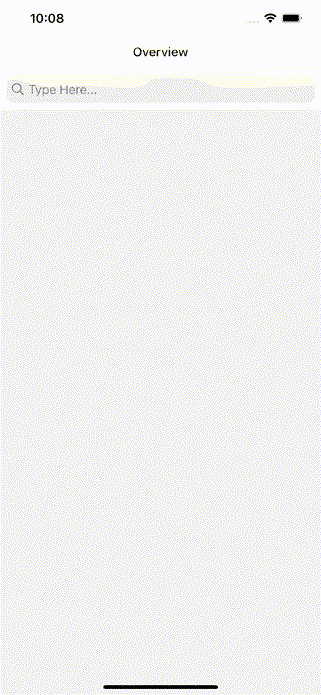

到目前为止，我们已经完成了作为图片浏览应用程序的所有基本功能。但是您会注意到仍然有一些缺陷，比如它不支持本地存储，并且它不使用 Redux 作为中央状态存储。我们将在另一个教程中改进这个应用程序。

如果你对如何用 Redux 实现这个应用的全局状态存储感兴趣，请看看

 [## 使用 React Native(2)-Redux 构建图片浏览应用程序

### React Native 为 iOS 和 Android 带来了 React 的声明式 UI 框架。使用 React Native，您可以使用本机 UI 控件…

kxie0124.medium.com](https://kxie0124.medium.com/build-an-image-browsing-app-with-react-native-2-redux-68f2d7a6744f) 

感谢浏览本教程，并欢迎任何意见。