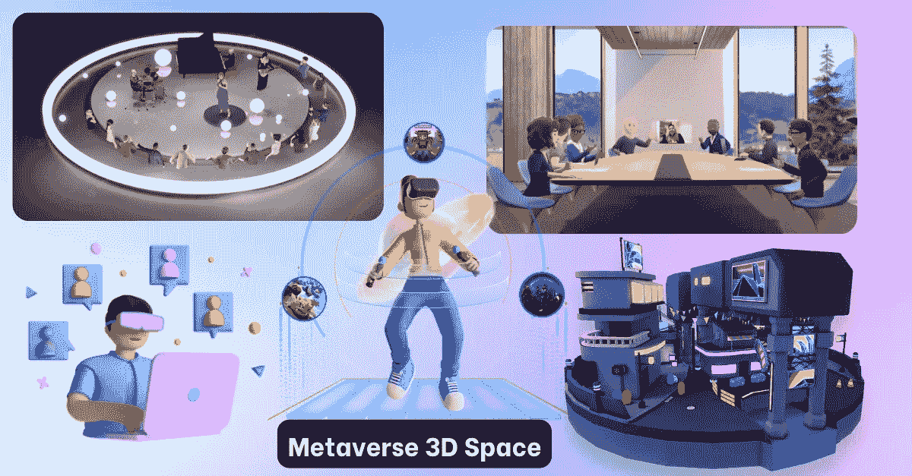

# 利用元宇宙 3D 空间为企业构建身临其境的虚拟工作空间

> 原文：<https://medium.com/geekculture/build-an-immersive-virtual-workspace-for-business-with-metaverse-3d-space-f2b6f867dda3?source=collection_archive---------13----------------------->

Metaverse 3D Space

疫情迫使许多公司远程办公。在家工作已经成为商业领域的一个常用术语。但是，想象一下这样一种情况，你实际上是在你的工作场所，在你舒适的家里工作。听起来很迷人，不是吗？随着元诗句的引入，所有这些都成为可能。现有的视频会议工具可能会使员工脱离工作空间动态。但是，元宇宙工作空间为雇主和雇员提供了身临其境的体验。不仅是工作空间，您还可以通过元宇宙虚拟地主持商务会议、产品发布和管理人力资源需求。

你是一个想为你的企业开发一个 3D 虚拟现实 3D 会议空间的企业家吗？让我们直接进入[元宇宙三维空间发展](https://www.blockchainappfactory.com/metaverse-development-services?utm_source=geekculture&utm_medium=10-12-2022&utm_campaign=Pavun)的细节。

**元宇宙 3D 会议空间**

**Metaverse 3D meeting space**

有了元宇宙 3D 会议空间，您可以在虚拟空间举行会议，这给用户一种身临其境的体验，就像他们实际参加的会议一样。这一概念提供了更多的创造性灵活性和自由移动，并促进自发的对话。元宇宙会议空间的其他优势包括:

➡人可以用独特的方式联系

➡数据和媒体可以实时共享

➡用户可以通过自助导航从一个地方快速移动到另一个地方

➡元宇宙可以从世界上任何一个有互联网接入的地方进入

## **为什么选择元宇宙工作区？**

元宇宙工作区对中小型企业非常有利，因为他们缺乏资金来运行物理工作区。小公司和初创公司通过元宇宙工作区更有效地连接其组织内部，从而在市场中获得竞争优势。

对于大型企业来说，虚拟工作空间可以打破孤岛，与团队成员、经理甚至首席执行官展开自发的对话。部门还可以通过虚拟工作空间更有效地进行连接。

# **3D 虚拟现实会议空间的特征:**

✅ **实时沉浸式体验:**元宇宙使用沉浸式虚拟现实技术，让您可以实时看到您的同事，从而更容易在虚拟空间中与他们互动。非正式和自发的对话在商务交流中占很大比例；这些重要的自发对话在疫情时期的远程工作中丢失了。

✅ **康乐空间:**康乐空间是人们可以休息和体验不同事物的地方。这些空间可以设计成森林、水族馆，甚至是月球。该功能旨在解决员工的精神健康和工作压力。这些都是根据点播内容制作的，如冥想或锻炼课程。

✅ **实时跟踪:**就像一个实体办公室一样，你可以虚拟地在办公空间走动，并获得办公室楼层的 360 度视图。你可以查看同事的位置，看看谁有空，和他们聊天，等等。

✅ **数字同事:**工作同事不会仅仅局限于现实生活中的头像；你的元宇宙也将由数字同事组成——用强大的人工智能技术构建的高度逼真的类人机器人。这些数字机器人可以在元宇宙领域充当助手和顾问；这释放了人力资源，使其能够从事更高的生产力和增值任务。

✅ **去中心化:** [基于区块链技术开发的元宇宙工作空间](https://www.blockchainappfactory.com/metaverse-development-services?utm_source=geekculture&utm_medium=10-12-2022&utm_campaign=Pavun)为公司提供了透明和去中心化的平台。这确保了品牌的安全和公平的工作环境。

✅ **培训和发展:**元宇宙可以在虚拟环境中为员工提供有效的培训和技能发展。这可以极大地改善学习，减少获取新技能所需的时间和精力。高度逼真的虚拟“游戏”场景，如“挑战客户对话”、“重要销售演示”，为用户提供了实时体验。

3D virtual reality meeting space

# **谁在用元宇宙开会:**

➼ **运营:**运营团队使用元宇宙来提高运营效率和进行培训。它可用于运营教育以及团队和业务部门会议。

➼ **人力资源:**人力资源团队利用元宇宙，通过促进健康的工作文化、留住员工和吸引顶尖人才，来维持一个繁荣活跃的工作场所。人力资源部门使用元宇宙的一些案例包括招聘会、面试、入职、社交活动和人力资源培训课程。

➼ **营销团队:**营销团队有效利用元宇宙来解决技术限制，帮助品牌有效成长。营销团队使用元宇宙的一些案例包括产品发布会、粉丝活动、合作活动和营销培训会议。

➼ **销售:**对于销售团队来说，这是关于利用元宇宙通过创造销售线索来促进他们在数字领域的销售。销售团队可以有效地优化、留住客户、提高盈利能力和增加收入。销售团队的用例包括粉丝活动、销售体验、客户答谢活动、销售培训和服务开发活动。

➼ **客户服务:**在客户服务方面，元宇宙致力于提供一流的客户服务，确保用户了解他们的产品。客户支持团队使用元宇宙的案例包括客户反馈、个人会议、客户支持培训等。

## **总结**

许多世界领先的公司，如 Meta 和微软，已经开发了他们自己的元宇宙会议空间。根据比尔·盖茨的说法，几年后，大多数工作会议可能会在元宇宙召开。您还可以为您的公司创建一个完全定制的元宇宙 3D 虚拟现实会议工作区，并通过聘请专业的[元宇宙 3D 空间开发](https://www.blockchainappfactory.com/metaverse-development-services?utm_source=geekculture&utm_medium=10-12-2022&utm_campaign=Pavun)公司保持领先地位。