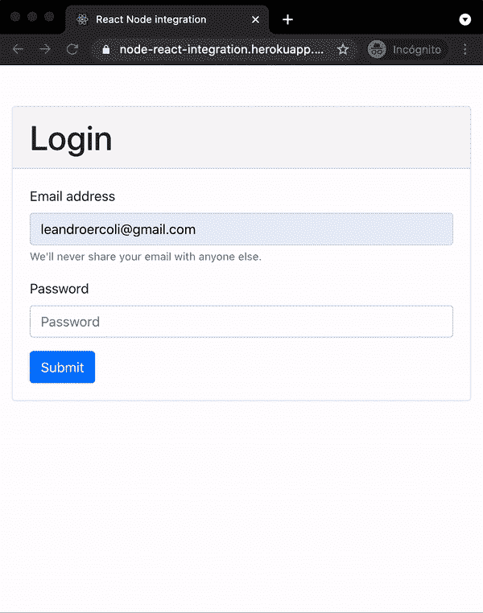
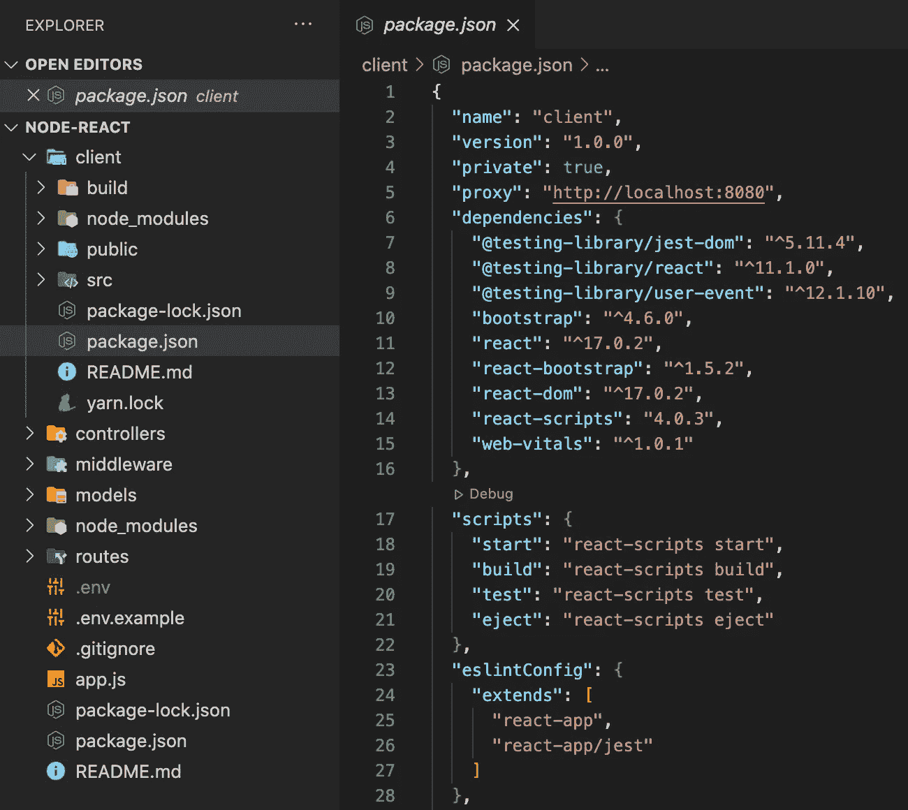

# 使用 React 和 Node.js+Express 构建和部署 Web 应用程序

> 原文：<https://medium.com/geekculture/build-and-deploy-a-web-application-with-react-and-node-js-express-bce2c3cfec32?source=collection_archive---------0----------------------->

## 集成 Node.js、Express 和 React 的分步指南。



## 应用程序

为了完成连接和运行 Node.js 服务器和 React 应用程序的步骤，我们将构建一个简单的 web 应用程序，在芝加哥的[艺术学院的 API](https://api.artic.edu/docs/) 上搜索艺术品。我们将建立一个基本的登录页面，在浏览器上保存一个令牌以保持用户登录，并在 AIC 的数据库中通过关键字搜索艺术品。主页上的注销按钮将从本地存储中删除令牌，并将用户重定向到登录页面。

需要一些 Node.js、Express 和 React 方面的知识和经验。

## 后端

首先，我们将从构建应用程序的后端开始。下载并安装最新版本的 [Node.js](https://nodejs.org/en/) 。为此项目创建一个新文件夹，并在其中打开一个终端窗口。运行`npm init`快速创建一个 *package.json* 文件，我们将在其中列出所有依赖项及其版本，以及其他元数据。这使得项目可重复，并简化了开发人员之间的协作。

> 专业提示:全局安装 [nodemon](https://www.npmjs.com/package/nodemon) 以在每次文件改变时自动重启服务器。

我们还会在开始写代码之前安装一些包。 [Express](https://www.npmjs.com/package/express) 是一个构建在 Node.js 之上的框架，它简化了它的 API，允许我们平滑地添加中间件、路由和请求处理程序。 [Cors](https://www.npmjs.com/package/cors) 将处理跨源资源共享配置。 [Dotenv](https://www.npmjs.com/package/dotenv) 使我们能够将秘密(如端口号、凭证或令牌)从源代码中分离出来，并将这些信息存储在一个*中。env* 文件指出**不应该**在 git 上提交。Express-validator 是 validator.js 的一个包装器，有助于输入净化和验证。

```
npm i express cors dotenv express-validator
```

应用程序后端的入口点文件(由 *package.json* 文件中的属性`main`设置)将初始化一个服务器并监听指定端口上的连接。我们还应该添加所有的中间件功能，并在服务器启动时将路由绑定到控制器。

Entry point file

models/server.js

routes/auth.js

我们将通过请求处理器上的[中间件函数](https://expressjs.com/en/guide/using-middleware.html)来净化和验证输入数据，如果没有错误发生，就将这些值发送给相应的控制器函数。为了使本指南简单，登录控制器将只允许用户在输入密码为*“1234”时登录。理想情况下，这些信息将与数据库条目相匹配。*

controllers/auth.js

这应该足以让用户登录并重定向到主页。每次加载应用程序时，我们将检查浏览器上是否保存了令牌。

## API 集成

由于 AIC 的 API 不需要授权协议来请求数据，控制器将从前端接收一个关键字作为 [URL 参数](https://expressjs.com/en/api.html#req)，并执行对 API 的请求，以获取与搜索词匹配的作品。为了与 API 通信，我们将安装[交叉提取](https://www.npmjs.com/package/cross-fetch)库，并执行带有适当参数的 GET 请求。

API 响应将被解析为一个 JSON 对象，发送到前端，并转化为浏览器上呈现的 UI 组件。

controllers/homepage.js

## 前端

我们将把所有前端(React)代码分组到根级别的一个新文件夹中。它将选择我们为节点服务器定义的相同的`.gitignore`规则(如果您还没有选择，`git init`将创建一个新的 Git 存储库)。进入创建的文件夹，用 [Create React App](https://es.reactjs.org/docs/create-a-new-react-app.html#create-react-app) 启动 React 项目。

```
npx create-react-app node-react
```

由于应用程序的每个部分在开发时将运行在不同的端口上，我们需要[代理来自前端的 API 请求](https://create-react-app.dev/docs/proxying-api-requests-in-development/)。为此，如果后端服务器运行在端口 8080 上，那么在客户端的 *package.json* : `“proxy”: “http://localhost:8080”`中添加这一行



Folder structure and front end proxy

现在，从前端到相对路径的所有未知请求都将被发送到运行在端口 8080 上的后端服务器。请注意，这仅在开发中有效，在生产中不会有任何影响。

让我们[安装 Bootstrap](https://react-bootstrap.github.io/getting-started/introduction) 并使用它的 React 组件构建一个基本的 UI 来与后端交互。在应用程序的入口点组件上，我们将检查本地存储上的令牌，以了解用户是否已经登录。注销时，我们将从浏览器的存储中删除令牌。

App.js

为了触发对艺术品的 AIC 搜索，我们将使用相对路径向后端执行请求。随着应用程序的扩展，将所有 API 函数放在一个与 UI 组件分开的文件夹中。

api/index.js

我们现在可以从 React UI 组件对 Node.js 服务器执行 API 请求。例如，根据关键词查找艺术品:

```
const artworks = await searchArtworks({ keyword });
```

components/homepage.js

## 同时地

如果我们同时使用 npm 的包[和](https://www.npmjs.com/package/concurrently)，那么同时开发和运行前端和后端会变得更容易:我们可以同时运行多个命令，并在每次更改时自动重新加载两个服务器。

```
npm i -D concurrently
```

转到根文件`package.json`并添加以下脚本。确保将`--prefix`选项的值设置到文件结构中正确的文件夹。

Server’s package.json

现在我们可以用一个命令运行这两个应用程序:`npm run dev`

## 部署

在将应用程序部署到托管服务之前，我们需要构建客户端应用程序，并告诉后端如何加载它。

运行`npm run build`将所有前端代码捆绑、缩小、优化成 HTML、CSS 和 JavaScript 文件，放在`build`文件夹中。整个 React 应用程序将通过入口点`client/build/index.html`提供服务。该文件必须由后端服务器获取，以服务于前端应用程序:导入[路径模块](https://nodejs.org/api/path.html)并将下一行添加到`Server`类构造函数，确保指定与项目文件结构匹配的构建文件夹的相对路径。

```
this.app.use(express.static(
    path.join(__dirname,“../client/build”)));
```

我们还将在`Server`类上添加一个新的请求处理程序来捕获所有不匹配任何路由的请求，并发回 React 的`index.html`文件。

models/server.js

该应用程序现在可以生产了。如果你选择在 [Heroku](https://www.heroku.com/home) 部署你的应用程序，首先注册，进入仪表盘，创建一个新的应用程序。然后，您可以安装 Heroku CLI 从终端管理您的应用程序，或者链接您的 GitHub 存储库进行自动部署。无论选择哪种部署方法，都要确保节点的`package.json`文件位于目录结构的根目录下。

当您准备好部署您的应用程序时，确保您的所有更改都已提交，并将它们推送到部署分支。

> [查看该应用程序的完整代码](https://github.com/leandroercoli/NodeReact)或[查看其运行](https://node-react-integration.herokuapp.com/)。

