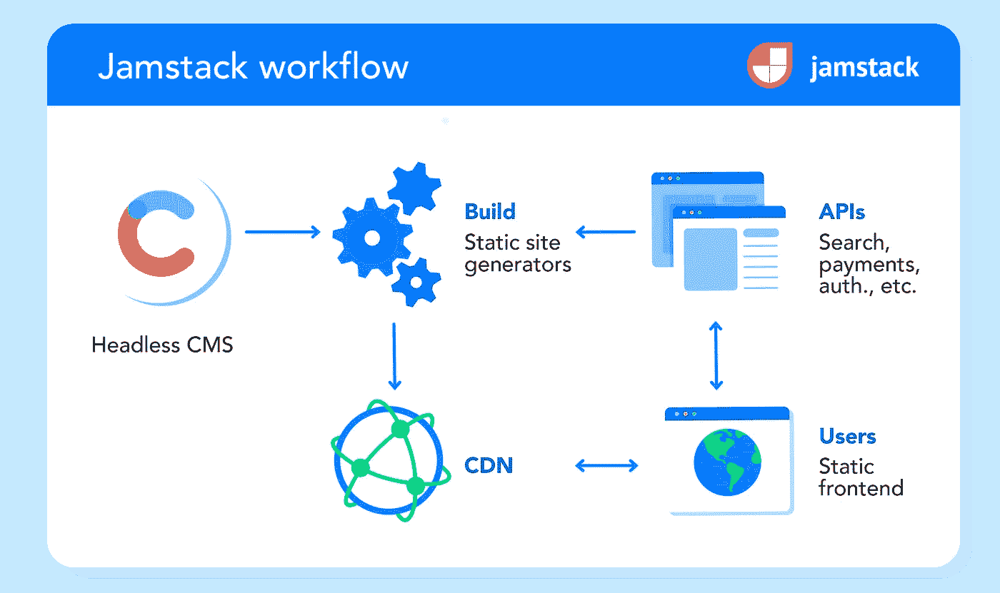

# 一天之内免费建立并托管你一直想要的低代码网站

> 原文：<https://medium.com/geekculture/build-and-host-the-low-code-website-you-always-wanted-734f43c25874?source=collection_archive---------3----------------------->

## 企业家黑客

## 做你自己的网络开发者:做点什么，不花一分钱，改变一切

Hard at work!

[创建并运营自己的网站](#2c01)
[注意事项](#21ae)
[结果](#9948)
[您网站的名称](#bdde)
[选择如何建立您的网站](#ffb7)
[真正建立您的网站](#341c)
[现在就试试吧！](#0924)
[托管你的网站](#0a1f)
[设置你的开发环境](#701c)
[向全世界部署你的网站](#b75b)
[你还没完成！](#e232)
[SEO，SEO，SEO](#0c8e)

# 创建并运营自己的网站

我的妻子和我一直在建造一个名为 SleepaSloth 的婴儿发声机器，我们需要一个我们产品的登陆页面，这个页面可以在以后发展成为一个“合适的”网站。

**作为一名工程师**，*我想要一些我可以完全控制*的东西，所以像 [Wix](https://www.wix.com) ， [Squarespace](https://www.squarespace.com) ， [Weebly](https://www.weebly.com) ， [Webflow](https://webflow.com) 等网站构建者并不是我的选择(尽管是优秀的无代码选项)。

**作为初创公司的联合创始人**，*我需要一个尽可能经济高效的解决方案*(阅读:免费！).

作为三个孩子的父亲，我必须要有一些容易快速构建、扩展和维护的东西，而不是我需要花费所有时间的东西。

这是我希望在开始时就有的指南！它并不打算展示最好的*或只展示*或*的*方式，而只是描述一种对我们有用的方式，它也可以对你有用，你可以根据需要随意改变它。

# 警告

*   要遵循这个指南，你需要理解 HTML，CSS 和 JavaScript。如果你还不知道，那么有必要[了解一下这些 web 开发的基本构件](https://www.w3schools.com)
*   如果你想建立一个电子商务网站，只需选择 [Shopify](https://www.shopify.com)
*   我决定不使用 [Netlify](https://www.netlify.com) ，尽管它是一个很棒的平台。作为一个单人团队，我不需要任何远程构建或协作功能，并且[他们的自由层限制](https://www.netlify.com/pricing)感觉有点受限。如果你愿意，你仍然可以遵循这个指南并使用 Netlify
*   我最终使用了很多谷歌产品，尽管我并不隶属于谷歌，也没有特别的偏见(例如，我对谷歌广告有过不好的体验，并停止使用它)

# 结果

这是我们按照本指南中描述的方法构建的网站:

 [## 婴儿睡眠辅助设备- SleepaSloth

### 每个婴儿都是独一无二的。每个家庭都不一样。SleepaSloth 认识到并庆祝这一点。SleepaSloth 有一个单一的…

sleepasloth.com](https://sleepasloth.com/) 

**sleepasloth.com TDLR**—使用[十一位静态站点生成器](https://www.11ty.dev)构建，它使用[顺风 CSS](https://tailwindcss.com) 用于样式， [Alpine.js](https://alpinejs.dev) 用于编程， [PhotoSwipe](https://photoswipe.com) 用于图库。它的源代码托管在 [GitHub](https://github.com) 上，使用 [VS 代码](https://code.visualstudio.com)在本地开发，部署到 [Firebase](https://firebase.google.com) 上，由 [Google Domains](https://domains.google.com) 做前端。它的内容用 HTML 的飞溅写在 [Nunjucks](https://mozilla.github.io/nunjucks) 和 [Markdown](https://www.markdownguide.org) 中。

> 除了域名，它是完全免费的，我可以随时随地改变它！

# 您网站的名称

所以这一点不是免费的…技术上你不需要一个域名，但实际上你会疯了不这样做！

我用的是[谷歌域名](https://domains.google.com)，又快又好用。我的域名花费我 10 英镑/年，它自动更新，并包括免费的隐私保护。你可以使用任何你想要的域名注册商，我已经用了几年了，发现谷歌域名对我来说是最好的。

事实上，一旦你有了自己的域名，设置了 DNS 和邮件转发，你就会忘记这一切。

# 选择*如何*建立你的网站

这就是你需要做出**最大、最难改变的决定**的地方。

这些年来，我制作了各种各样的“网站”，从零开始编写 HTML/CSS/JavaScript，到 [Grails](https://grails.org) 、 [Spring Boot](https://spring.io/projects/spring-boot) 和 [Angular](https://angular.io) web 应用程序。

我带着清晰的需求接近这个选择:我想要简单的、便携的、速度惊人的和对 SEO 有益的。

我不想重新发明轮子，所以一个**可扩展**并且背后有一个**强大的开源社区**的解决方案是很重要的。

我的需求和研究把我带到了 Jamstack，这是一个定义了一种新的网站建设方式的架构。

 [## 快速安全的网站| Jamstack

### Jamstack 的女人现在直播！看看吧！建设 Jamstack 网站和全球之家的综合指南…

jamstack.org](https://jamstack.org/) 

**JAM stack****中的 JAM 代表 JavaScript、API 和标记**，该术语由 Matt Biilmann (Netlify 的联合创始人兼首席执行官)于 2015 年首次提出。

自 Jamstack 这个术语最初被创造出来以来，它已经有了很大的发展，Jamstack 风格的方法[带来了很多好处](https://jamstack.org/why-jamstack)，你可以很容易地自己进一步研究。

要理解的主要概念是**你正在创建一个静态站点**——在你的网站被部署并提供给用户之前，你的用户界面已经被编译和预渲染。有时候，就像我的网站一样，你甚至根本不需要后台。

Jamstack overview from [https://www.contentful.com](https://www.contentful.com/r/knowledgebase/jamstack-cms/) — (The Headless CMS is optional)

一旦您采用 Jamstack 方法，您的下一个决定就是选择您想要使用的静态站点生成器(SSG)。如今有大量的 SSG 可用。在撰写本文时，一些最受欢迎的 SSG 是 [Next.js](https://nextjs.org) 、[雨果](https://gohugo.io)、[盖茨比](https://www.gatsbyjs.com)、[杰基尔](https://jekyllrb.com)和 [Nuxt](https://nuxtjs.org) 。

**没有单一的最佳 SSG** ，*你应该选择一个最适合你的*。基于它所支持的语言和模板以及使用它的现有网站，我决定使用 SSG。

我想要一个基于 JavaScript 的解决方案，所以 Jekyll(基于 Ruby)和 Hugo(基于 go)被淘汰了。我希望有更多的模板语言可供选择，所以 Next.js 和 Gatsby (React 模板)和 Nuxt (Vue 模板)被淘汰了。

我决定和 [**十一(11ty)**](https://www.11ty.dev) 一起去，至今没有后悔这个决定。

 [## 一个更简单的静态站点生成器

### Eleventy v1.0.0 需要节点 12 或更高版本。在命令行上使用 node - version 来查找您的本地节点版本。这个…

www.11ty.dev](https://www.11ty.dev/) 

Eleventy 是基于 JavaScript 的，它支持一系列模板语言(HTML、Markdown、JavaScript、Liquid、Nunjucks、Handlebars 等)，并用于构建 [Netlify](https://www.netlify.com) 、Google[web . dev](https://web.dev)和 [Chrome 开发者](https://developer.chrome.com)、 [ESLint](https://eslint.org) 等网站。它有一个[强大的用户社区](https://www.11ty.dev/docs/community)和[好文档](https://www.11ty.dev/docs)。

# 真正建设你的网站

恭喜你！你已经决定使用一个简单灵活的基于 [Node.js](https://nodejs.dev/) 的开源静态站点生成器来构建一个极其快速、安全和廉价的网站。但这只涵盖了你将如何建立你的网站，而不是你将实际建立什么。

当你开始使用新的东西时，我发现掌握它的最好方法是拿一个例子/模板/起始项目，让它工作，然后开始做改变。这意味着你**从有效的东西**开始，并逐步改变它。

**Eleventy 有令人眼花缭乱的首发项目**可供选择:【https://www.11ty.dev/docs/starter】T4

起始项目的选择将取决于您正在构建的站点类型和您选择的技术。我从一个简单的登陆页面开始，强烈渴望[吻](https://en.wikipedia.org/wiki/KISS_principle)。我想避免复杂/魔术，并正在寻找一些没有(完全真棒)的工具，如 SASS，Webpack 和 Bootstrap。

我最终选择了一个**超级简单的茶栈**——**T**ailwind CSS， **E** leventy， **A** lpine.js。

Photo by [Manki Kim](https://unsplash.com/@kimdonkey?utm_source=medium&utm_medium=referral) on [Unsplash](https://unsplash.com?utm_source=medium&utm_medium=referral)

是一个简单的 CSS 框架，允许你使用类名直接在 HTML 标记中创建你的设计。它重量轻，响应快——鉴于现在大多数网络浏览都是在移动设备上完成的，这一点至关重要。

[Alpine.js](https://alpinejs.dev) 是一个轻量级的 JavaScript 框架。我以前有很多使用 JQuery 的经验，并且更喜欢 Alpine！

# 现在就试试吧！

在这一点上，我发现开始使用实际的例子是有用的，只是为了在进一步之前证明这些基本的决定。我建议你也这样做，我已经尽力让它对你来说超级简单。你需要一个 GitHub 账户和一个 Netlify 账户。它们是免费的，非常值得拥有，现在就去创造你的吧！

在下面找到我能创建的最简单的茶栈项目。您可以通过单击 Netlify 来部署它。尝试一下，看看源代码，部署它，看看结果，改变它，重新部署它:

 [## 这是一个使用 TailwindCSS 和 AlpineJS 的 11 级入门项目…

### 这个中等的故事是一个如何建立和托管你一直想要的低代码网站的完整指南，免费，在…

github.com](https://github.com/alanmosely/teatime-starter) 

# 托管您的网站

你现在有一个托管在 Netlify 上的网站，你可以继续在 Netlify 上运行你的网站，但我选择不这样做。另一个可以考虑的选项是 [GitHub Pages](https://pages.github.com) ，我研究过它，但没有进行测试。这是因为我已经在使用[谷歌的 Firebase](https://firebase.google.com/docs/hosting) 来开发我们正在开发的 SleepaSloth 手机应用程序，并优先尝试了这个应用程序。

在 [Firebase 上托管你的静态站点是免费的(在相当合理的范围内)](https://firebase.google.com/docs/hosting/usage-quotas-pricing)，简单且可扩展。但是你可以把你的网站放在任何你想放的地方。我在 Firebase 上没有遇到任何限制，所以仍然保留在那里，[配置是微不足道的](https://firebase.google.com/docs/hosting/quickstart)，[部署和回滚是简单的](https://firebase.google.com/docs/hosting/manage-hosting-resources)，性能是一流的。

 [## 重火力点

### 受谷歌支持，受应用程序开发团队喜爱——从初创公司到全球企业，都可以加入谷歌 I/O 的 Firebase

firebase.google.com](https://firebase.google.com/) 

# 设置您的开发环境

我把我的源代码放在 GitHub 上，有些人更喜欢 GitLab 或其他解决方案。

我使用 [Visual Studio 代码](https://code.visualstudio.com)在本地开发代码，有无穷无尽的 ide 可用，随你的喜好去做。如果你没有，VS 代码是一个伟大的，免费的默认。

这里有几个我觉得有用的 VS 代码插件:

*   [Alpine.js 智能感知](https://marketplace.visualstudio.com/items?itemName=adrianwilczynski.alpine-js-intellisense)—alpine . js 的代码完成
*   [颜色高亮](https://marketplace.visualstudio.com/items?itemName=naumovs.color-highlight) —高亮 CSS 网页颜色
*   GitHub 副驾驶——AI 双人程序员，比我想象的更有用
*   GitLens —获得洞察力和可视化
*   [HTML CSS 支持](https://marketplace.visualstudio.com/items?itemName=ecmel.vscode-html-css)—HTML id 和类属性的代码完成
*   [markdownlint](https://marketplace.visualstudio.com/items?itemName=DavidAnson.vscode-markdownlint) -降价的林挺和样式检查
*   [Nunjucks](https://marketplace.visualstudio.com/items?itemName=ronnidc.nunjucks) — Nunjucks 语法定义
*   [Nunjucks 模板](https://marketplace.visualstudio.com/items?itemName=eseom.nunjucks-template) — Nunjucks 语法和格式化程序
*   [更漂亮的](https://marketplace.visualstudio.com/items?itemName=esbenp.prettier-vscode) —代码格式化程序
*   [SVG 查看器](https://marketplace.visualstudio.com/items?itemName=cssho.vscode-svgviewer) —查看 VS 代码中的 SVG 图像
*   [顺风 CSS 智能感知](https://marketplace.visualstudio.com/items?itemName=bradlc.vscode-tailwindcss) —顺风 CSS 的代码完成、突出显示和林挺

# 与世界分享你的网站

一旦你有了一个用 Eleventy 构建的站点和一个[配置的 Firebase 项目](https://firebase.google.com/docs/projects/learn-more#setting_up_a_firebase_project_and_registering_apps)(即有效的`firebase.json`和`.firebaserc`文件)，你就可以将以下内容添加到你的 [Node.js](https://nodejs.dev/learn/the-package-json-guide) `[package.json](https://nodejs.dev/learn/the-package-json-guide)` [文件](https://nodejs.dev/learn/the-package-json-guide):

现在，部署新版本的网站就像运行`npm run deploy`一样简单，更新后的网站不到一分钟就可以上线了！

Photo by [Pineapple Supply Co.](https://unsplash.com/@pineapple?utm_source=medium&utm_medium=referral) on [Unsplash](https://unsplash.com?utm_source=medium&utm_medium=referral)

# 你还没完！

一旦你有了一个基本的网站并开始运行，你可以进入很多其他的话题，这里有几个我花了时间的方面，如果你对其中任何一个感兴趣，请告诉我，我可以写一个更详细的帖子。

*   定制十一项短代码——我为可重复使用的内容创建了一些短代码
*   自动生成带有 11 个条目的目录
*   带有顺风 CSS 和 [Alpine.js Intersect 插件](https://alpinejs.dev/plugins/intersect)的基本 [CSS 过渡/动画](https://tailwindcss.com/docs/transition-property)
*   带有 Alpine.js 的灯箱
*   带有十一和[照片擦除](http://photoswipe.com)的照片库

# SEO，SEO，SEO

Photo by [Merakist](https://unsplash.com/@merakist?utm_source=medium&utm_medium=referral) on [Unsplash](https://unsplash.com?utm_source=medium&utm_medium=referral)

如果你花时间创建自己的网站，很可能你希望它被人们发现和阅读。除非你有广告预算或现有受众，否则搜索引擎优化将是关键。搜索引擎优化有很多方面，我绝不是专家，但我确实花了相当多的时间来研究它。我最喜欢的 SEO 指南来自 Backlinko，它非常全面。不要被 SEO 吓到，立即开始，SEO 投资需要时间(几个月)才能产生回报。

以下是我调查的一些领域，特别是我的网站:

*   在你的十一月网站上设置基本搜索引擎优化
*   使用 [Google 的 PageSpeed Insights](https://pagespeed.web.dev) 和 [Lighthouse](https://developers.google.com/web/tools/lighthouse) 的网络性能
*   使用[谷歌分析](https://marketingplatform.google.com/intl/en_uk/about/analytics)和[谷歌搜索控制台](https://search.google.com/search-console/about)的网站性能
*   用 Eleventy 自动生成站点地图
*   有[顺风 CSS](https://tailwindcss.com/docs/responsive-design) 的响应式网站
*   使用[十一图像插件](https://www.11ty.dev/docs/plugins/image)优化图像
*   用 [PostCSS](https://postcss.org) 和 [cssnano](https://cssnano.co) 和 [html-minifier](https://www.npmjs.com/package/html-minifier) 优化你的网站