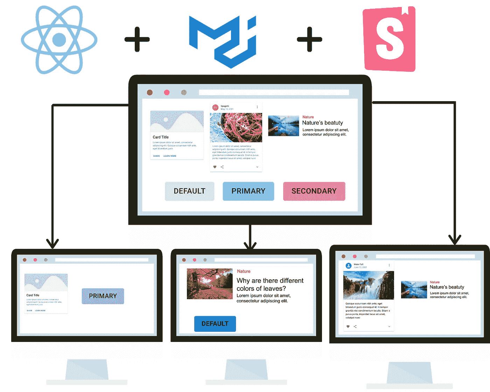
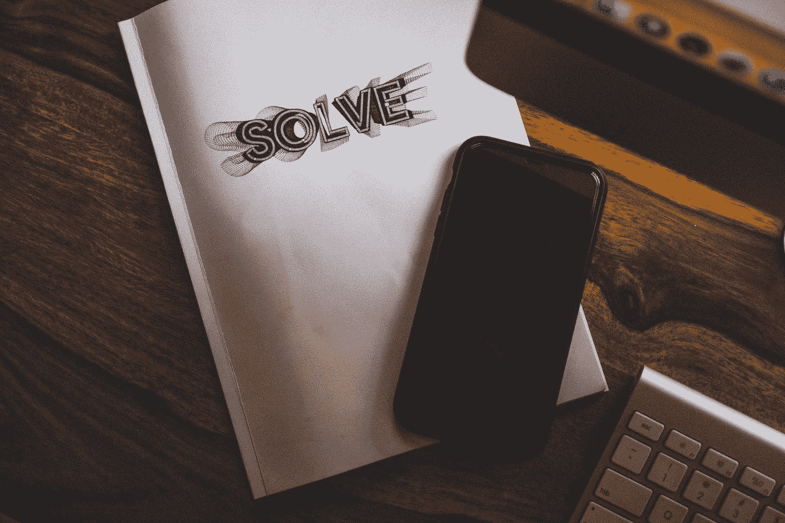
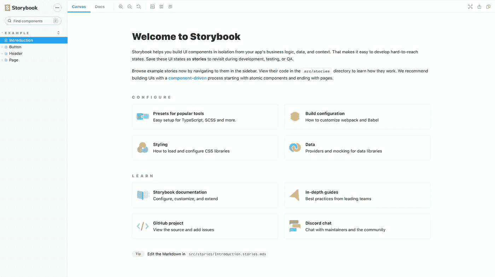
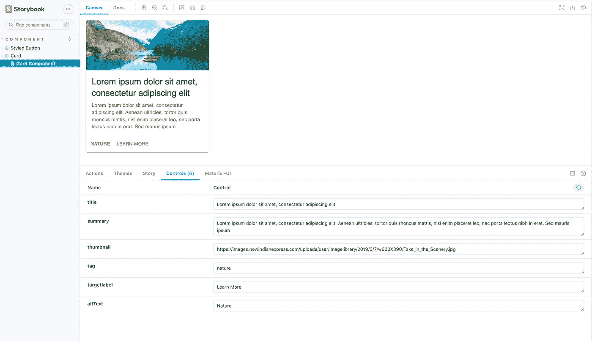

# 使用 Material UI 和 Storybook Part-1 在项目之间构建和共享 React UI 组件

> 原文：<https://medium.com/geekculture/build-and-share-react-ui-components-between-projects-using-material-ui-and-storybook-part-1-93ccc2f99116?source=collection_archive---------6----------------------->



最近，我开始将 React [故事书](https://storybook.js.org/)用于我一直在构建的 React 应用程序。在这篇文章中，我将分享我在使用 storybook 共享组件方面的学习，希望能鼓励你考虑在下一个 react 项目中使用 Storybook。

# 简而言之，故事书

Storybook 是一个开源工具，用于构建独立的 UI 组件和页面。您将能够独立开发您的 UI 组件，而无需启动复杂的开发堆栈。

# 为什么要材质 UI？

Material-UI 是一个基于 Google Material Design 的 React 组件库，它允许更快更容易的风格化 web 开发。它有一个简单的可定制的组件库，可以构建更快、更漂亮、更易访问的 React 应用程序。

# 为什么要共享组件？

例如，如果你有 3 个反应应用程序使用相同的组件，如卡片，按钮，菜单栏等。如何共享组件？请不要复制粘贴。复制和粘贴时可能面临的问题；如果 react 应用的数量从 3 个增加到 7 个会怎样？复制和粘贴包含所有依赖项的组件代码很容易出错。如果一个组件需要更新怎么办？所以，我强烈建议不要复制粘贴。



We’ll solve this

# 让我们从创建 React 应用程序开始

假设您已经安装了节点。让我们使用 [create-react-app](https://reactjs.org/docs/create-a-new-react-app.html) 创建一个 React 应用程序。

```
npx create-react-app storybook
```

npx 它是 npm 5.2+ 自带的[包运行器工具。上面的命令将下载 create-react-app 及其依赖项的最新版本，并设置一个名为 *storybook* 的新 react 应用程序。](/@maybekatz/introducing-npx-an-npm-package-runner-55f7d4bd282b)

# 设置故事书

让我们转到新创建的文件夹*故事书*

```
cd storybook
```

使用以下命令初始化故事书

```
npx -p @storybook/cli sb init
```

一旦设置完成，您应该能够使用命令启动故事书

```
yarn storybook or npm run storybook
```



现在，你已经准备好了故事书，让我们添加[材质 ui 包](https://www.npmjs.com/package/@material-ui/core)。

```
npm i @material-ui/core
```

现在，让我们在 Storybook 中创建卡片组件。在 src/components/Card 下创建一个 Card.js

现在您已经创建了 card 组件，让我们在 src/stories/Card create Card . stories . js 下创建故事

现在，这就是你的卡片故事的样子



Card story

现在，您已经学会了如何在 storybook 中创建一个组件并编写故事。在下一个教程中，您将学习如何将这些组件导入到一个单独的 react 应用程序中，这样我们只需编写一次组件，就可以在任何地方重用。

敬请关注！！！

# 感谢所有的掌声


参见第二部分的[条](https://ninuvarghese.medium.com/build-and-share-react-ui-components-between-projects-using-material-ui-and-storybook-part-2-416b4613d0ce)。