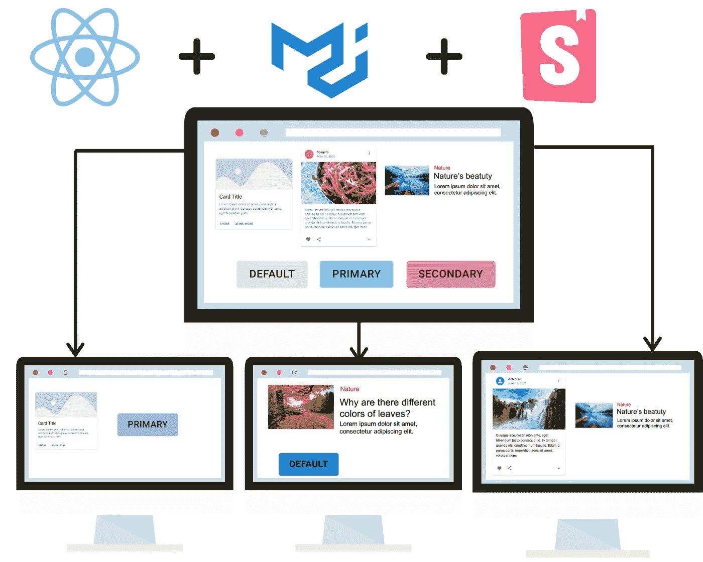
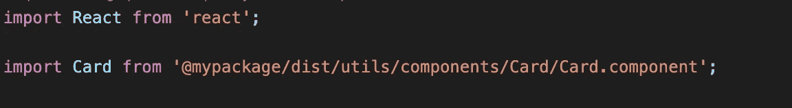

# 使用 Material UI 和 Storybook Part-2 在项目之间构建和共享 React UI 组件

> 原文：<https://medium.com/geekculture/build-and-share-react-ui-components-between-projects-using-material-ui-and-storybook-part-2-416b4613d0ce?source=collection_archive---------5----------------------->



在本教程中，您将学习如何在各种 ReactJS 项目中使用您在故事书中创建的组件。

***请注意:*** *这是第二部分* ***2 部分课程*** *。*有关本教程的更多内容和概述，请参考第一部分[](/geekculture/build-and-share-react-ui-components-between-projects-using-material-ui-and-storybook-part-1-93ccc2f99116)**。**

# **组件作为一个包**

**为了让我们的故事书组件在各种 ReactJS 项目中使用，我们需要将它们导出为[包](https://docs.npmjs.com/creating-and-publishing-private-packages)。**

**根据项目的性质，您可以选择将它们发布为公共包或私有包。**

**组件需要在作为 npm 包导出之前进行转换。**

## **传输您的故事书组件**

****利用巴别塔****

**Babel 用于将 JSX 语法、类型脚本转换为常规 JavaScript。让我们在 storybook 项目中安装 Babel Cli。**

```
npm i babel-cli -D
```

**现在，让我们修改 pakage.json，添加一个`distribute`脚本，我们将使用它让 Babel 将我们的组件源文件传输到一个名为`dist`的目标文件夹中**

```
"distribute": "rm -rf dist/factory-utils && mkdir -p dist/factory-utils && babel src/factory -d dist/factory-utils — copy-files"
```

**现在，运行`npm run distribute`**

**这将在项目中创建一个`dist`目录。现在，将这个目录作为一个包上传到 npm。创建私有包请参考[https://docs . npmjs . com/creating-and-publishing-private-packages](https://docs.npmjs.com/creating-and-publishing-private-packages)。**

# **旋转 React 应用程序**

**让我们从使用 create react app 创建一个 React 应用程序开始。如果您需要复习，请参考[https://reactjs.org/docs/create-a-new-react-app.html](https://reactjs.org/docs/create-a-new-react-app.html)**

**使用`npm i <my-package>.`将你的包作为依赖项安装在这个项目中**

**您的 package.json 显示了下面一行**

```
"@mypackage/dist": "1.1.1",
```

**现在，将您在故事书中创建的组件导入到 react 项目中。**

****

**如果您的组织有多个 react 项目，并计划将组件作为库重用，那么这种方法是有益的。**

**这样，您的开发人员可以专注于构建可重用的组件，这些组件可以在整个组织/单位中共享，而不必花费时间重新发明轮子。**

> **感谢所有的掌声**

****

# **结论**

**在本文中，您已经学习了如何使用 Material UI 和 Storybook 在项目之间构建、共享和重用 React UI 组件。**

**我希望你喜欢这篇文章！如果您对我如何改进有任何反馈，请告诉我。想在我发表新文章时收到通知吗？那请别忘了关注我:)。谢谢，干杯！**