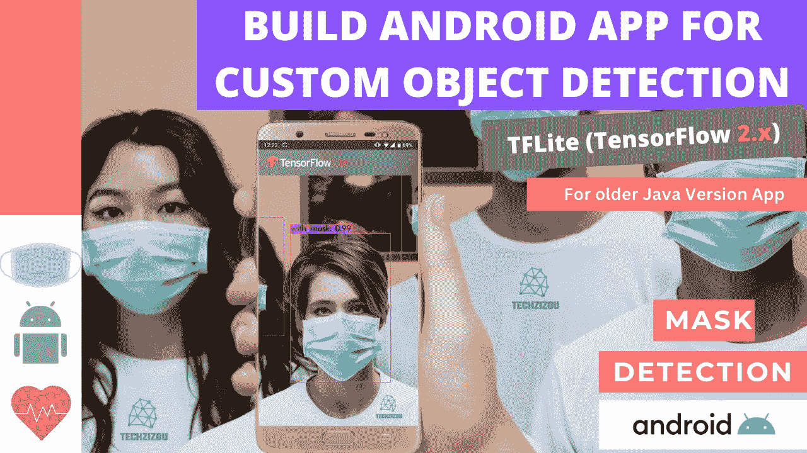
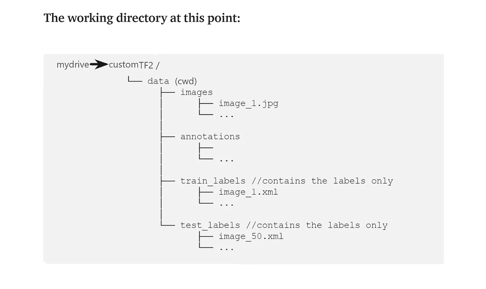
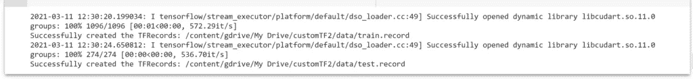
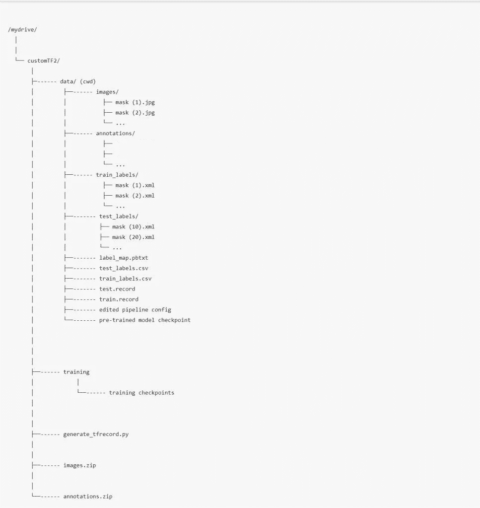
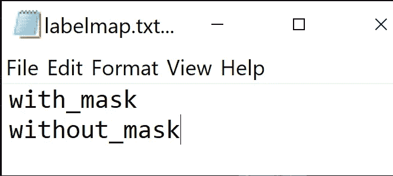
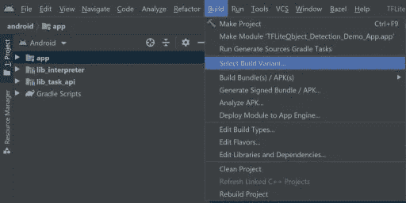
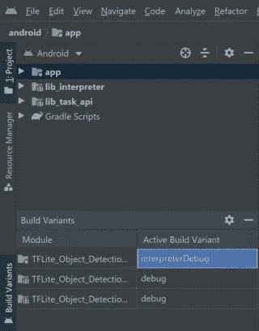

# 构建用于自定义对象检测的 Android 应用程序(TensorFlow 2.x)

> 原文：<https://medium.com/geekculture/build-android-app-for-custom-object-detection-tf-2-x-53904a08cfa2?source=collection_archive---------0----------------------->



## 使用 TensorFlow 对象检测 API(用于旧版本 TF 应用程序)

使用 Google Colab 中的 **TensorFlow 2.x** 训练一个用于自定义对象检测的深度学习模型，并使用 TensorFlow 的 GitHub 中的样本 TFLite [对象检测应用](https://github.com/tensorflow/examples/tree/master/lite/examples/object_detection)将其转换为 TFLite 模型，以部署在 Android、iOS、Raspberry Pi、物联网设备等移动设备上。

## **重要:**

本教程针对使用 TensorFlow 对象检测 API 的 TensorFlow 2.5。

这是针对旧的 java 版本的。在 GitHub 中可以切换到以前的版本。对本教程中使用的 java 版本参考应用程序使用以下版本:

[https://github . com/tensor flow/examples/tree/demo/lite/examples/object _ detection/Android](https://github.com/tensorflow/examples/tree/demo/lite/examples/object_detection/android)

## 路标

*   收集图像数据集，并对它们进行标记，以获得它们的 XML 文件。
*   安装 TensorFlow 对象检测 API。
*   生成培训所需的 TFRecord 文件。(为此需要生成 _tfrecord.py 脚本和 CSV 文件)
*   编辑模型管道配置文件，并下载预先训练的模型检查点。
*   训练和评估模型。
*   将模型导出并转换为 TFlite(TensorFlow Lite)格式。
*   使用来自 TensorFlow 的 GitHub 的样本 TFLite [对象检测应用](https://github.com/tensorflow/examples/tree/master/lite/examples/object_detection)在 Android / iOS / IoT 设备上部署 TFlite 模型。

# 目标:为自定义对象检测构建 Android 应用程序

在本文中，我将为自定义对象训练一个对象检测模型，并将其转换为 TFlite 模型，以便它可以部署在 Android、iOS 和物联网设备上。遵循下面提到的 21 个步骤。(前 16 个步骤和我上一篇关于用 TF 2 训练一个 ML 模型的文章是一样的。由于 TFLite 目前只支持 SSD 型号，我们将在这里使用 SSD 型号)

(但首先✅Subscribe 到我的 YouTube 频道👉🏻[https://bit.ly/3Ap3sdi](https://bit.ly/3Ap3sdi)😁😜)

1.  [**导入库**](#1854)
2.  [**在 google drive 中创建 customTF2、training 和 data 文件夹**](#5c39)
3.  [**创建并上传您的图片文件和 XML 文件**](#1f9c)
4.  [**将 generate_tfrecord.py 文件上传到您的驱动器**](#fedc) 中的 customTF2 文件夹
5.  [**挂载驱动器并链接你的文件夹**](#dac7)
6.  [**克隆 TensorFlow 模型 git 库&安装 TensorFlow 对象检测 API**](#6931)
7.  [**测试模型构建器**](#dbf4)
8.  [**导航到*/my drive/custom tf2/data/*，将 images.zip 和 annotations.zip 文件解压到数据文件夹**](#26e9)
9.  [创建测试 _ 标签&训练 _ 标签 ](#f157)
10.  [**创建 CSV 和“label_map.pbtxt”文件**](#e0a2)
11.  [**创建‘train . record’&【test . record】文件**](#63f4)
12.  [**下载预训练模型检查点**](#fd78)
13.  [**获取模型管线配置文件，对其进行修改，并将其放入数据文件夹**](#3675)
14.  [**加载张量板**](#33e6)
15.  [**训练模型**](#b148)
16.  [**测试你训练过的模型**](#e928)
17.  [**安装 TensorFlow-nightly**](#eb05)
18.  [**导出 SSD TFlite 图**](#5a2d)
19.  [**将保存的模型转换为 TFlite 模型**](#6cac)
20.  [**创建 TFLite 元数据**](#9aef)
21.  [**下载带有元数据的 TFLite 模型，并将其部署在移动设备上**](#fb5e)

# 如何开始？

*   在你的浏览器上打开我的 [Colab 笔记本](https://colab.research.google.com/drive/13SPNsogGr8o4KQvBAxJBBCIonUx5Xad8?usp=sharing)。
*   点击菜单栏中的**文件**并点击**在驱动器**中保存一份副本。这将在您的浏览器上打开我的 Colab 笔记本的副本，您现在可以使用它了。
*   接下来，一旦你打开了我的笔记本，并连接到谷歌 Colab 虚拟机，点击菜单栏中的**运行时**，并点击**改变运行时类型**。选择 **GPU** ，点击保存。

# 我们开始吧！！


# 1)导入库

```
import os
import glob
import xml.etree.ElementTree as ET
import pandas as pd
import tensorflow as tf
```

# 2)在 google drive 中创建 customTF2、training 和 data 文件夹

在 google drive 中创建一个名为 ***customTF2*** 的文件夹。

在 ***customTF2*** 文件夹中再创建一个文件夹，名为*training*(***training***文件夹是训练时保存检查点的地方)。

在 ***customTF2*** 文件夹内创建另一个名为 ***data*** 的文件夹。

# 3)创建并上传您的图像文件及其相应的带标签的 XML 文件。

为您的自定义数据集图像创建一个名为 ***images*** 的文件夹，并为其对应的 PASCAL_VOC 格式的 XML 文件创建另一个名为 ***annotations*** 的文件夹。

接下来，创建他们的 zip 文件并上传到你的驱动器中的 ***customTF2*** 文件夹。

> ***使*** ***确定所有的图像文件都有它们的扩展名为”。仅 jpg”。***
> 
> *其他格式如* ***<。png>*******<。jpeg >*** *甚至<。****【JPG】**>会给出错误自***generate _ TF record***和**【XML _ to _ CSV***脚本这里只有* ***<。jpg >*** *在其中。如果您有其他格式的图像，则相应地在脚本中进行更改。*****

*对于数据集，您可以在本文底部的致谢部分查看我的数据集来源。*

## *收集图像数据集并标记它们以获得它们的 PASCAL_VOC XML 注释。*

## *标注数据集*

*输入图像示例(**Image1.jpg**)*

**

*您可以使用任何软件进行贴标，如 [**贴标机**](https://github.com/tzutalin/labelImg#labelimg) 工具。*

**

*我使用一个叫做 **OpenLabeling** 的开源标签工具，它有一个非常简单的 UI。*

**

*点击下面的链接，了解更多关于贴标过程和其他软件的信息:*

*   *[**影像数据集标注条**](https://techzizou.com/dataset-labeling-annotation-tutorial-for-beginners/)*

***注:**垃圾进=垃圾出。选择和标记图像是最重要的部分。尽量找质量好的图片。数据的质量在很大程度上决定了结果的质量。*

*输出的 PASCAL_VOC 标记的 XML 文件如下所示:*

**

# *4)将 generate_tfrecord.py 文件上传到驱动器中的 customTF2 文件夹。*

*你可以在这里找到 generate_tfrecord.py 文件*

# *5)安装驱动器并链接您的文件夹*

```
***#mount drive**from google.colab import drive
drive.mount('/content/gdrive')**# this creates a symbolic link so that now the path /content/gdrive/My Drive/ is equal to /mydrive**!ln -s /content/gdrive/My Drive/ /mydrive
!ls /mydrive*
```

# *6)克隆 TensorFlow 模型 git 存储库并安装 TensorFlow 对象检测 API*

```
***# clone the tensorflow models on the colab cloud vm**!git clone --q https://github.com/tensorflow/models.git**# navigate to /models/research folder to compile protos**%cd models/research**# Compile protos.**!protoc object_detection/protos/*.proto --python_out=.**# Install TensorFlow Object Detection API.**!cp object_detection/packages/tf2/setup.py .
!python -m pip install .*
```

# *7)测试模型构建器*

```
*!python object_detection/builders/model_builder_tf2_test.py*
```

# *8)导航到/mydrive/customTF2/data/*

```
*%cd /mydrive/customTF2/data/**# unzip the datasets and their contents so that they are now in /mydrive/customTF2/data/ folder**!unzip /mydrive/customTF2/images.zip -d .
!unzip /mydrive/customTF2/annotations.zip -d .*
```

# *9)创建测试标签和训练标签*

*当前工作目录为***/my drive/custom tf2/data/****

*将标注分为 test_labels(20%)和 train_labels(80%)。*

**

# *10)创建 CSV 文件和“label_map.pbtxt”文件*

*当前工作目录为***/my drive/custom tf2/data/****

*运行下面的 xml_to_csv 脚本来创建***test _ labels . CSV***和***train _ labels . CSV****

*该脚本还使用 xml 文件中提到的类创建了***label _ map . Pb txt***文件。*

**

*创建的 3 个文件，即 **train_labels.csv** 、 **test_labels.csv** 和 **label_map.pbtxt** ，如下图所示:*

******

***train_labels.csv** 包含所有列车图像的名称、这些图像中的类及其注释。*

***test_labels.csv** 包含所有测试图像的名称、这些图像中的类以及它们的注释。*

***label_map.pbtxt** 文件包含来自您的带标签的 XML 文件的类名。*

***注:**我有两个职业，分别是****【带 _ 遮罩】********【不带 _ 遮罩】****。*********

> ********标签贴图 id 0 预留给背景标签*** *。******

# *****11)创建训练记录和测试记录文件*****

*****当前工作目录为***/my drive/custom tf2/data/********

*****运行***generate _ TF record . py***脚本，创建 ***train.record*** 和 ***test.record*** 文件*****

```
*******#Usage:**
#!python generate_tfrecord.py output.csv output_pb.txt /path/to/images output.tfrecords**#For train.record**
!python /mydrive/customTF2/generate_tfrecord.py train_labels.csv  label_map.pbtxt images/ train.record**#For test.record**
!python /mydrive/customTF2/generate_tfrecord.py test_labels.csv  label_map.pbtxt images/ test.record*****
```

**********

*****图像文件的总数是 1370。因为我们将标签分为两类，即。train_labels(80%)和 test_labels(20%)，“ **train.record** 的文件数为 1096，“t **est.record** 的文件数为 274。*****

# *****12)下载预先训练的模型检查点*****

*****当前工作目录为***/my drive/custom tf2/data/********

*****根据您的数据和要求，您可以选择任何模型进行培训。阅读[这篇](https://serokell.io/blog/how-to-choose-ml-technique)博客，了解更多关于这方面的信息。TensorFlow 2.x 的检测模型检查点官方列表可以在[这里](https://github.com/tensorflow/models/blob/master/research/object_detection/g3doc/tf2_detection_zoo.md)找到。*****

*****然而，由于 TFLite 现在并不支持所有的模型，目前这方面的选择是有限的。TensorFlow 正致力于添加更多支持 TFLite 的模型。点击阅读更多关于所有 ML 模块的 TFLite 兼容模型，如对象检测、图像分类、图像分割等[。](https://www.tensorflow.org/lite/guide/hosted_models)*****

> ********目前，TFLite 仅支持 SSD 型号(不包括 EfficientDet)********

*****在本教程中，我将使用**SSD _ mobilenet _ v2 _ fpnlite _ 320 x320 _ coco 17 _ TPU-8**模型。*****

```
*******# Download the pre-trained model ssd_mobilenet_v2_fpnlite_320x320_coco17_tpu-8.tar.gz into the *data* folder & unzip it**!wget http://download.tensorflow.org/models/object_detection/tf2/20200711/ssd_mobilenet_v2_fpnlite_320x320_coco17_tpu-8.tar.gz!tar -xzvf ssd_mobilenet_v2_fpnlite_320x320_coco17_tpu-8.tar.gz*****
```

# *****13)获取模型管线配置文件，对其进行更改，并将其放入数据文件夹中*****

*****当前工作目录为**/my drive/custom tf2/data/*******

*****从***/content/models/research/object _ detection/configs/tf2***下载**SSD _ mobilenet _ v2 _ fpnlite _ 320 x320 _ coco 17 _ TPU-8 . config**。对其进行必要的修改，并上传到***/my drive/custom/data***文件夹。*****

*******或*******

*****在 colab vm 中编辑***/content/models/research/object _ detection/configs/tf2***中的配置文件，并将编辑后的配置文件复制到***/my drive/custom tf2/data***文件夹中。*****

*****您还可以在我们在上一步中刚刚下载的模型检查点文件夹中找到管道配置文件。*****

*******你需要做如下修改:*******

*   *****将 ***num_classes*** 更改为您的班级数。*****
*   *****将 ***test.record*** path、***train . record***path&***label map***path 更改为您创建这些文件的路径(训练时路径应相对于您当前的工作目录)。*****
*   *****将 ***微调检查点*** 更改为步骤 12 下载的检查点所在目录的路径。*****
*   *****根据类型，用值**分类**或**检测**改变 ***微调 _ 检查点 _ 类型*** 。*****
*   *****根据您的 GPU 能力，将 ***batch_size*** 更改为 8 的任意倍数。(例如:- 24，128，…，512)。GPU 能力越好，你能走的越高。我的设置为 64。我的设置为 64。*****
*   *****将 ***num_steps*** 更改为您希望探测器训练的步数。*****

> *****最大批量大小=可用 GPU 内存字节数/ 4 /(张量大小+可训练参数)*****

*******接下来，复制编辑过的配置文件**。*****

```
*******# copy the edited config file from the configs/tf2 directory to the data/ folder in your drive**!cp /content/models/research/object_detection/configs/tf2/ssd_mobilenet_v2_fpnlite_320x320_coco17_tpu-8.config /mydrive/customTF2/data*****
```

*******此时的工作区:*******

**********

> *****您可以添加许多数据扩充选项。查看完整列表 [*此处*](https://github.com/tensorflow/models/blob/master/research/object_detection/protos/preprocessor.proto) 。对于新手来说，以上改动就足够了。*****

# *****数据扩充建议(可选)*****

*****首先，您应该使用带有上述基本更改的示例配置文件来训练模型，并看看它做得如何。如果你过拟合，那么你可能想做一些更多的图像放大。*****

*****在示例配置文件中:默认添加`**random_horizontal_flip**` & `**ssd_random_crop**`。您也可以尝试添加以下内容:*****

*****(**注**:每次图像增强都会大幅增加训练时间)*****

1.  *****来自**列车配置{}:*******

```
*****data_augmentation_options {
    random_adjust_contrast {
    }
  }
  data_augmentation_options {
    random_rgb_to_gray {
    }
  }
  data_augmentation_options {
    random_vertical_flip {
    }
  }
  data_augmentation_options {
    random_rotation90 {
    }
  }
  data_augmentation_options {
    random_patch_gaussian {
    }
  }*****
```

*****2.在**型号{ }>SSD { }>box _ predictor { }:**将`**use_dropout**`设置为`true`这将帮助您应对过度拟合。*****

*****3.在 **eval_config : {}** 设置`**num_examples**`中的**测试**图像的数量，并移除`**max_eval**`以无限期评估*****

```
*****eval_config: {
  num_examples: 274 # set this to the number of test images we divided earlier
  num_visualizations: 20 # the number of visualization to see in tensorboard
}*****
```

# *****14)加载张量板*****

```
*****%load_ext tensorboard
%tensorboard --logdir '/content/gdrive/MyDrive/customTF2/training'*****
```

# *****15)训练模型*****

*****导航到 Colab VM 中的***object _ detection***文件夹*****

```
*****%cd /content/models/research/object_detection*****
```

# *****15 (a)使用 model_main_tf2.py 进行培训*****

*****这里 **{PIPELINE_CONFIG_PATH}** 指向管道配置， **{MODEL_DIR}** 指向训练检查点和事件将被写入的目录。*****

```
*******#Run the command below from the content/models/research/object_detection directory****"""
PIPELINE_CONFIG_PATH=path/to/pipeline.config
MODEL_DIR=path to training checkpoints directory
NUM_TRAIN_STEPS=50000
SAMPLE_1_OF_N_EVAL_EXAMPLES=1****python model_main_tf2.py -- \
--model_dir=$MODEL_DIR --num_train_steps=$NUM_TRAIN_STEPS \
--sample_1_of_n_eval_examples=$SAMPLE_1_OF_N_EVAL_EXAMPLES \
--pipeline_config_path=$PIPELINE_CONFIG_PATH \
--alsologtostderr****"""**!python model_main_tf2.py --pipeline_config_path=/mydrive/customTF2/data/ssd_mobilenet_v2_fpnlite_320x320_coco17_tpu-8.config --model_dir=/mydrive/customTF2/training --alsologtostderr*****
```

*******注:*******

*****为了获得最佳结果，如果可能的话，应该在损失小于 0.1 时停止训练，否则训练模型，直到损失暂时没有任何显著变化。理想的损耗应该在 0.05 以下(在不过度拟合模型的情况下，尽量让损耗尽可能低。如果模型已经收敛，不要在训练步骤上走得太高，以试图降低损失。如果它不能进一步显著减少损失，并且需要一段时间才能下降。)*****

*****理想情况下，我们希望损失尽可能低，但我们应该小心，以免模型过度拟合。您可以将步数设置为 50000，并检查损失是否低于 0.1，如果没有，则可以用更高的步数重新训练模型。*****

*****输出通常看起来像是“冻结”了，但不要急于取消该过程。默认情况下，训练仅每 100 步输出一次日志，因此，如果您等待一段时间，您应该会在第 100 步看到一个丢失日志。您应该等待的时间可能会有很大的不同，这取决于您是否使用 GPU 以及在配置文件中为`batch_size`选择的值，所以请耐心等待。*****

# *****15 (b)使用 model_main_tf2.py 的评估(可选)*****

*****您可以打开另一个 colab 笔记本，同时运行这个命令和上面的训练命令(不要忘记安装驱动器，克隆 TF git repo，并在那里安装 TF2 对象检测 API)。这将给你验证损失，地图等，所以你有一个更好的想法如何你的模型执行。*****

*****这里 **{CHECKPOINT_DIR}** 指向包含由训练作业生成的检查点的目录。评估事件被写入**{模型 _ 目录/评估}** 。*****

```
*******# Run the command below from the content/models/research/object_detection directory****"""
PIPELINE_CONFIG_PATH=path/to/pipeline.config
MODEL_DIR=path to training checkpoints directory
CHECKPOINT_DIR=${MODEL_DIR}
NUM_TRAIN_STEPS=50000
SAMPLE_1_OF_N_EVAL_EXAMPLES=1****python model_main_tf2.py -- \
--model_dir=$MODEL_DIR --num_train_steps=$NUM_TRAIN_STEPS \
--checkpoint_dir=${CHECKPOINT_DIR} \
--sample_1_of_n_eval_examples=$SAMPLE_1_OF_N_EVAL_EXAMPLES \
--pipeline_config_path=$PIPELINE_CONFIG_PATH \
--alsologtostderr
"""**!python model_main_tf2.py --pipeline_config_path=/mydrive/customTF2/data/ssd_mobilenet_v2_fpnlite_320x320_coco17_tpu-8.config --model_dir=/mydrive/customTF2/training/ --checkpoint_dir=/mydrive/customTF2/training/ --alsologtostderr*****
```

# *****重新训练模型(以防断线)*****

*****如果您在 Colab VM 上断开连接或丢失会话，您可以从您停止的地方开始培训，因为检查点保存在您的驱动器上的培训文件夹中。要重新开始训练，只需运行**步骤 1、5、6、7、14** 、**和 15。*******

*****请注意，由于我们拥有训练所需的所有文件，如记录文件、编辑过的管道配置文件、label_map 文件和模型检查点文件夹，因此我们不需要再次创建这些文件。*****

*****【The model _ main _ tf2.py 脚本每 1000 步保存一次检查点。训练会自动从上次保存的检查点重新开始。*****

*****但是，如果您发现它没有从最后一个检查点重新开始训练，您可以在管道配置文件中进行 1 处更改。将 **fine_tune_checkpoint** 更改为您最新训练的检查点所在的位置，并使其指向最新的检查点，如下所示:*****

```
*****fine_tune_checkpoint: "/mydrive/customTF2/training/ckpt-X" (where ckpt-X is the latest checkpoint)*****
```

*****阅读[这篇](https://tensorflow-object-detection-api-tutorial.readthedocs.io/en/latest/training.html#) TensorFlow 物体探测 API 教程，了解更多关于 TF2 的训练过程。*****

# *****16)测试你训练好的模型*****

## *****导出推理图*****

*****当前工作目录是***/内容/模型/研究/对象 _ 检测********

```
*****!python exporter_main_v2.py --trained_checkpoint_dir=/mydrive/customTF2/training --pipeline_config_path=/content/gdrive/MyDrive/customTF2/data/ssd_mobilenet_v2_fpnlite_320x320_coco17_tpu-8.config --output_directory /mydrive/customTF2/data/inference_graph*****
```

*******注意**:上述命令中的 *trained_checkpoint_dir* 参数需要训练目录的路径。有一个名为“检查点”的文件，其中保存了所有的模型路径和最新的模型检查点路径。因此它会自动使用最新的检查点。在我的例子中，检查点文件中为最新的 model_checkpoint_path 写入了 ckpt-36。*****

*****对于 *pipeline_config_path* ，给出我们用来训练上述模型的已编辑配置文件的路径。*****

## *****在图像上测试您训练的对象检测模型*****

*****当前工作目录为***/内容/模型/研究/对象 _ 检测********

*****这一步是可选的。*****

```
*****# **Different font-type and font-size for labels text**!wget https://freefontsdownload.net/download/160187/arial.zip
!unzip arial.zip -d .%cd utils/
!sed -i "s/font = ImageFont.truetype('arial.ttf', 24)/font = ImageFont.truetype('arial.ttf', 50)/" visualization_utils.py
%cd ..*****
```

## *****测试您训练好的模型*****

## *****对于网络摄像头捕捉或视频的测试，请使用这款 colab 笔记本。*****

# *****将训练好的 SSD 模型转换为 TFLITE 模型*****

# *****17)每夜安装 tf*****

*******(TFLite 转换器与 tf-nightly 配合使用效果更好。建议使用 tf-nightly。也可以尝试使用最新的 TensorFlow 稳定版。)*******

```
*****!pip install tf-nightly*****
```

*******注意:**如果运行上述命令要求您重新启动运行时，并且您丢失了 colab VM 中的所有局部变量，您必须再次运行步骤 5 & 6 来挂载驱动器、克隆 TF 模型库并安装对象检测 API。再次运行这些步骤后，运行下面的步骤 18。*****

# *****18)导出 SSD TFlite 图形*****

*****当前工作目录是***/内容/模型/研究/对象 _ 检测********

```
*****%cd /content/models/research/object_detection!python export_tflite_graph_tf2.py --pipeline_config_path /content/gdrive/MyDrive/customTF2/data/ssd_mobilenet_v2_fpnlite_320x320_coco17_tpu-8.config --trained_checkpoint_dir /mydrive/customTF2/training --output_directory /mydrive/customTF2/data/tflite*****
```

# *****19)将 TensorFlow 保存的模型转换为 TFlite 模型*****

*****检查输入和输出张量名称*****

```
*****!saved_model_cli show --dir /mydrive/customTF2/data/tflite/saved_model --tag_set serve --all*****
```

# *****转换为 TFlite*****

*******使用方法(a)或方法(b)转换为 TFLite** 。*****

*******方法(a):-** 使用命令行工具*****

*****使用 *tflite_convert* 命令将保存的模型转换为 TFLite。这是用于基本模型转换的简单方法。对于新手，我推荐先用这个方法。虽然第二种方法，即 *Python_API* ，因为它有更多可用的支持和特性，所以在任何地方都被强烈推荐，但是您可以从使用第一种命令行工具方法开始进行测试，然后您可以稍后使用第二种方法，这也允许我们应用优化和训练后量化等。*****

*****运行下面的代码块，使用 *tflite_convert* 命令行工具*创建 TFLite 模型。******

```
*******# The default inference type is Floating-point.** %cd /mydrive/customTF2/data/!tflite_convert --saved_model_dir=tflite/saved_model --output_file=tflite/detect.tflite*****
```

*******方法** ( **b)** :-使用 Python API*****

*****使用 Python API 将保存的模型转换为 TFLite。根据 TensorFlow 文档，这是更好的选择，因为我们可以应用其他功能和优化，如训练后量化，从而减少模型大小，并改善 CPU 和硬件加速器延迟。您可以根据自己的需求更改下面的代码。请阅读下面这些代码块下面的链接，以便更广泛地理解这一点以及为什么它更好，并且在理解了创建 TFLite 模型的整个过程的基础之后尝试一下。*****

```
*******# Navigate to the data folder**%cd /mydrive/customTF2/data/*****
```

*****运行以下代码块，使用 *Python API 创建 TF lite*模型。您可以使用任何推理类型或应用任何您想要的优化。*******

*******要了解以上两种方法、优化、训练后量化以及我们为什么需要它们的更多信息，请查看下面的链接**:*****

*****[](https://www.tensorflow.org/lite/convert) [## 张量流 Lite 转换器

### TensorFlow Lite 转换器采用 TensorFlow 模型并生成 TensorFlow Lite 模型(优化的 FlatBuffer…

www.tensorflow.org](https://www.tensorflow.org/lite/convert) [](https://www.tensorflow.org/lite/performance/post_training_quantization) [## 训练后量化| TensorFlow Lite

### 训练后量化是一种转换技术，可以减少模型大小，同时还可以改善 CPU 和硬件…

www.tensorflow.org](https://www.tensorflow.org/lite/performance/post_training_quantization) [](https://www.tensorflow.org/lite/performance/model_optimization) [## 模型优化| TensorFlow Lite

### 边缘设备通常具有有限的内存或计算能力。可以对模型进行各种优化，以便…

www.tensorflow.org](https://www.tensorflow.org/lite/performance/model_optimization) [](https://colab.research.google.com/github/tensorflow/tensorflow/blob/master/tensorflow/lite/g3doc/performance/post_training_integer_quant.ipynb#scrollTo=jPYZwgZTwJMT) [## 训练后量化

### 张量流](https://colab.research.google.com/github/tensorflow/tensorflow/blob/master/tensorflow/lite/g3doc/performance/post_training_integer_quant.ipynb#scrollTo=jPYZwgZTwJMT) 

**注:**以上所有转换创建了“ **detect.tflite** 模型。我已经使用了一个转换，并注释掉了其余的。如果运行所有命令，第二个命令将覆盖第一个命令。我的建议是首先运行其中一个转换，然后在下一步中使用元数据创建 TFLite 模型。一旦你有了带有一个模型的元数据的“ **detect.tflite** ”，下载它，然后你就可以回来对另一个模型重新运行这一步，进行优化和训练后量化，然后也用元数据创建它的 tflite 模型。我为所有的转换编写了相同的名称，因为它也在下面的命令中使用。如果使用不同的名称，请在接下来的步骤中进行相应的更改。

# 20)将元数据附加到 TFLite 模型

用于对象检测的新 TensorFlow Lite 示例要求最终的 TFLite 模型应附加元数据才能运行。你可以在 TensorFlow 官方网站[这里](https://www.tensorflow.org/lite/convert/metadata)了解更多信息。运行以下步骤来获取带有元数据的 TFLite 模型。

## 安装 tflite_support_nightly 软件包

```
pip install tflite_support_nightly
```

## 在“tflite”文件夹中创建一个名为“tflite_with_metadata”的单独文件夹，以保存添加了元数据的最终 tflite 模型。

```
%cd /mydrive/customTF2/data/
%cd tflite/
!mkdir tflite_with_metadata
%cd ..
```

## 创建并上传“labelmap.txt”文件

创建并上传“ **labelmap.txt** ”文件，我们稍后也将在 Android Studio 中使用该文件。该文件不同于我们在步骤 **10 & 11** 中使用的“ **label_map.pbtxt** ”。这个" **labelmap.txt** "文件只有写在每一行中的类的名称，仅此而已。将此文件上传到***/my drive/custom tf2/data***文件夹。 **labelmap.txt** 文件如下所示:



## 运行下面代码块中的代码，用元数据创建 TFLite 模型。

**(注意:将下面代码块中第 14、15 & 16 & 87 行的路径改为您的路径。只有当你为你的文件使用不同的路径时。但是如果你正在遵循这个教程，你可以让它保持原样)**

*   **第 14 行:**在步骤 19 中创建的没有元数据的输入 TFLite 模型。
*   **第 15 行和第 87 行:**label map . txt 文件。
*   **第 16 行:**添加了元数据的最终 TFLite 模型输出的位置。

**注意:**您可以为上面块中的元数据信息添加自己的名称和描述。我使用了通用的 SSD_Detector 名称和描述。

# 21)下载带有元数据的 TFLite 模型，并调整 TFLite 对象检测示例应用程序

**重要:**

使用[这个链接](https://github.com/tensorflow/examples/tree/demo)下载我在本教程中使用的旧版本 TensorFlow 档案。

**→** 接下来，打开 Android Studio 中的 ***物体检测*** app。

```
***C:Users\zizou\Downloads\examples-master\examples-master\lite\examples\object_detection***
```

**→** 接下来，将 **detect.tflite** 模型连同元数据和 **labelmap.txt** 文件复制到物体检测安卓 app 的 ***assets*** 文件夹内。

```
***..\object_detection\android\app\src\main\assets***
```

**→** 接下来，对代码进行如下修改。

*   首先，编辑 gradle 构建文件。打开 **build.gradle** 文件***$ TF _ EXAMPLES/lite/EXAMPLES/object _ detection/Android/app/build . gradle***注释掉**apply from**:'**download _ model . gradle**'，基本上是下载默认的对象检测应用 TFLite 模型并覆盖您的资产。

```
// apply from:'download_model.gradle'
```

*   第二，如果您的模型被命名为`**detect.tflite**`，并且您的标签文件被命名为`**labelmap.txt**`，那么只要它们被正确地复制到基本资产目录中，示例就会自动使用它们。为了确认，在文本编辑器中或在 Android Studio 本身中打开***$ TF _ EXAMPLES/lite/EXAMPLES/object _ detection/Android/app/src/main/Java/org/tensor flow/demo/detector activity . Java***文件，并找到 **TF_OD_API_LABELS_FILE** 的定义。验证它指向你的标签映射文件:“ ***labelmap.txt*** ”。注意，如果你的模型是量化的，标志**TF _ OD _ API _ IS _ quantified**设置为 **true** ，如果你的模型是浮点的，标志**TF _ OD _ API _ IS _ quantified**设置为 **false** 。这个***DetectorActivity.java***的新部分现在应该看起来如下。

**为一个** **量化模型**

```
private static final boolean TF_OD_API_IS_QUANTIZED = true;
private static final String TF_OD_API_MODEL_FILE = "detect.tflite";
private static final String TF_OD_API_LABELS_FILE = "labelmap.txt";
```

**对于浮点模型**

```
private static final boolean TF_OD_API_IS_QUANTIZED = false;
private static final String TF_OD_API_MODEL_FILE = "detect.tflite";
private static final String TF_OD_API_LABELS_FILE = "labelmap.txt";
```

## **重要:**

*   第三，将“DetectorActivity.java”文件中的输入大小更改为您正在使用的模型的输入数组形状。在这种情况下，将其设置为 320，因为这是我们正在使用的模型的输入数组形状。当我们打印出输入&输出张量细节时，我们在我们的 colab 笔记本上也看到了这个形状。您还可以使用 Netron 查看 TFLite 模型，以查看输入和输出张量的名称和形状。在“DetectorActivity.java”中进行以下调整:

```
private static final int *TF_OD_API_INPUT_SIZE* = 320;
```

*   最后，连接移动设备并运行应用程序。在进行任何其他新的改进或添加更多功能之前，请测试您的应用程序。现在您已经为此创建了一个基本的应用程序，您可以尝试对您的 TFLite 模型进行更改，正如我在本文前面提到的那样。我还提供了 TensorFlow 网站页面的链接，在那里你可以学习如何应用其他功能和优化，如训练后量化等。阅读下面在**文档中的链接。玩得开心！**

# 实施解决方案

该对象检测 Android 参考应用程序演示了两种实施解决方案:

(1) `[lib_task_api](https://github.com/tensorflow/examples/tree/master/lite/examples/object_detection/android/lib_task_api)`利用来自 [TensorFlow Lite 任务库](https://www.tensorflow.org/lite/inference_with_metadata/task_library/object_detector)的现成 API

(2) `[lib_interpreter](https://github.com/tensorflow/examples/tree/master/lite/examples/text_classification/android/lib_interpreter)`使用 [TensorFlow Lite 解释器 Java API](https://www.tensorflow.org/lite/guide/inference#load_and_run_a_model_in_java) 创建自定义推理管道。

对于新手来说，可以就这样吧。默认实现是 lib_task_api。

## 重要事项:

您可以对使用上述教程训练的模型使用默认实现，即 **lib_task_api** ，即使使用最新的 TensorFlow 版本也能很好地工作。然而，对于 **lib_interpreter** 实现，对于 TensorFlow 2.6 和更高版本，如果您得到一个输出张量维度错误，您可能必须调整 lib_interpreter 文件中的代码。

**在 lib_interpreter 中更改“tfliteobjectdetectionapimodel . Java”文件中索引的顺序。**

将顺序从:

```
**outputMap.put(0, outputLocations);
outputMap.put(1, outputClasses);
outputMap.put(2, outputScores);
outputMap.put(3, numDetections);**
```

收件人:

```
**outputMap.put(0, outputScores);
outputMap.put(1, outputLocations);
outputMap.put(2, numDetections);
outputMap.put(3, outputClasses);**
```

*   上述代码的文件位置:object _ detection \ Android \ lib _ interpreter \ src \ main \ Java \ org \ tensor flow \ lite \ examples \ detection \ TF lite \ tfliteobjectdetectionapimodel . Java

要了解有关这些实现的更多信息，请阅读以下 TensorFlow 文档。

[https://www . tensor flow . org/lite/推论 _ with _ metadata/task _ library/overview](https://www.tensorflow.org/lite/inference_with_metadata/task_library/overview)

[https://www . tensor flow . org/lite/inference _ with _ metadata/lite _ support](https://www.tensorflow.org/lite/inference_with_metadata/lite_support)

在`app`文件夹中的`[build.gradle](https://github.com/tensorflow/examples/blob/master/lite/examples/object_detection/android/app/build.gradle)`显示了如何改变`flavorDimensions "tfliteInference"`在两种解决方案之间切换。

在 **Android Studio** 中，您可以将构建版本更改为您想要构建和运行的版本——只需转到`Build > Select Build Variant`并从下拉菜单中选择一个即可。更多详情请参见[在 Android Studio](https://developer.android.com/studio/build/build-variants#product-flavors) 中配置产品口味。



# 注意:

我收集的用于遮罩检测的数据集主要包含特写图像。你可以在网上搜索更多的长镜头图片。有很多网站可以下载有标签和无标签的数据集。我在数据集来源下面给出了一些链接。我也给出了一些掩膜数据集的链接。其中一些有超过 10，000 张图片。

虽然我们可以对我们的训练配置文件进行某些调整和更改，或者通过增强为每种类型的对象类向数据集添加更多图像，但我们必须小心，以免导致影响模型准确性的过度拟合。

对于初学者，你可以简单地使用我上传到 GitHub 上的配置文件。我还上传了我的掩模图像数据集以及 PASCAL_VOC 格式的文本文件，虽然这可能不是最好的，但将为您提供一个如何使用 SSD 模型训练您自己的自定义对象检测器的良好开端。你可以找到一个质量更好的带标签的数据集或者一个不带标签的数据集，以后自己标注。

我已经针对一个戴或没戴口罩的人的特定场景训练了这个应用程序，我的数据集主要有如上所述的特写图像。如果我们将这个应用程序用于其他场景，它可能会给出一些误报。您可以通过在正确的数据集上训练来为您的场景训练模型。此外，如果您想在您的场景中排除某些对象，您可以训练这些对象，然后在您的应用程序中编写代码来排除这些对象，只包括您想要的对象。

有许多方法可以定制这些 ML 应用程序，并处理这些应用程序中的误报。你可以在网上找到脚本。本教程向您展示了如何开始使用移动 ML。玩得开心！


# 我的 GitHub

培训文件

[](https://github.com/techzizou/Train-Object-Detection-Model-TF-2.x) [## GitHub-techzizou/Train-Object-Detection-Model-TF-2 . x:训练一个自定义的对象检测模型，使用…

github.com](https://github.com/techzizou/Train-Object-Detection-Model-TF-2.x) 

# 我的掩膜数据集

[](https://www.kaggle.com/techzizou/labeled-mask-dataset-pascal-voc-format) [## 带标签的掩膜数据集(PASCAL_VOC)

### PASCAL_VOC 格式 XML 注释

www.kaggle.com](https://www.kaggle.com/techzizou/labeled-mask-dataset-pascal-voc-format) 

# 我的 Colab 笔记本

[](https://colab.research.google.com/drive/13SPNsogGr8o4KQvBAxJBBCIonUx5Xad8?usp=sharing) [## 谷歌协作笔记本

### 构建对象检测应用程序 tf2](https://colab.research.google.com/drive/13SPNsogGr8o4KQvBAxJBBCIonUx5Xad8?usp=sharing) 

# 看看我在 Youtube 上的视频

## 第一部分

## 第二部分

# 如果你觉得这篇文章有帮助，请订阅我的 YouTube 频道，并考虑在 YouTube、Medium 或以下任何🖖上支持我

[](https://www.youtube.com/techzizou) [## 泰克齐祖

### 创建人工智能、机器学习、深度学习、计算机视觉、物体检测、图像等方面的视频教程

www.youtube.com/techzizouizichtech](https://www.youtube.com/techzizou)  [## 给我买杯咖啡！

### 嘿，👋我正在创建技术博客和视频。你现在可以给我买杯咖啡来支持我的频道了！

www.buymeacoffee.com/techzizou](https://www.buymeacoffee.com/techzizou) [](https://www.patreon.com/techzizou) [## 订阅模式

### 立即成为 TechZizou 的赞助人:获得世界上最大的会员的独家内容和体验…

www.patreon.com/techzizou](https://www.patreon.com/techzizou) 

# 信用

## 文件/参考资料

*   [Tensorflow 简介](https://github.com/tensorflow/tensorflow)
*   [Tensorflow 模型 Git 库](https://github.com/tensorflow/models)
*   [TensorFlow 对象检测 API 库](https://github.com/tensorflow/models/tree/master/research/object_detection)
*   [TensorFlow 物体检测 API 教程](https://tensorflow-object-detection-api-tutorial.readthedocs.io/en/latest/training.html#)
*   [TF 对象检测文档](https://github.com/tensorflow/models/tree/master/research/object_detection/g3doc)
*   [TF2 安装指南](https://github.com/tensorflow/models/blob/master/research/object_detection/g3doc/tf2.md)
*   [TensorFlow 2 检测模型动物园](https://github.com/tensorflow/models/blob/master/research/object_detection/g3doc/tf2_detection_zoo.md)
*   [TensorFlow 2 分类模型动物园](https://github.com/tensorflow/models/blob/master/research/object_detection/g3doc/tf2_classification_zoo.md)
*   [使用 TensorFlow 2 进行培训和评估](https://github.com/tensorflow/models/blob/master/research/object_detection/g3doc/tf2_training_and_evaluation.md)
*   [TensorFlow Lite 物体检测 Android 演示](https://github.com/tensorflow/examples/tree/master/lite/examples/object_detection/android)
*   [在手机上运行 TF2 检测 API 模型](https://github.com/tensorflow/models/blob/master/research/object_detection/g3doc/running_on_mobile_tf2.md)
*   [TensorFlow Lite 转换器文档](https://www.tensorflow.org/lite/convert#using_the_interpreter_from_a_model_file)
*   [TensorFlow Lite 示例应用](https://github.com/techzizou/examples/tree/master/lite)
*   [张量流教程](https://www.tensorflow.org/tutorials)
*   [面向移动和物联网设备的物体检测](https://www.tensorflow.org/lite/models/object_detection/overview)
*   [张量流枢纽](https://tfhub.dev/)
*   [TensorFlow Hub 对象检测 Colab](https://github.com/tensorflow/hub/blob/master/examples/colab/tf2_object_detection.ipynb)
*   [TensorFlow Lite 转换器](https://www.tensorflow.org/lite/convert)
*   [TensorFlow Lite 训练后量化](https://www.tensorflow.org/lite/performance/post_training_quantization)
*   [TensorFlow Lite 元数据](https://www.tensorflow.org/lite/convert/metadata)
*   [TensorFlow Lite 托管模型](https://www.tensorflow.org/lite/guide/hosted_models)
*   [TensorFlow Lite 任务库](https://www.tensorflow.org/lite/inference_with_metadata/task_library/overview)
*   [TensorFlow Lite 支持库](https://www.tensorflow.org/lite/inference_with_metadata/lite_support)
*   [TensorFlow Lite 任务库—集成对象检测器](https://www.tensorflow.org/lite/inference_with_metadata/task_library/object_detector)
*   [TensorFlow Lite 解释器 Java API](https://www.tensorflow.org/lite/guide/inference#load_and_run_a_model_in_java)
*   [物体探测器教程](https://towardsdatascience.com/detailed-tutorial-build-your-custom-real-time-object-detector-5ade1017fd2d)

## 数据集源

您可以从下面提到的网站下载许多对象的数据集。这些网站还包含许多种类的对象的图像以及它们的多种格式的注释/标签，例如 YOLO_DARKNET txt 文件和 PASCAL_VOC xml 文件。

*   [通过谷歌打开图像数据集](https://storage.googleapis.com/openimages/web/index.html)
*   [Kaggle 数据集](https://www.kaggle.com/datasets)
*   [Roboflow 公共数据集](https://public.roboflow.com/)
*   [可视化数据数据集](https://www.visualdata.io/discovery)

## 屏蔽数据集源

*   [般若 Github](https://github.com/prajnasb/observations)
*   [安德鲁·默德·卡格尔](https://www.kaggle.com/andrewmvd/face-mask-detection)
*   [X-张洋 Github](https://github.com/X-zhangyang/Real-World-Masked-Face-Dataset)

## 更多掩膜数据集

*   Prasoonkottarathil ka ggle(20000 张图片)
*   ashishjangra 27 ka ggle(12000 张图片)

# 故障排除:

## 错误 1) ANDROID 错误:索引 0 处的输出张量应该有 3 个维度，但找到 2 个。

lib_task_api 实现与 TensorFlow 2 的最新版本配合得很好。

然而，对于 lib_interpreter 实现，您必须在代码中进行一些更改，以便它能够与使用 Tensorflow 2.6 和更高版本创建的 TFLite 模型一起工作。进行以下更改，它将正常工作:

**在 lib_interpreter 中更改“tfliteobjectdetectionapimodel . Java”文件中索引的顺序。**

将顺序从:

```
**outputMap.put(0, outputLocations);
outputMap.put(1, outputClasses);
outputMap.put(2, outputScores);
outputMap.put(3, numDetections);**
```

收件人:

```
**outputMap.put(0, outputScores);
outputMap.put(1, outputLocations);
outputMap.put(2, numDetections);
outputMap.put(3, outputClasses);**
```

注意:上述文件位于 object _ detection \ Android \ lib _ interpreter \ src \ main \ Java \ org \ tensor flow \ lite \ examples \ detection \ TF lite \ tfliteobjectdetectionapimodel . Java

## 错误 2) OPENCV 错误

如果上面的 _registerMatType cv2 出现错误，这可能是因为 Colab 中的 OpenCV 版本不匹配。运行`!pip list|grep opencv`查看安装的 OpenCV 包版本，即`opencv-python`、`opencv-contrib-python`、&、`opencv-python-headless`。版本会有所不同，这导致了这个错误。当 colab 更新其支持的版本时，此错误将会消失。现在，您可以通过简单地卸载和安装 OpenCV 包来解决这个问题。

检查版本:

```
!pip list|grep opencv
```

如果只有 opencv-python-headless 是不同的版本，请使用以下两个命令:

```
!pip uninstall opencv-python-headless --y!pip install opencv-python-headless==4.1.2.30
```

或者，如果其他 opencv 包是不同的版本，则使用以下命令。卸载并安装所有相同版本的**。**

```
!pip uninstall opencv-python --y
!pip uninstall opencv-contrib-python --y
!pip uninstall opencv-python-headless --y!pip install opencv-python==4.5.4.60
!pip install opencv-contrib-python==4.5.4.60
!pip install opencv-python-headless==4.5.4.60
```

# 误差 3) DNN 误差

## 没有找到 DNN 图书馆

此错误是由于 Google Colab 环境中的版本不匹配造成的。这可能是由于两个原因。第一，到目前为止，由于 Google Colab 中的默认 TensorFlow 版本是 2.8(截至目前)，但我们在步骤 6 中安装的对象检测 API 的默认 TensorFlow 版本是 2.9.0，这导致了一个错误。

第二，Google Colab 的默认 cuDNN 版本是 8.0.5，但是对于 TF 2.8 和更高版本，它应该是 8.1.0。这也会导致版本不匹配。

当 Colab 更新它的包时，这个错误将会消失。但是对于临时解决方案，在搜索了许多在线论坛并查看了 Google Colab 团队成员的回复后，我可以推荐以下两个可能的解决方案:

**解决方案 1)**

这是最简单的修复方法，但是根据 Google Colab 团队成员在论坛上的评论，这不是最佳实践，也不安全。这也可能导致与其他包或库的不匹配，但是作为一个临时的解决方法，这将会起作用。

在训练步骤之前运行以下命令。这将更新 cudnn 版本，之后您将不会有任何错误。

```
!apt install --allow-change-held-packages libcudnn8=8.1.0.77-1+cuda11.2
```

**解决方案 2)**

在此方法中，您可以编辑要安装在 TensorFlow 对象检测 API 中的包版本，使其与 Colab 的默认版本相同。

我们将步骤 6 分成两个部分。

第一节:

```
# clone the tensorflow models on the colab cloud vm
!git clone --q [https://github.com/tensorflow/models.git](https://github.com/tensorflow/models.git)#navigate to /models/research folder to compile protos
%cd models/research# Compile protos.
!protoc object_detection/protos/*.proto --python_out=.
```

上面的第 1 节将克隆 TF 模型 git 存储库。

之后可以在***object _ detection/packages/tf2/setup . py***编辑文件。
更改所需包中的代码，在 pandas 包行后包括以下 4 行:

```
 'tensorflow==2.8.0',
    'tf-models-official==2.8.0',
    'tensorflow_io==0.23.1',
    'keras==2.8.0'
```

**注意**:我在上面写了 TensorFlow 2.8.0，因为它是目前默认的 Google colab 版本。

接下来，在这之后，您可以运行下面所示的步骤 6 的第 2 部分，用更新后的 ***setup.py*** 文件安装 TF2 OD API。

第二节:

```
# Install TensorFlow Object Detection API.!cp object_detection/packages/tf2/setup.py .
!python -m pip install .
```

这将安装 TensorFlow 2.8.0 的 TensorFlow 对象检测 API 和其他所需的包，以及我们在 ***setup.py*** 文件中指定的更新版本。

现在，您将能够正确无误地运行培训步骤。

# 错误 4) TypeError: EndVector()缺少 1 个必需的位置参数:“vectorNumElems”

该错误是由于 flatbuffers 版本不匹配造成的。将 flatbuffers 版本从 2.0 降级到 1.12，它将修复此错误。

```
**!pip install flatbuffers==1.12**
```

# 别忘了留下👏

# 祝您愉快！！！✌

# ♕·特奇佐·♕*****