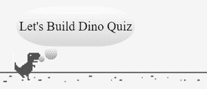
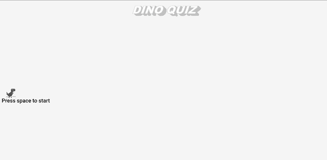
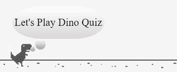
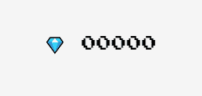

# 使用 JavaScript 通过语音识别从头开始构建 Chrome Dino 问答游戏

> 原文：<https://medium.com/geekculture/build-chrome-dino-quiz-game-from-scratch-with-speech-recognition-using-javascript-844829fc00c9?source=collection_archive---------14----------------------->

你们一定都知道 Chrome 恐龙游戏，也被称为 T-Rex 游戏和 Dino Runner，这是谷歌 Chrome 网络浏览器中的一款内置浏览器游戏，在谷歌 Chrome 上离线时或通过在地址栏中键入`*chrome://dino*` 即可访问。但是如果你从来没有玩过，那么今天是你的幸运日。

在这篇文章中，您将学习如何从头开始构建 Dino Runner 游戏，并将其改造成一个使用语音识别和 Web Speech API 的问答游戏。



Dino Character Speaking

让我们开始吧。

**HTML 布局**:HTML 布局定义了将在页面上显示的元素结构。它包括:

**标题**:该部分位于网页顶部，用于以下用途:

*   *标题*:显示游戏标题，游戏第一次加载或重新加载时。
*   *问题板*:显示测验的问题。
*   *答题板*:显示当前玩家答错的问题的答案。

**游戏**:这部分是整个游戏执行的地方。它包括:

*   *比分板*:该块显示玩家已经达到的比分。
*   *游戏状态*:该区块在游戏开始或游戏结束时显示。
*   *Dino* : 这个块显示玩家形象，设置玩家在游戏中的位置。
*   *仙人掌*:此块显示障碍物(仙人掌)并设置障碍物的位置。
*   *地面*:此块显示地面，并设置其在游戏中的位置。
*   *语音气泡*:该块显示语音结果，玩家将通过麦克风说话。

HTML Code

CSS 样式化 : CSS 用于样式化 HTML 中的不同部分，使其更具视觉吸引力。

*   CSS 样式表被插入到名为 *index.css* 的`<head>`标签下。
*   游戏标题 Dino Quiz，一个通过 JavaScript `createElement()`函数创建的段落元素`<p>`，拥有类属性`stripe-text`。伪元素`::after`和`::before`分别用于提供文本样式和文本阴影。
*   语音气泡是一个具有 class 属性 `oval-thought`的 div 元素，它为元素提供了气泡形状的样式。它的子元素`<p>`text node 根据玩家在麦克风中说话时的语音结果进行更新。
*   谷歌字体是用来给游戏一个街机的外观，通过使用“按下开始 2P”字体系列来显示玩家的分数。
*   CSS 和 JavaScript 中都使用了供应商前缀，以提供对实验性功能的支持，如目前 Chrome 和 Edge 桌面浏览器支持的 Web Speech API。

CSS Style-Sheet

**JavaScript** :幕后的繁重工作由 JavaScript 完成，比如操作 DOM 元素、集成 Web 语音 API、动画等等。JavaScript 代码在 Game.js 文件中定义，使用`<script></script>`标签插入到 HTML 文件中的 `</body>`标签之前，首先加载 HTML 代码。

让我们一步一步地理解代码:

**步骤 1** :显示开始画面

**游戏状态:**

1.  定义的`gameStatus`对象有两个访问器属性，`gameOver`和`gameReset`，由 setter 方法操作，由 getter 方法获得。

*   当游戏结束时`gameOver`标志被设置为`true`，否则设置为`false`。
*   当玩家想要再次玩游戏时,`gameReset`标志被设置为`true`。

**显示标题和启动/重新加载信息**:

1.  `initialText()`方法在标题部分显示标题 *Dino Quiz* 作为新的段落元素，消息 *Press space to start* 将在游戏开始时出现在玩家角色的底部。
2.  但是，这两个文本都只在`getResetGame()`方法返回`false`时显示，告知游戏没有结束；如果是真的，那么只显示*按空格键重新加载*消息，要求玩家重新开始游戏。



Start Screen

**步骤 2:** 构建玩家档案和功能

**玩家形象**:

1.  在`drawDino()`方法中，选择类属性为 dino 的 canvas 元素；它将充当我们的玩家角色，执行跳跃和奔跑等动作。
2.  使用`drawImage()`方法在选定的画布上绘制一个恐龙图像，该方法采用如下九个参数:

*   `image` —要绘制到上下文中的元素。
*   `sx` —要绘制到目标上下文中的源图像子矩形左上角的 x 轴坐标。
*   `sy` —要绘制到目标上下文中的源图像子矩形左上角的 y 轴坐标。
*   `sWidth` —要绘制到目标上下文中的源图像的子矩形的宽度。如果未指定，则使用从 sx 和 sy 指定的坐标到图像右下角的整个矩形。
*   `sHeight` —要绘制到目标上下文中的源图像的子矩形的高度。
*   `dx` —目标画布中放置源图像左上角的 x 轴坐标。
*   `dy` —目标画布中放置源图像左上角的 y 轴坐标。
*   `dWidth` —在目标画布中绘制图像的宽度。这允许缩放所绘制的图像。如果未指定，则图像在绘制时不缩放宽度。
*   `dHeight` —在目标画布中绘制图像的高度。这允许缩放所绘制的图像。如果未指定，则图像在绘制时不按高度缩放。

**玩家位置**:

*   `dinoPosition`对象告知玩家角色是否在地上，即是否做出了跳跃动作。
*   如果`onground`属性为真，那么玩家角色将在地面上，否则一个跳跃动作已经开始。

**玩家动画**:

1.  **运行**——在`dinoRun()`方法中，`setInterval()`方法使用`drawDino()`方法在定义的时间间隔(在本例中为 100 毫秒)后在播放器画布上重新绘制角色的图像，给人一种角色正在运行的感觉。当游戏结束或者当玩家角色离开地面时，动画停止。
2.  **跳转** -在`jumpDino()`方法中，两个`setInterval()`方法用于创建跳转效果-

*   第一种`setInterval()`方法将播放器画布的 Y 轴坐标缩小到 100 像素。
*   第二种`setInterval()`方法将播放器画布的 Y 轴坐标增加到 200px。
*   这两种方法都以定义的时间间隔依次执行任务。

**第三步**:游戏中的障碍

1.  **生成障碍**:`createElement()`方法在游戏中动态生成障碍。障碍是基于玩家已经避开最后一个障碍的条件而创建的。
2.  **移动障碍物**:变量`obctacleSpeed`以毫秒(千分之一秒)为单位，表示指定的`setInterval()`方法执行之间的延迟，障碍物位置不断变化，直到它到达位置 0，或者当游戏结束时，`remove()`方法从 DOM 中移除障碍物元素。
3.  **设定条件**:根据障碍物与玩家位置的距离，执行单独的条件语句。

*   **Set Game Over** :当用户对问题给出错误答案时，`getflagVal()` getter 方法返回 false，玩家与障碍物的最小距离已经达到`toJump()`方法返回`true`，游戏状态为`false`，调用`gameOver()`方法。
*   **跳跃玩家**:当用户给出问题的正确答案时， `getflagVal()` getter 方法返回 false，玩家与障碍物的最小距离已经达到`toJump()`方法返回`true`，从而触发`jumpDino()`方法使玩家跳跃。
*   **其他方法**:其他方法如`setQuestion()`、`setHideBubble()`、`setflagVal()`在合适的条件被触发时被调用。

**第四步**:游戏背景

1.  `groundMove()`方法提供了一个移动的背景效果，它渲染画布元素，并在设定的时间间隔后在画布上重新绘制地面图像。
2.  图像在画布上以适当的距离绘制两次，每次向左移动 2 的倍数；这里 2 的倍数代表图像移动的速度。因此，较高的值意味着较高的速度。

**第 5 步**:测验问题和答案

**问题对象**:测验的问题是一个对象数组；每个对象都有三个属性。

*   **ID** :是问题编号，从 1 开始。
*   **问题**:它有测验的问题。
*   **答案**:它有问题的答案。

**设置问题并获得答案**:

*   `quizQuestionAnswer`对象使用 setter 方法在问题板块上设置问题，并使用 getter 方法回答相应的问题。它还检查代表问题数组索引的索引值；如果超过问题总数，则返回`false`。
*   `setQuestion()` setter 方法调用`Cactus()`方法启动障碍生成。
*   静态的`String.fromCodePoint()`方法用于在 HTML 代码中插入表情符号，该方法返回一个使用指定的代码点序列创建的字符串。

**第六步**:语音识别

**集成网络语音 API** :

*   Web 语音 API 有两个部分:语音合成(文本到语音)和语音识别(异步语音识别。)我们将使用语音识别通过麦克风从用户那里获得输入。
*   在一些浏览器上，如 Chrome，在网页上使用语音识别需要一个基于服务器的识别引擎。您的音频被发送到 web 服务进行识别处理，因此无法脱机工作。

在我们的例子中触发了两个事件。

*   ***结果*事件** -当单词或短语被肯定识别时触发。它将用户语音结果与当前问题的答案进行比较。

1.  *结果匹配* -分数增加 100，使用`speechBubble`对象设置器方法`setBubbleResult()`显示用户语音结果，并将`answerMatchresult`对象设置器方法`setflagVal`设置为`true`。
2.  *结果不匹配* -使用`speechBubble`对象设置器方法`setBubbleResult()`显示用户语音结果，并将`answerMatchresult`对象设置器方法`setflagVal`设置为`false`。

*   ***结束*事件**——当语音识别服务断开时触发。它再次启动语音识别服务，为用户保持连续的语音流。

**显示语音结果**:

*   当`SpeechRecognition`的结果事件被触发以显示用户语音结果时，调用带有`setBubbleResult()` setter 方法的`speechBubble`对象。
*   `setHideBubble()` setter 方法是隐藏语音气泡。

**设置结果标志**:

*   当用户语音结果与相关问题的答案匹配时，`answerMatchresult`对象使用`setflagVal()` setter 方法将对象的 flag 属性设置为`true`。
*   `getflagVal()` getter 方法用于返回`flag`。



Speech Bubble

**第七步**:计分板

记分板对象跟踪用户的当前分数。

*   `setScoreBoard()` setter 方法，它将记分板结果初始化为 0。
*   当用户成功避开一个障碍时，就会调用`setScore()` setter 方法，每次分数都会增加 100。

钻石表情符号(HTML 代码`&#128142;`)与`<span>`标签一起显示，谷歌字体“按下开始 2P”用于显示比分，这给游戏带来了街机的外观。



Scoreboard

第八步:把所有的东西放在一起

**初始化游戏**:

*   当 HTML 文档完全加载时，调用`initGame()`方法。它呈现用户第一次遇到的开始屏幕。它显示游戏的标题，并监听空格键事件来启动游戏。它还检查游戏重置条件，并相应地显示结果。
*   玩家分数设置为 0，并且`scoreboard`和`speechBubble`显示设置为隐藏。
*   当`gameStatus.getResetGame`为`true`时，游戏被重新加载，该动作通过重新加载游戏正在执行的当前浏览器窗口来执行。因此，所有变量和常量值都会自动重置。

**开始游戏**:

*   `startGame()`方法执行`Speech()`方法，启动 Web Speech API，`dinoRun()`方法被调用初始化游戏中的玩家角色，`groundMove()`方法被调用渲染游戏背景。
*   调用`quizQuestionAnswer`对象的 setter 方法`setQuestion()`，该方法将一个问题对象作为参数来初始化测验的问题，`scoreboard`显示在这里被设置为可见。

**游戏结束**:

*   当`gameStatus`对象的`*gameReset*` 属性为`false`时，即当玩家与障碍物发生碰撞时，执行`gameOver()`方法。
*   它显示相应问题的正确答案，并调度 reload 事件。

**重装游戏**:

*   `gameReloadEvent`是由`gameOver()`方法触发的自定义事件监听器；它将`gameOver`和`gameReset`标志分别设置为`false`和`true`，并调用`initGame()`方法。

恭喜你！你成功了。我希望你今天玩得开心并且学到了新的东西。我们已经编码出了出路，是时候开始游戏了。到目前为止，您一定已经创建了三个文件，即

1.  HTML 文件
2.  CSS 样式表
3.  JavaScript 文件 oceanhero.today

在执行 HTML 文件之前，我们必须设置一个本地服务器。对于我们的目的来说，最简单的方法之一是使用 Python 的`*SimpleHTTPServer*`或`*http.server*`，这取决于所安装的 Python 版本。如果你不知道我在说什么，请点击下面的链接-

[MDN 网络文档文章](https://developer.mozilla.org/en-US/docs/Learn/Common_questions/set_up_a_local_testing_server)

**启动恐龙测验**:

*   打开命令提示符，使用`*cd*` 命令将当前目录路径更改为您存储 Dino 智力竞赛游戏文件的路径。
*   在下面的终端上键入命令，启动本地服务器

```
# If Python version returned above is 3.Xpython3 -m http.server# On windows, try "python" instead of "python3", or "py -3"# If Python version returned above is 2.Xpython -m SimpleHTTPServer
```

*   要访问本地服务器，您需要访问`[http://localhost:8000/](http://localhost:8000/.)`，端口`8000`是默认的。
*   游戏将启动，或者您将在 web 浏览器中看到一个目录列表，打开您为游戏启动创建的 HTML 文件。

**演示**:

*   你可能会在下面的视频中看到延迟，这是由于屏幕录制软件，在实际中没有遇到这样的延迟问题。

**资源**:

*   项目中使用的图像可以在 Chromium 开源项目中获得。下面给出链接-
    [离线-图片](https://source.chromium.org/chromium/chromium/src/+/master:components/neterror/resources/images/default_200_percent/offline/200-offline-sprite.png)