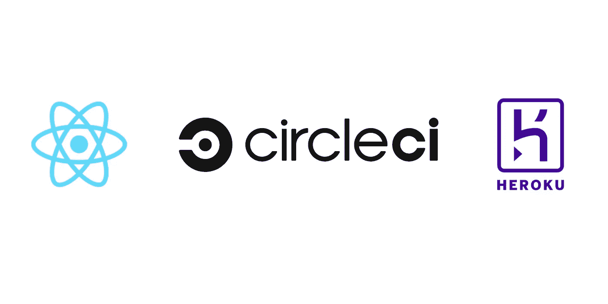
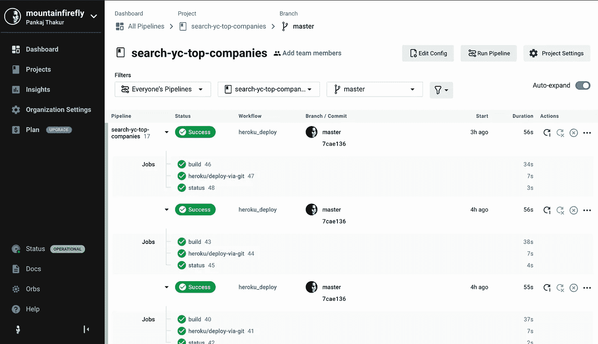
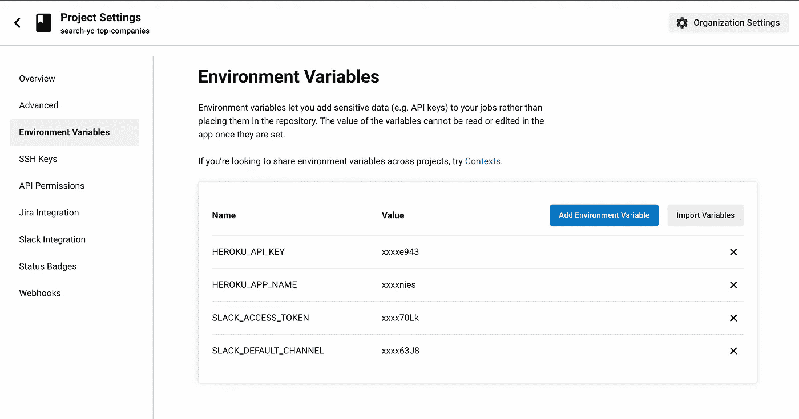

# 使用 CircleCI 构建和部署您的软件。

> 原文：<https://medium.com/geekculture/build-deploy-your-software-using-circleci-4e3c0cc870cd?source=collection_archive---------20----------------------->



在本文中，我们将熟悉 CircleCI，以及如何使用它来自动化我们的部署。您可以通过 CircleCi 执行任何软件进入生产所需的所有步骤，即**构建**、**测试**和**部署。**在这篇文章中，我们将跳过测试步骤。

# 目标

*   让你熟悉 CircleCI。
*   在 CircleCI 环境中构建一个 React 项目。
*   在 Heroku 服务器上部署 React 项目。

# 什么是 CircleCI？

CircleCI 是一个现代工具，用于项目的[持续集成和持续部署](https://www.atlassian.com/continuous-delivery/principles/continuous-integration-vs-delivery-vs-deployment) (CI/CD)。您可以在个人云中设置它，并在有限的时间内使用它。

你可以通过访问[https://circleci.com/vcs-authorize/](https://circleci.com/vcs-authorize/)在 CircleCI 上创建一个账户，并使用 Github 或 Bitbucket 登录。

通过 Github 或 Bitbucket 登录会要求访问您的存储库的权限，并自动将您的所有存储库导入到 CircleCI 仪表板中。

接下来，让我简单介绍一下 CircleCI 的主要元素。

## 管道—

管道是在您触发项目工作时运行的一整套流程。管道包含工作流，而工作流又与作业相协调。

## 球体—

orb 是代码片段，可以帮助您自动化重复的过程，加快项目设置，并且易于与第三方工具集成。

## 工作—

工作是你管道的组成部分。作业是步骤的集合，根据需要运行命令/脚本。并且每个作业必须有一个可以是 VM 或容器的执行器。

## 遗嘱执行人—

您的配置中定义的每个作业都将在一个唯一的执行器中运行。此外，执行器可以是 Docker 容器或运行 Linux、Windows 或 macOS 的虚拟机。

## 步骤—

步骤是完成一项工作所需的一组动作。步骤通常是可执行命令的集合，CircleCI 提供了内置步骤，您可以使用例如 *checkout* 。

## 工作流程—

工作流是作业的集合，可以以并发、顺序或预定的方式运行这些作业。

希望到现在为止，您已经对 CircleCI 有了足够的了解，可以为您的项目建立一个 CI/CD。

# 在 CircleCI 环境下构建 ReactJS 项目

接下来，我们将为 React 项目设置 CircleCI，这是一个 React 应用程序示例，它位于 Github([https://github.com/mountainfirefly/search-yc-top-companies](https://github.com/mountainfirefly/search-yc-top-companies))上。

稍后，我将托管一个 web 应用程序来搜索 YC 关于回购的顶级公司，现在它只是呈现一个样本 react 应用程序。

## 创建一个 Heroku 应用程序来托管 React 项目

在这一步中，我们需要创建一个 Heroku 应用程序来托管 React 项目，为此我们将使用 Heroku 命令行。

如果您的计算机上没有 Heroku CLI，您可以使用下面的命令安装它。

```
$ npm i -g heroku
```

你可以登录你的 Heroku 账户，然后会打开一个浏览器询问凭证

```
$ heroku login
```

在这里，我们将使用 buildpack 部署 React 项目，如果您不知道 build pack，它们只是一组用于在 Heroku 上编译应用程序的脚本。你可以在这里阅读更多关于构建包[的内容。](https://devcenter.heroku.com/articles/buildpacks)

在我们的例子中，我们将使用 create-react-app-buildpack 来部署 react 项目。

```
$ heroku create yc-top-companies --buildpack [https://github.com/mars/create-react-app-buildpack.git](https://github.com/mars/create-react-app-buildpack.git)
```

这个命令将输出一个属于你的 Heroku 应用程序的 URL，你可以把它放在你的浏览器中检查是否一切运行顺利。

## **CircleCI 配置**

现在，我们将为我们的项目创建 CircleCI 配置文件，并转到您的项目。

```
$ cd search-yc-top-companies/
```

我们需要添加的第一件事是一个配置文件，它将告诉 CircleCI 如何构建我们的 React 项目。这个配置文件需要添加到我们项目根目录下的`.circleci`目录中，命名为`config.yml`。

```
$ mkdir .circleci
```

这里是`config.yml`

```
version: 2.1orbs:
  heroku: circleci/heroku@0.0.10jobs:
  build:
    docker:
      - image: circleci/node:10.16.3
    working_directory: ~/search-yc-top-companies
    steps:
      - checkout
      # install dependencies
      - run:
          name: Install Dependencies
          command: npm install
      - run:
          name: Build
          command: npm run buildworkflows:
  heroku_deploy:
    jobs:
      - build
      - heroku/deploy-via-git: # Use the pre-configured job, deploy-via-git
          requires:
            - build
          filters:
            branches:
              only: master
```

这是一个非常简单的配置文件，我们在其中有两个任务`build`和`heroku/deploy-via-git`。

一旦这个配置文件创建完成，现在提交并将其推送到 Github 存储库。

```
$ git add .circleci
$ git commit -m "Add circleci configuration"
$ git push origin master
```

接下来，我们将转到 CircleCI 仪表板，并执行以下步骤:-

*   点击左侧菜单上的`Add Projects`项
*   搜索`search-yc-top-companies` Github 项目
*   点击右侧的`Set up Project`按钮。
*   接下来，它会要求您提供一个包含 circleci 配置的分支，另一个选项是创建一个分支。在我们的例子中，我们已经有了它，所以选择`master`。



一旦完成，接下来我们必须链接 Heroku 和 CircleCI，为此，您需要从 Heroku 仪表板添加您的应用程序名称和 API 密钥。

上述详细信息可在 Heroku 仪表板上找到

*   应用程序名称可在仪表板项目列表 iteself 中找到。
*   对于 API 密匙，进入你的账户设置，向下滚动到 API 密匙部分，你会找到它。

按照以下步骤将这些变量添加到 CircleCI 环境变量中

*   现在转到 CircleCI 仪表板
*   点击项目下屏幕右侧的`Project Settings`按钮。
*   选择左边的`Environment Variables`菜单。
*   点击`Add Environment Variable`按钮。
*   对于应用程序名称，输入名称字段作为`HEROKU_APP_NAME`，并在值的位置输入您的 Heroku 应用程序名称。
*   对于 API 键，输入名称字段为`HEROKU_API_KEY`，而不是我们之前讨论过的值 API 键，您可以在 Heroku 的帐户设置中获得。



如果你正确地遵循了上述步骤，一切都会好的😁。

现在转到你的 CircleCI 项目，点击`Run Pipeline`，在它成功完成后，打开你的 Heroku 应用程序 URL，你会看到一个样本 react 应用程序在那里运行。

现在是时候体验持续集成和持续部署的力量了，在本地机器上进入 react 项目并进行更改，然后将其推送到 GitHub。

如果你在 CircleCI 仪表板上，你会看到管道被自动触发，过一会儿，Heroku 应用程序应该会根据你在本地机器上所做的最新更改进行更新。

我希望你们喜欢这篇文章，就像我喜欢写它一样。

我将为此写一篇后续文章，其中我们将集成 Slack 并获得构建部署状态的通知。

请继续关注，我们会不时发布更多这样的文章，你也可以查看我的网站 [mountainfirefly.dev](https://mountainfirefly.dev/) ，我在那里写了很多这样的文章。

如果你在阅读这篇文章时遇到任何问题，可以在 Twitter @mountainfirefly 上联系我。

**感谢**阅读！！