# 使用 gRPC 和. NET7 构建高性能服务

> 原文：<https://medium.com/geekculture/build-high-performance-services-using-grpc-and-net7-7c0c434abbb0?source=collection_archive---------1----------------------->

## 获得比. NET6 高 800%的性能


Photo by [AltumCode](https://unsplash.com/@altumcode?utm_source=unsplash&utm_medium=referral&utm_content=creditCopyText) on [Unsplash](https://unsplash.com/s/photos/programming?utm_source=unsplash&utm_medium=referral&utm_content=creditCopyText)

。NET 7 正式发布，标准支持期为 18 个月。包含了许多激动人心的新特性，包括 Web API、gRPC、ASP.NET 和 C#11 的性能升级。

本文涵盖了以下主题:

1.  中的性能改进。NET 7。
2.  gRPC JSON 转码。
3.  在中创建 gRPC 服务。NET 7。
4.  使用 Postman 消费 gRPC 服务。
5.  使用服务器反射和邮递员
6.  添加 Swagger 规范。

中讨论 gRPC 的新特性。NET 7，我们还将实现一个现实世界的微服务，能够在一分钟内**传输 500 万条记录。**

**注意**:如果你不熟悉 gRPC 服务。网，先看看下面这篇文章。

[](/swlh/build-high-performance-services-with-grpc-and-net-5-7605ffe9b2a2) [## 使用 gRPC 和构建高性能服务。网络 5

### 。NET 5 已经发布，它带来了许多令人兴奋的特性、新技术和性能改进…

medium.com](/swlh/build-high-performance-services-with-grpc-and-net-5-7605ffe9b2a2) 

**这里是一个快速回顾:**

*   gRPC 是一个流行的开源 RPC 框架，由 CNCF 开发[。](https://www.cncf.io/projects/grpc/)
*   作为契约优先、独立于语言的框架，客户机和服务器必须就消息的内容和交付方式达成一致——契约在。原型文件，然后使用. NET7 的工具生成代码。
*   在单个 tcp 连接上，HTTP/2 支持多路复用，可以同时发送多个请求。
*   此外，gRPC 支持数据流，服务器可以同时向客户机发送多个响应，反之亦然。

## 中的新功能。NET 7？

## 1.性能改进

为了让 gRPC 支持多路复用，需要 HTTP/2。然而，Kestrel 的 HTTP/2 实现存在一个已知的问题，当连接繁忙时，它会在通过 HTTP/2 编写响应的过程中造成瓶颈。当您在同一个 TCP 连接上同时运行多个请求，但一次只有一个线程能够写入连接时，就会发生这种情况。这是用线程锁实现的。NET 6，这导致了锁争用。

NET 7 使用了一种巧妙的方法来解决这个瓶颈，它实现了一个队列，当一个写操作完成时，它会通知所有其他线程，允许它们等待写操作完成。因此，性能大大提高，CPU 资源得到了更好的利用——不再需要争夺锁了。

。NET gRPC 团队的基准测试显示，服务器流性能提高了 800%。

*   。净 6-0.5 米 RPS
*   。净 7450 万 RPS

**HTTP/2 上传速度**

通过增加缓冲区大小，延迟减少了 600%。。NET 7 将上传 100MB 文件的时间从 26.9 秒减少到 4.3 秒。NET 6。

。NET 7 gRPC 的性能现在超过了 Rust、Go 和 C++等流行框架。

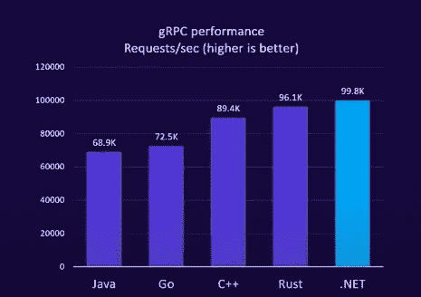

[https://github.com/Lesnyrumcajs/grpc_bench](https://github.com/Lesnyrumcajs/grpc_bench)

## 2.gRPC JSON 代码转换

. NET7 为 NET7 核心 gRPC 提供了一个扩展，以使 gRPC 服务能够作为 RESTful Web 服务公开。您现在可以通过 HTTP 调用 gRPC 方法，没有任何重复。

gRPC JSON 转码支持:

*   HTTP 动词
*   URL 参数绑定
*   JSON 请求/响应

在这个扩展中，通过使用 protobuf 注释的概念，HTTP 动词被映射到 gRPC 服务，并且该扩展在 ASP.NET 核心应用程序中运行，这些应用程序然后将 JSON 反序列化为 protobuf 消息并直接调用 gRPC 服务，而不必编写自己的 gRPC 客户端应用程序。

我们将在下一节研究如何实现这一点。

## 3.开放 API 规范

中现在有一个针对 gRPC JSON 代码转换的开放 API 规范。NET 7 使用以下 Nuget 包:

> 【https://www.nuget.org/packages/Microsoft. AspNetCore.Grpc.Swagger

## 4.Azure 应用服务支持

最后但同样重要的是，Azure App 服务现在完全支持 gRPC。这是在. NET 中使用 gRPC 构建和部署高性能服务的一大进步。

既然我们已经谈完了，让我们来实现 gRPC，看看新特性是什么样子的。


Source: [https://i.pinimg.com/originals/72/f6/fe/72f6fe384180442d9cd835abd4e021d9.jpg](https://i.pinimg.com/originals/72/f6/fe/72f6fe384180442d9cd835abd4e021d9.jpg)

**先决条件:**

*   下载并安装[。NET 7](https://dotnet.microsoft.com/en-us/download/dotnet/7.0) SDK
*   [Visual Studio 2022 17.4+](https://visualstudio.microsoft.com/vs/)

我们需要做的第一件事是启动 Visual Studio 并创建一个新项目。我们将选择“ASP。NET Core gRPC 服务”，这将创建一个 hello world gRPC 服务示例。

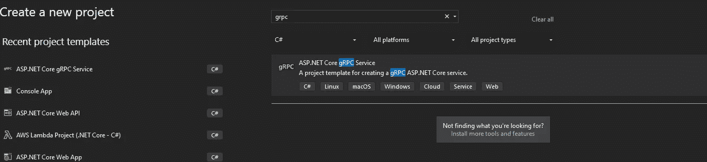

Image by Author

确保选择了. NET7。

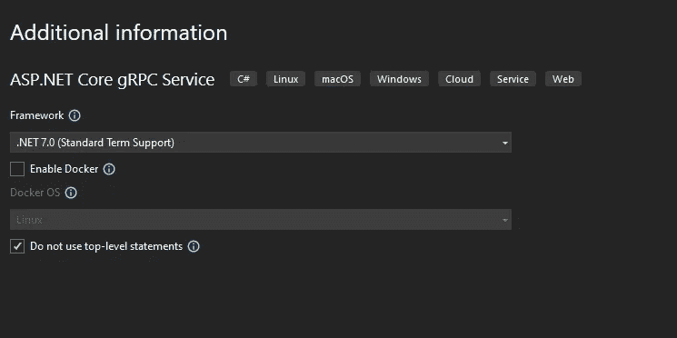

Image by Author

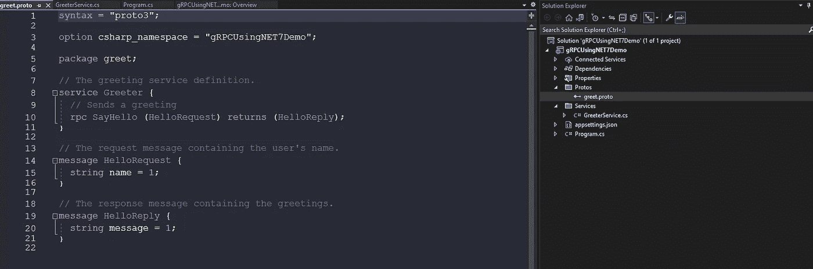

Image by Author

这将分别在 protos 和服务文件夹中创建一个现成的 gRPC 应用程序和 GreeterService。

这里有一个作为契约的 greeting.proto 文件，它定义了客户端将接收的消息和服务。

```
syntax = "proto3";

option csharp_namespace = "gRPCUsingNET7Demo";

package greet;

// The greeting service definition.
service Greeter {
  // Sends a greeting
  rpc SayHello (HelloRequest) returns (HelloReply);
}

// The request message containing the user's name.
message HelloRequest {
  string name = 1;
}

// The response message containing the greetings.
message HelloReply {
  string message = 1;
}
```

契约可以被认为是接口，这些接口的实现将由服务定义，在我们的例子中是 greeter service . cs——这个文件是描述契约实现的地方。

GreeterService 类是一个标准的 C#类，它向响应返回 hello。protobuf 的实际实现是通过代码生成实现的，它是使用 GreeterBase 抽象出来的。如果你想知道到底发生了什么，你可以去 GreeterBase，在那里你会找到所有的底层细节。

```
public class GreeterService : Greeter.GreeterBase
    {
        private readonly ILogger<GreeterService> _logger;
        public GreeterService(ILogger<GreeterService> logger)
        {
            _logger = logger;
        }

        public override Task<HelloReply> SayHello(HelloRequest request, ServerCallContext context)
        {
            return Task.FromResult(new HelloReply
            {
                Message = "Hello " + request.Name
            });
        }
    }
```

代码生成是。NET 7，它允许您生成服务器端和客户端 gRPC 代码。中更改代码生成过程的行为是可能的。CS 项目文件(例如，从服务器到客户端)，方法是设置代码生成设置。

```
 <ItemGroup>
    <Protobuf Include="Protos\greet.proto" GrpcServices="Server" />
  </ItemGroup>
```

让我们启动 Kestral，打开应用程序后在浏览器中浏览 gRPC 端点。

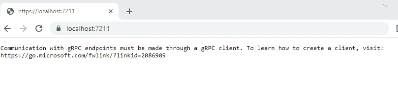

Image by Author

我们无法通过网络访问我们的 gRPC 服务，因为它需要使用 gRPC 客户端。然而，我们将使用流行的测试工具 Postman 来测试它，而不是要求使用 gRPC 客户机。它最近在其特性中增加了对 gRPC 请求的支持。

第一步是打开 Postman 并创建一个新的 gRPC 请求。

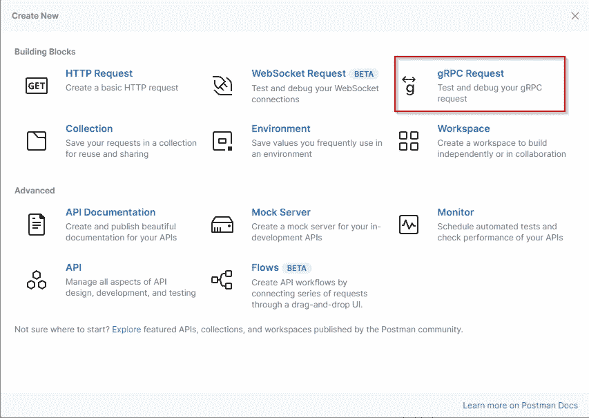

请在下面的框中输入服务器地址(运行您的应用的位置)。例如， [https://localhost:7211](https://localhost:7211)

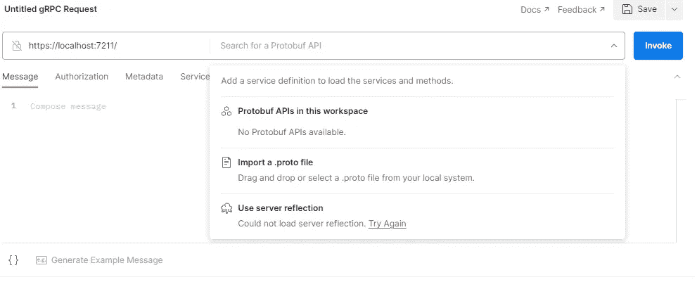

邮递员不明白我们的服务目前是如何工作的，所以我们有几个选择。一种是导入一个. proto 文件或者使用一种叫做“服务器反射”的东西。可以认为它是 gRPC 调用的 OpenAPI 规范。

**在 gRPC 服务中启用服务器反射。**

按照下面的步骤启用服务器反射非常简单。

1.  下载并安装以下 nuget 软件包:

```
Install-Package Grpc.AspNetCore.Server.Reflection -Version 2.49.0
```

2.在 Program.cs 文件中，您需要注册以下服务，并在我们的 http 管道中映射该服务，如下所示:

```
builder.Services.AddGrpcReflection();

app.MapGrpcReflectionService();
```

现在我们已经完成了所有这些，让我们回到 Postman，再次运行应用程序。

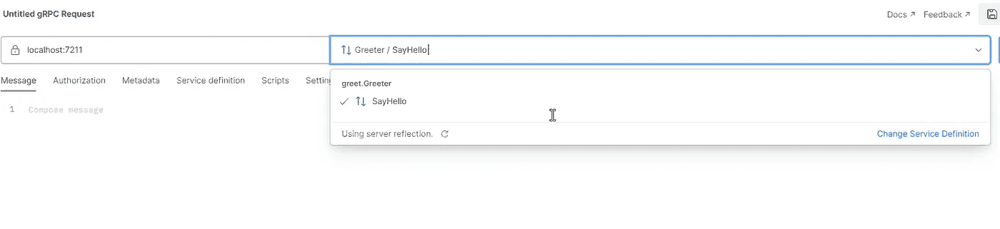

Image by Author

耶！！我们可以看到我们的 greet.greeter 服务及其 SayHello 方法

这个端点可以通过点击带有 JSON 主体的 Invoke 按钮来调用(Postman 会将其转换为 protobuf)。

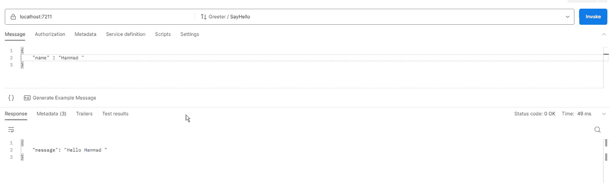

Image by Author

太好了！我们在 49 毫秒内得到了服务器响应。

## 将您的 gRPC 服务转变为 REST

本节将实现 gRPC JSON 代码转换，以便通过 HTTP 访问 gRPC。

1.  将以下 nuget 包添加到您的项目中:

```
Install-Package Microsoft.AspNetCore.Grpc.JsonTranscoding -Version 7.0.0
```

2.导航到 Program.cs 并添加 JSONTranscoding 服务:

```
builder.Services.AddGrpc().AddJsonTranscoding();
```

下一步，我们将向我们的项目添加两个原型文件。

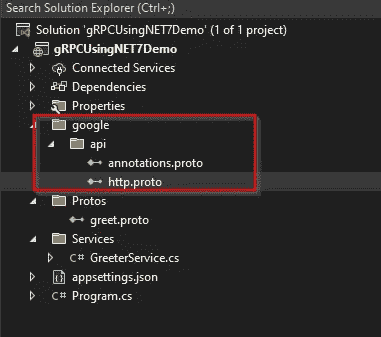

Image by Author

以下是原型文件的链接:

1.  [https://raw . githubusercontent . com/Google API/Google API/master/Google/API/annotations . proto](https://raw.githubusercontent.com/googleapis/googleapis/master/google/api/annotations.proto)
2.  [https://raw . githubusercontent . com/Google APIs/Google APIs/master/Google/API/http . proto](https://raw.githubusercontent.com/googleapis/googleapis/master/google/api/http.proto)

添加完这些文件后，我们需要修改 greet.proto 并添加 import“Google/API/annotations . proto ”,这样我们就可以注释我们的服务方法了。

```
 // Sends a greeting
  rpc SayHello (HelloRequest) returns (HelloReply)
  {
   option (google.api.http) =
   {
    get: "/v1/greeter/{name}"
   }

  };
```

基本上，我们向 RPC 方法添加了一个路由，这样它就可以作为 REST 方法被调用。让我们再次运行应用程序，并使用浏览器执行端点。

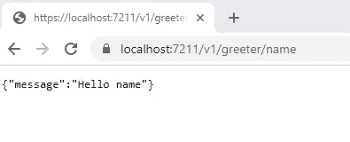

Image by Author

就是这样！这个 API 现在作为一个基于 REST 的 API 工作，但是它仍然可以作为一个 gRPC 接口使用。来自 Postman 的 gRPC 响应如下所示。

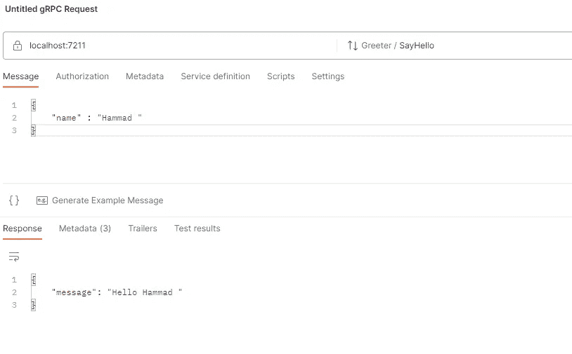

Image by Author

## 添加开放 API 规范

本节的目的是解释如何使用 gRPC.Swagger 将开放 API 规范添加到我们的应用程序中。

1.  安装以下 nuget 软件包:

```
Install-Package Microsoft.AspNetCore.Grpc.Swagger -Version 0.3.0
```

2.如下注册 Swagger 服务和中间件。

```
 builder.Services.AddGrpcSwagger();
    builder.Services.AddSwaggerGen( c=>
            {
      c.SwaggerDoc("v1",
new Microsoft.OpenApi.Models.OpenApiInfo { Title = "gRPC using .NET 7 Demo", Version = "v1" } );
            });
```

最后，您的 program.cs 应该是这样的:

```
using gRPCUsingNET7Demo.Services;

namespace gRPCUsingNET7Demo
{
    public class Program
    {
        public static void Main(string[] args)
        {
            var builder = WebApplication.CreateBuilder(args);

            // Additional configuration is required to successfully run gRPC on macOS.
            // For instructions on how to configure Kestrel and gRPC clients on macOS, visit https://go.microsoft.com/fwlink/?linkid=2099682

            // Add services to the container.
            builder.Services.AddGrpc().AddJsonTranscoding();
            builder.Services.AddGrpcReflection();
            builder.Services.AddGrpcSwagger();

            builder.Services.AddSwaggerGen( c=>
            {
                c.SwaggerDoc("v1",
                    new Microsoft.OpenApi.Models.OpenApiInfo { Title = "gRPC using .NET 7 Demo", Version = "v1" }

            });
            var app = builder.Build();
            app.UseSwagger();
            app.UseSwaggerUI(c =>
            {
                c.SwaggerEndpoint("/swagger/v1/swagger.json", "gRPC using .NET7 Demo");
            }
            );
            // Configure the HTTP request pipeline.
            app.MapGrpcService<GreeterService>();
            app.MapGrpcReflectionService();
            app.MapGet("/", () => "Communication with gRPC endpoints must be made through a gRPC client. To learn how to create a client, visit: https://go.microsoft.com/fwlink/?linkid=2086909");
            app.Run();
        }
    }
}
```

启动应用程序后调用 Swagger 端点。[https://localhost:7211/swagger/index . html](https://localhost:7211/swagger/index.html)

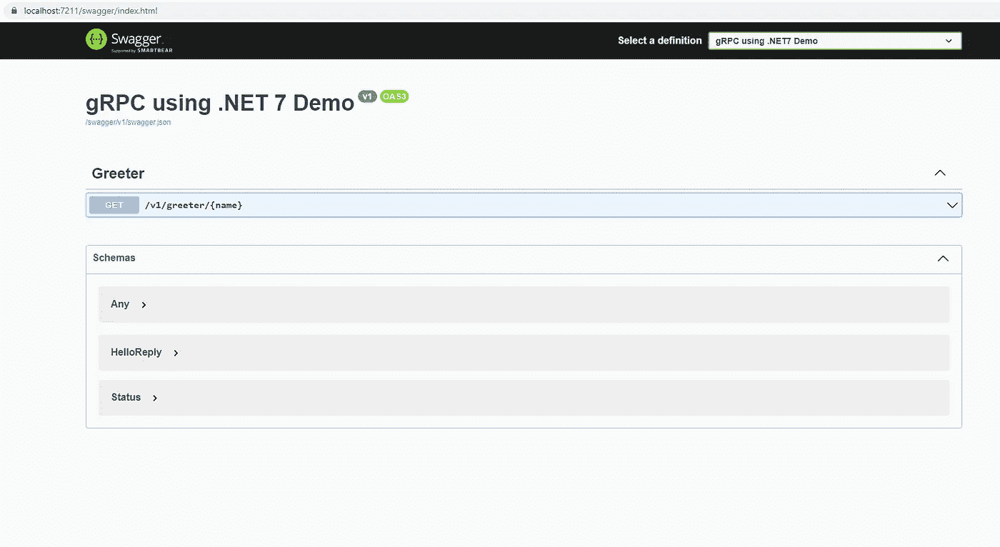

Image by Author

您可以尝试像调用任何 Restful API 一样调用端点。

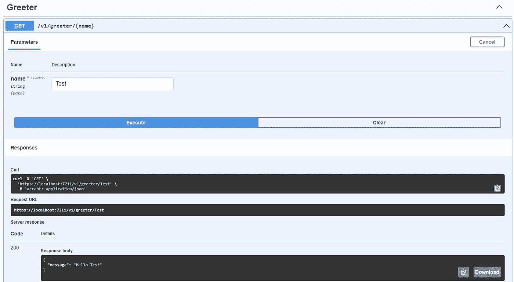

Image by Author

在本节之后，我们将演示如何使用 gRPC 服务器流将 500 万条记录(大约 600MB 的数据)传输到客户端。

# gRPC 服务器流

在服务器流中，gRPC 客户机发送一个请求并获得一个响应流。客户端读取这些响应，直到所有消息都已传递。gRPC 确保消息有序。

以这个[样本 CSV 文件](https://eforexcel.com/wp/wp-content/uploads/2020/09/5m-Sales-Records.zip)为例。

该 CSV 文件包含大约 500 万条销售记录，因此不可能在一次通话中交付所有记录。

此外，传统的基于 REST 的分页涉及多个客户端请求，并且需要在客户端和服务器之间来回通信。

gRPC 服务器流是解决这一问题的绝佳方案。

*   客户端将简单地调用服务方法。
*   CSV 文件将被逐行读取，转换为原型模型，然后使用 StreamReader 发送回客户端。
*   响应流将被发送到客户端。

我们将从定义一个原型文件开始:


**Protos- > sales.proto**

```
syntax = "proto3";
import "google/protobuf/timestamp.proto";
 csharp_namespace = "gRPCUsingNET7Demo";

package sales;

service SalesService {
rpc GetSalesData(Request) returns (stream SalesDataModel) {}
}

message Request{
string filters=1;

}

message SalesDataModel {
  int32 OrderID = 1;
  string Region = 2;  
  string Country = 3;
  string ItemType=4;
  google.protobuf.Timestamp OrderDate=5;
  google.protobuf.Timestamp ShipDate=6;
  int32 UnitsSold=7;
  float UnitCost=8;
  float UnitPrice=9;
  int32 TotalRevenue=10;
  int32 TotalCost=11;
  int32 TotalProfit=12;
  }
```

使用 stream 关键字，我们可以指定 SalesDataModel 将作为流交付。

我们的下一步是通过以下方式添加一个新服务—saledataservice . cs:

```
using Grpc.Core;
using gRPCUsingNET7Demo;

namespace gRPCUsingNET7Demo.Services
{
    public class SalesDataService : SalesService.SalesServiceBase

    {

        public override async Task
            GetSalesData(Request request,
            IServerStreamWriter<SalesDataModel> responseStream, ServerCallContext context)
        {

            using (var reader = new StreamReader(Path.Combine(AppDomain.CurrentDomain.BaseDirectory, "Data", "sales_records.csv")))
            {
                string line; bool isFirstLine = true;
                while ((line = reader.ReadLine()) != null)
                {
                    var pieces = line.Split(',');

                    var _model = new SalesDataModel();

                    try
                    {
                        if (isFirstLine)
                        {
                            isFirstLine = false;
                            continue;
                        }

                        _model.Region = pieces[0];
                        _model.Country = pieces[1];

                        _model.OrderID = int.TryParse(pieces[6], out int _orderID) ? _orderID : 0;
                        _model.UnitPrice = float.TryParse(pieces[9], out float _unitPrice) ? _unitPrice : 0;

                        _model.ShipDate = Google.Protobuf.WellKnownTypes.Timestamp.FromDateTime
                             ((DateTime.TryParse(pieces[7], out DateTime _dateShip) ? _dateShip : DateTime.MinValue).ToUniversalTime());

                        _model.UnitsSold = int.TryParse(pieces[8], out int _unitsSold) ? _unitsSold : 0;

                        _model.UnitCost = float.TryParse(pieces[10], out float _unitCost) ? _unitCost : 0;

                        _model.TotalRevenue = int.TryParse(pieces[11], out int _totalRevenue) ? _totalRevenue : 0;
                        _model.TotalCost = int.TryParse(pieces[13], out int _totalCost) ? _totalCost : 0;

                        await responseStream.WriteAsync(_model);

                    }

                    catch (Exception ex)
                    {
                        throw new RpcException(new Status(StatusCode.Internal, ex.ToString()));
                    }

                }
            }

        }

    }
}
```

该服务实现 SalesServiceBase 类，该类由. NET7 工具使用 proto 文件自动生成。

它只是重写 GetSalesData，从文件中逐行读取数据，并将其作为流返回。

```
await responseStream.WriteAsync(_model);
```

让我们构建项目并运行应用程序。

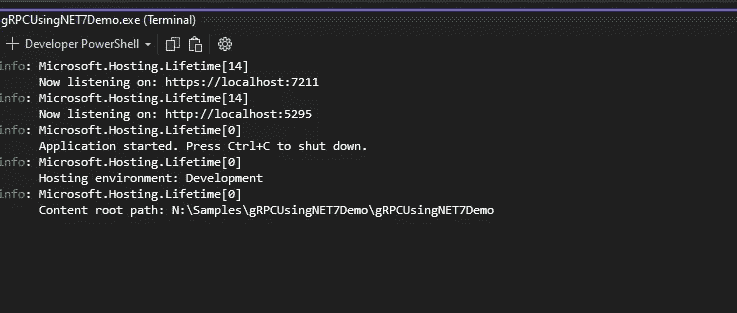

应用程序正在按预期运行。为了从服务器获得订单流，我们需要创建一个单独的 RPC 客户端，这将在下一节中描述。

## 使用. NET7 创建 gRPC 客户端

让我们在您的解决方案中创建一个新的控制台应用程序，并向其中添加以下包

```
<PackageReference Include="Google.Protobuf" Version="3.21.9" />
  <PackageReference Include="Grpc.Net.ClientFactory" Version="2.49.0" />
  <PackageReference Include="Grpc.Tools" Version="2.40.0">
   <PrivateAssets>all</PrivateAssets>
   <IncludeAssets>runtime; build; native; contentfiles; analyzers; buildtransitive</IncludeAssets>
  </PackageReference>
```

1.  确保添加了 Protos 文件夹，并将 sales.proto 文件复制到那里。
2.  为了为客户端生成 gRPC 类，您需要修改。csproj 文件。

```
<ItemGroup>
  <Protobuf Include="Protos\sales.proto" GrpcServices="Client" />
 </ItemGroup>
```

3.应该保存并构建项目(以便生成客户端代码)

4.第一步是打开 Program.cs，为您的 gRPC 服务创建一个频道。

```
var channel = GrpcChannel.ForAddress("https://localhost:7211");
```

5.创建一个新的 SalesService 对象(使用 gRPC 工具创建)，如下所示:

```
var client = new SalesService.SalesServiceClient(channel);
```

6.应该按如下方式调用服务方法:

```
using var call = client.GetSalesData(new Request { Filters = "" });
```

7.我们的代码只是在服务器上调用 ReadAllAsync 来检索流，然后一收到流就在控制台上打印输出。

```
await foreach (var each in call.ResponseStream.ReadAllAsync())
{
Console.WriteLine(String.Format("New Order Receieved from {0}-{1},Order ID = {2}, Unit Price ={3}, Ship Date={4}", each.Country, each.Region, each.OrderID, each.UnitPrice,each.ShipDate));
Count++;
}
```

这就是完整实现的样子

```
using Grpc.Core;
using Grpc.Net.Client;
using gRPCUsingNET7Demo;

namespace gRPCClient
{
    internal class Program
    {
        static async Task Main(string[] args)
        {
            var channel = GrpcChannel.ForAddress("https://localhost:7211");
            int Count = 0;
            var watch = System.Diagnostics.Stopwatch.StartNew();
            try
            {
                var client = new SalesService.SalesServiceClient(channel);

                using var call = client.GetSalesData(new Request { Filters = "" }
                  , deadline: DateTime.UtcNow.AddMinutes(10)
                );

                await foreach (var each in call.ResponseStream.ReadAllAsync())
                {

                    Console.WriteLine(String.Format("New Order Receieved from {0}-{1},Order ID = {2}, Unit Price ={3}, Ship Date={4}", each.Country, each.Region, each.OrderID, each.UnitPrice, each.ShipDate));
                    Count++;

                }
            }
            catch (RpcException ex) when (ex.StatusCode == StatusCode.DeadlineExceeded)
            {
                Console.WriteLine("Service timeout.");
            }

            watch.Stop();

            Console.WriteLine($"Stream ended: Total Records:{Count.ToString()} in {watch.Elapsed.TotalMinutes} minutes and {watch.Elapsed.TotalSeconds} seconds.");
            Console.Read();

        }
    }
}
```

正如您在上面的例子中看到的，服务方法调用是在截止日期的帮助下完成的。您可以使用期限来指定通话的持续时间，这样您就可以指定通话应该持续多长时间。

```
using var call = client.GetSalesData(new Request { Filters = "" }
, deadline: DateTime.UtcNow.AddMinutes(10)
);
```

客户端现在允许您查看来自 gRPC 服务的传入消息。

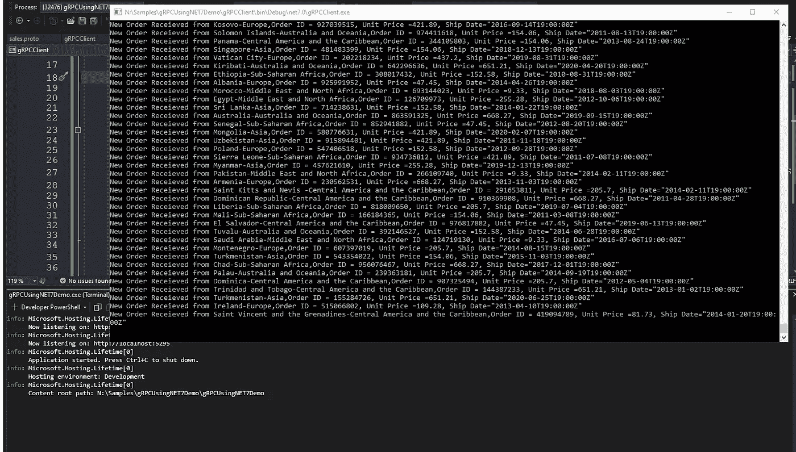

Image by Author

**结论:**

本文的目的是提供关于 gRPC 中添加的性能增强的信息。NET 7 框架，包括 gRPC JSON 代码转换特性、OpenAPI 规范和服务器反射特性，以及新的性能改进。本文还解释了如何使用 gRPC 服务器流来创建高性能服务，能够立即处理和交付数百万条记录。

源代码可以从[这个资源库下载。](https://github.com/csehammad/gRPCDemoUsingNET7)