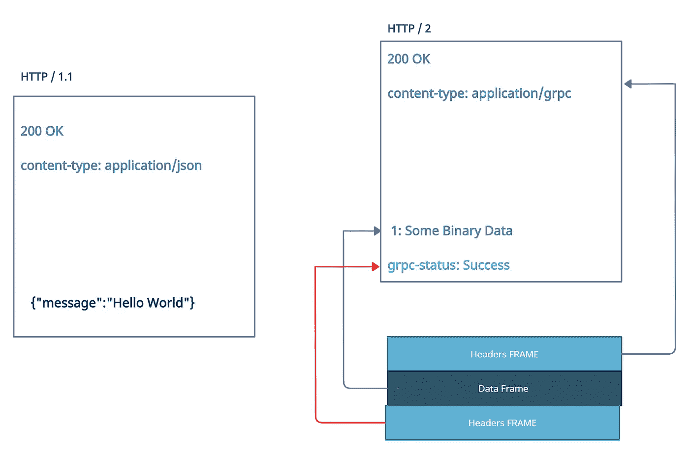
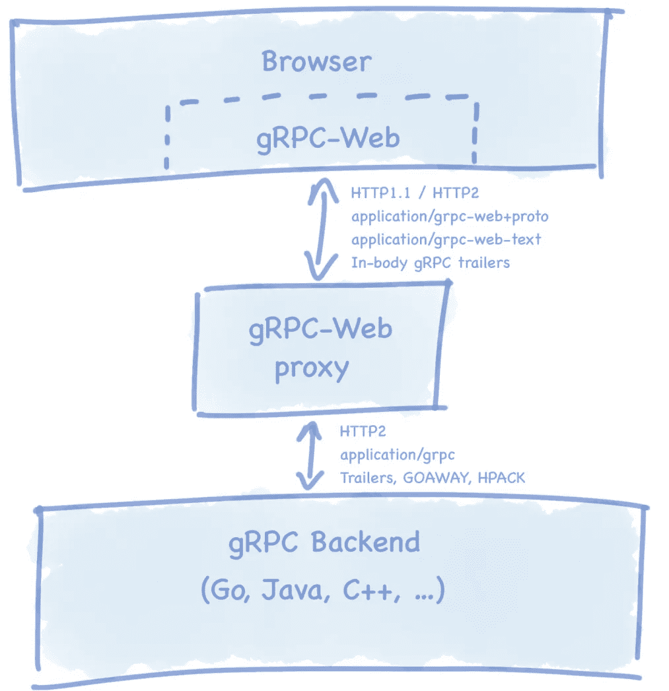
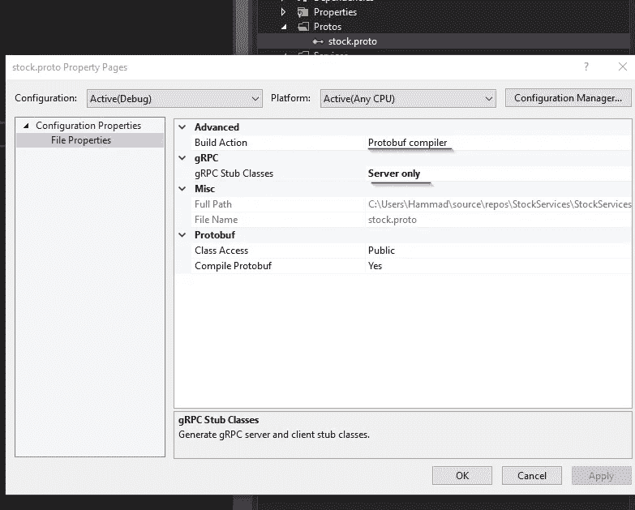
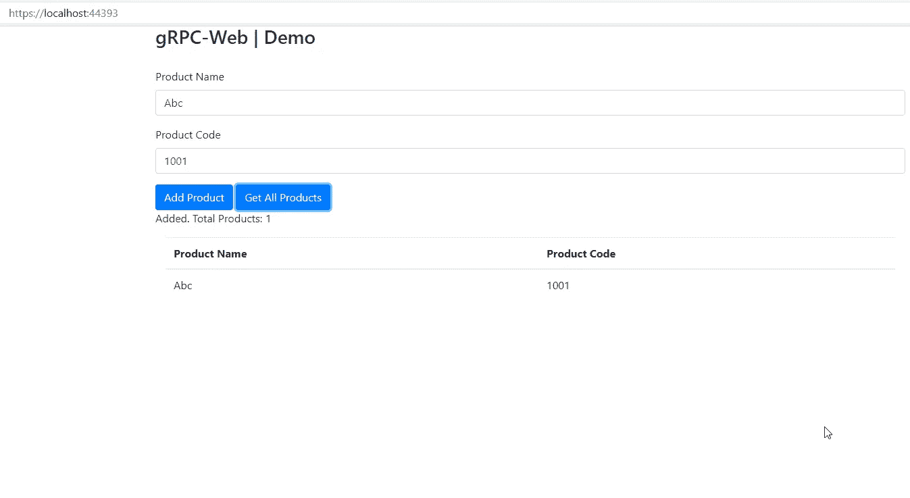
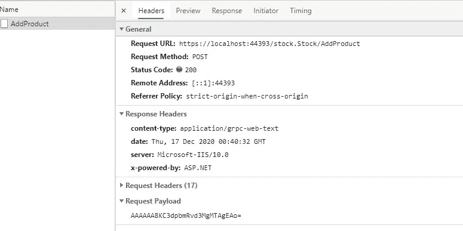
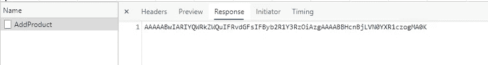
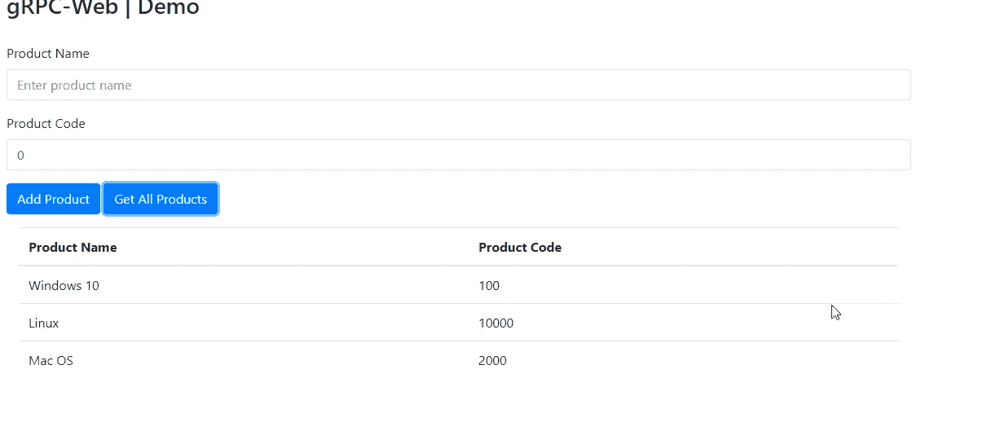

# 在带有 gRPC-Web 和. NET5 的浏览器中使用 gRPC

> 原文：<https://medium.com/geekculture/build-high-performance-services-with-grpc-and-net-5-part-2-92c4561b8ac2?source=collection_archive---------0----------------------->

## 微服务架构

## 使用 gRPC 和构建高性能服务。网络 5


© All rights reserved

在本文中，我们将探索微软的 gRPC-Web，以及如何使用它来创建可从浏览器调用的真实 gRPC 服务。

(注意:如果你是 gRPC 的新手，那么你应该先看看[这篇文章](/swlh/build-high-performance-services-with-grpc-and-net-5-7605ffe9b2a2)。这将引导您使用创建第一个 gRPC 服务器和客户机。净 5)。

## 1 —问题

在上一篇文章中，我们已经看到，与 REST 不同，gRPC 服务不能从浏览器中调用(因为根本没有浏览器 API 对请求提供足够的控制)。

gRPC 项目模板被配置为在从浏览器访问时显示以下警告:

> 与 gRPC 端点的通信必须通过 gRPC 客户端进行。要了解如何创建客户端，请访问:https://go . Microsoft . com/fwlink/？linkid=2086909

这是因为 gRPC 依赖于浏览器 API 不支持的 HTTP/2 尾部响应头(也称为尾部)。

因此，让我们通过对 HTTP/2 的高级概述来理解那些尾随的响应头。



© HTTP 1.1 and HTTP/2 High-Level Structure

从上图中可以看出，HTTP/2 有一个成帧机制，它是 HTTP/1.1 和底层传输协议之间的中间层。

HTTP/ 2 消息被分成帧，然后嵌入到流中。分离数据和报头帧为进一步优化(报头压缩和复用)打开了大门。

使用 HTTP/2，服务器可以针对一个请求发送多个响应，因此默认的 HTTP 状态 200/OK 是不够的。

为了解决这一问题，使用尾随标头来获取关于传入响应的元数据。gRPC-状态；例如，如果成功接收到流中的消息，可以通知客户端。

## 2 —解决方案

这就是 gRPC Web 的用武之地——它位于浏览器和 gRPC 服务器之间，充当与 HTTP 1.1 和 HTTP 2 都兼容的代理。



Source: [https://grpc.io/](https://grpc.io/)

这项技术并不新鲜，它基于 [grpc-web](https://github.com/grpc/grpc/blob/master/doc/PROTOCOL-WEB.md) Javascript 客户端。微软在今年早些时候发布了一个实验版本，后来又发布了一个正式版本，该版本已经可以投入生产，并且完全支持 grpc-dot net 项目。

[](https://github.com/grpc/grpc-web) [## grpc/grpc-web

### 用于 Web 客户端的 gRPC。在 GitHub 上创建一个帐户，为 grpc/grpc-web 开发做贡献。

github.com](https://github.com/grpc/grpc-web) 

## 3—gRPC-Web for 入门。网

**步骤 1:配置您的 gRPC 服务项目**

使用“gRPC 服务”项目模板添加新的 gRPC ASP.NET 核心服务。

我们不使用默认的 greet.proto，而是添加另一个 proto-buf 文件(stock.proto ),如下所示:

这个原型文件包含一个股票服务，它有两个方法

1.  AddProduct —它使用一元调用添加产品。
2.  GetAllProducts —它返回产品流。要启用流，我们需要添加流前缀。

然后，我们为产品和结果定制消息。

提示:当您在解决方案中添加任何 protobuf 文件时。确保将“构建操作”设置为“protobuf 编译器”,如下所示:



Set build action to Protobuf compiler

3.添加一个新类— [StockService。服务文件夹中的 cs](https://gist.github.com/csehammad/14ed7590d3943304176d0e2ccbbfea72) 。

然后，您可以从{service-name}继承您的类。{服务名称}。基础

```
using StockServices.Protos;public class StockService  : Stock.StockBase{
}
```

提示:grpc 代码生成将增加。原型命名空间自动，所以你需要添加它的引用，例如—{你的名字空间}。普罗托斯

在我们的 StockService 类中定义一个静态产品商店。这将包含客户端将添加的所有产品对象。

```
private static List<Product> _allProducts = new List<Product>();
```

通过键入 Override 来覆盖存根类方法。您将看到原型文件中定义的所有方法。

```
public override Task<Result> AddProduct(Product request, ServerCallContext context){}
```

我们将向该方法添加以下功能，以便它将产品添加到内存中的产品存储中。

```
if (string.IsNullOrEmpty(request.Name))return Task.FromResult<Result>(new Result { Msg = "Product Name Can't be nulled", Status = false });if (_allProducts.FirstOrDefault(f => f.Code == request.Code) != null)return Task.FromResult<Result>(new Result { Msg = "Product is already Added", Status = false });_allProducts.Add(request);return Task.FromResult<Result>(new Result { Msg = "Added. Total Products: "+_allProducts.Count.ToString(), Status = true });}
```

让我们也实现我们的流方法，该方法将简单地将我们的产品商店中添加的所有产品流式传输到客户端。

```
public override async Task GetAllProducts(Empty request, IServerStreamWriter<Product> responseStream, ServerCallContext context){foreach (var each in _allProducts){
await responseStream.WriteAsync(each);
} }
```

现在，为了使这个服务可以从浏览器调用，我们必须执行以下步骤:

1.  安装 [Grpc。AspNetCore 包](https://www.nuget.org/packages/Grpc.AspNetCore.Web)

2.在 Startup.cs 的 configure 方法中添加以下行

```
app.**UseGrpcWeb**();app.UseEndpoints(endpoints =>{endpoints.MapGrpcService<StockService>().**EnableGrpcWeb**();});
```

这个中间件将处理所有关于 grpc-web 调用的事情，我们的 grpc 服务不需要知道任何关于 grpc-web 的事情。

就是这样，现在可以从浏览器中调用 gRPC 服务了。

**步骤 2:使用(Blazor、SPA 或 Javascript)创建您的 Web 客户端**

让我们添加一些 HTML 和 Javascript 客户端代码来与该服务进行交互。

这个 HTML 文件接受两个输入(产品名称和代码),并在我们的 gRPC 服务中调用 AddProduct 和 getAllProducts 方法。



我们现在可以在 wwwroot 中添加“脚本”文件夹来保存我们的脚本文件，例如 index.js

您可以注意到它需要“stock_pb”和“stock_grpc_web_pb”文件。这些是 gRPC-Web JavaScript 客户端和使用 gRPC-Web [代码生成器插件](https://github.com/grpc/grpc-web#code-generator-plugin)的“协议”生成的消息。

您可以使用 Powershell 中的以下命令在您的脚本文件夹中生成这些文件。

```
protoc greet.proto --js_out=import_style=commonjs:CHANGE_TO_SCRIPTS_DIRECTORY --grpc-web_out=import_style=commonjs,mode=grpcwebtext:CHANGE_TO_SCRIPTS_DIRECTORY --plugin=protoc-gen-grpc-web=CHANGE_TO_PROTOC_GEN_GRPC_WEB_EXE_PATH
```

**注**:确保“协议”和“协议-gen-grpc-web”应该在您的计算机上，并且可以从您的路径中被发现。

让我们分析一下我们的 javascript 代码:

1.  这将创建我们的 gRPC 客户端——我们将使用这个对象来调用服务方法。

```
var client = new StockClient(window.location.origin);
```

消息可以初始化如下:

```
var request = new Product(); 
request.setName(txtName.value); 
request.setCode(txtCode.value);
```

最后，我们可以调用 gRPC 服务

```
client.addProduct(request, {}, (err, response) => { resultText.innerHTML = htmlEscape(response.getMsg()); 
});
```

下面是我们的 package.json 文件，当我们使用 webpack 来

©

注意:这个例子需要 node.js 和 webpack，所以您需要更新[构建目标。](https://gist.github.com/csehammad/4d669fecbd7b14c46706d0936e25b327)

让我们构建并运行这个项目。

尝试添加新产品—您将看到内容类型为“application/grpc-web-text”的 gRPC 呼叫:



©

与纯文本 JSON 不同，响应是 base64 编码的(包含二进制字节)。



©

## 服务器流

我们的演示应用程序使用“添加产品”功能的一元调用和“获取所有产品”的流调用。您可以尝试添加一些产品，然后单击“获取所有产品”。这将导致加载所有已添加的产品。



这是通过使用**服务器流**来完成的——客户端发送一个 gRPC 调用并获得一个流来读回一系列消息。

```
 var request = new Empty(); 
streamingCall = client.getAllProducts(request, {}); streamingCall.on(‘data’, function (response) 
{ trProducts.innerHTML += “<tr><td>” + htmlEscape(response.getName()) + “</td><td>” + htmlEscape(response.getCode())+”</td></tr>”; });
```

如果您想知道数据流何时结束，您可以订阅此功能:

```
streamingCall.on('end', function () { 
       console.log("Stream ended");   
  });
```

## 结论

我希望这篇文章能让您很好地了解如何使用 gRPC-Web 与 gRPC 服务进行通信。在性能至关重要并且需要利用多路复用或服务器流的情况下，您可以选择 gRPC-Web 而不是 REST/JSON。

你可以从[这个 Github repo](https://github.com/csehammad/grpcWeb-StockDemo) 下载完整的解决方案。