# 使用 gRPC 和构建高性能微服务。网络 6

> 原文：<https://medium.com/geekculture/build-high-performant-microservices-using-grpc-and-net-6-adde158c5ac?source=collection_archive---------0----------------------->

## 了解如何利用服务器流轻松交付 500 万条记录


Photo by [Fotis Fotopoulos](https://unsplash.com/@ffstop?utm_source=unsplash&utm_medium=referral&utm_content=creditCopyText) on [Unsplash](https://unsplash.com/?utm_source=unsplash&utm_medium=referral&utm_content=creditCopyText)

微软已经推出了最快的产品。网上发布了-。NET 6 的长期稳定版本。NET 核心和许多新的 API、性能和语言改进。在本文中，我们将了解。用于 gRPC 服务的. NET 6(极快的性能和序列化、更好的容错、客户端负载平衡和 HTTP/3 支持)。

我们还将了解如何利用这些特性，使用 gRPC 和构建高性能微服务。NET 6。我们还将创建一个真实的 gRPC 服务，利用服务器流来处理和交付**500 万条记录。**

**注意**:如果你是 gRPC 服务的新手。NET，建议先浏览一下[这篇文章](/swlh/build-high-performance-services-with-grpc-and-net-5-7605ffe9b2a2)，它解释了一些基本概念，也解释了 gRPC 与 WCF 和 REST 等其他技术的比较。

## 简要回顾:

*   gRPC 是由 CNCF 运行的一个流行的开源 RPC 框架。
*   这是一个契约优先的独立于语言的平台——简单地说，这意味着客户机和服务器必须就传递消息的内容和方式达成一致。契约在. proto 文件中定义，该文件通过. NET6 提供的工具派生代码生成过程。
*   它是跨平台的，所以客户机和服务器可以使用不同的技术栈。
*   它使用 HTTP/2 并发送 Protobuf(一种高性能的消息序列化技术)。与以人类可读的文本格式存储数据的 JSON 不同，Protobuf 使用二进制交换格式，不是人类可读的，因此需要工具来创建强类型的客户端和基类。幸运的是。NET，就像引用任何 NuGet 包一样简单。
*   HTTP/2 支持多路复用，即在一个连接上同时发送多个请求。
*   它还支持流式传输，即服务器可以向客户端发送多个响应，反之亦然。
*   双向流—客户端和服务器都来回发送多条消息。

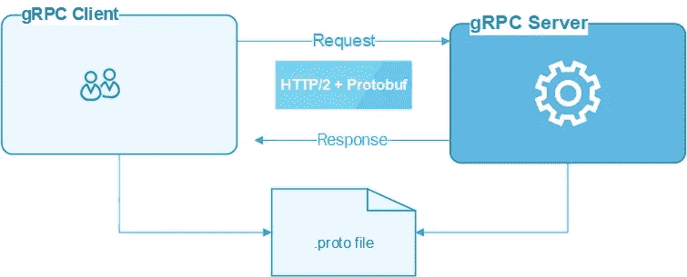

gRPC High-Level Overview (Image by Author)

## 创建您的第一个 gRPC 服务。网络 6

不再赘述，让我们创建第一个 gRPC 服务。NET 6。

**先决条件:**

*   [Visual Studio 2022](https://visualstudio.microsoft.com/vs/)
*   [。NET 6 SDK](https://dotnet.microsoft.com/en-us/download/dotnet/6.0) 。

1.  创建一个新项目并选择“ASP。网络核心 gRPC 服务模板

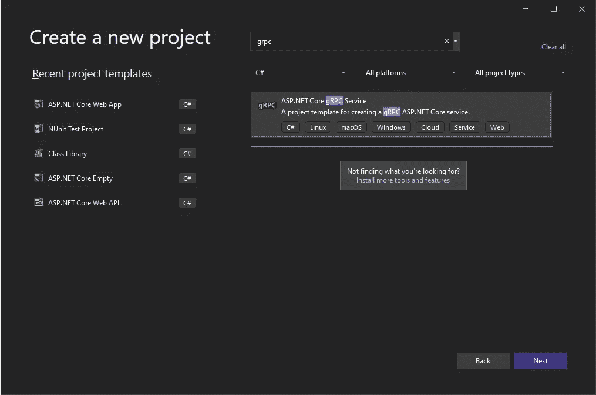

gRPC Project Template ( Image by Author)

确保。NET 6.0 被选为目标框架

*   如果想在容器中运行这个服务，可以启用 Docker 支持。

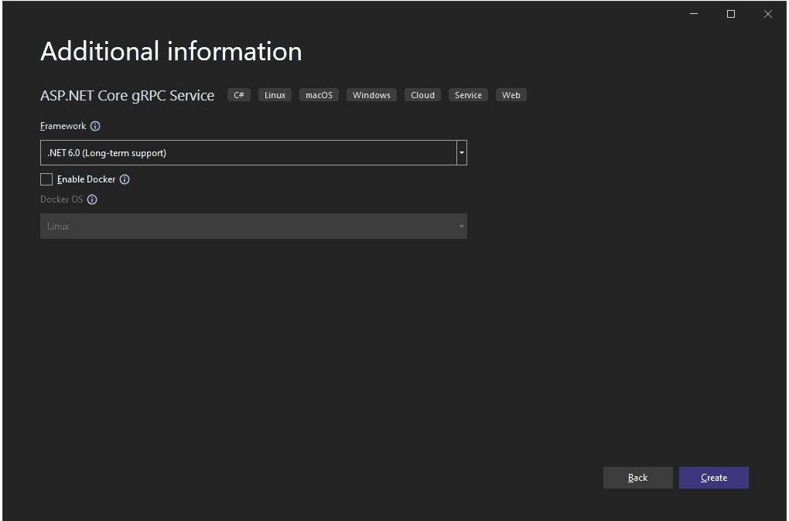

单击 create 将创建带有默认欢迎服务的项目，如下所示。

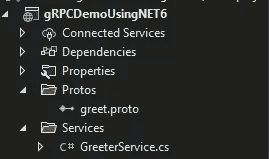

让我们分析一下 greet.proto 文件

```
syntax = “proto3”;option csharp_namespace = “myGRPCService”;package greet;// The greeting service definition.service Greeter {// Sends a greetingrpc SayHello (HelloRequest) returns (HelloReply);}// The request message containing the user’s name.message HelloRequest {string name = 1;}// The response message containing the greetings.message HelloReply {string message = 1;}
```

这是一个语言中立的契约，它简单地定义了服务的外观和它所消费的消息。

让我们看看 GreeterService.cs，它是这个契约的实现(。原型文件)

```
public class GreeterService : Greeter.GreeterBase{private readonly ILogger<GreeterService> _logger;public GreeterService(ILogger<GreeterService> logger){_logger = logger;}public override Task<HelloReply> SayHello(HelloRequest request, ServerCallContext context){return Task.FromResult(new HelloReply{Message = “Hello “ + request.Name});}}
```

这个服务只是实现 SayHello 动作，并将 HelloReply 消息返回给客户端。您可能会注意到，GreeterBase、HelloReply、HelloRequest 类型尚未定义。如果您检查一下 GreeterBase 类型的定义，您会发现这些类型是由. NET6 工具自动生成的。

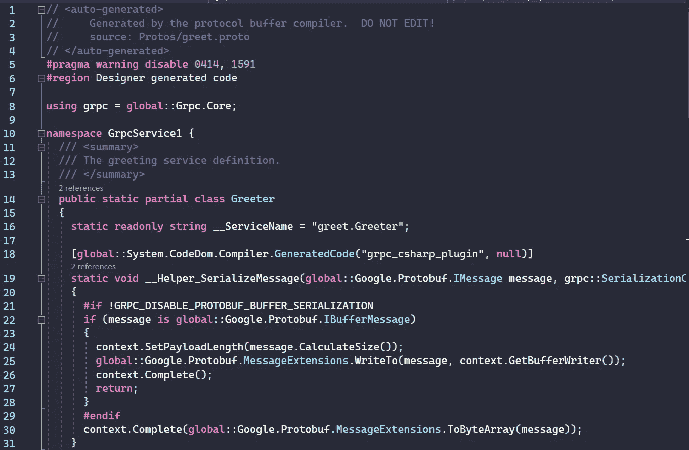

Auto-Generated Types ( Image by Author)

## 代码生成是如何工作的？

如果编辑。您会注意到引用 **greet.proto** 的 protobuf 元素和一个指示服务器代码生成的属性。

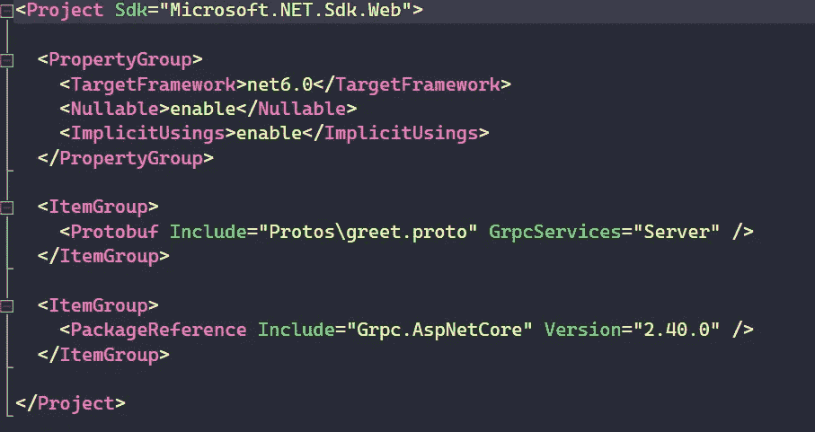

要运行该服务，只需打开命令提示符并键入“dotnet run”

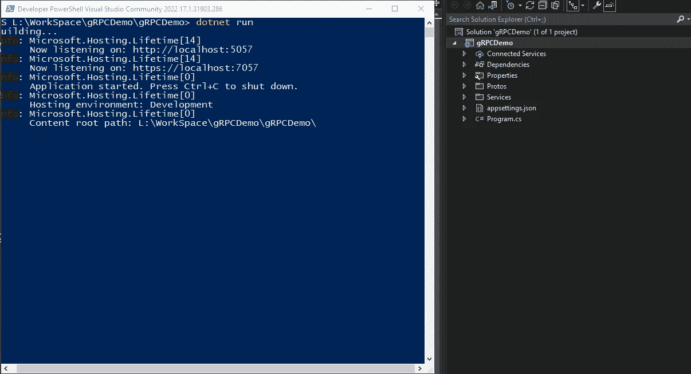

您可以注意到该服务运行在 [https://localhost:7057 上。](https://localhost:7057.)现在，与 REST APIs 不同，我们不能在浏览器上测试这一点，需要创建一个客户端。

创建一个新的控制台应用程序来使用服务。右键单击依赖项，然后选择“管理连接的服务”

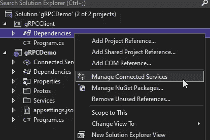

现在，我们将添加一个服务引用—选择 gRPC。

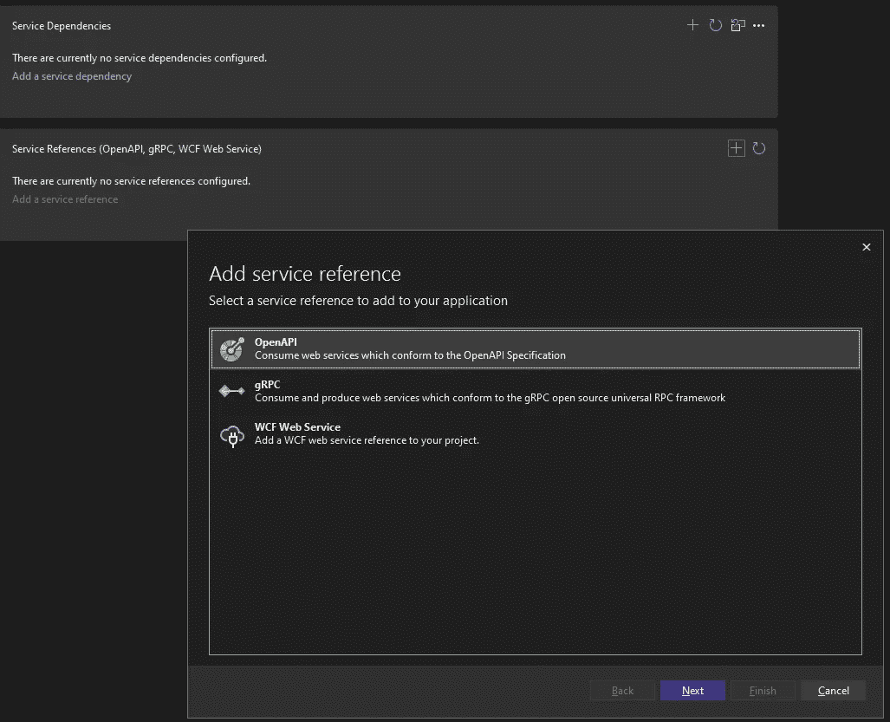

找到您的原型文件并选择“客户机”类型，它将生成使用 gRPC 服务所需的代码。

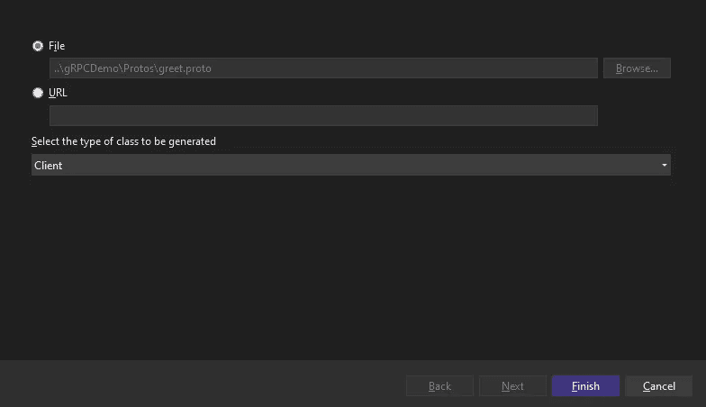

确保验证 greet.proto 文件的属性，以生成“仅客户端”存根类。

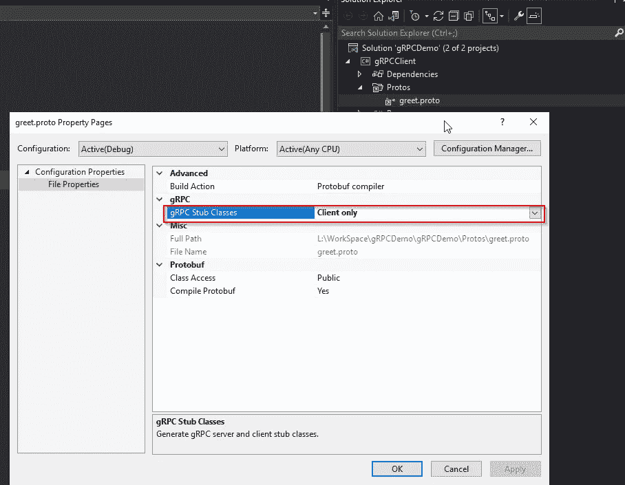

现在打开 program.cs 并添加下面几行来调用您的 gRPC 服务

```
var channel = GrpcChannel.ForAddress(“https://localhost:7057");var client = new Greeter.GreeterClient(channel);var reply = await client.SayHelloAsync( new gRPCDemo.HelloRequest { Name = “gRPC Demo” });Console.WriteLine(“from server: “ + reply);
```

上面的代码简单地创建了一个新的 gRPC 通道，该通道被传递给一个 greeter 客户机，然后该客户机调用 SayHello 方法。

运行项目以查看服务的响应。

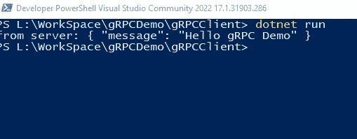

现在，我们已经在中创建了第一个 gRPC 服务。NET 6，让我们来探索一下。NET 6。

## gRPC 的新功能。网络 6

1.  **性能提升:**

*   在 NET 6 中，protobuf 的 ASCII 字符串序列化使用 [SIMD](https://en.wikipedia.org/wiki/SIMD#:~:text=Single%20instruction%2C%20multiple%20data%20(SIMD,parallel%20processing%20in%20Flynn's%20taxonomy.&text=SIMD%20describes%20computers%20with%20multiple,on%20multiple%20data%20points%20simultaneously.) —单指令多数据，使用高性能 CPU 指令并行处理字符，整体性能提升 20%。
*   gRPC 使用字节字符串发送和接收原始字节。新的。NET 6 引入了**零拷贝字节流 API** ，避免了创建拷贝/分配内部数组的需要。如果您正在发送和接收大型消息，这对于避免不必要的分配非常有用。

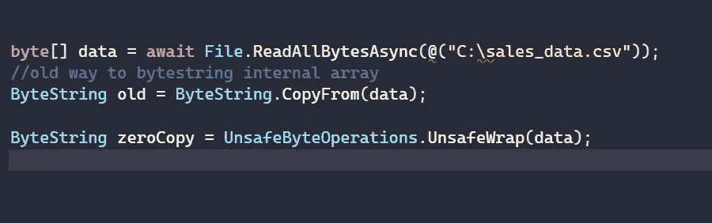

Image by Author

*   英寸 NET 5 HTTP/2 库在有延迟时使用固定的缓冲区大小来限制下载速度。此问题已在中解决。NET 6 通过更新 HTTP/2 库来使用动态缓冲区大小 T1，这使得下载性能提高了 118%。

**2。瞬时故障处理**

现在，您可以捕捉 RPC 异常，检测瞬时故障(如网络连接丢失或超时)，并使用内置逻辑进行自动重试，现在可以在通道上进行配置。

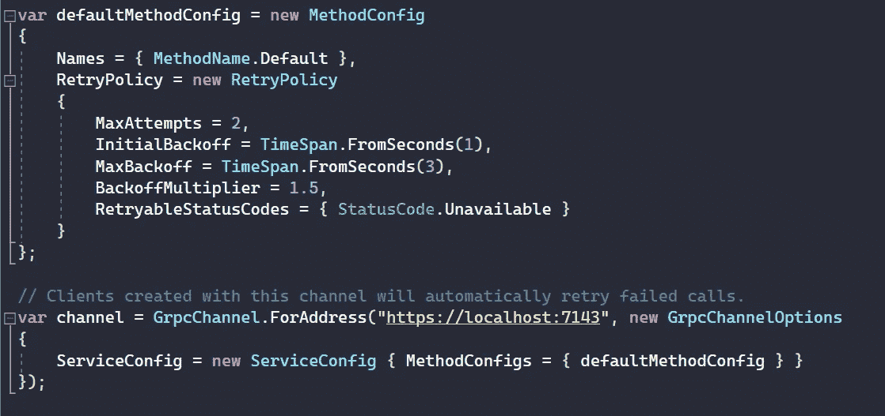

提示:如果你想了解更多关于 gRPC 重试瞬时故障处理的信息，请点击[链接](https://docs.microsoft.com/en-us/aspnet/core/grpc/retries?view=aspnetcore-6.0)。

**3。客户端负载平衡**

通过客户端负载平衡，您可以让 gRPC 客户端在您的服务器之间以最佳方式分配负载。它消除了对负载平衡代理的需求。我们可以在创建新通道的同时配置客户端负载平衡。它由两部分组成:

*   服务发现:它充当解析器并进行 DNS 查询以获取 gRPC 所在服务器的 IP。
*   负载平衡器，它创建一个连接，并使用各种配置(如 PickFirst 和 RoundRobin 逻辑)来选择地址。

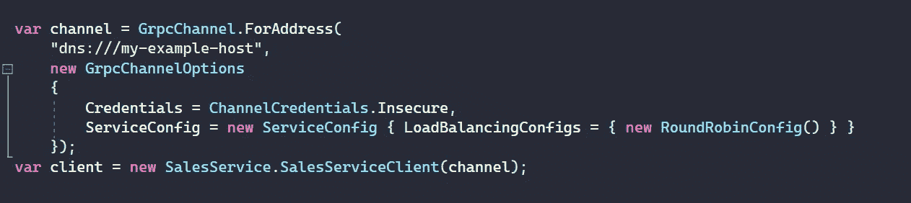

Client-Side Load Balancing (Image by Author)

如果任何一个端点出现故障，负载平衡器将自动切换到其他健康的端点。

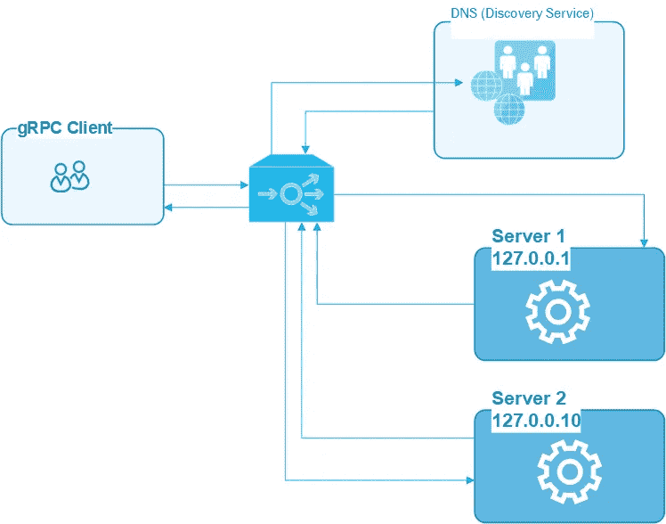

gRPC — Client Side Load Balancing ( Image by Author)

**3。HTTP/3 支持**

。NET 6 是第一个支持端到端 HTTP/3 的 gRPC 实现。

HTTP/2 支持多个流，并使用帧来支持在同一连接上同时处理多个请求，然而，世界已经变得越来越移动，使用 Wi-Fi 和蜂窝连接有时可能不可靠，在这些情况下，TCP 数据包将丢失，所有流都将被阻塞— [线路阻塞](https://http3-explained.haxx.se/en/why-quic/why-tcphol)问题。HTTP/3 通过使用一种称为 QUIC 的新连接协议解决了这一问题，该协议使用 UDP 并内置 TLS，因此建立连接更快，并且独立于 IP 地址，因此移动客户端可以在 wifi 和蜂窝网络之间切换，保持相同的逻辑连接。

。NET 6 支持 QUIC 并有一个它的开源实现— [MSQUIC](https://github.com/microsoft/msquic) 并提供以下好处:

*   第一个请求的响应时间更快
*   改善了连接数据包丢失时的体验
*   支持网络间的转换

注意:HTTP/3 的 [RFC 还没有最终确定，可能会改变，所以它是 NET6 中的一个预览特性。](https://datatracker.ietf.org/doc/html/draft-ietf-quic-http-34)

**在下一部分，我们将了解如何利用 gRPC 服务器流来构建高性能微服务，向客户端交付 500 万条记录。**

如果我们回到我们的欢迎服务，您会注意到它正在使用**一元调用**——它从客户端发送请求消息开始，当服务完成处理时，会返回一个响应消息。

```
service Greeter {rpc SayHello (HelloRequest) returns (HelloReply);}
```

## gRPC 服务器流

服务器流使 gRPC 客户机能够向服务发送请求，并获得响应流。客户端从返回的流中读取，直到不再有消息。gRPC 负责保证消息的排序。

在我们的例子中，我们将使用这个 196MB 的[样本 CSV 文件](https://eforexcel.com/wp/wp-content/uploads/2020/09/5m-Sales-Records.zip)，其中包含 500 万条销售记录。现在，在一个电话中传递这些记录是没有效率的。此外，传统的 rest 风格的分页需要多个客户端请求——从客户端到服务器的来回通信。

gRPC 服务器流有效地解决了这个问题。

*   客户端将简单地调用服务方法。
*   我们的 gRPC 服务将使用 StreamReader 逐行读取 CSV 文件，将行转换为 gRPC 理解的模型，然后将记录发送回客户端——一次一行。
*   客户端将接收到响应流。

让我们从定义一个原型文件开始，用下面的字段来传递消息。


Sample Sales Data (CSV) Fields

**Protos- > sales.proto**

```
syntax = “proto3”;import “google/protobuf/timestamp.proto”;option csharp_namespace = “gRPCDemoUsingNET6.Protos”;package sales;service SalesService {rpc GetSalesData(Request) returns (stream SalesDataModel) {}}message Request{string filters=1;}message SalesDataModel {int32 OrderID = 1;string Region = 2;string Country = 3;string ItemType=4;google.protobuf.Timestamp OrderDate=5;google.protobuf.Timestamp ShipDate=6;int32 UnitsSold=7;float UnitCost=8;float UnitPrice=9;int32 TotalRevenue=10;int32 TotalCost=11;int32 TotalProfit=12;}
```

stream 关键字指示 SalesDataModel 将作为流传递

```
rpc GetSalesData(Request) returns (stream SalesDataModel) {}
```

让我们添加一个新的服务— SalesaDataService.cs，如下所示

```
public class SalesDataService : Protos.SalesService.SalesServiceBase{public override async TaskGetSalesData(Protos.Request request,IServerStreamWriter<Protos.SalesDataModel> responseStream, ServerCallContext context){using (var reader = new StreamReader(Path.Combine(AppDomain.CurrentDomain.BaseDirectory, “Data”, “sales_records.csv”))){string line; bool isFirstLine = true;while ((line = reader.ReadLine()) != null){var pieces = line.Split(‘,’);var _model = new Protos.SalesDataModel();try{if (isFirstLine){isFirstLine = false;continue;}_model.Region = pieces[0];_model.Country = pieces[1];_model.OrderID = int.TryParse(pieces[6], out int _orderID) ? _orderID : 0;_model.UnitPrice = float.TryParse(pieces[9], out float _unitPrice) ? _unitPrice : 0;_model.ShipDate = Google.Protobuf.WellKnownTypes.Timestamp.FromDateTime((DateTime.TryParse(pieces[7], out DateTime _dateShip) ? _dateShip : DateTime.MinValue).ToUniversalTime());_model.UnitsSold = int.TryParse(pieces[8], out int _unitsSold) ? _unitsSold : 0;_model.UnitCost = float.TryParse(pieces[10], out float _unitCost) ? _unitCost : 0;_model.TotalRevenue = int.TryParse(pieces[11], out int _totalRevenue) ? _totalRevenue : 0;_model.TotalCost = int.TryParse(pieces[13], out int _totalCost) ? _totalCost : 0;await responseStream.WriteAsync(_model);}catch (Exception ex){throw new RpcException(new Status(StatusCode.Internal, ex.ToString()));}}}}}
```

让我们分解一下，以便更好地理解它。

```
public class SalesDataService : Protos.SalesService.SalesServiceBase
```

该类实现由. NET6 工具使用原型文件配置自动生成的 SalesServiceBase。

```
public override async TaskGetSalesData(Protos.Request request,IServerStreamWriter<Protos.SalesDataModel> responseStream, ServerCallContext context){} 
```

然后，我们重写方法*getsaledata*以从文件中读取数据，并通过简单地将我们的数据模型写入 *responseStream* 对象来将其作为流返回，如下所示:

```
await responseStream.WriteAsync(_model);
```

现在让我们运行服务来看看它的运行情况。

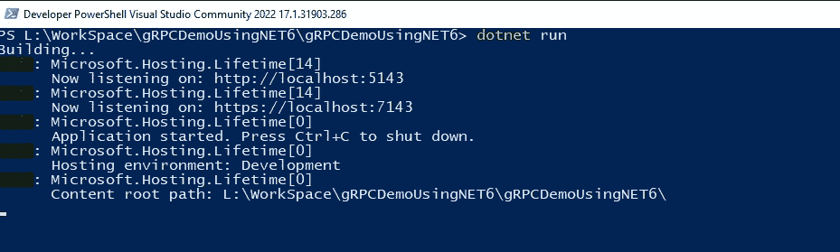

gRPC Service ( Image by Author )

该服务已经启动并运行，因此我们可以创建我们的客户端。

创建一个新的控制台项目，使用 protobuf 添加 gRPC 服务引用(如前所述)

这是我们的客户端实现的样子

```
//Create a channel for your gRPC Service
var channel = GrpcChannel.ForAddress("https://localhost:7143");//Create SalesService Client to open a connection
var client = new SalesService.SalesServiceClient(channel);//Invoke the method using var call = client.GetSalesData(new Request { Filters = "" });int Count = 0;//Get response stream
await foreach (var each in call.ResponseStream.ReadAllAsync()){Console.WriteLine(String.Format("New Order Receieved from {0}-{1},Order ID = {2}, Unit Price ={3}, Ship Date={4}", each.Country, each.Region, each.OrderID, each.UnitPrice,each.ShipDate));Count++;}
Console.WriteLine("Stream ended: Total Records: "+Count.ToString());Console.Read();
```

让我们运行客户端，您可以看到来自 gRPC 服务的传入消息流。


gRPC Client Output — 5 million records ( Image by Author )

从 gRPC 服务加载全部 500 万条销售记录几乎需要 2 分钟。但是，在某些情况下，您可能希望指定呼叫应该运行多长时间。为此，您需要配置**截止日期**。

```
using var call = client.GetSalesData(new Request { Filters = “” }, deadline: DateTime.UtcNow.AddSeconds(5));
```

因此，当这个时间超过时，客户端将停止处理流，并抛出一个异常，可以按如下方式处理:

```
catch (RpcException ex) when (ex.StatusCode == StatusCode.DeadlineExceeded){Console.WriteLine(“Service timeout.”);}
```

下面的例子使用了 5 秒的上限，所以它只处理了 77829 条记录。

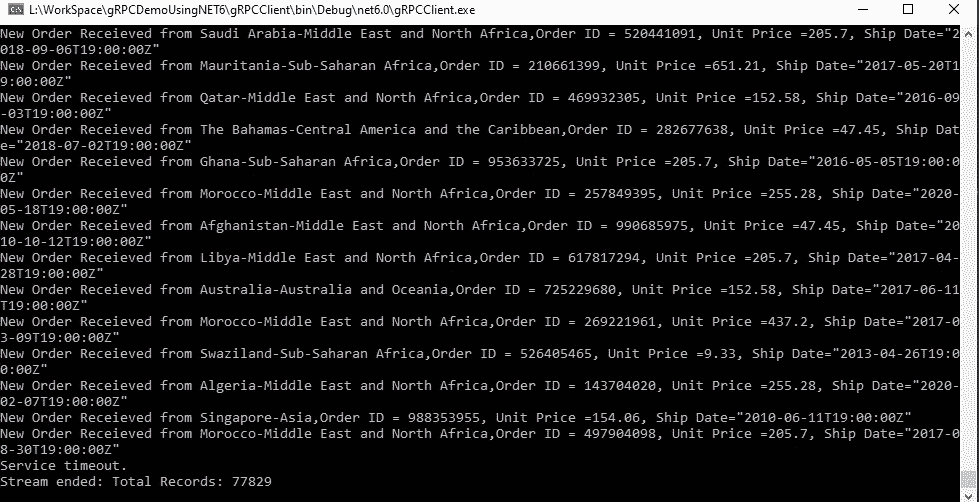

gRPC Client Output — with Deadline ( Image by Author )

## **结论**

在本文中，我们了解了 gRPC 新的性能增强。NET 6，如客户端负载平衡、瞬时故障处理和 HTTP/3。它还解释了如何利用 gRPC 服务器流来构建能够处理和交付数百万条记录的高性能微服务。

你可以从[这个回购](https://github.com/csehammad/gRPCDemoUsingNET6)下载源代码。