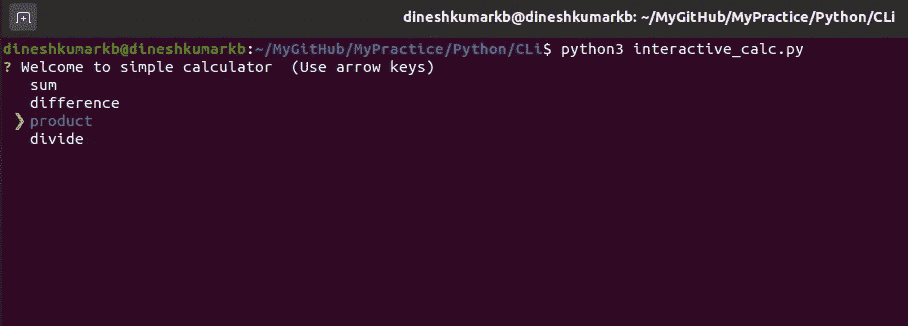
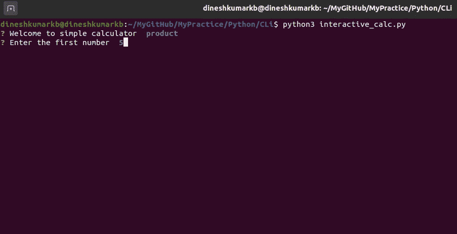
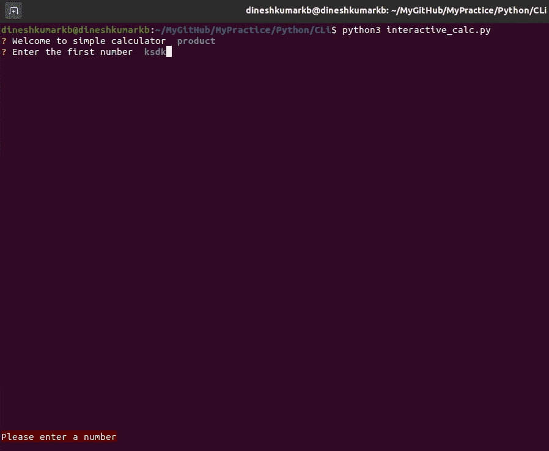

# 用 Python 构建交互式 CLI 工具

> 原文：<https://medium.com/geekculture/build-interactive-cli-tools-in-python-47303c50d75?source=collection_archive---------0----------------------->

## 厌倦了传统的气候？用 PyInquirer 开发交互式命令行


Photo by [Sigmund](https://unsplash.com/@sigmund?utm_source=medium&utm_medium=referral) on [Unsplash](https://unsplash.com?utm_source=medium&utm_medium=referral)

**注:对于非会员，本文也可在**[**https://dineshkumarkb . com/tech/how-to-build-interactive-command-line-tools-in-python/**](https://dineshkumarkb.com/tech/how-to-build-interactive-command-line-tools-in-python/)获得

## 简介:

命令行界面是完成任务的快速有效的工具。不仅如此，为您开发的任何 web 应用程序提供命令行界面也很酷，这样可以避免最终用户迷失在庞大的 UI 站点地图中。

这就是为什么尽管 aws 有一个功能丰富的控制台，但它有一个由`botocore`模块支持的惊人的 cli，不是吗？

## 动机:

1.  你厌倦了传统的命令行界面吗？
2.  您是否厌倦了在 cli 中记录每个功能的命令？

如果是，那么你一定要进一步阅读。

我们可以使用`PyInquirer`和其他库在 python 中构建交互式和沉浸式命令行界面。

对于我的例子，我选择了`click`和`PyInquirer`。

## 点击的快速介绍:

编写 Click 是为了支持 python 中的 Flask web 框架。Flask 的命令行使用点击来执行操作。

您曾经尝试过从命令行向 flask 中的数据库添加值吗？嗯，那你用过 click。

## **为什么不是 argparse？**

我们完全可以用 argparse 编写一个简单的计算器 cli。在我看来，随着 cli 应用程序的增长，维护用 argparse 编写的代码变得越来越复杂。而使用 click，代码看起来更加模块化和可伸缩。所以我选择点击这里。

你可以自由选择任何你喜欢的 cli 框架，甚至可以只使用`PyInquirer`来解决。

## 安装点击

```
pip install click
```

现在我们已经完成了安装，让我们使用 click 编写一个简单的计算器 cli。

这是编写简单计算器 cli 的一种方式。让我们为这个 cli 执行 help 命令。

```
Output:python simplecalc.py --help
Usage: simplecalc.py [OPTIONS] COMMAND [ARGS]...Options:
  --help  Show this message and exit.Commands:
  add
  div
  mul
  sub
```

help 命令的输出如下所示。我们将执行一个添加操作。

```
Output:python simplecalc.py add
Enter the first number: 2
Enter the second number: 2
The added value 4
```

这相当不错。这样，用户必须记住命令或查看帮助来获得可用的 cli 选项。当您有多个包含嵌套子命令的命令时，这将变得更加混乱。用户可能会发现很难记住每个命令及其对应的子命令。此外，最后但同样重要的是，我们作为开发人员可能必须相应地编写一个全面的帮助命令。

另一种方法是使用`PyInquirer`的交互式 cli。让我们安装 PyInquirer。

```
pip install PyInquirer
```

## 介绍 PyInquirer:

PyInquirer 努力成为一个易于嵌入的漂亮的 Python 命令行界面。PyInquirer 的工作基于可以提示给用户的问题，而不是由用户提供 cli 命令。它帮助我们编写身临其境的命令行工具。

PyInquirer 让

*   您定义一个问题列表，并交给 prompt
*   prompt 返回答案列表

它支持以下问题类型

*   **列表**
*   **原始列表**
*   **展开**
*   **确认**
*   **复选框**
*   **输入**
*   **密码**
*   **编辑**

此处提供了所有这些问题类型的示例[。我相信大多数问题类型都是不言自明的。](https://github.com/CITGuru/PyInquirer/)

现在，让我们使用 PyInquirer 重写简单的计算器程序。

## 使用 PyInquirer 的简单计算器:

Interactive Simple Calculator

## 了解 PyInquirer:

问题的`type`定义了用户得到什么样的提示。如果类型被定义为一个列表，我们得到一个选项列表，而当它是一个输入时，我们提示用户得到输入，等等。

在上面的代码片段中，问题是一个包含类型、名称、消息、验证、过滤和其他一些问题属性的字典列表。让我们看看所使用的属性。

**类型** —定义问题的类型。可以是输入、问题列表、密码提示等。我们在这里使用了一个列表来为用户提供一个计算器选项列表，而不是让用户为我们提供命令。很酷不是吗？这是吸引我的第一件事。



Type-list

这也提供了视觉提示来通知用户正在选择什么选项。

**注意:请注意，外观可能会因平台而异。我用的是 ubuntu 系统。**

**name** — Name 是存储用户选择的选项的变量。例如，如果用户在上面的列表中选择了`product`，`user_option`变量将具有值`product`。

**输入** —输入类似于提示用户输入值的常规 python 输入。



Type-Input

**消息** —消息是显示给用户的消息。

**validate** — Validate 通常调用一个`Validator`类来检查用户的输入。例如，我们在这里期待一个`int`值。

如果用户提供了一个`string`或者一个`None`值呢？我们不应该验证用户的输入吗？这正是验证的用途。您可以在这里拥有您的验证逻辑。



InputValidation

**过滤器** —默认情况下，在输入中输入的任何用户值都属于`str`类型。如果我们需要将它们转换成`int`或任何其他类型，我们可以利用`filter`函数来完成。这也可以用于`strip`用户输入的空白。

可以扩展为任何复杂的 cli，为您的 CLI 吸引更多用户。

整体执行如下所示。

## 输出:

下次当您开发或增强命令行工具时，一定要尝试一下。

## 参考资料:

*   [https://github.com/CITGuru/PyInquirer/](https://github.com/CITGuru/PyInquirer/)