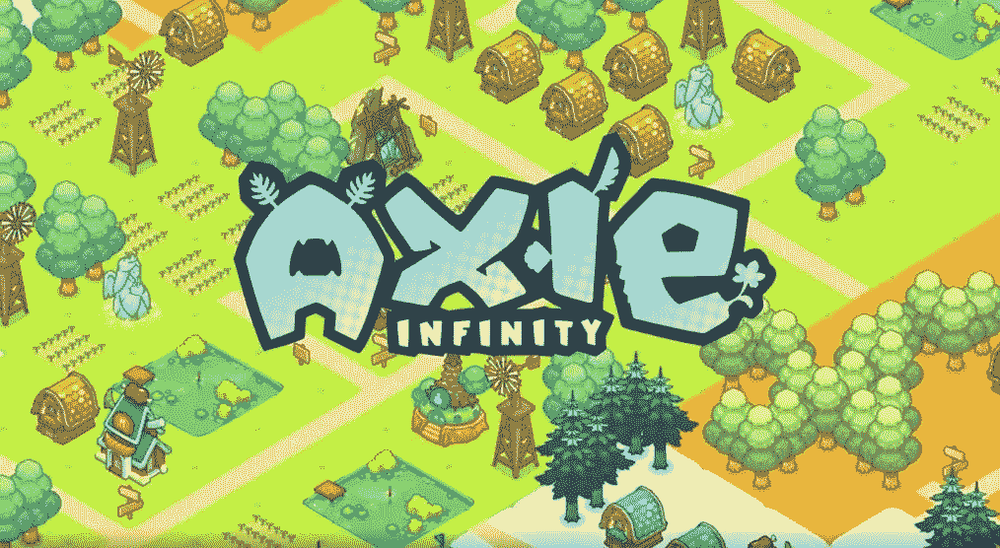
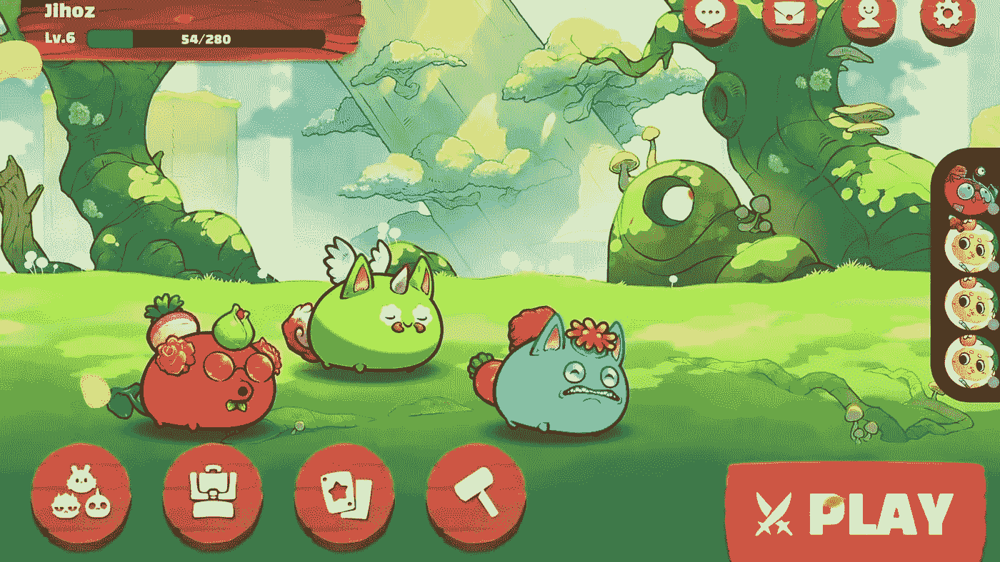

# 像 Axie Infinity 一样构建 NFT 游戏——即玩即赚模式中的最佳游戏

> 原文：<https://medium.com/geekculture/build-nft-game-like-axie-infinity-the-best-game-in-play-to-earn-model-3d0f5b76e741?source=collection_archive---------8----------------------->

NFT 游戏已经给这个游戏改头换面，这个游戏已经成为全世界游戏玩家的一部分。NFT 游戏通过提供在线游戏赚钱的机会，开始满足在疫情期间一直过着触摸生活的游戏玩家的需求。

这些基于区块链的游戏已经统治互联网相当长一段时间了，Axie Infinity 就是这样一个东西，它在网上为它们的成功做出了严格的说明。它们已经成为一款成功的区块链在线游戏，并提升了玩家在游戏中赚钱的方式。今年到目前为止，它已经实现了 7 亿美元的销售额，并有望在年底前实现 10 亿美元的销售额。

然而，要在这样一个游戏的帮助下统治密码世界，你需要建立一个像 Axie Infinity 这样的 NFT 游戏，类似于原始游戏。为了让这个活起来，你需要一个 [**区块链开发公司**](https://bit.ly/3x8Sz0y) ，雇佣一个将带领你到十年中最好的区块链游戏。让我们看看更多关于他们的事情。

## **什么是 Axie Infinity？**

在当今的加密货币市场上， [**NFTs**](https://en.wikipedia.org/wiki/Non-fungible_token) 风靡一时，加密收藏类游戏在全球范围内爆发式流行。该游戏还从《最终幻想战术》和《闲置英雄》等游戏中的闲置战斗系统中获得灵感。

Axie Infinity 是一款基于区块链的游戏，用户可以通过在受口袋妖怪启发的区块链数字宠物环境中玩游戏来赚取令牌。用户可以使用这个游戏来战斗，收集，繁殖和扩大他们的宠物帝国。

游戏采用了****模式(也称为“付费玩赚”)，玩家在支付初始费用后，可以通过游戏赚取一种基于以太坊的游戏内加密货币。每隔 14 天，Axie Infinity 允许用户兑现他们的代币。这种模式被描述为一种赌博形式，市场不稳定，过度依赖新玩家的流入。****

****随着生态系统的发展，玩家将能够拥有网络上的资产并将其货币化。此外，随着每日活跃用户超过 100 万，许多玩家开始将游戏视为额外收入的来源。****

****它可以用来在游戏中创建新的维度，供以后使用。axe 可以在现实世界的交易所交易，比如 NFT 或 Axie。除了 axies 之外，其他商品，如鲜花、数字土地、桶等，也可以在 NFT 市场交易。****

********

****一个玩家可以有一个优势，如果他们组建了一个强大的团队与高统计数据轴。在锦标赛和比赛期间，玩家可以使用 Discord、电子邮件、实时聊天和 Twitter 寻求帮助。****

****你可能已经很好地学习了这个游戏，并渴望建立一个游戏来满足玩家的渴望，并在开始一次成功的冒险中看到更多的利润。在此之前，你需要知道建立一个这样的游戏的好处。****

## ******Axie Infinity 游戏开发的好处******

****以下是好处:****

******ᐅ** 增加数字资产的价值。****

******ᐅ** 游戏元素可以在全 3D 环境、世界和迷你游戏中显示。****

****ᐅ 使用区块链技术的 NFT 游戏平台适应性更强，功能更丰富。****

******ᐅ** 在 NFT 游戏平台中，使用 NFT 创建贵重物品的稀有数字复制品。****

******ᐅ** 得益于区块链技术，NFT 艺术可以展示，人物可以用各种配件定制。****

******ᐅ** 提高了数据安全性。****

****ᐅ博彩业变得越来越自给自足，竞争也越来越激烈。****

****现在，让我们来看看在构建像 Axie infinity 这样的游戏时要考虑的最后一组事情:****

## ******打造类似 Axie infinity 的 NFT 游戏******

****为了构建一个像 Axie infinity 这样的 NFT 游戏，你需要考虑这些因素。****

******ᐅ** 聘请最好的游戏开发公司****

******ᐅ** 选择要部署的最佳功能****

****这两件事对于构建像 Axie Infinity 这样的 NFT 游戏非常重要。但是为什么呢？让我们深入探讨一下:****

## ******聘请最好的游戏开发公司******

****为了避免任何误解，请业内拥有丰富专业知识和经验的顶级游戏开发人员。这是需要考虑的最重要的因素。现在有很多 NFT 游戏开发公司，但是选择最好的还是取决于你。他们将建立一个类似 axie infinity 的 NFT 游戏，并整合所有必要的功能。他们帮助你从头开始构建游戏，或者使用一些定制的产品来简化游戏。****

## ******NFT 游戏平台的独家功能******

****NFT 游戏平台最重要的特性和功能是那些能够让您的平台在竞争中脱颖而出，并帮助您建立或保持市场地位的特性和功能。****

****因此，选择正确的功能至关重要。以下是一些需要考虑的问题:****

******ᐅ** 战役****

******ᐅ** 育种阿谢尔****

******ᐅ** 支付网关****

******ᐅ** 土地****

******ᐅ** 仪表盘****

****ᐅ 集成加密钱包****

******ᐅ** 土著代币****

****ᐅ 市场****

******ᐅ** 透明度****

******ᐅ** 安全标准****

******ᐅ** 沉浸式用户体验****

****这些功能有助于您获得最佳产品，让您成为市场的潮流引领者。比开发像 Axie infinity 这样的 NFT 游戏更重要的是。****

## ******结论******

****当雇佣最好的开发公司和专家开发人员时，你可能在几年内成为最好的。他们通过照顾游戏的所有必需品使你的工作更好。现在，我们希望你发现这个关于像 Axie Infinity 这样的 NFT 游戏的博客既有教育意义又有娱乐性。如果你想保持竞争力，打破目前的 NFT 游戏产业，一定要选择一家顶级的游戏开发公司。作为一家领先的 NFT 游戏平台开发公司，他们帮助您为世界各地的客户开发基于区块链的游戏。他们可以帮助你开发一个高端、强大的 NFT 游戏，类似于 Axie Infinity，拥有自己的一套特性和功能。建立一个类似 Axie Infinity 的 NFT 游戏，重现在线游戏的魔力。此外，这将是一些不可思议的事情的开始，可以让你成为一名成功的企业家。****