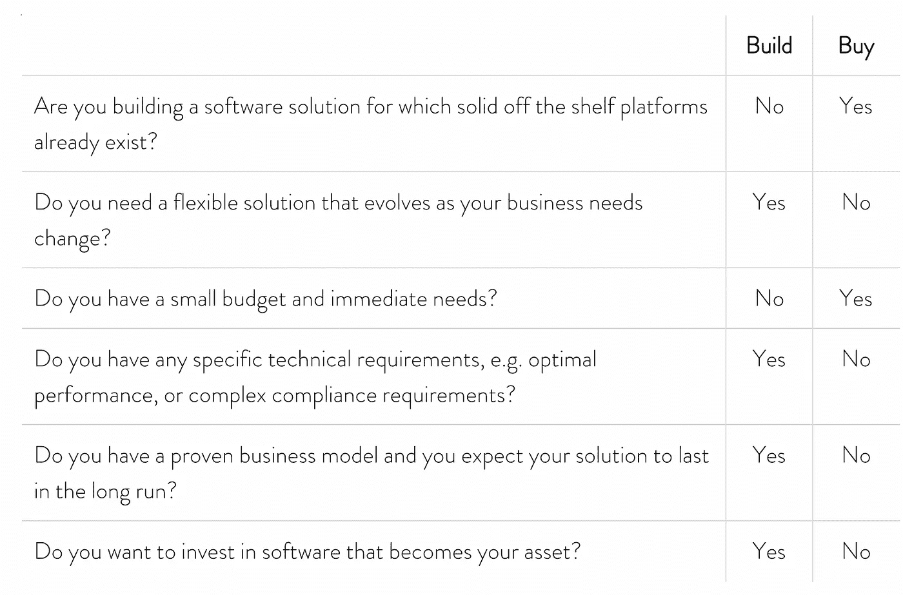

# 建造还是购买——企业家永恒的困境

> 原文：<https://medium.com/geekculture/build-or-buy-the-evergoing-entrepreneurs-dilemma-920e464d909f?source=collection_archive---------18----------------------->

科技企业家在推出产品时最常见的一个问题是，是从头开始构建软件，还是购买一个商业软件平台。这是一个重要的决定，可以在开发成本或未来面临的风险方面产生重大影响。

在我们讨论选择什么样的模型是最好的之前，让我们先来探讨一下常见的软件模型，它们的优点和缺点。

# 定制开发

定制开发或定制开发是开发定制软件时的传统开发形式，是根据您的特定业务需求量身定制的。考虑买套西装。你可以做一个你喜欢的模型，没有任何限制。

定制开发包括设计、实现、部署和维护软件的过程，通常由内部开发团队构建或外包给第三方。通用定制软件开发的一些最流行的编程语言是 Java、C#、PHP、JavaScript、Python 等。这些是软件开发人员常用的编程语言。

那么定制开发的好处和坏处是什么呢？

**高灵活性。使用这种模式，基本上没有任何限制，你可以建造任何你能想到的东西。这并不意味着完整的软件是从零开始构建的。当然也可以使用一些第三方库，但是软件的基础是定制的。**

**控制力增强。**定制软件开发意味着您不依赖任何第三方解决方案。不存在第三方明天停止提供支持的风险，也不存在第三方解决方案中实施的安全性不足的问题。

**更大的责任**。然而，因为你不依赖任何其他方，这意味着你有更大的责任。您需要考虑任何安全性、隐私或合规性要求。

**更高的前期投资。**定制开发需要在初始开发上花费更高的成本。你的团队需要经历理解客户需求、设计产品、开发、部署的整个过程。当然，这需要时间和精力。

**长期的资产。您构建的定制软件成为您的所有权。随着产品变得更加稳定，花费在实现上的成本会随着时间的推移而降低，从长远来看，软件会成为您的资产。**

# 商业现货(COTS)

另一方面，我们有现成的商业平台。使用 COTS 模型意味着您正在购买一个商业可用的平台，它不是专门为您自己构建的，而是为大众构建的。因为它是为大众生产的，所以 COTS 软件遵循由一般最佳实践指导的“一刀切”的方法。通常情况下，您需要做出一些改变来使平台适应您的需求。您可以配置平台，或者(如果平台允许)开发一些定制软件来适应平台。想想买一套西装，你买最适合你的尺寸，你做一些小的调整。

COTS 平台的典型例子是电子商务平台。电子商务是一种非常常见的商业模式，电子商务应用程序具有非常相似的功能，例如购买产品、将产品标记为喜爱的产品，或者将产品添加到购物篮中。由于这一功能在广泛的应用程序之间共享，像 Shopify、Sharetribe 或 Magento 这样的公司已经将其打包成一个可供许多企业商业使用的平台。

COTS 模型有很多好处，但当然也有缺点。

**加快上市时间。**因为使用 COTS 平台意味着你不用从头开始构建你的软件解决方案，你可以更快地构建产品，有时甚至只需要几天。这允许您更快地将工作产品投入生产。

**灵活性有限。**要使 COTS 平台成为可行的选择，它需要提供适合您业务的正确功能。一些平台允许更多的定制，一些允许更少，但无论如何，适应平台的能力是有限的。一些平台承诺能够完全定制。但即便如此，如果你在技术上能够让产品满足你的需求，那就意味着你没有利用平台提供的优势，你让你的产品变得不必要的复杂。

**对平台的长期依赖。**在 COTS 平台上构建产品意味着你将在安全性、性能等方面严重依赖第三方。这导致了“供应商锁定”，因为你的产品完全依赖于第三方平台。离开这个平台可能意味着从头开始重新构建软件。

**长期运营成本。**从长远来看，对平台的长期依赖也带来了持续的许可成本。这些平台的定价模式通常是基于使用情况的，也就是说，使用你的产品的用户越多，价格就越高。这意味着，只要您的产品是活的，并且被您的客户使用，许可成本就会一直存在。

通常比定制开发的软件性能差。这取决于所选择的平台和您的需求，但一般来说，使用这种模式，软件的性能会稍差一些，您无法像使用定制开发那样获得最佳性能。

# 定制低代码开发

我会把这作为一个单独的类别。这是一种商业上可用的平台，允许您用很少的代码(低代码)或根本不用代码(无代码)来构建应用程序。这些平台通过用可视编码代替文本编码简化了应用程序开发过程。这意味着，您将使用可视化界面和可用的构建块，而不是键入代码，并且您可以通过使用拖放方法，重用和连接这些构建块来构建您的软件应用程序。

虽然 COTS 平台也被称为低代码平台(因为它们减少了开发软件的需求)，但 COTS 旨在满足特定领域(如电子商务)中特定客户群的需求。自定义低代码开发类别允许开发更通用的应用程序，但比传统编码方式更简单。

这种模型的优点和缺点与 COTS 平台非常相似。

**加快上市时间。**低代码开发可以显著提高开发的生产率，这意味着更快的产品发布。

**软件质量低下的风险增加。由于编码更少，这些平台承诺让非技术人员也能进行开发。但这有风险。由非技术人员构建的低代码应用程序通常会变得非常复杂并且质量较低，因为对于这种类型的开发，您仍然需要理解软件的概念以及构建软件的最佳实践。**

**灵活性有限。**尽管这些平台承诺它们可以用于构建任何应用程序，但是如果平台不允许使用可用的构建块来构建应用程序，您可能最终会得到大量的自定义代码，这会增加应用程序的复杂性。因此，与定制软件相比，这种模型的功能灵活性是有限的。

**长期依赖平台和运营成本。像 COTS 平台一样，你的低代码产品完全依赖于低代码平台。这就带来了持续的许可成本，只要软件产品还在使用，许可成本就会一直存在。**

**性能往往不如定制。**与定制软件相比，这些平台的性能较低。同样，这取决于平台，但对于初创公司来说，从低代码解决方案开始，并在某个时候达到性能极限，然后随着规模的扩大过渡到定制开发的软件，这种情况并不罕见。

# 何时构建，何时购买

现在记住这一点，试着回答下面列出的问题，并评估现阶段什么是最适合你的企业的模式。

请记住，没有绝对正确或错误的解决方案。只要你意识到了风险，并且找到了管理这些风险的方法，你就走在了正确的道路上。

*原载于 2022 年 10 月 10 日*[*https://www . enlight . services*](https://www.enlighten.services/post/build-or-buy-the-evergoing-entrepreneur-s-dilemma)*。*