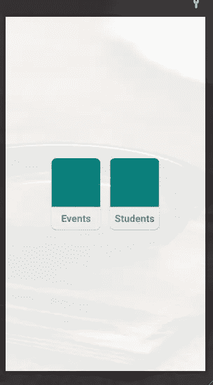
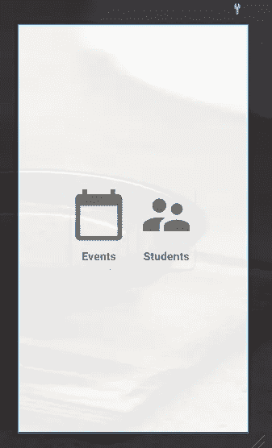
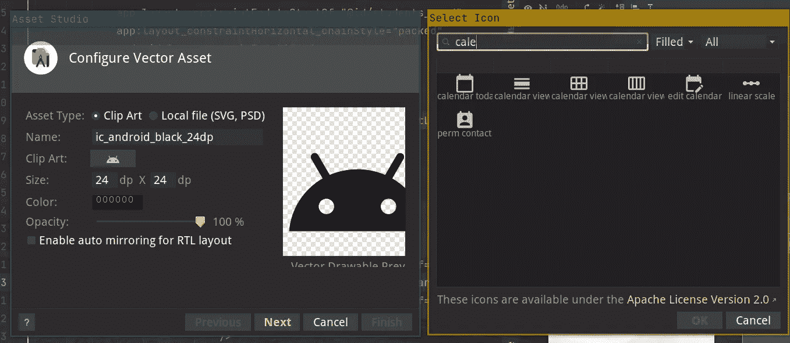
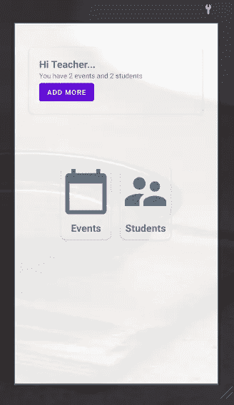
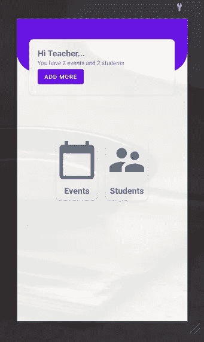

# 在 Kotlin 中构建简单的考勤应用程序—第 1 部分—仪表板布局

> 原文：<https://medium.com/geekculture/build-simple-attendance-app-in-kotlin-part-1-dashboard-layout-c111b84ea9cf?source=collection_archive---------13----------------------->

如果你想掌握一门语言，或者一个框架，在它的基础上构建一些东西！

在本系列中，您将使用 Kotlin 构建一个简单的学生考勤应用程序。

您还将学习如何使用 jetpack 功能，如导航、相机、房间。您还将学习如何在 android 中使用 MVVM 和存储库模式。

我对你有一些假设:

1.  你对 kotlin 和 android 有些经验
2.  你可以使用 Android Studio，以及已经安装在你桌面上的 Android SDK
3.  本教程的最小 SDK 是 API 21

我们开始吧

## 章节:

*   使用 ConstraintLayout 的简单仪表板[你在这里]

对于每一章，我将提供三个链接:

*   拉链。你可以下载。
*   差异。您可以显示章节之间的差异。
*   每个章节的标记存储库

[**zip**](https://github.com/ihfazhillah/Simple-Attendance-Example/archive/refs/tags/part1.zip) 、diff【没什么，因为是我们第一个版本】、 [**repo**](https://github.com/ihfazhillah/Simple-Attendance-Example/tree/part1)

# 使用 ConstraintLayout 创建简单的仪表板

在本系列中，您将主要使用 ConstraintLayout 视图组。您可以在没有嵌套视图组的情况下布局复杂的层次结构。此外，如果您愿意，您可以使用可视化编辑器，而无需接触 XML 文件。如果你想使用可视化编辑器，你可以访问 android 文档。

但是，在本系列中，您将使用 XML 文件实现布局，并获得一些关于它的解释。

让我们打开`activity_main.xml`文件，并在 ConstraintLayout 标记中填充这段代码。

我们这里有两个`CardView`。在它里面，我们有`ConstraintLayout`。

第一个`CardView`，顶部、底部和开始(左侧)约束被约束到父视图中。并且结束约束被约束到 id 为`studnets_card`的视图的开始。

你看:

```
app:layout_constraintTop_toTopOf="parent"            app:layout_constraintBottom_toBottomOf="parent"            app:layout_constraintStart_toStartOf="parent"            app:layout_constraintEnd_toStartOf="@id/students_card" 
```

有趣的部分是这些下面的线。`chainStyle`。`ConstraintLayout`有几种款式的链条。其中一个就是`packed`。这意味着，对于水平链，约束到最左侧视图的每个视图，或者对于垂直链，约束到最顶部视图的每个视图，将在计算边距后被打包。你会在不久的将来看到`packed`链式的结果。

```
app:layout_constraintHorizontal_chainStyle="packed"
```



packed chain style horizontally

你可以看到，顶部和底部的约束被限制在第一张卡中。这意味着无论你在哪里改变第一张卡片的上边距或下边距，第二张卡片都会跟着改变。

为了让它和第一张卡片放在一起，你要把开始约束到第一张卡片的末端。并且不要忘记对父对象的结束进行结束约束。

你会看到如上图的结果。

此外，您会注意到边距将遵循约束。我的意思是，如果你将顶部约束到父视图中，并给定 50dp 的边距，这将在父视图和视图之间留出 50dp 的空间。

如果给学生卡的开始页边空白值 50dp，并且该卡被限制在活动卡结束时开始，这将使这两张卡之间的空间为 50dp。

但是，如果你给活动卡的末尾留边，这将不会在它们之间留下任何空间。所以，确保你注意到这一点。

你注意到`ImageView`仍然在使用颜色填充它。在真正的应用程序中，您将为这些卡片使用图标。

让我们用图标制作你的活动卡和学生卡，让它们看起来像下面的图片



右键点击可绘制文件夹，选择新建，选择`Vector Asset`菜单。然后单击剪贴画按钮，您将看到对话框。



搜索你需要的图标。做两次。

我在活动卡上使用日历，在学生卡上使用主管图标。我给它取名为`ic_calendar.xml`和`ic_users.xml`

接下来，转到`activity_main.xml`并更改每个`ImageView`的`android:src`属性。`@drawable/ic_calendar`为活动，而`@drawable/ic_users`为学生卡。

你注意到了文件夹和你在模板中调用它的方式之间的关联，对吗？这个`drawable`文件夹，你用`@drawable/xxx`调用里面的东西。并且在 kotlin 代码中，可以使用`R.drawable.xxx`引用它。

总而言之:

*   drawable/xxx ->文件夹和文件
*   `@drawable/xxx` - >如何在模板中引用它
*   `R.drawable.xxx` - >如何在 java / kotlin 代码中引用它

在`event`卡代码前的`activity_main.xml`文件中输入以下代码。

当你打字的时候，你会注意到你在这张卡片上加了一些页边空白。这个余量会产生影响，因为余量和我之前解释的约束相匹配。

你也注意到了`layout_width`是`0dp`。为什么？这是一个使视图的宽度在扣除边距后填满屏幕宽度的技巧。因此，请确保指定开始和结束约束以及边距。

您也可以将`layout_height`值设为`0dp`。行为将是相同的。

假设您有一个选项卡布局和一个回收器视图。你想把标签放在最上面。回收器视图在选项卡下，但未被选项卡覆盖。

如果您将`layout_height`设为`match_parent`，部分内容将被选项卡覆盖。

如果你设置它为`wrap_content`,你将顶部的约束设置为标签，底部的约束设置为父标签，并且你的内容没有显示在屏幕上，你的项目将会在屏幕的中心。

因此，`layout_height`的`0dp`值将会起作用。你将在下一章的某个视图中使用这个技巧。

您的最终布局将如下所示



接下来，您将在顶部卡片下方添加自定义背景。您将通过编写 XML 代码自己创建一个自定义的 drawable。

实现代码后，您的屏幕将是这样的



右键单击可绘制文件夹，选择新建，然后选择可绘制资源文件。使文件名值为`rounded_top_background.xml`，根元素值为`shape`。是的，您将使用 XML 自己绘制形状。

生成最终的 XML 文件，如下所示:

首先，添加一个`solid`标签。这将你的形状颜色赋予在`values/themes.xml`中定义的`colorPrimary`属性

然后，通过在`corners`标签中添加`bottomRightRadius`和`bottomLeftRadius`属性，使底角的两边变圆。

接下来，再次打开`activity_main.xml`并将这段代码添加到`top_card`视图的上方。

您可以通过调用`findViewById`来引用 kotlin 代码中的每个视图，并将视图 id 传递给它。

例如，如果你想引用事件卡片，你可以调用`findViewById<CardView>(R.id.event_card)`并把它传递给一个变量。

或者，如果你想得到按钮更多的视图，你可以调用`findViewById<Button>(R.id.button_more)`。

或者，您可以使用`viewBinding`或`dataBinding`功能。在本教程中，您将使用`viewBinding`。

要启用此功能，请确保您使用的是 Android Studio 以上版本。

打开`app`文件夹内的`build.gradle`。增加

```
buildFeatures {
    viewBinding true
}
```

在`android`部分和`sync`中，你的 Gradle 文件发生变化。

将根据布局名称生成`viewBinding`类。`activity_main.xml`会生成`ActivityMainBinding`。

我们如何使用它？你问。

打开`MainActivity.kt`，在`onCreate`方法里面你可以初始化它。

```
val binding = ActivityMainBinding.inflate(layoutInflater)
setContentView(binding.root)
```

替换`setContentView`方法，用`binding.root`代替`R.layout.activity_main`。

接下来，您会注意到使用下划线的 ids 将生成它的 camelCase 版本。`button_more`将会是`buttonMore`，`events_card`将会是`eventsCard`

您将在按钮和卡片上添加简单的点击监听器。

键入这个

```
binding.buttonMore.setOnClickListener {
    Toast.makeText(this, "button more clicked", Toast.LENGTH_SHORT).show()
}binding.eventsCard.setOnClickListener {
    Toast.makeText(this, "Events card clicked", Toast.LENGTH_SHORT).show()
}binding.studentsCard.setOnClickListener {
    Toast.makeText(this, "Students Card clicked", Toast.LENGTH_SHORT).show()
}
```

当每个按钮被点击时，这将创建一个简短的祝酒词。`Toast.makeText`方法需要 3 个参数:

*   语境
*   文本
*   吐司长度类型，吐司有两种类型:LENGTH_SHORT 和 LENGTH_LONG

您的活动代码将类似于

当点击按钮`Add More`时，你需要打开一个弹出菜单，而不是显示一个祝酒词。因为您希望能够创建事件或学生记录。

因此，在 res 文件夹中右键单击，单击 New 并选择 Android Resource Directory。

将目录名填写为`menu`，类型为`menu`

然后，右键单击`menu`文件夹，新建，选择菜单资源文件。

接下来，打开 MainActivity，并将`buttonMore` click listener 更改为`openMoreMenu(it)`

创建一个名为`openMoreMenu`的方法，带有一个名为`view`的参数。请看下面第 21 行的代码:

当您点击更多按钮时，这将`inflate`您之前定义的`R.menu.more_menu`布局。然后设置菜单项 click listener。之后，您显示弹出窗口。

综上所述，创建弹出菜单的步骤是:

*   使用菜单标签和其中的项目创建菜单布局
*   在 Kotlin 代码中初始化`PopupMenu`，展开菜单布局，并设置点击监听器。
*   你决定什么时候显示它。在本章中，您将在单击“更多”按钮时显示弹出窗口。

恭喜你，成为 android 开发者的第一步已经完成。

以下是您在本章中学到的内容:

*   约束布局
*   视图绑定
*   烤
*   PopupMenu

是的，成为一名 android 开发专家是一个漫长的旅程。不要放弃。

您将在第二章的[中了解更多关于如何创建学生记录并将其保存到数据库中的信息。](https://mihfazhillah.medium.com/build-simple-attendance-app-in-kotlin-part-2-navigate-to-student-form-a9f519a1098c)

# 参考

*   https://developer.android.com/training/constraint-layout
*   【https://developer.android.com/topic/libraries/view-binding 

## 更新

*   **2021 年 6 月 20 日**增加第二章的链接