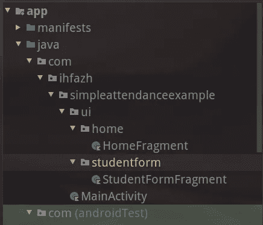
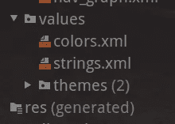

# 在 Kotlin 中构建简单的考勤应用程序—第 2 部分—导航到学生表单

> 原文：<https://medium.com/geekculture/build-simple-attendance-app-in-kotlin-part-2-navigate-to-student-form-a9f519a1098c?source=collection_archive---------21----------------------->

现在，您将开始使用 Jetpack 导航组件创建导航图的旅程。

在本章中，您将在导航组件的帮助下使用一个活动多片段架构。这使得处理屏幕过程更容易。

不多谈了，我们开始吧！！

# 章节:

*   [使用 ConstraintLayout 的简单仪表板](/geekculture/build-simple-attendance-app-in-kotlin-part-1-dashboard-layout-c111b84ea9cf)
*   Jetpack 导航-学生表单[你在这里]

对于每一章，我将提供三个链接:

*   拉链。你可以下载。
*   差异。您可以显示章节之间的差异。
*   每个章节的标记存储库

[**zip**](https://github.com/ihfazhillah/Simple-Attendance-Example/archive/refs/tags/part2.zip) ， [**diff**](https://github.com/ihfazhillah/Simple-Attendance-Example/compare/part1...part2) ， [**repo**](https://github.com/ihfazhillah/Simple-Attendance-Example/tree/part2)

让我们首先添加导航依赖项。打开应用程序级别的`build.gradle`并添加

```
implementation "androidx.navigation:navigation-fragment-ktx:$nav_version"
implementation "androidx.navigation:navigation-ui-ktx:$nav_version"
```

如果你现在做`sync`，你会得到一个错误。因为你没有在任何地方定义`nav_version`变量。

要修复它，打开顶层的`build.gradle`并添加它

```
ext.nav_version = "2.3.5"
```

在`buildscript`街区内。

使用这种方法，如果您想要更新或降级整个导航库，您不需要在每个`implementation`行进行更新。相反，只需更新项目的 build.gradle 中的`ext.nav_version`值。

请立即同步，因为您已经在`build.gradle`文件中做了更改。

接下来，打开`activity_main.xml`文件，并添加以下内容

```
<androidx.fragment.app.FragmentContainerView
    android:layout_width="0dp"
    android:layout_height="0dp"
    app:layout_constraintTop_toTopOf="parent"
    app:layout_constraintBottom_toBottomOf="parent"
    app:layout_constraintStart_toStartOf="parent"
    app:layout_constraintEnd_toEndOf="parent"
    android:id="@+id/nav_host_fragment"
    android:name="androidx.navigation.fragment.NavHostFragment"
    app:defaultNavHost="true"
    app:navGraph="@navigation/nav_graph"/>
```

该视图将成为您的导航主机。导航主机是一个空容器，它将是你的屏幕进出的地方，这取决于你在哪里导航。这应该是`NavHost`类的子类，默认实现是`NavHostFragment`。你在你的`FragmentContainerView`的`android:name`标签中定义它

`app:defaultNavHost`将您的导航主机标记为默认导航主机，并处理后退按钮。如果有多个默认导航主机，则只能在一个布局中定义一个默认导航主机。

那`navGraph`呢？它是一个 XML 文件，定义了你的屏幕和它们的动作。这个 XML 文件的根是`navigation`。

`Screens`要么是一个活动，要么是一个片段。或者，用谷歌术语来说，就是一个`direction`。

而`action`是从一个方向到另一个方向的路线。

如果您打开可视化布局，您可以看到一个代表活动或片段的矩形。而`action`是它们之间的连接路径。

## 定义导航图中的第一个屏幕

在上一步中，您将在`app:navGraph`属性下面看到红色下划线。这是因为您的项目中没有该文件。创建它的简单方法是点击键盘上的`CTRL+ALT+ENTER`。然后按照说明操作。

Android Studio 将打开根元素为`navigation`的`nav_graph.xml`文件。

将这段代码添加到`navigation`标签中:

这将向导航图添加一个片段。如果你想添加一个活动，你应该使用`activity`标签。您还可以看到一些属性:

*   `android:id`导航图中该片段的标识符
*   `android:name`实际片段包
*   `android:label`用于标题
*   `tools:layout`显示导航图设计中的布局。

但是，你的家园碎片在哪里？你问。请耐心等待，您将更新前面的活动，并将主活动实现移动到您的`HomeFragment`中。

## 标记为起始目的地

现在你的导航图没有开始屏幕。您可以将之前添加的第一个片段添加为起始目的地。

在`navigation`标签中，添加`app:startDestination="@id/home_fragment"`属性。您的`nav_graph.xml`文件将如下所示:

看到了吗？起始目的地值是导航标签子项中第一个片段的 id。

## 添加 HomeFragment

在我们开始移动`MainActivity`实现之前，您将为`HomeFragment`创建一个框架

在`layout`目录下创建`fragment_home.xml`。以`ConstraintLayout`为根元素使其为空即可。

添加`ui`包，并在其内部添加`home`包。然后创建一个新的 kotlin 文件，并用以下内容填充它:

绑定初始化与您在活动中所做的略有不同，对吗？在片段中，您应该解除绑定，以确保应用程序不会产生内存泄漏。

您将`private val _binding`定义为一个可空变量，并用空值初始化它。然后当片段的视图被破坏时，你应该再次使它为空。

为了使访问`binding`更容易，并且您不应该检查绑定是否为空，您创建了另一个变量，并通过两次敲击`!!`强制该绑定不为空。

## 让我们把仪表板搬进家里

将`FragmentContainerView`下的所有视图移动到根标签内的`fragment_home.xml`。

您会注意到 MainActivity 现在有一条红色下划线。将所有侦听器移到 HomeFragment 的 onViewCreated 方法中，您的 HomeFragment 将如下所示

如果您运行您的应用程序，在您的设备上将不会注意到任何变化。因为你只能从活动进入片段。

一般来说，使用 Jetpack 导航的步骤是:

1.  值为`android:name`的 Add FragmentContainerView 是`NavHost`的子类。默认的是`androidx.navigation.fragment.NavHostFragment`

2.确定`app:navGraph`

3.创建导航图文件

## 添加操作

菜单里面的学生按钮添加更多应该会打开一个新的屏幕。你要实现它。



StudentFormFragment

首先，在 **ui.studentform** 目录中创建一个名为 **StudentFormFragment** 的片段。另外，在布局目录中创建`fragment_student_form.xml`。首先将其设为默认，不包含任何视图。

您将首先对屏幕特征执行**更改。然后实现实际的表单。**

接下来，再次打开 **nav_graph.xml** 并在 home 片段下添加新创建的片段。

在 nav_graph 的 fragment 标签中，您可以添加一个动作。正如我之前告诉你的，动作是连接屏幕的路径。源操作是您的操作的根。而目的地是你在行动中定义的。

例如，你想创建一个连接 home 和 studentformfragment 的动作。您应该在 home 片段中添加一个操作，并用 studentformfragment id 填充`app:destination`。

如果您仍然不确定如何实现它，请看下面最终的 nav_graph.xml

并且，我如何能使用它从家移动到新的片断？

轻松点。

打开 HomeFragment 文件，在 menu_student 菜单监听器中，将 Toast 实现更改为`findNavController().navigate(R.id.home_to_student_view)`

运行它，你会看到变化。恭喜你。！

## 实现表单布局

让`fragment_student_form.xml`看起来像这样

它只是添加了 2 个编辑文本和按钮。我们在这里使用谷歌材料设计组件。



the values/strings.xml file

你注意到 android:text 属性现在有了像`@string/save`这样的值。这是最佳实践，不是将字符串硬编码到布局中，而是将它们提取到`values/strings.xml`文件中。

当你的 android:text 属性仍然带红色下划线时，做一个`ALT+SHIFT+ENTER`。它将创建一个映射到 values/strings.xml 文件的记录。

## 添加保存监听程序

当点击 save 按钮时，您希望采取措施将记录保存到数据库，并将屏幕导航回主页。

不，现在，你只能做第二部分。因为我们现在还没有建立数据库。

您可以将侦听器添加到 StudentFormFragment.kt 中的 onViewCreated 方法中

```
binding.btnSave.setOnClickListener { Toast.makeText(context, "Student will be saved into database.", Toast.LENGTH_SHORT).show() findNavController().navigateUp()
}
```

`navigateUp()`将导航到您定义的动作的父动作。在这种情况下，家庭片段。你可以再读一遍你的导航图来理解我所说的。

## 修正 android 的应用标题:标签

您的应用程序现在可以顺利运行了。但是你注意到一件事。标题栏不符合您在导航图形文件中定义的`android:label`。我们如何修复它？

打开`MainActivity.kt`。您将使用导航控制器设置动作栏。

1.  获取导航片段
2.  获取 navhost 控制器
3.  用导航控制器设置动作栏
4.  覆盖 onSupportNavigateUp 并让 navhostcontroller 处理它

要获得导航主机控制器，您可以

```
val navFragment = supportFragmentManager.findFragmentById(R.id.nav_host_fragment) as NavHostFragment
navHostController = navFragment.findNavController()
```

然后，要设置带有导航控制器的动作栏，您可以使用

```
setupActionBarWithNavController(navHostController)
```

要覆盖 onSupportNavigateUp，您可以

```
override fun onSupportNavigateUp() = navHostController.navigateUp()
```

并且，您的最终文件将如下所示

最后，您的仪表板屏幕的标题现在是**主页**，学生表单中的标题现在是**学生表单**。您会注意到，标题栏中的后退按钮现在出现了。

## 添加安全参数

android 开发者文档强烈建议您使用安全的 args Gradle 插件在屏幕间导航。这将生成方向类，并严格要求您在某些屏幕上需要时传递参数。

要进行添加，请遵循以下说明:

1.  在顶级 build.gradle 文件中添加导航类路径
2.  在应用级 build.gradle 中应用插件

```
classpath "androidx.navigation:navigation-safe-args-gradle-plugin:$nav_version"
```

将它添加到顶层 build.gradle 文件的`dependencies`块中

在应用程序级别，通过添加来应用插件

```
id "androidx.navigation.safeargs.kotlin"
```

在插件块中

不要忘记重新同步您的项目。

接下来，你应该考虑这些事情:

*   使用**片段名称类+“方向”**生成方向类
*   每个方向的动作都是从每个动作的 id 开始的。例如，在 home to student 片段中，id 是 **home_to_student_view。然后，Gradle 将把 **homeToStudentView** 方法添加到类中**

是的，你明白了。Gradle 将生成**homefragmentdirections . hometostudentview()**，您将使用它从主页导航到学生表单视图。

还有一件事。每当您更改 nav_graph.xml 文件时，不要忘记重新构建您的应用程序。你可以简单地按 CTRL+F9 来完成。这将确保生成的方向类。

接下来，您可以将实现从

```
findNavController().navigate(R.id.home_to_student_view)
```

到

```
val destination = HomeFragmentDirections.homeToStudentView()
findNavController().navigate(destination)
```

最后，你已经在这里学到了很多。您了解了 Jetpack 导航组件、Fragment 和 Safe Args Gradle 插件。

在下一章中，您将学习如何使用 Room 将实际记录保存到数据库中，并使用 RxJava 集成您的应用程序，使应用程序更具吸引力。

## 更多资源

*   [https://developer . Android . com/guide/navigation/navigation-getting-started](https://developer.android.com/guide/navigation/navigation-getting-started)
*   [https://developer . Android . com/topic/libraries/view-binding # fragments](https://developer.android.com/topic/libraries/view-binding#fragments)
*   [navigateUp vs popBackStack](https://stackoverflow.com/a/67702986/8626538)