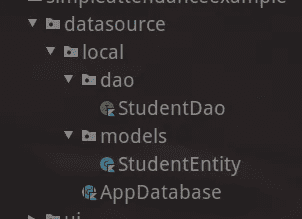

# 在 Kotlin 中构建简单的考勤应用程序—第 3 部分—使用 Room 将学生记录保存到数据库中

> 原文：<https://medium.com/geekculture/build-simple-attendance-app-in-kotlin-part-3-save-student-record-into-database-using-room-4800d4f9af2a?source=collection_archive---------30----------------------->

当你学习如何构建一个应用程序时，最有趣的部分是什么？对我来说，这是我可以在数据库中存储数据的时候。虽然它有一些困难的概念，但当你能实现它们时，你会感到自豪。

在最后一部分中，您将学习如何从主屏幕导航到学生表单。但是，您仍然没有持久化您的记录，所以您不能再次访问您的数据。

在这一部分，您将学习如何做到这一点。您将学习如何使用房间数据库持久性。最后，您还将学习一些关于 RxJava 的概念。

# 章节:

*   [使用 ConstraintLayout 的简单仪表板](/geekculture/build-simple-attendance-app-in-kotlin-part-1-dashboard-layout-c111b84ea9cf)
*   [喷气背包导航—学生表单](/geekculture/build-simple-attendance-app-in-kotlin-part-2-navigate-to-student-form-a9f519a1098c?source=---------0----------------------------)
*   房间，RxJava 学生插入[您在这里]

对于每一章，我将提供三个链接:

*   拉链。你可以下载。
*   差异。您可以显示章节之间的差异。
*   每个章节的标记存储库

[**zip**](https://github.com/ihfazhillah/Simple-Attendance-Example/archive/refs/tags/part3.zip) ， [**diff**](https://github.com/ihfazhillah/Simple-Attendance-Example/compare/part2...part3) ， [**repo**](https://github.com/ihfazhillah/Simple-Attendance-Example/tree/part3)

## 实体、Dao 和数据库

要实现房间，你必须知道它的 3 个最重要的部分。**实体，道，数据库。**

我们将从最小的部分开始，即**实体**。该实体基本上类似于数据库的表定义。它将用于将数据库中的一条记录数据映射到一个 Kotlin 对象中。

该实体将如下所示:

```
@Entity <-- this data class is an entity
data class SomeObject(
    @PrimaryKey 
    val theId: Int,

    @ColumnInfo
    val someColumn: String, @ColumnInfo(name="hello")
    val anotherColumn: String?
)
```

当您想要创建一个实体时，您应该使用`@Entity`注释一个数据类对象。如果没有指定任何参数，表名将与类名匹配。

如果您想使用另一个名称，您可以提供一个名为`tableName`的参数。假设你要将这个类映射到对象表，你应该使用`@Entity(tableName = "object")`。

您应该为一个实体定义至少一个主键。您可以使用`@PrimaryKey`注释定义一个主键。您也可以通过提供 autoGenerated=true 作为其参数来使其自动递增。

接下来，要定义其他列，可以使用`@ColumnInfo`注释。列名将与变量名相同，除了您添加了一个`name`参数作为它的参数。

如果你想使列可为空，你可以在变量类型后面加上`?`符号。

好，那**刀**呢？ **D** 数据库 **A** 访问 **O** 对象。由 Room 提供的接口，用于抽象任何数据库操作。您可以使用它来查询、插入、更新或删除数据库中的对象，而不是编写 SQL 脚本来生成数据并手动映射它。

有趣的是，你不能从 dao 函数返回任何东西，一个实体，一个实体列表。此外，当你想与 RxJava 集成时，你可以返回 Completable，for，Single。使用它的另一个好处是与 Jetpack 的正式集成——分页。

Dao 对象将如下所示:

```
@Dao
interface HelloDao{
 @Query("select * from hello")
 fun list(): List<HelloEntity>
}
```

要创建一个 DAO 对象，可以用`@Dao`注释来注释一个接口。然后对于查询，您可以使用`@Query`注释来注释一个方法。您也可以使用`@Insert`进行插入。`@Update`用于更新，`@Delete`用于删除。

最后是`Database`。这是这两者之间的粘合剂。

该数据库将看起来像这样

```
@Database(entities = [Entity::class], version)
abstract class AppDatabase: RoomDatabase(){
     abstract fun entityDao(): EntityDao
}
```

如您所见，您的数据库类是`RoomDatabase`类的子类。您将使用`Room.databaseBuilder`来构建它。

## 让我们建立你自己的

从最小的部分开始，实现它，你会得到全貌。后续的实现对你来说就容易了。

一旦你已经做了一些关于学生形式的工作，让我们从它开始。

将房间版本添加到 build.gradle

```
ext.room_version = "2.3.0"
```

接下来，在应用程序的 build.gradle 中添加依赖项

```
*// room database* implementation "androidx.room:room-runtime:$room_version"
    kapt "androidx.room:room-compiler:$room_version"
```

`kapt`用于注释处理，在 kotlin 语言中使用。你应该启用`kotlin-kapt`插件。

您的插件将如下所示:

```
plugins {
    id 'com.android.application'
    id 'kotlin-android'
    id 'kotlin-kapt'
    id 'androidx.navigation.safeargs.kotlin'
}
```

## 启动学生数据库

创建一个类似这样的项目结构



*   学生岛
*   学生身份
*   应用数据库

让我们实现您之前已经了解的关于实体、Dao 和数据库的内容。

这将创建包含三列的表**学生**:

*   studentId 作为主键
*   名字
*   姓

所有列都是 varchar 类型的不可空列。

这将用于将学生记录插入数据库。只要数据库找到具有相同主键的记录，onConflict 参数就会替换它。您不需要首先检查是否找到了记录，也不会出现唯一约束错误。

接下来，应用数据库

实际上，如果你使用依赖注入这样的东西，你会摆脱`companion object`块。现在，你可以跳过它。如果你对这个名字感到好奇，它被命名为 Singleton 设计模式。

## 保存您的学生记录

更改您的按钮点击监听器

如您所见，您首先获得数据库对象。然后创建一个外部执行器，并将流程记录插入传递给它。

为什么我们需要使用外部执行器？因为数据库插入是一个庞大的操作，可能会使您的 UI 滞后。所以你应该把它从 android 主线程中传递出去。

在最后一部分中，您将屏幕导航到主屏幕。

## 将 RxJava 添加到应用程序中

RxJava 帮助您处理事件驱动类型的应用程序。先装吧。

```
*// room rxjava support* implementation "androidx.room:room-rxjava2:$room_version"

*// rxjava* implementation "io.reactivex.rxjava2:rxjava:$rxjava_version"implementation "io.reactivex.rxjava2:rxandroid:$rxjava_android_version"
```

对于这些版本

```
ext.rxjava_version = "2.2.21"
ext.rxjava_android_version = "2.1.1"
```

在 Rx-java 世界中，我们有许多类型的可观察对象(可以用来观察的东西，一旦某种类型的事件发生，你可以做一些动作)。其中一个是可完成的 T2。

**Completable** 将被发送，除了“嘿，你做的操作已经完成”事件之外，不包含任何数据。

您将在这里使用它来观察插入操作是否已经完成。如果已经完成，你将向上导航，而不是向上导航你的屏幕，你不知道操作是否完成。

更新您的插入函数以返回 Completable 类型，这样您的 StudentDao 将看起来像

```
fun insert(student: StudentEntity): Completable
```

现在，您的插入操作将返回一个 Completable。您不需要像以前一样手动将函数扔进外部线程，让 RxJava 来处理。

让我们看看实际情况。

更新 btnSave click 操作，如下所示

它只是简单地说:将函数调用扔进 **Schedulers.io()** 并在 **Android.mainThread()中等待它。**调用成功后，导航至主屏幕。

你用**订阅**的**抛出调用函数**，用**观察**的**等待**。最后，当调用成功时，您使用 **subscribe** 函数来调用下一步要做的事情。

## 可任意处理的

现在，在 db.insert 函数中，您将得到一个警告，提示“该变量未被使用”

completable 对象的 subscribe 方法返回一个可释放的对象。这个对象使您能够控制对函数调用的观察。

您将使用 CompositeDisposable 来处理这个问题。它只是一个一次性物品的容器，你可以同时处理/清除它们。

将私有属性添加到片段中

```
private val compositeDisposable = CompositeDisposable()
```

然后将插入调用保存到一个变量中，并将其添加到 compositeDisposable 中

```
var disposable = db.studentDao().... 
compositeDisposable.add(disposable)
```

最后，当片段生命周期进入 onDestroyView 时处理它

```
override fun onDestroyView(){
    super.onDestroyView()
    _binding = null
    compositeDisposable.dispose()
}
```

## 视图模型

让我们将您的插入逻辑移到一个视图模型中。

然后在你的片段中

## 使用委托启动视图模型

你可以稍微清理一下你的代码。您可以使用 kotlin 提供的 delegate 函数来处理 ViewModel 初始化重复任务。

```
private val viewModel: StudentFormViewModel by *viewModels*()
```

并在 btnSave click listener 之前删除 viewModel 变量。

## 添加禁用状态

当您多次单击 save 按钮时，您会在数据库检查器中注意到插入记录出现了多次。为了防止这种情况，您可以在点击按钮后禁用它。

将它添加到 btnSave 的 onClick 侦听器中

```
**it**.*isEnabled* = false
```

最后，你做得很好！

您已经在这里学习了一些概念:

*   房间数据库
*   一些 RxJava 的东西
*   视图模型

# 资源

*   [https://developer.android.com/training/data-storage/room](https://developer.android.com/training/data-storage/room)
*   【https://guides.codepath.com/android/RxJava 号
*   【https://kotlinlang.org/docs/delegation.html 