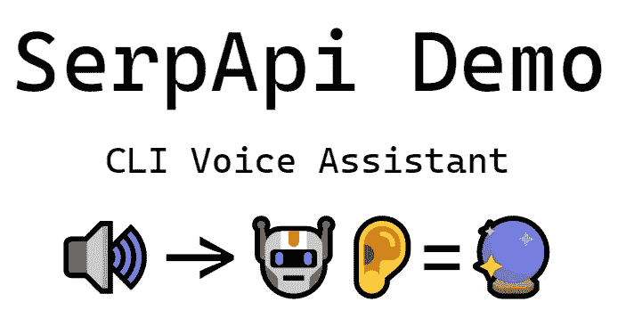
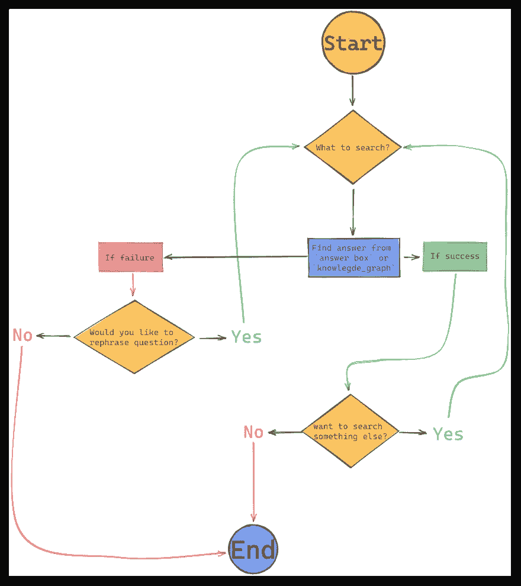

# 使用 PyAudio、语音识别、pyttsx3 和 SerpApi 构建简单的基于 CLI 的语音助手

> 原文：<https://medium.com/geekculture/build-simple-cli-based-voice-assistant-with-pyaudio-speech-recognition-pyttsx3-and-serpapi-8bf605c02565?source=collection_archive---------8----------------------->



# 介绍

正如你看到的标题，这是一个演示项目，显示了一个非常基本的语音助手脚本，可以回答你的问题，在终端基于谷歌搜索结果。

你可以在 GitHub 资源库中找到完整的代码:`[dimitryzub/serpapi-demo-projects/speech-recognition/cli-based/](https://github.com/dimitryzub/serpapi-demo-projects/tree/4789cf3c2a5cb7af6c29ba13a4222a0eec05eadf/speech-recognition/cli-based)`

后续博客帖子将会涉及:

*   基于网络的解决方案使用了 [Flask](https://flask.palletsprojects.com/en/2.2.x/) ，一些 HTML，CSS 和 Javascript。
*   使用 [Flutter](https://flutter.dev/) 和 [Dart](https://dart.dev/) 的基于 Android 和 Windows 的解决方案。

# 我们将在这篇博文中构建什么

SerpApi Voice Assistant Video Demo

# 先决条件

首先，让我们确保我们处于一个不同的环境中，并正确安装项目所需的库。最难的(可能)是安装`pyaudio`。

# 虚拟环境和库安装

在开始安装库之前，我们需要为这个项目创建并激活一个新环境:

```
# if you're on Linux based systems
$ python -m venv env && source env/bin/activate
$ (env) <path>

# if you're on Windows and using Bash terminal
$ python -m venv env && source env/Scripts/activate
$ (env) <path>

# if you're on Windows and using CMD
python -m venv env && .\env\Scripts\activate
$ (env) <path>
```

解释`python -m venv env`告诉 Python 运行模块(`[-m](https://docs.python.org/2/using/cmdline.html#cmdoption-m)` ) `[venv](https://docs.python.org/3/library/venv.html)`，创建一个名为`env`的文件夹。`&&`代表和。将激活您的环境，您将只能在该环境中安装库。

现在安装所有需要的库:

```
pip install rich pyttsx3 SpeechRecognition google-search-results
```

现在到`[pyaudio](https://pypi.org/project/PyAudio/)`。请记住，安装时`pyaudio`可能会抛出错误。你可能需要做额外的调查。

如果你在 Linux 上，我们需要[安装一些开发依赖来使用](https://stackoverflow.com/a/50409644/15164646) `[pyaudio](https://stackoverflow.com/a/50409644/15164646)`:

```
$ sudo apt-get install -y libasound-dev portaudio19-dev
$ pip install pyaudio
```

如果你在 Windows 上，那就更简单了(用 CMD 和 Git Bash 测试过):

```
pip install pyaudio
```

# 完整代码

```
import os
import speech_recognition
import pyttsx3
from serpapi import GoogleSearch
from rich.console import Console
from dotenv import load_dotenv

load_dotenv('.env')
console = Console()

def main():
    console.rule('[bold yellow]SerpApi Voice Assistant Demo Project')
    recognizer = speech_recognition.Recognizer()

    while True:
        with console.status(status='Listening you...', spinner='point') as progress_bar:
            try:
                with speech_recognition.Microphone() as mic:
                    recognizer.adjust_for_ambient_noise(mic, duration=0.1)
                    audio = recognizer.listen(mic)
                    text = recognizer.recognize_google(audio_data=audio).lower()
                    console.print(f'[bold]Recognized text[/bold]: {text}')

                    progress_bar.update(status='Looking for answers...', spinner='line')
                    params = {
                        'api_key': os.getenv('API_KEY'),
                        'device': 'desktop',
                        'engine': 'google',
                        'q': text,
                        'google_domain': 'google.com',
                        'gl': 'us',
                        'hl': 'en'
                    }
                    search = GoogleSearch(params)
                    results = search.get_dict()

                    try:
                        if 'answer_box' in results:
                            try:
                                primary_answer = results['answer_box']['answer']
                            except:
                                primary_answer = results['answer_box']['result']
                            console.print(f'[bold]The answer is[/bold]: {primary_answer}')
                        elif 'knowledge_graph' in results:
                            secondary_answer = results['knowledge_graph']['description']
                            console.print(f'[bold]The answer is[/bold]: {secondary_answer}')
                        else:
                            tertiary_answer = results['answer_box']['list']
                            console.print(f'[bold]The answer is[/bold]: {tertiary_answer}')

                        progress_bar.stop() # if answered is success -> stop progress bar.
                        user_promnt_to_contiune_if_answer_is_success = input('Would you like to to search for something again? (y/n) ')

                        if user_promnt_to_contiune_if_answer_is_success == 'y':
                            recognizer = speech_recognition.Recognizer()
                            continue # run speech recognizion again until `user_promt` == 'n'
                        else:
                            console.rule('[bold yellow]Thank you for cheking SerpApi Voice Assistant Demo Project')
                            break
                    except KeyError:
                        progress_bar.stop()
                        error_user_promt = input("Sorry, didn't found the answer. Would you like to rephrase it? (y/n) ")

                        if error_user_promt == 'y':
                            recognizer = speech_recognition.Recognizer()
                            continue # run speech recognizion again until `user_promt` == 'n'
                        else:
                            console.rule('[bold yellow]Thank you for cheking SerpApi Voice Assistant Demo Project')
                            break
            except speech_recognition.UnknownValueError:
                progress_bar.stop()
                user_promt_to_continue = input('Sorry, not quite understood you. Could say it again? (y/n) ')

                if user_promt_to_continue == 'y':
                    recognizer = speech_recognition.Recognizer()
                    continue # run speech recognizion again until `user_promt` == 'n'
                else:
                    progress_bar.stop()
                    console.rule('[bold yellow]Thank you for cheking SerpApi Voice Assistant Demo Project')
                    break

if __name__ == '__main__':
    main()
```

# 代码解释

导入库:

```
import os
import speech_recognition
import pyttsx3
from serpapi import GoogleSearch
from rich.console import Console
from dotenv import load_dotenv
```

*   `[rich](https://github.com/Textualize/rich)` Python 库，用于在终端中进行漂亮的格式化。
*   `[pyttsx3](https://github.com/nateshmbhat/pyttsx3)` Python 的文本到语音转换器，离线工作。
*   `[SpeechRecognition](https://github.com/Uberi/speech_recognition)` Python 库将语音转换为文本。
*   `[google-search-results](https://github.com/serpapi/google-search-results-python)` SerpApi 的 Python API 包装器，可解析来自 15 个以上搜索引擎的数据。
*   `[os](https://docs.python.org/3/library/os.html)`读取秘密环境变量。在这种情况下，它是 SerpApi API 密钥。
*   `[dotenv](https://github.com/theskumar/python-dotenv)`从`.env`文件加载您的环境变量(SerpApi API key)。`.env`文件可以重命名为任何文件:`.napoleon` `.`(点)代表一个环境变量文件。

定义`rich` `[Console()](https://rich.readthedocs.io/en/stable/console.html)`。它将用于美化终端输出(动画等):

```
console = Console()
```

定义`main`功能，所有功能将在此发生:

```
def main():
    console.rule('[bold yellow]SerpApi Voice Assistant Demo Project')
    recognizer = speech_recognition.Recognizer()
```

在函数的开始，我们定义`speech_recognition.Recognizer()`和`console.rule`将产生以下输出:

```
───────────────────────────────────── SerpApi Voice Assistant Demo Project ─────────────────────────────────────
```

下一步是创建一个 while 循环，该循环将持续监听麦克风输入以识别语音:

```
while True:
    with console.status(status='Listening you...', spinner='point') as progress_bar:
        try:
            with speech_recognition.Microphone() as mic:
                recognizer.adjust_for_ambient_noise(mic, duration=0.1)
                audio = recognizer.listen(mic)

                text = recognizer.recognize_google(audio_data=audio).lower()
                console.print(f'[bold]Recognized text[/bold]: {text}')
```

*   `[console.status](https://github.com/Textualize/rich/blob/5f4e93efb159af99ed51f1fbfd8b793bb36448d9/rich/console.py#L1144-L1163)` -一个`rich`进度条，仅用于修饰目的。
*   `speech_recognition.Microphone()`开始从麦克风拾取输入。
*   `[recognizer.adjust_for_ambient_noise](https://github.com/Uberi/speech_recognition/blob/353d4ef74a55082de1f32796601899506d1b8bc7/speech_recognition/__init__.py#L560-L567)`旨在用环境能量水平校准能量阈值。
*   `[recognizer.listen](https://github.com/Uberi/speech_recognition/blob/353d4ef74a55082de1f32796601899506d1b8bc7/speech_recognition/__init__.py#L636-L649)`监听实际的用户文本。
*   `[recognizer.recognize_google](https://github.com/Uberi/speech_recognition/blob/353d4ef74a55082de1f32796601899506d1b8bc7/speech_recognition/__init__.py#L859-L874)`使用 Google 语音识别 API 执行语音识别。`lower()`是降低识别文本。
*   `console.print`一条`rich` `print`语句，允许使用文本修改，如添加**粗体**、*斜体*等。

`spinner='point'`将产生如下输出([使用](https://github.com/Textualize/rich/blob/5f4e93efb159af99ed51f1fbfd8b793bb36448d9/rich/console.py#L1157) `[python -m rich.spinner](https://github.com/Textualize/rich/blob/5f4e93efb159af99ed51f1fbfd8b793bb36448d9/rich/console.py#L1157)` [查看](https://github.com/Textualize/rich/blob/5f4e93efb159af99ed51f1fbfd8b793bb36448d9/rich/console.py#L1157) `[spinners](https://github.com/Textualize/rich/blob/5f4e93efb159af99ed51f1fbfd8b793bb36448d9/rich/console.py#L1157)`列表):


之后，我们需要为搜索初始化 SerpApi 搜索参数:

```
progress_bar.update(status='Looking for answers...', spinner='line') 
params = {
    'api_key': os.getenv('API_KEY'),  # serpapi api key   
    'device': 'desktop',              # device used for 
    'engine': 'google',               # serpapi parsing engine: https://serpapi.com/status
    'q': text,                        # search query 
    'google_domain': 'google.com',    # google domain:          https://serpapi.com/google-domains
    'gl': 'us',                       # country of the search:  https://serpapi.com/google-countries
    'hl': 'en'                        # language of the search: https://serpapi.com/google-languages
    # other parameters such as locations: https://serpapi.com/locations-api
}
search = GoogleSearch(params)         # where data extraction happens on the SerpApi backend
results = search.get_dict()           # JSON -> Python dict
```

`progress_bar.update`将使用新的`status`更新`progress_bar`(文本打印在控制台中)，并且`spinner='line'`将生成以下动画:


之后，使用 SerpApi 的[谷歌搜索引擎 API](https://serpapi.com/search-api) 从谷歌搜索中提取数据。

代码的以下部分将执行以下操作:



```
try:
    if 'answer_box' in results:
        try:
            primary_answer = results['answer_box']['answer']
        except:
            primary_answer = results['answer_box']['result']
        console.print(f'[bold]The answer is[/bold]: {primary_answer}')

     elif 'knowledge_graph' in results:
            secondary_answer = results['knowledge_graph']['description']
            console.print(f'[bold]The answer is[/bold]: {secondary_answer}')
        else:
            tertiary_answer = results['answer_box']['list']
            console.print(f'[bold]The answer is[/bold]: {tertiary_answer}')
        progress_bar.stop()  # if answered is success -> stop progress bar

        user_promnt_to_contiune_if_answer_is_success = input('Would you like to to search for something again? (y/n) ')

        if user_promnt_to_contiune_if_answer_is_success == 'y':
            recognizer = speech_recognition.Recognizer()
            continue         # run speech recognizion again until `user_promt` == 'n'
        else:
            console.rule('[bold yellow]Thank you for cheking SerpApi Voice Assistant Demo Project')
            break

    except KeyError:
        progress_bar.stop()  # if didn't found the answer -> stop progress bar
        error_user_promt = input("Sorry, didn't found the answer. Would you like to rephrase it? (y/n) ")

        if error_user_promt == 'y':
            recognizer = speech_recognition.Recognizer()
            continue         # run speech recognizion again until `user_promt` == 'n'
        else:
            console.rule('[bold yellow]Thank you for cheking SerpApi Voice Assistant Demo Project')
            break
```

最后一步是处理麦克风没有声音时的错误:

```
# while True:
#     with console.status(status='Listening you...', spinner='point') as progress_bar:
#         try:
            # speech recognition code
            # data extraction code
        except speech_recognition.UnknownValueError:
                progress_bar.stop()         # if didn't heard the speech -> stop progress bar
                user_promt_to_continue = input('Sorry, not quite understood you. Could say it again? (y/n) ')

          if user_promt_to_continue == 'y':
              recognizer = speech_recognition.Recognizer()
              continue               # run speech recognizion again until `user_promt` == 'n'
          else:
              progress_bar.stop()    # if want to quit -> stop progress bar
              console.rule('[bold yellow]Thank you for cheking SerpApi Voice Assistant Demo Project')
              break
```

`console.rule()`将提供以下输出:

```
───────────────────── Thank you for cheking SerpApi Voice Assistant Demo Project ──────────────────────
```

添加`if __name__ == '__main__'`习语，防止用户在无意中意外调用某些脚本，并调用`main`函数运行整个脚本:

```
if __name__ == '__main__':
    main()
```

# 链接

*   `[rich](https://github.com/Textualize/rich)`
*   `[pyttsx3](https://github.com/nateshmbhat/pyttsx3)`
*   `[SpeechRecognition](https://github.com/Uberi/speech_recognition)`
*   `[google-search-results](https://github.com/serpapi/google-search-results-python)`
*   `[os](https://docs.python.org/3/library/os.html)`
*   `[dotenv](https://github.com/theskumar/python-dotenv)`

加入我们的[Twitter](https://twitter.com/serp_api)|[YouTube](https://www.youtube.com/channel/UCUgIHlYBOD3yA3yDIRhg_mg)

添加一个[特征请求](https://github.com/serpapi/public-roadmap/issues)💫还是一个 [Bug](https://github.com/serpapi/public-roadmap/issues) 🐞