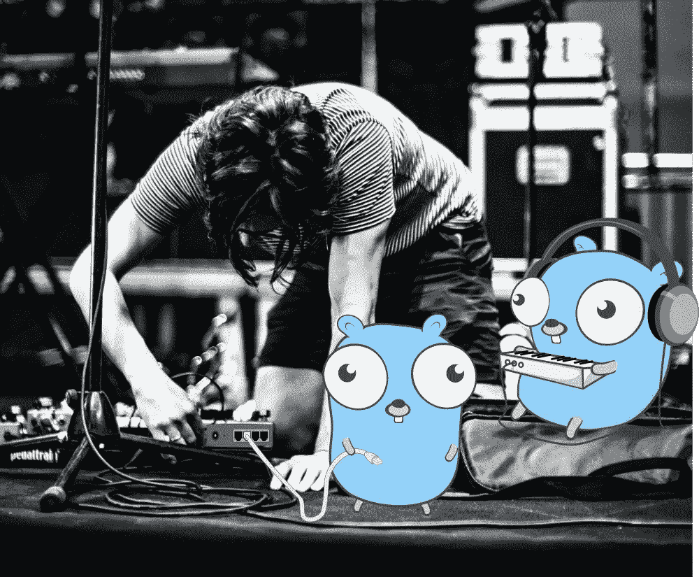

# 使用套接字模式在 Golang 中构建松弛应用程序—设置

> 原文：<https://medium.com/geekculture/build-slack-application-in-golang-using-socket-mode-setting-up-57f454e63c0a?source=collection_archive---------8----------------------->

## GOLANG SLACKBOT 教程

## 每个 Slack 应用程序都是从几个简单的步骤开始的。

Photo by [Adi Goldstein](https://unsplash.com/@adigold1?utm_source=medium&utm_medium=referral) on [Unsplash](https://unsplash.com?utm_source=medium&utm_medium=referral), Gopher by [Egon Elbre](https://github.com/egonelbre).

一个月前，我开始撰写关于构建 Slack 机器人的文章，并决定继续这个系列，直到涵盖 Slack 提供的所有内容。我很快注意到我可能会重复…