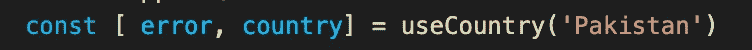
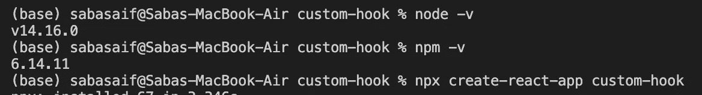
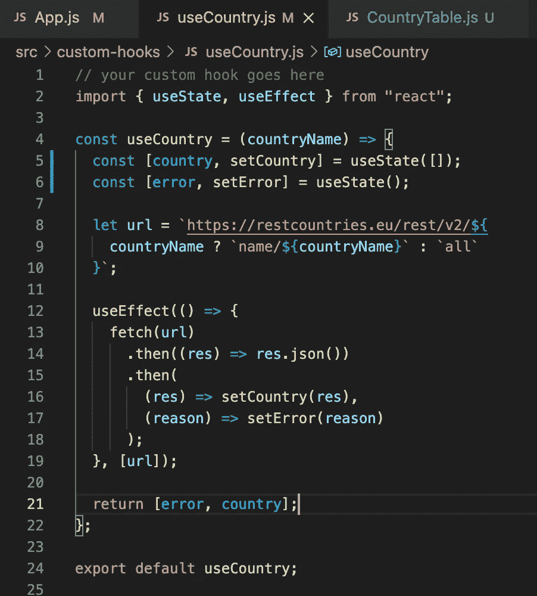
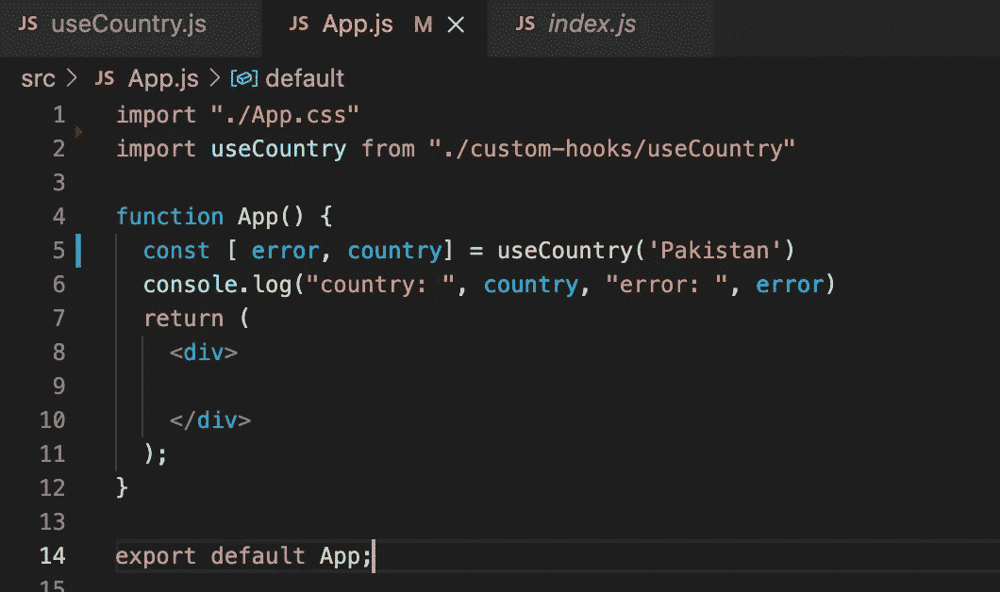

# 构建您的第一个 React 自定义挂钩

> 原文：<https://medium.com/geekculture/build-your-first-react-custom-hook-5d61a5355510?source=collection_archive---------63----------------------->

picture: [Morioh](https://morioh.com/p/50fc89d6e2b6)

# 我们为什么需要钩子？

之前，react 提供了*道具渲染*和*高阶组件*，使得你的代码可以重用。但是很难理解和理解。在 react 中需要使用钩子，这基本上允许你重用**有状态逻辑**而不干扰你的组件层次结构。它允许你将代码分割成更小的函数。商店中已经有一些钩子可供使用，例如，useEffect、useState、useContext。你可以打电话给他们，然后你就可以走了。

但是随着你的代码变得复杂，你需要对它有更多的控制，你可以通过**创建你自己的定制钩子**来实现，它与你自己的项目需求相一致。让我们开始吧:

# **我们在创造什么？**

在本教程中，我们将创建一个自定义钩子来从 API 获取国家数据。我们将使用[国家 API](https://restcountries.eu/) 。

1.  如果没有争议，我们将获取并返回所有国家。
2.  如果参数中给出了国家名称，我们将只返回该国家的数据。
3.  自定义挂钩的用法示例:

# **先决条件:**

对于本教程，我们将假设您已经熟悉 Javascript 和 React 的基本概念。

# 教程的设置:

**custom-hook** 是我的 react-app 的名字，你可以取任何名字。创建应用程序后，您可以将目录更改为您的应用程序，并运行“yarn start”来检查您的应用程序是否正在 localhost 上的浏览器中运行。

接下来，在 src 文件夹中创建 **useCountry.js** 。

注意:你必须在钩子上使用“use”关键字，这样 react 就可以识别出这是一个钩子。

第一步:为你的钩子编写功能。

注意:你可以在你的定制钩子中使用其他钩子。

**第二步:**在主组件中调用并析构你的钩子。

**第三步:**运行代码。

现在你可以在浏览器控制台中看到你的第一个定制钩子的响应。

钩子的代码也可以在 [Github](https://github.com/SabaSaif-github/custom-hook) 上找到。如有任何疑问，请随时评论！

在下一集，您将学习如何借助 Material-UI 将 API 响应渲染到一个表格中。

> [https://Saba-Saif . medium . com/designing-in-react-app-with-material-ui-2663 be 0 e 43 a 6](https://saba-saif.medium.com/designing-in-react-app-with-material-ui-2663be0e43a6)