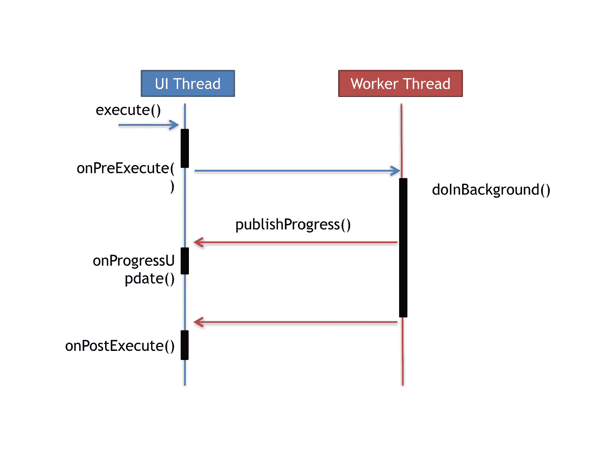

# 异步挑战

> 原文：<https://medium.com/geekculture/build-your-own-asynctask-fcfc4aaf0225?source=collection_archive---------4----------------------->

## 创建并执行您自己的 AsyncTask。

by [Chetan Gupta](https://medium.com/u/54fbf878c2f4?source=post_page-----fcfc4aaf0225--------------------------------)

几十年来，`AysncTask`一直是在 Android 中编写并发代码的最广泛使用的解决方案之一，现在即使它被弃用，知道如何自己复制相同的功能也是很好的。

所以，在这篇文章中，我尝试实现我自己的`AsyncTask`，在浏览文章之前——试着自己实现它，并考虑提交你的 Github 的链接。

让我们继续…

一个`AsyncTask`实现的一个常见的事情是，它在一个`background thread`上运行一个任务，其结果在`UI thread`上发布。

> AsyncTask 使用的三种输入类型如下:
> 1。`*Params*`:任务执行时发送给任务的参数类型
> 2。`*Progress*`:后台发布的进度单位类型。计算
> 3。`*Result*`:背景计算结果的类型

我们知道成功实施`AsyncTask`的 4 个主要步骤是:

1.  `onPreExecute`:在执行任何任务之前，在`UI Thread`上调用
2.  `doInBackground(Params..)`:在`onPreExecute`执行完毕后，立即在`background thread`上调用
3.  `onProgressUpdate(Progress…)`:在`UI Thread`上调用，显示执行任务的进度
4.  `onPostExecute(Result…)`:在`UI Thread`上调用，在`doInBackground()`执行完毕后立即发布结果

Fig. 1.1 Internal working of an AsyncTask

因此，`AsyncTask`合同的实现如下:

`AsyncTaskResolver`类将这 4 个步骤实现为类中的**抽象函数**，稍后将从`execute()`方法中触发，该方法基本上是异步操作的触发点。

为了让这些方法`onPreExecute()`、`onProgressUpdate()`和`onPostExecute()`在`UI Thread`上被调用，我使用了`Handler`(它允许你从`background thread`与`UI thread`进行通信)。

为后台执行生成新线程的类如下所示:

为了在后台执行任务，我使用具有两个主要功能的`ThreadSpawner`类生成了一个后台线程——T8 和 T9。

`execute()`函数以 lambda 函数`task`为参数，负责启动线程执行。

在`execute()`方法中，我们创建了一个新线程，它在**开始**时触发 lambda。`execute()`正在返回`ThreadSpawner`类的**当前实例**，这对实现函数的**链接**很有用。

为了彻底关闭线程，我们在`ThreadSpawner`类中有`cancel()`方法，它调用`Thread.interrupt()`来停止线程。

> 注意:`Thread.stop()`已被弃用，因为它本身就不安全。

现在，您可以使用活动中的`AsyncTask`来安排任务了:

使用`execute()`功能触发`AsyncTask`，使用`cancel()`功能终止任务；

我知道有上百种更好的方法来设计 API，但这是我想到的最少的方法，下面附有代码的链接，如果你有建议和改进，请打开一个关于知识库的 PR。随时欢迎投稿和建议…

 [## pooja-srivs/CustomAsyncTask

### 在 GitHub 上创建一个帐户，为 pooja-srivs/CustomAsyncTask 开发做贡献。

github.com](https://github.com/pooja-srivs/CustomAsyncTask) 

# 社区提交的内容

以下是来自开发人员社区的提交列表:

## 切坦·古普塔

提交了 AsyncTask 挑战，使用了**处理线程**并改进了用于**错误处理**的 API，他的提交如下

 [## ch8n/异步任务器

### 你好朋友们。🙌，欢迎来到我的编码游乐场！继续四处探索👩‍💻如果你发现什么，一定要让我知道…

github.com](https://github.com/ch8n/AsyncTasker) 

他还在发表了大量关于 Kotlin 和 Android 的文章

 [## 机器人咬|大脑瓜-科特林|切坦·古普塔

### 使用本地技术设计和开发现代 android 应用程序，使用 Kotlin 和 Java 同步提高工作效率…

chetangupta.net](https://chetangupta.net) 

# [AndroidDeveloperLB](https://medium.com/u/d36fab545633?source=post_page-----fcfc4aaf0225--------------------------------)

提交的挑战和他的解决方案包括:
——可以在任何地方创建和执行。不仅仅是主线程，UI 线程
——可以通过生命周期
自动取消——只有一个值需要处理:结果。对于参数和进度，您可以添加自己的实现

 [## AndroidDeveloperLB/AsyncTaskEx

### 一个 AsyncTask 的修改版本，在 Kotlin 中，使用一些简单的类删除了一些内容，添加了一些内容…

github.com](https://github.com/AndroidDeveloperLB/AsyncTaskEx)