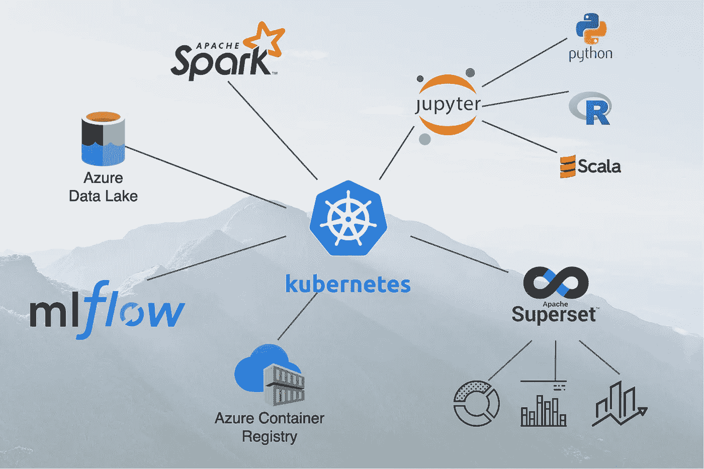
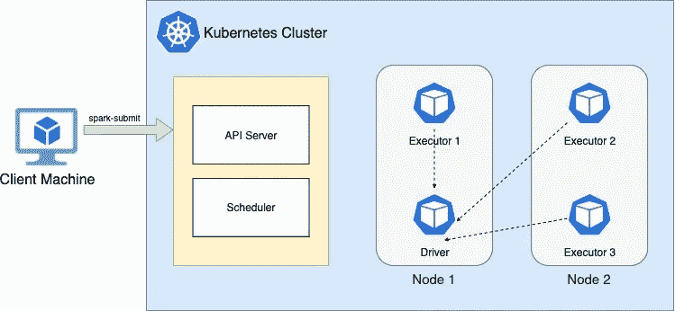
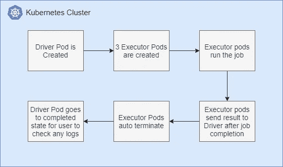

# 构建您自己的大数据生态系统—第 1 部分

> 原文：<https://medium.com/geekculture/build-your-own-big-data-ecosystem-part-1-a19e4c778632?source=collection_archive---------2----------------------->

## 详细的演练

## 在 Kubernetes 上运行火花



数据是我们如今所做的一切不可或缺的一部分。几乎我们周围的一切都以某种形式产生数据。只有当我们能够从中提取有意义的见解时，这些数据才对我们有用。这就是数据分析的用武之地。我们有很多产品可以满足我们的大数据需求，但它们通常需要高昂的许可成本。

在这个多部分系列中，我们将尝试使用所有开源工具创建我们自己的云不可知大数据生态系统。

典型的大数据生态系统由以下部分组成

*   运行大数据查询的核心数据分析引擎
*   交互式创建查询的笔记本/UI 界面
*   具有底层数据湖的通信信道
*   管理 ML 模型生命周期的框架
*   创建图表的可视化工具

Spark 以其高查询性能而闻名，并作为底层数据分析引擎广泛应用于许多成功的产品中，如 AWS EMR、Databricks、Cloudera 等。我们也将使用 **Spark 作为我们的数据分析引擎**

为了使生态系统与底层基础设施分离，我们将在 **Kubernetes** 上运行它，这样我们就可以在任何我们想要的地方运行它，并随时扩展它。从 2.3 版本开始，Spark 可以在 Kubernetes 上运行。

## 简而言之，这篇博文

我们将从官方的 Spark 发行版创建一个 Spark Docker 映像。然后，我们将在 Azure 中创建一个 Kubernetes 集群，并使用上面创建的 Docker 映像在集群中运行 spark driver 和 executor pods。我们将在集群模式下运行一个样例 Spark 作业来计算这个 Kubernetes 集群中的 Pi 值。

# 先决条件

虽然我们可以使用 windows 机器来设置一切，但我强烈建议使用基于 Ubuntu 的机器，以获得更大的支持和易用性。

以下内容需要存在于您的开发机器中(如果没有使用云外壳)

*   [码头工人](https://docs.docker.com/engine/install/ubuntu/)
*   [库贝克特尔](https://kubernetes.io/docs/tasks/tools/install-kubectl/)
*   [minikube](https://minikube.sigs.k8s.io/docs/start/) (仅当您计划在本地系统上运行 Kubernetes 时)
*   [Java-11](https://www.digitalocean.com/community/tutorials/how-to-install-java-with-apt-on-ubuntu-18-04)
*   [Docker 容器注册表](https://azure.microsoft.com/en-in/services/container-registry/) (ACR / ECR / Docker Hub 等。)

> 我使用过 Azure 的云外壳来运行我的大部分命令。这减少了设置所需的二进制文件的工作量，如 Java、az cli、kubectl、python 等，因为它们已经预先安装好了。

# Spark + Kubernetes —一些基本要素



The execution model of Spark on Kubernetes

Spark 架构有 3 个主要部分。

*   **驱动程序** — *负责将一个传入的 spark 任务分解成更小的垃圾，并管理这些垃圾的执行*
*   **执行者** — *负责运行整个任务中的一个单独部分，并将结果报告给驱动程序。*
*   **集群管理器** — *负责管理 Spark 驱动程序和执行器运行的底层基础设施*

传统上，Spark 使用 Yarn、Mesos 和独立的集群管理器，但从 Spark 2.3 开始，Spark 包含了对 Kubernetes 的支持，并充当其集群管理器。

在我们的用例中，Kubernetes 调度程序负责在可用的节点中创建适当的驱动程序和执行器 pod。

我们可以在两种 Spark 模式、集群模式和客户端模式下执行作业。在这篇博客文章中，我们将介绍**集群模式**，在这种模式下，我们使用 **spark-submit 向 Kubernetes** 集群提交一个作业，该集群在运行中创建 spark 上下文、驱动程序和执行器 pod。

在本系列的第 2 部分中，我们将更深入地研究客户机模式。

# **步骤 1——创建 Spark Docker 图像**

在这一步，我们将创建支持 pyspark 的 Spark Docker 映像。我们将在 Kubernetes pods 上使用这张图片。

## 下载并提取 Spark

运行下面的 curl 命令下载编译后的火花分布。或者，您也可以在 web 浏览器中访问 URL 并开始下载。

```
curl [https://mirrors.estointernet.in/apache/spark/spark-3.0.1/spark-3.0.1-bin-hadoop3.2.tgz](https://mirrors.estointernet.in/apache/spark/spark-3.0.1/spark-3.0.1-bin-hadoop3.2.tgz) --output spark-3.0.1-bin-hadoop3.2.tgz
```

在撰写本文时，Spark 版本的最新可用版本是 3.0.1，Hadoop 版本是 3.2

下载后，解压下载的 zip 文件

```
tar -xvzf spark-3.0.1-bin-hadoop3.2.tgz
```

## 构建 Spark Docker 映像

Spark 附带了一个内置脚本“docker-image-tool.sh ”,它为我们创建了 docker 映像。在提取的文件夹的根级别中，运行以下命令。

```
./bin/docker-image-tool.sh -r <<docker registry url>> -t v3.0.1-j11 -p kubernetes/dockerfiles/spark/bindings/python/Dockerfile -b java_image_tag=11-jre-slim build
```

> 注意—需要在运行脚本的机器上安装 Docker。

在上面的命令中，我们使用如下参数执行 docker-image-tool.sh

*   **-r** 用于 docker 注册表
*   **-t** 是输出 docker 图像的标签
*   **-p** 是实际 Docker 文件的路径。我们使用上面的 python Dockerfile，它应该出现在给定的路径中。这增加了对 pyspark 的支持。
*   **-b** 是我们想要发送到 Dockerfile 的构建参数。在我们的例子中，我们提到了要用作 11-jre-slim 的 java 基础映像

在成功执行 docker-image-tool.sh 之后，您应该会在本地注册表中看到 2 个 docker 图像。一个名为< <docker registry="" url="">>/spark，另一个名为< <docker registry="" url="">>/spark-py</docker></docker>

由于我们计划在接下来的部分中运行 python 查询，我们将在后续步骤中使用图像 spark-py

## 将映像推送到容器注册表中

下一步是将 docker 映像推送到 Docker 存储库。在这篇文章的后半部分，我们将在运行 spark-submit 命令时引用图像的这个位置。

```
docker push <<docker registry url>>/spark-py:v3.0.1-j14
```

# 步骤 2 —创建 Kubernetes 集群

既然我们的 Spark docker 映像已经准备好了，是时候启动 Kubernetes 集群来运行 Spark 了。

我使用 Azure Kubernetes 服务在 Azure 上创建一个集群。但是由于这种方法并不真正关心您的集群在哪里，您可以将它部署到您选择的位置。

创建一个 AKS 集群，遵循这个来自微软的[官方文档](https://docs.microsoft.com/en-us/azure/aks/kubernetes-walkthrough-portal)。

## 设置 kubectl

我们的第一个任务是配置 kubectl 来连接到我们的集群。kubectl 处理通常位于$HOME/的 kubeconfig 文件。kube 文件夹。各种各样的 Kubernetes 服务提供了不同的方式来配置 kubectl，以便与集群一起工作。

对于 AKS 集群，运行下面的 az-cli 命令使 kubectl 指向它。

```
az aks get-credentials --resource-group myResourceGroup --name myAKSCluster
```

> **注意**——如果您从本地系统运行上述命令，您需要在运行之前运行“ **az 登录**

您可以直接在 Azure cloud shell 上运行这个命令，并在那里开始使用 kubectl。

## 创建一个 Kubernetes 名称空间

接下来，我们在集群中创建一个名称空间。虽然我们可以使用默认的名称空间，但是当我们将许多其他工具作为同一个集群的一部分进行部署时，它被证明是一种更好、更具可伸缩性的方法。

要创建命名空间，请运行以下命令

```
kubectl create namespace spark
```

## 创建一个服务帐户并为其绑定一个角色

作为 Spark 执行周期的一部分，驱动程序单元需要通过在需要时创建和删除单元来改变集群的状态。因此，我们需要 Kubernetes 中的一个服务帐户，它将对集群拥有编辑权限。我们将使用这个帐户运行我们的 spark-submit 命令。

```
kubectl create serviceaccount spark --namespace=sparkkubectl create clusterrolebinding spark-role --clusterrole=edit --serviceaccount=spark:spark --namespace=spark
```

我们在 spark 名称空间中创建一个名为“spark”的服务帐户，集群角色为 edit。

## 在 Docker 注册表上分配图像提取权限

为了在 pods 中创建容器，Kubernetes 需要访问您的 docker 注册中心来提取 docker 图像。为此，我们在集群中使用凭据创建一个密码，然后将该密码与我们在上一步中创建的服务帐户相关联。

> **注意** —在创建 AKS 集群时，我们可以通过创建向导将 Azure 容器注册中心与它关联起来。如果您已经这样做了，您可以跳过这一步

运行下面的命令来创建密码

```
kubectl create secret docker-registry docker-repo-access --namespace=spark --docker-server=<<docker registry url>> --docker-username=<<username>> --docker-password=<<password>>
```

> **注意** —如果您在 Azure 之外的集群中使用 ACR，您可以在 AAD 中创建一个服务主体，在 ACR 上为其提供 ACR 拉角色，并使用服务主体的客户端 id &客户端机密来代替用户名&密码

将密码分配给我们的服务帐户

```
kubectl patch serviceaccount spark -p '{"imagePullSecrets": [{"name": "docker-repo-access"}]}' -n spark
```

# 步骤 3 —在集群上运行 Spark 作业

通过我们在步骤 2 中执行的所有操作，我们的集群现在已经准备好运行一个 spark 作业。

最后，是时候在这个集群上运行我们的第一个 Spark 作业了。

如果您从 Azure cloud shell 运行，请在新选项卡中打开另一个 shell，并运行下面的命令来打开与 IP 地址为 127.0.0.1:8001 的集群的代理连接

```
kubectl proxy
```

然后使用命令 spark-submit 来运行我们的作业。

```
./bin/spark-submit --master k8s://http://127.0.0.1:8001 --deploy-mode cluster --name spark-pi --class org.apache.spark.examples.SparkPi --conf spark.executor.instances=3 --conf spark.kubernetes.authenticate.driver.serviceAccountName=spark --conf spark.kubernetes.container.image=ascendonk8s.azurecr.io/spark-py:v3.0.1-j14 local:///opt/spark/examples/jars/spark-examples_2.12-3.0.1.jar 1000
```

*   这是我们集群的 API 服务器的 URL。k8s://是 Spark 用来将 URL 标识为 Kubernetes 集群端点的约定。
*   `--name`这是我们为我们的 Spark 工作想要的名称
*   `--class`这是入口点 Java 类，我们的执行将从这里开始
*   `--conf`使用它，我们可以提供我们需要的 executor pods 的数量、我们希望与 pod 关联的服务帐户以及用于启动 pod 的容器映像方面的详细信息。
*   `local://`这是一个约定，告诉 spark 我们工作的代码包存在于容器本身中。使用它，我们指定需要运行名为 spark-examples _ 2.12–3 . 0 . 1 . jar 的 jar 文件，该文件位于映像中相应的路径。

提交命令后，您可以使用下面的命令在集群单元上放置一个观察器

```
watch kubectl get pods -n spark
```

豆荚的生命周期如下



Pod life-cycle

如果你能在上面的“观察”命令中看到豆荚按照这个生命周期来来去去，那就意味着一切顺利。

对于我们最后的验证，我们使用下面的命令检查驱动程序的日志

```
kubectl logs <<driver_pods_name>>
```

您应该会在输出中看到如下一行

```
Pi is roughly 3.152155760778804
```

至此，我们结束了第一部分。我们现在已经为我们的生态系统打下了基础。

在下一部分中，我们将探索在集群中使用 Jupyter 笔记本在客户机模式下运行交互式 Spark 查询。

# 参考

*   [在 Kubernetes 官方 Spark 文档上运行 Spark](https://spark.apache.org/docs/latest/running-on-kubernetes.html#:~:text=Spark%20can%20run%20on%20clusters,configuration%2C%20container%20images%20and%20entrypoints.)
*   在 AKS 上运行 Apache Spark 作业。微软官方文档
*   [Ola 使用类似方法进行数据分析的使用案例](https://tech.olx.com/running-spark-on-kubernetes-a-fully-functional-example-and-why-it-makes-sense-for-olx-d56b6a61fcbe)