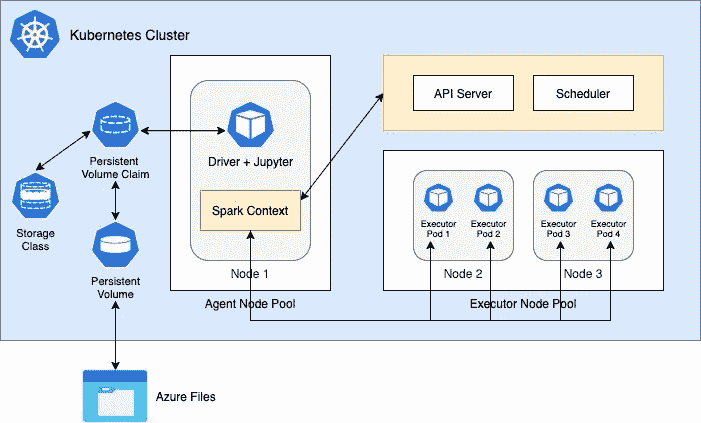

# 构建您自己的大数据生态系统—第 2 部分

> 原文：<https://medium.com/geekculture/build-your-own-big-data-ecosystem-part-2-94c99dc3617?source=collection_archive---------13----------------------->

## 详细的演练

## 在 Kubernetes 上用 Spark 设置 Jupyter 笔记本


Jupyter Notebook 是所有数据科学相关活动的首选 IDE。它是全球大多数数据科学家和数据工程师的首选工具。Jupyter 笔记本为运行 Spark 提供了非常好的支持，毫无疑问也将成为我们生态系统的 IDE。

在本系列的第一部分中，我们了解了如何在 Kubernetes 上设置 Spark 的运行实例。在本文中，让我们探索在同一个 Kubernetes 集群中设置 Jupyter notebook，并将其与我们的 Spark 实例挂钩。

## 简而言之，这个博客

我们将在之前的帖子([第 1 部分](/geekculture/build-your-own-big-data-ecosystem-part-1-a19e4c778632))的基础上，采取以下措施将 Jupyter Notebook 集成到我们的集群中。

*   为 Azure 文件服务创建存储类以存储我们的笔记本
*   为将此存储类附加到我们的驱动程序 pod 创建一个永久卷声明
*   创建一个部署来启动副本集、驱动程序单元和一个便于驱动程序和执行器单元之间通信的服务。
*   从笔记本用户界面创建一个 Spark 上下文，并查看实时运行的 executor 窗格。

# 先决条件

*   运行中的 Kubernetes 星团。(参见[第一部分](/geekculture/build-your-own-big-data-ecosystem-part-1-a19e4c778632))
*   Spark 工作节点的 Docker 映像。(参见[第一部分](/geekculture/build-your-own-big-data-ecosystem-part-1-a19e4c778632))
*   基本了解 [Kubernetes 部署](https://kubernetes.io/docs/concepts/workloads/controllers/deployment/)、[持久卷](https://kubernetes.io/docs/concepts/storage/persistent-volumes/)和[存储类](https://kubernetes.io/docs/concepts/storage/storage-classes/)

> 我已经用 Azure 的云 Shell 运行了我的大部分命令，并且还使用了 AKS 集群。我将使用 Azure 文件作为我们的持久数据存储，但你可以选择一个适合你的需求。

# Jupyter + Spark + Kubernetes —一些基本原理



The execution model of Jupyter + Spark on Kubernetes

运行 Jupyter 笔记本意味着我们不会直接在集群上发出 spark-submit 命令，而是从 k8s 集群内部创建 spark 上下文，然后发出分析查询。这种操作模式被称为在 [**客户端模式**](https://spark.apache.org/docs/2.4.5/running-on-kubernetes.html#client-mode) 中运行 Spark。

在这里，我们通过预装在 Jupyter 笔记本上的独立 docker 映像来明确启动我们的驱动程序 pod。然后，我们创建一个 Spark 上下文，指定 pod 的数量、它们的内存和计算需求、executor docker 映像位置和其他配置。Spark context 负责与 Kubernetes 调度程序对话以请求所需的 Pods，并与 Pods 对话以在其上执行单独的命令。

一个 Pod 本质上是无状态和短暂的。我们不能保证我们运行 Spark driver 和 Jupyter 笔记本的 pod 会一直可用。因此，我们需要一种机制，将 Pod 连接到商店并保存笔记本的状态，这样即使 Pod 由于间歇性故障而重新启动，我们也不会丢失笔记本和代码。为了实现这一点，我们在 Kubernetes 中创建了一个持久的卷声明，并将其连接到 Azure 文件共享。

# 步骤 1 —创建预装在 Jupyter 中的 Spark 驱动程序映像

使用下面的 docker 文件生成带有 Jupyter 笔记本的 Spark 驱动程序容器。

驱动程序和执行器 spark pods 的 python 版本必须相同。我们在[第 1 部分](/geekculture/build-your-own-big-data-ecosystem-part-1-a19e4c778632)中使用 Spark 版本 3.0.1 构建的 Spark 映像是 Python 3.7 附带的，因此我们将 Python 3.7 作为基础映像，然后在其上安装所有需要的依赖项。

Jupyter 的默认安装附带了一个特定 auth 令牌的身份验证机制，我们必须将它与 UI 端点结合使用。我们修改该行为，要求输入密码，并在 docker 文件中设置默认密码。这样，我们不必在每次生成或重启驱动程序 pod 时都获取令牌。

Dockerfile for deploying Jupyter Notebook with Spark and Python

在保存 docker 文件的同一文件夹中创建一个 requirements.txt 文件。添加所有需要安装的 python 库，如下所示。

```
jupyter
jupyterlab
matplotlib
numpy
pandas
```

使用下面的命令从上面的 docker 文件创建 docker 映像。

```
docker build --tag="<your_container_registry>/jupyter-spark:pybase" .
```

# 步骤 2 创建 Kubernetes 存储类

下面是创建与 Azure 文件存储相对应的存储类的 YAML 文件。

运行以下命令创建存储类。

```
kubectl apply -f azure_sc.yaml
```

# 步骤 3:创建永久卷声明

我们使用下面的 yaml 文件在集群中创建一个持久卷声明，并指定之前在其中创建的存储类。然后，我们将此 PVC 与我们作为整体部署的一部分创建的驱动程序单元相关联。

运行以下命令创建存储类

```
kubectl apply -f azure_sc.yaml
```

# 步骤 4-为 pod 和服务创建部署。

最后，我们创建一个 Kubernetes 部署，它创建一个在其中运行 Jupyter 的驱动程序 pod 和一个服务，该服务将充当驱动程序和执行器 pod 之间的通信层。

使用以下命令运行部署。

```
kubectl apply -f driver_deployment.yaml
```

# 看到这一切走到一起

一旦您创建了部署，您将会看到为我们的驱动程序创建了一个 pod。运行 kubectl get all 应该会给出以下输出。

```
$ kubectl get all -n sparkNAME                                         READY   STATUS    RESTARTS   AGEpod/my-notebook-deployment-6677b6975-9dxxd   1/1     Running   0          3m30s NAME                             TYPE        CLUSTER-IP   EXTERNAL-IP   PORT(S)     AGEservice/my-notebook-deployment   ClusterIP   None         <none>        29413/TCP   3m30sNAME                                     READY   UP-TO-DATE   AVAILABLE   AGEdeployment.apps/my-notebook-deployment   1/1     1            1           3m31sNAME                                               DESIRED   CURRENT   READY   AGEreplicaset.apps/my-notebook-deployment-6677b6975   1         1         1       3m32s
```

在新的终端中运行下面的 port-forward 命令，将您的本地系统连接到已部署的 Jupyter 笔记本

```
kubectl port-forward -n spark deployment.apps/my-notebook-deployment 8888:8888
```

现在将你的浏览器指向 http://localhost:8888 ，你会看到 Jupyter 笔记本登录页面。添加密码“jupyter”(不带引号)


Jupyter Login Page

# 从笔记本运行 Spark 作业

现在我们已经设置好了笔记本环境，我们继续进行最后也是最重要的一步，通过笔记本在集群上运行 Spark 作业。

在 UI 中创建新的笔记本，并在第一个单元格中添加以下代码。

用你的 spark executor 图像的位置更新第 14 行(更多细节参考[第 1 部分](/geekculture/build-your-own-big-data-ecosystem-part-1-a19e4c778632))并运行单元。

这里，我们通过提供相关的配置，在集群上设置了一个 spark 上下文。上述要点中第 29 行的命令将创建 executor pods。

```
SparkSession.builder.config(conf=sparkConf).getOrCreate()
```

设置 spark 上下文后，您应该看到 executor pods 已经开始运行。我们总共有 3 个 executor pods，因为我们在设置 spark 上下文时已经提供了计数 3。


现在我们的 Spark 集群已经准备好使用这个 Spark 上下文运行作业。

要停止 executor 窗格，请运行以下命令

```
spark.stop()
```

至此，我们结束了第二部分。我们现在有了一个正在运行的 Spark 集群，它带有一个笔记本界面，可以在集群中交互地运行我们的作业。

在下一部分中，我们将探索如何从数据湖中访问数据，并从我们的笔记本中执行数据分析。