# 建立您自己的自定义道路损坏检测器

> 原文：<https://medium.com/geekculture/build-your-own-custom-road-damage-detector-ddcfcc405771?source=collection_archive---------17----------------------->

在这篇博客中，我解释了我工作的点点滴滴，同时在一个自定义数据集(RDD)上工作，执行对象检测任务。

所以首先让我们从数据集开始，这是**道路损坏检测**数据集。每个人都知道道路在我们生活中的重要性。这些不仅对交通和旅行至关重要，而且对许多事情都至关重要，我们都使用道路来完成我们的日常事务。但是维护道路同样重要。这些道路维护会消耗大量的资金，要么来自当地市政当局，要么来自政府。这笔钱可以用来调查损失，调查车辆，承包商，劳工和其他许多事情。

Source : [https://wallpaperaccess.com/beautiful-roads](https://wallpaperaccess.com/beautiful-roads)

由于道路损坏调查至关重要，因此我们需要了解当地管理机构(市政当局)检查损坏的技术。为了调查损坏情况，有三种主要的技术。

*   **手动方法—** 这种方法被认为是传统方法。在手动方法中，一组调查人员通过步行或坐在缓慢行驶的车辆上来检测损伤。这种视觉检查受到调查者主观判断的影响，并且这一过程非常耗时且不安全。
*   **半自动方法—** 该方法也被认为是传统方法。在半自动方法中，使用快速移动的车辆来拍摄损坏的照片，但是对于重要的损坏，仍然需要人工检查。但是与手动方法相比，这种方法最终是相当安全的，但不是完全安全的。
*   **全自动方法—** 该方法是检查损伤的现代方法。在全自动方法中，一辆快速移动的车辆配备了精密而昂贵的传感器。然后通过图像处理和模式识别对采集的图像进行处理。但是这种方法太贵了，因为要使用高质量的传感器和摄像头。所以财力薄弱的地方机构负担不起。**那么接下来是什么。**

现在是时候理解我们试图解决的**问题，**了，记住一件事，我们必须最小化成本。因此，其中一个很好的想法是使用**深度学习**模型对道路图像进行训练，然后预测损坏类型。我们也可以想一想另一件事，我们可以使用智能手机来拍摄道路图像，而不是使用昂贵的相机来最小化成本。这项技术是在[的这篇](http://scholar.google.co.in/scholar_url?url=https://www.researchgate.net/profile/Toshikazu_Seto/publication/326087983_Road_Damage_Detection_and_Classification_Using_Deep_Neural_Networks_with_Smartphone_Images_Road_damage_detection_and_classification/links/5c51051aa6fdccd6b5d3381e/Road-Damage-Detection-and-Classification-Using-Deep-Neural-Networks-with-Smartphone-Images-Road-damage-detection-and-classification.pdf&hl=en&sa=X&ei=rl_jX5iEGY7gygSm-KCACw&scisig=AAGBfm3hRxmGM0MksjxOlQOKro5PhZmBPg&nossl=1&oi=scholarr)研究论文上提出的。

该想法是将智能手机安装在汽车的仪表板上，然后以 40 公里/小时的速度行驶车辆(在研究论文中提到)。这款智能手机配备了一个应用程序，可以每秒钟捕捉一幅图像。所以最终我们必须建立一个**实时物体检测器**，它甚至可以为移动设备工作。因为速度是至关重要的，所以 YOLO 模型可能会工作得很好。对于这个问题，我用的是 **YOLOv3** 型号。在进一步深入之前，我们先非常快速地了解一下数据。

# 数据:

我正在使用的**数据**也被称为 **RDD2020** ，可以从[这个](https://mycityreport.s3-ap-northeast-1.amazonaws.com/02_RoadDamageDataset/public_data/IEEE_bigdata_RDD2020/train.tar.gz)链接下载。在此数据集之前，还有 RDD2019 和 RDD2018 可用。prior RDD 和 RDD2020 之间的主要区别是—

*   RDD2020 包含 3 个国家(印度、日本和捷克共和国)的图像，而以前的版本只包含日本的图像。
*   在 RDD2020 中提到了 4 种损坏类型，但在之前的 RDD 中提到了 8 种损坏类型。下图描述了 RDD2020 的 4 种损坏类型—

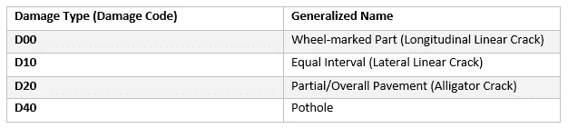

Damage types in RDD2020

让我们从一个快速的 EDA 部分开始——

# EDA:

让我们从可视化一些带有损伤类型的图像开始，只是为了理解损伤类型及其外观。

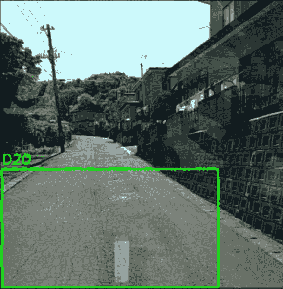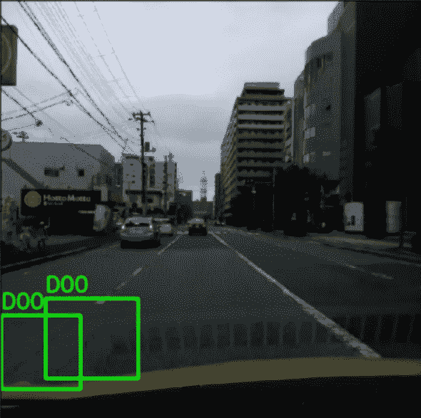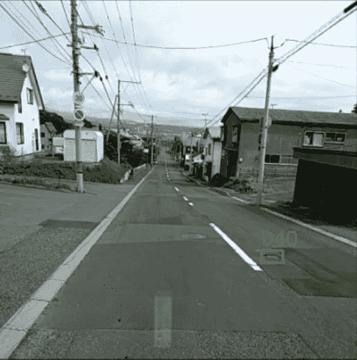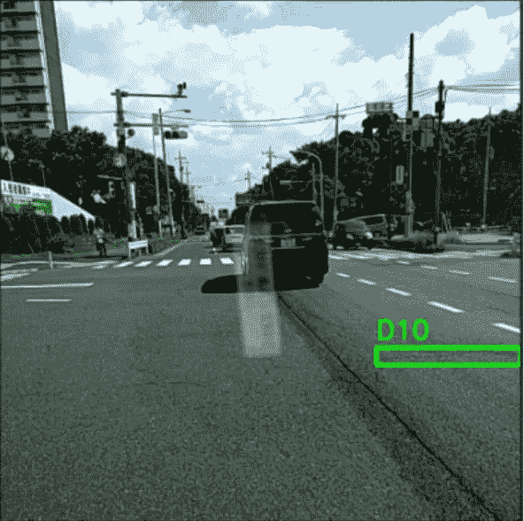

The 4 damage types mentioned in RDD2020

现在让我们来看看损伤类型在数据集中的分布。为此，我使用了**计数图**和百分比。

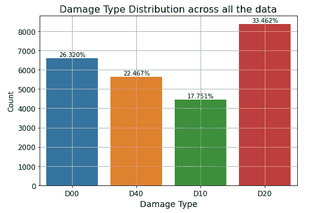

从上面的图中我们可以很容易地看到，没有太多的不平衡，我们有来自所有损坏类型的数据集的大量数据。

这里要注意的一点是，图像不包含边界框，这些边界框信息在一个单独的文件中。包含图像对应的包围盒信息的文件可以用 **COCO** 格式或者 **PASCAL VOC** 格式表示，通常这些格式被称为**注解**。实际上两种格式是一样的，不同的是，COCO 格式看起来像典型的“json”或 python 字典，而 PASCAL VOC 格式看起来像 xml 文件。对于 RDD 问题，他们提供了 PASCAL VOC 格式。并且两种表示都呈现在下面。

由于数据集 RDD2020 只是先前 RDD2019 和 RDD2018 的扩展，因此它还包含与 RDD2020 中未提及的损坏类型(如 D01、D43、D44、D50 等)相对应的图像和边界框注释。所以我们可以很容易地在预处理步骤中删除它们。

# 预处理:

首先我们必须创建一个 pandas dataframe，它只包含两列*图像*和*注释*。在创建它之前，我们需要确保在每一行中，我们有相同的文件名和 xml 文件名。为此，我们可以使用以下代码片段。

运行上面的代码片段后，我们可以得到如下所示的数据帧，

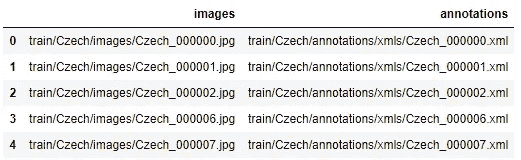

对于进一步的**预处理**，我在解释这个文件中[提到的步骤。因此，作为一个良好的预处理步骤，我们可以首先删除图像和相应的 xml 文件，其中损坏类型不是 D00，D10，D20 和 D40。为了删除不必要的图片和它们的 xml 文件，我使用了下面的代码片段。](https://github.com/rahulchamoli916/RDD2020/blob/main/Dataset_Preparation.ipynb)

所以最初我们有 25046 张图片，其中有 12851 张图片的类别不是我们想要的。因此，我们可以使用它们的索引轻松地将它们从数据帧中删除。

移除 12851 张图片后，我们只剩下 12195 张图片和注释。但问题是，这些注释也可能包含我们不想要的类(例如，除了损坏类型 D00、D10、D20 和 D40 之外，还有可能是一些损坏类型，如 D43、D44、D50 等。也存在于 xml 文件中)。所以我们需要从 xml 文件中删除这些类细节。在下面的 xml 文件中，有 3 个对象，其中两个是 D40，一个是 D50。所以我们想通过从 xml 文件中删除 D50 来保留两个 D40 对象。

为了执行这个预处理步骤，我们可以使用下面提到的代码片段—

这就是我们问题的解决方案，对于预处理步骤，现在我们需要为 YOLOv3 模型准备数据。但首先要快速了解 YOLOv3 的功能。

# YOLO v3:

如上所述，我们必须建立一个**实时对象检测器**，它可以非常快速地检测损坏。这就是我们使用 YOLOv3 的原因。Joseph Redmon 等人已经介绍了 YOLOv3 的概念，关于 YOLOv3 的所有细节都可以在他的[网站](https://pjreddie.com/darknet/yolo/)上获得。如果你想知道我是如何在自定义 RDD 数据集上训练 YOLOv3 的，你可以跳过这一节。

就速度而言，YOLOv3 比以前的对象检测模型快得多，但它的 mAP(平均精度)也可以与一些最先进的对象检测模型相媲美。正如我们在下图中看到的—

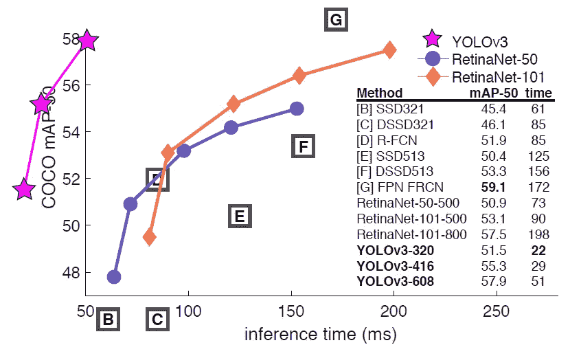

Source : [https://pjreddie.com/darknet/yolo/](https://pjreddie.com/darknet/yolo/)

如果我们看一下 YOLOv3–608 的性能，那么它的 mAP@IoU0.5 可以与最先进的 FPN·FRCN 模型相媲美，但 yolov 3 花费的时间比 FPN·FRCN 模型少得多。所以现在让我们深入到 YOLOv3 本身，它使用了哪种革命性的思想。

*   **特征提取器—** 最初他们为 YOLOv2 提供了 **darknet-19** 作为特征提取器，但他们没有为 YOLOv3 使用它，而是提出了新的特征提取器，称为 **darknet-53** 。darknet-53 的架构是—

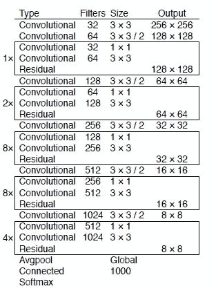

darknet — 53 architecture

darknet-53 是完全卷积网络，没有任何池。它包含 **53 个卷积层**、*，每个卷积层之后是批量归一化层和泄漏 relu 激活*。并在 ImageNet 数据集上进行了预训练。实际上，创造者也将 darknet-53 的性能与现有的特征提取器进行了比较。结果显示在下图中—

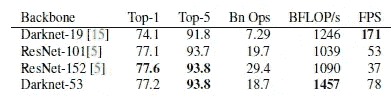

darknet-53 performance

在上表中,“Top-1”(Top-1 分类器的准确度)和“Top-5”(Top-5 分类器的准确度)用于表示在 ImageNet 任务上的**性能，我们可以看到所有特征提取器在 ImageNet 任务上的性能是相等的。Bn Ops(预测时需要数十亿次运算模型)比 darknet-19 多两倍，但不如 ResNet 模型快。BFLOP/s '(每秒十亿次浮点运算)darknet-53 是一个明显的赢家。与 ResNet 模型相比，FPS(每秒帧数)darknet-53 更快，但不等同于 darknet-19。综上所述，作者选择了 **darknet-53 作为 YOLOv3** 的特征提取器。**

有 3 种不同的图像尺寸，我们可以传给 YOLOv3 型号，320X320，416X416，608X608。如果我将 416X416 的图像作为 darknet-53 的输入，那么在全局平均池层之前，输出由 13X13X1024 表示，**为什么？** *由于我们在卷积层上有 5 倍步幅为 2，所以可以简单的用 2⁵除 416，所以就变成了 416/32=13，1024 是最后一个卷积层拥有的滤波器个数。*

现在它可以把整个 416X416 的图像划分成 13X13 的网格，每个网格都可以包含包围盒信息，但是怎么存储包围盒信息呢？那是一个谜…这并不神秘。

每个 13*13 的网格的深度是 1024，所以它没有使用整个深度。相反，它使用 85 维向量来存储单个边界框。在这个 85 维向量中，前 4 维表示**边界框坐标** (tx，ty，tw 和 th)。第五维度代表**物体存在性得分**，表示物体是否存在(潜在概率)。最后，剩下的 80 个维度对应于 COCO 数据集中提到的**类(同样是潜在概率)。正如我们在下图中看到的—**

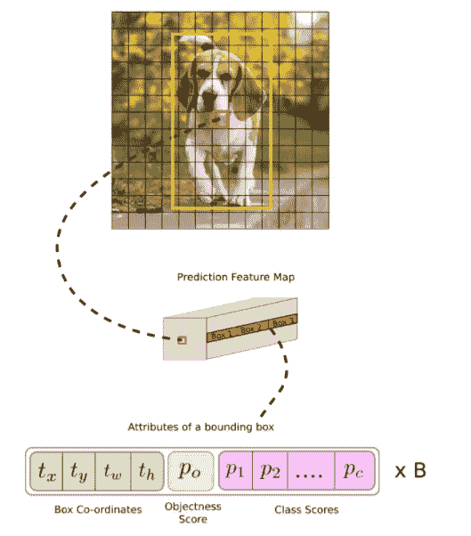

Source : [https://pylessons.com/YOLOv3-introduction/](https://pylessons.com/YOLOv3-introduction/)

但是根据这篇论文，他们在每个 13X13 的网格上使用了 3 个边框细节。为什么每个网格有多个边界框？ *因为每个网格可以容纳多个对象，所以他们使用了多个边界框的概念*。由于 85 个维度用于表示单个边界框，我们需要 3 个这样的框，因此我们需要 85*3=255 个维度。最初，我们从 darknet-53(在移除全局平均池层之后)得到的输出是 13X13X1024，因此我们可以使用 1X1 卷积和 255 个过滤器将 13X13X1024 转换为 13X13X255。

最初，他们试图直接预测图像的边界框，但是这些预测的边界框对于对象检测来说看起来并不好。为了解决这个问题，他们想出了一个非常巧妙的主意，被称为**锚盒**。

*   **锚框—** 被认为是预定义的框，模型在其上轻微移动以到达正确的预测框。通过使用锚盒，它们到达使用下述数学公式的预测盒——

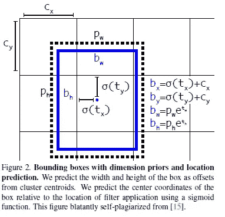

在上述公式中，tx、ty、tw 和 th 是原始边界框坐标，cx、cy、pw 和 ph 是锚框坐标。最后，bx，by，bw 和 bh 是预测的边界框坐标。现在，另一个有趣的问题可能是— **他们是如何产生 5 个边界框的想法的？** *为此，他们从 COCO 数据集中获取训练数据，为它们预测边界框，然后在预测的边界框上应用* ***K-Means 聚类*******K = 5****。这 5 个边界框获得对象的可能性非常高。**

*   ***每类 Sigmoid —** 如我们所知，对于 416X416 大小的输入图像，来自 darknet-53(在移除全局平均池层和 SoftMax 分类器之后)的结果是 13X13X1024。所以 YOLO 可以把整个图像分成 13X13 的网格。并且每个 13×13 的网格用于表示一个 85 维的边界框信息。如下所示—*

*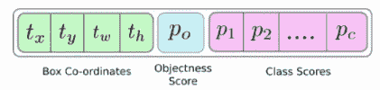*

*85 dimensional vector corresponding to a single bounding box*

*如果我们看 **Po** ，它代表客体性得分(概率)，也就是说客体是否存在。所以我们可以把它看作是一个二元分类，因此我们可以使用 sigmoid 函数进行分类。所以到目前为止，这是好的，但接下来的问题开始为其余 80 维向量…*

*现在看**类分数** (P1 到 Pc，其中 c=80)，分别对应 COCO 数据集中提到的各自的类。对于 YOLOv2，他们使用 SoftMax 分类器来了解潜在的概率。但让我们先来看一个场景，我们有一个女性的图像，并假设 COCO 类中的 C5 代表“女性”, COCO 类中的 C10 代表“人”,因此通过使用 SoftMax，它可以为女性或个人实现更高的概率，但不能同时为两者。但是直觉上，*女人就是人，对吧？*因此，在 YOLOv3 中，他们没有使用 SoftMax 分类器来了解潜在的概率，而是对每个类使用 sigmoid 函数，这种想法被称为**每类 Sigmoid** 。通过使用 per-class sigmoid YOLOv3 可以为女性和个人实现更高的概率。*

*   ***多尺度预测—** YOLO v3 跨 3 个不同尺度进行预测。检测层用于在三个不同大小的特征图上进行检测，分别具有跨度 32、16、8。这意味着，使用 416 x 416 的输入，我们可以在 13X13、26X26 和 52X52 的比例上进行检测。事实上，YOLO 的作者想到了这个想法，可以轻松地探测到更小的物体，只是因为他们从之前的版本中得到了抱怨。所以问题是，这个巧妙的想法是如何运作的？这很简单…*

*首先模型预测 52×52 网格的边界框(3 个框)，然后将网格向下采样到 26×26，再次预测边界框(3 个框)，再次将网格向下采样到 13×13，以预测最终的边界框(3 个框)。所以最终，我们将在每个单元/网格上有 3*3=9 个边界框。*

*   ***过滤—** 对于 416X416 大小的输入图像，YOLOv3 预测((52X52) + (26*26) + (13X13)) * 3 =总共 10647 个框。但是一幅图像怎么可能包含这么多物体呢，对吧？这就是为什么 YOLOv3 需要**过滤**的原因。*

*过滤意味着它将找出边界框的 IoU，对于 IoU 大于 0.5(阈值)的边界框，它只取那些并丢弃其余的。但是仍然可能存在许多边界框。那么如何去除呢？为此，YOLOv3 使用了下述技术——*

*   *非最大抑制-可能有多个框覆盖同一个对象。所以 YOLOv3 型号，必须将它们移除。为此，它找到覆盖同一对象的所有边界框的 IoU，并只取一个具有最高 IoU 的边界框。如下图所示——*

*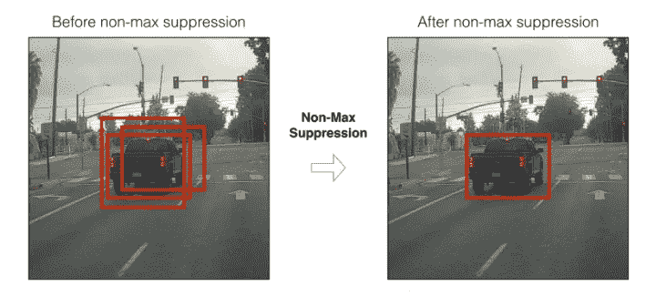*

*NMF*

*对 YOLOv3 来说，有一个术语可能有些读者不知道，那就是 IoU，它代表并上的**交集，如下图所示***

*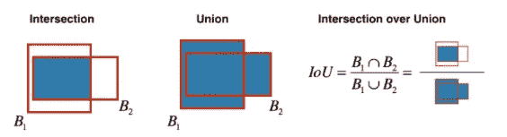*

*IoU*

# *在 RDD 数据集上训练 YOLOv3 模型:*

*YOLO 模型首先以适当的方式期望数据集，这意味着它必须在 pandas 数据帧中包含 6 个字段(图像名称、xmin、ymin、xmax、ymax 和类标签)。为此，我们需要所有的 xml 文件。然后我们可以用下面的片段—*

*结果是一个熊猫数据帧，看起来和下面提到的一模一样*

*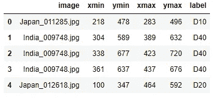*

*现在保存这个熊猫数据帧，对于我的例子，我使用了名字*

***因为我在 google colab 中使用了 Keras 实现，所以我跟踪了这个 [GitHub 库](https://github.com/AntonMu/TrainYourOwnYOLO)。我在这里解释的步骤可以在我的笔记本里找到。要在 YOLOv3 上训练 RDD 数据集，可以使用[这个](https://github.com/rahulchamoli916/RDD2020/tree/main/YOLO/YOLOv3)文件夹。获得这个文件夹(YOLOv3)后，目录结构将如下所示—***

***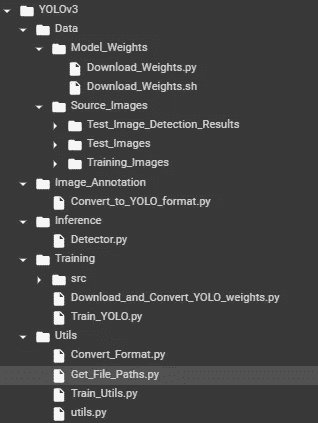***

***Directory Structure for YOLO***

> ***在继续之前，请确保使用 Tensorflow 版本 2.3.1 和 keras 版本 2.4.3***

***现在让我们看看目录结构，大部分内容都是一样的，正如我在[这个](https://github.com/AntonMu/TrainYourOwnYOLO) GitHub 仓库中提到的。有两件重要的事情需要改变。首先，在 Data→Source _ Images→Training_Images 下，复制所有训练图像，并创建一个文件夹“files_to_train”(在 Training _ Images 中只包含 Annotation-export.csv)。其次，在 Data → Source_Images → Test_Images 下，复制你的所有测试图像。其余一切保持不变。***

***上面的代码片段获取 Annotation-export.csv(从数据→源 _ 图像→训练 _ 图像→文件 _ 到 _ 训练)并将其转换为 YOLO 格式，通过生成两个文件，一个是 data_train.txt(在数据→源 _ 图像→训练 _ 图像→文件 _ 到 _ 训练中)，第二个是 data_classes.txt(在数据→模型 _ 权重中)。***

***接下来，是下载预训练的 YOLOv3 重量，并将其转换为 keras 格式。为此，预训练模型权重在 ImageNet 数据集上进行预训练。***

***运行上面的代码片段后，我们可以训练我们的模型，为此我们只需运行下面的代码片段。***

***这将运行到批次大小为 32 的 11 个时期，并且再次运行到批次大小为 4 的 11 个时期。结合时间将需要大约略多于 7 个小时在谷歌 Colab 与特斯拉 T4 GPU。然后保存的模型将存储为 trained_weight_final.h5，它将保存在 Data → Model_Weights 下。训练到此结束…下一步…推论。***

# ***对图像的测试(推断):***

***现在是时候在测试图像上运行我们训练过的 YOLOv3 模型了。为此，我使用了下面的片段。***

***上面的代码片段将获取测试图像(来自数据→源 _ 图像→测试 _ 图像)和保存的模型权重(来自数据→模型 _ 权重),并尝试检测测试图像的边界框，然后将结果图像存储到数据→源 _ 图像→测试 _ 图像 _ 检测 _ 结果。现在让我们看看模型工作良好的一些结果，以及模型失败(不完全)的一些情况。***

# ***结果:***

*   *****井预测案例—*****

***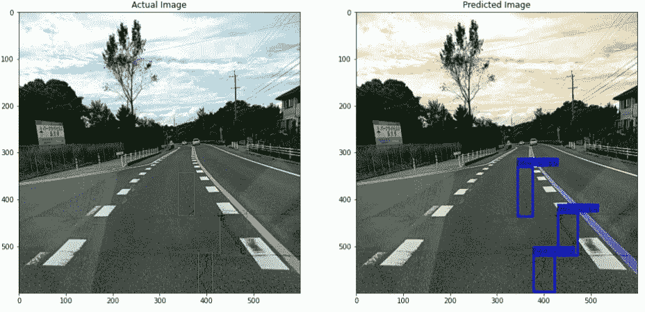******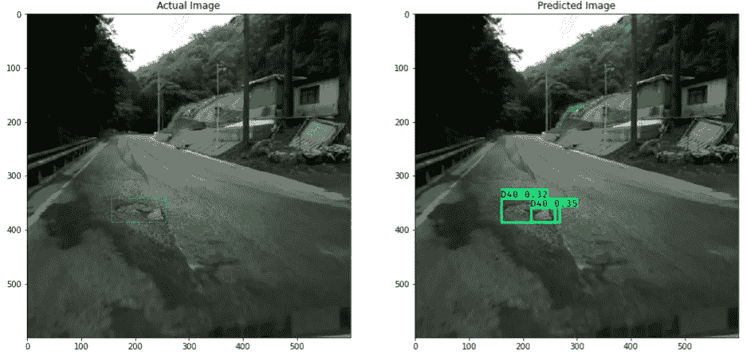***

***Test images for which model worked well***

*   *****不良预测案例—*****

***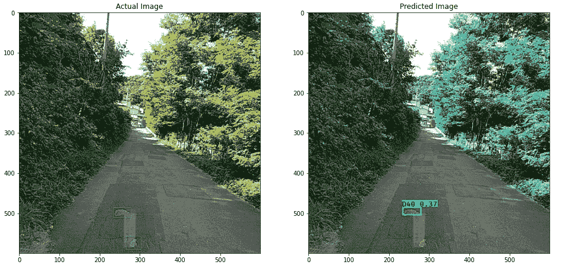******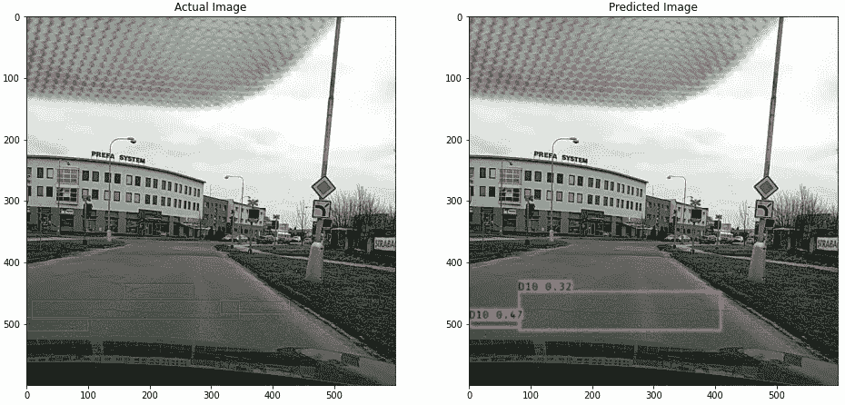***

***Test images for which model doesn’t worked well***

# ***数据管道:***

***数据管道对于部署我们的模型至关重要。通过创建管道，我们知道代码中的哪些片段对于测试图像的预测是有用的。***

***现在让我们谈一谈与这个项目有关的一些**未来工作**，首先在一个像样的系统上训练更多时代的模型，现在 YOLOv3 不是最先进的，所以我们可以尝试 YOLOv4，YOLOv5 来训练相同的数据集。***

# ***参考资料:***

*   ***约洛夫 3 的原始研究论文—[https://arxiv.org/pdf/1804.02767](https://arxiv.org/pdf/1804.02767)***
*   ***数据—[https://github.com/sekilab/RoadDamageDetector/](https://github.com/sekilab/RoadDamageDetector/)***
*   ***Redmon 的网站—[https://pjreddie.com/darknet/yolo/](https://pjreddie.com/darknet/yolo/)***
*   ***前田等人——http://scholar.google.co.in/scholar_url?URL = https://arxiv . org/pdf/1801.09454&HL = en&sa = X&ei = qokaypvib 4 tsyqstxkyybq&sci SIG = aagbfm 3 b 0 dnk ZJ 8 co 0 vvv7 owhjjjqxz 0773 q&nossl = 1&oi = schol arr***
*   ***艾莉亚等人——https://arxiv.org/pdf/2008.13101***
*   ***[https://pylessons.com/YOLOv3-introduction/](https://pylessons.com/YOLOv3-introduction/)***
*   ***[https://github . com/aset kn/Tutorial-Image-and-multi-Bounding-Boxes-Augmentation-for-Deep-Learning-in-4-Steps](https://github.com/asetkn/Tutorial-Image-and-Multiple-Bounding-Boxes-Augmentation-for-Deep-Learning-in-4-Steps)***
*   ***https://github.com/AntonMu/TrainYourOwnYOLO***

***如果你想看完整的代码，那就访问这个 GitHub 库——***

*** [## rahulchamoli916/RDD2020

### 完整的解释，请访问我的博客…

github.com](https://github.com/rahulchamoli916/RDD2020) 

如果你想在 LinkedIn 上联系我，这是我的个人资料

 [## Rahul Chamoli -新德里，德里，印度|职业简介| LinkedIn

### 查看拉胡尔·查莫利在全球最大的职业社区 LinkedIn 上的个人资料。拉胡尔有两个工作列在他们的…

www.linkedin.com](https://www.linkedin.com/in/rahul-chamoli-076b7b14b)***