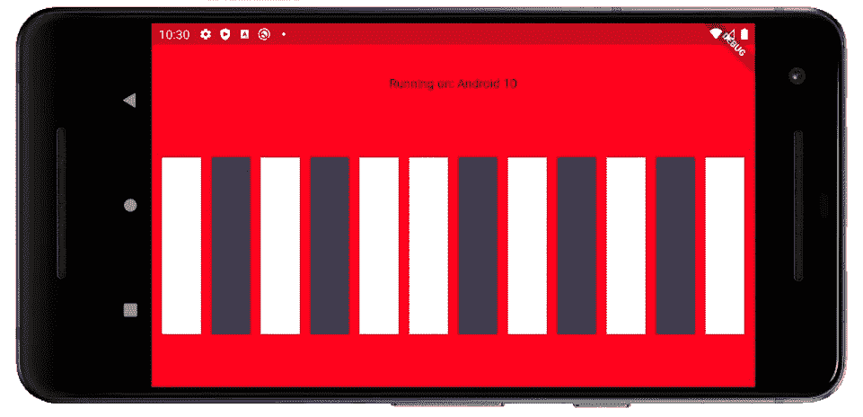
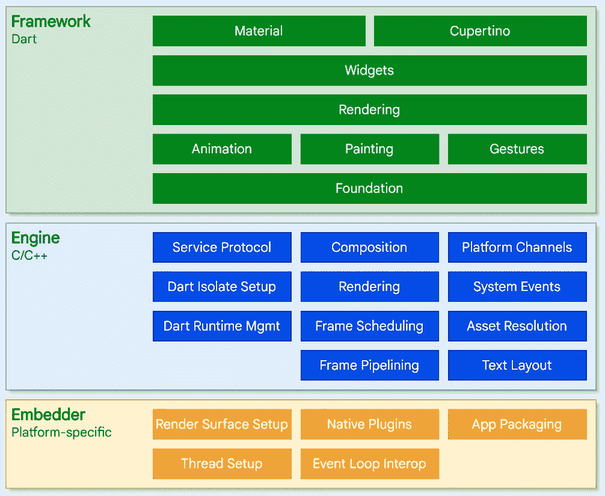
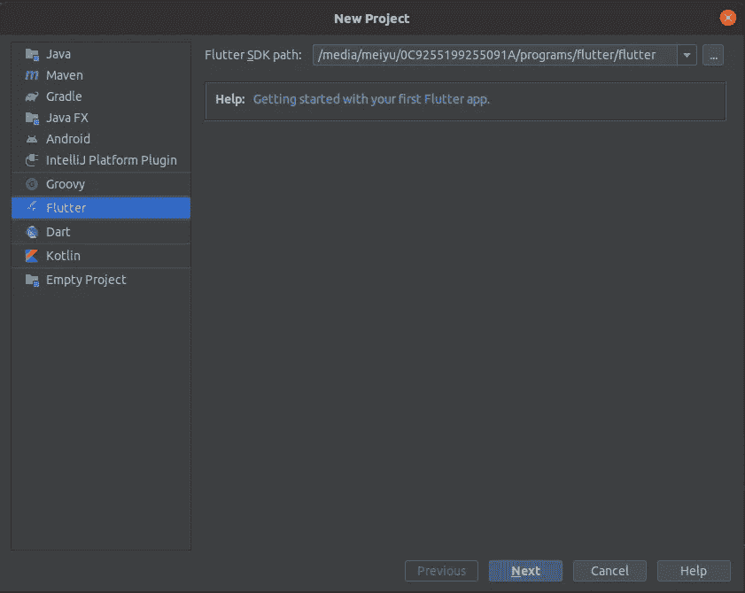
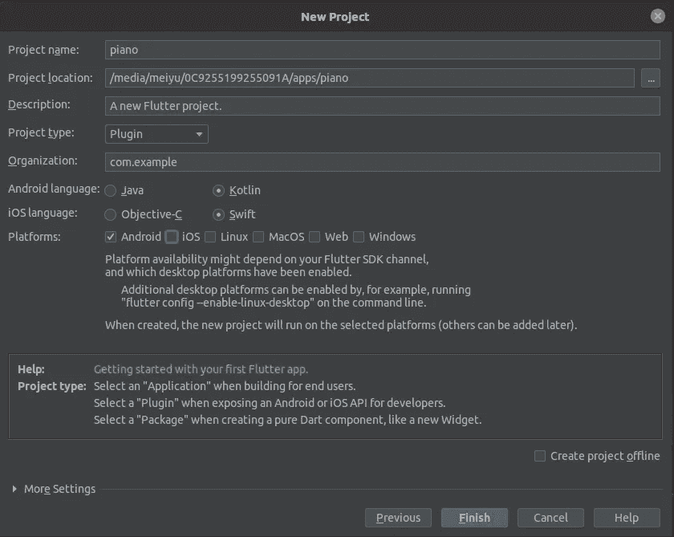
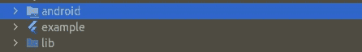
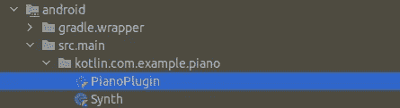
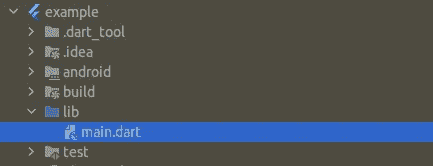

# 使用 Android 原生 Kotlin 构建你自己的 Flutter 插件——第一部分

> 原文：<https://medium.com/geekculture/build-your-own-flutter-plugin-for-android-native-kotlin-part-i-daed88eb706e?source=collection_archive---------25----------------------->

本教程是本教程的 **Kotlin** 版本: [**如何编写一个颤振插件**](https://codelabs.developers.google.com/codelabs/write-flutter-plugin#0) 来自 [Google 开发者 Colabs](https://codelabs.developers.google.com/) 。(原教程是用 JAVA 写的。)

本教程的 G ***oal*** 是通过:

*   什么时候需要一个 **Flutter 插件**项目。
*   Flutter 如何与 Kotlin 中的 **Android 原生代码/库进行通信。(iOS 替代方案阅读原教程)。**
*   如何用 **IntelliJ IDEA** 从头开始配置一个 Flutter 插件项目？
*   遵循原教程构建一个使用 Android 原生库的 **MIDI 键盘**(带 *Flutter 前端*)的示例 app:**Android . media**(带 *Kotlin* )通过 **Flutter 插件 API** (带 *Dart* )你将构建。

# 什么时候需要一个 Flutter 插件项目？

**颤振插件**是颤振开发中的高级课题。很多开发者在他们的 Flutter 开发中并不需要构建 Flutter 插件。但是，如果您想要执行以下任务，您可能需要一个:

*   如果你想构建一个 Flutter **API** 供其他 Flutter 项目使用，
*   和/或通过这样的 API，你使 Flutter 能够与 ***平台特定的*** **原生**代码(例如 Android 的 JAVA 或 Kotlin，iOS 的 Objective-C 或 Swift)进行通信。

# Flutter 是如何工作的？

在我们开始教程之前，我们需要一个关于 Flutter 一般是如何工作的介绍。Flutter 是一个**跨平台**开发框架，它允许你用一个代码库为不同的平台，即 Android、iOS 或 Web(另见[支持的平台](https://flutter.dev/docs/development/tools/sdk/release-notes/supported-platforms))构建 UI。Flutter 是用 [**Dart**](https://dart.dev/) 语言编写的，它负责不同平台的底层集成，因此您不需要为同一个应用程序构建单独的开发，例如，为 iOS 使用 Swift，为 Android 使用 Kotlin/JAVA。

听起来很棒，不是吗？由于 **Flutter** 是一个框架， ***包装*** 原生 Android 和 iOS 平台特定代码，使这种集成成为可能，因此有一个 ***中间 Dart 层*** 处理< Flutter 与 Android 原生>或< Flutter 与 iOS 原生>之间的通信。换句话说，如果你不需要 Android 或者 iOS ***的原生库*** 来实现你的任务，那么你甚至不需要担心这个。

颤振框架的**架构如图[所示](https://flutter.dev/docs/resources/architectural-overview):**

**顶层**(绿色)是 *Dart* 中的通用 UI/UX 框架，**底层**(黄色)是特定于平台的嵌入层，包括*原生插件*，可以用 Android 的 Kotlin/JAVA 或 iOS 的 Swift/Objective-C 等导入。然后， ***平台通道*** ，位于**中间层次**(蓝色)，负责*顶层(Dart)和底层(平台特定的本机代码)之间的通信。*

*平台通道的**架构如图所示:***

**

****方法通道*** 管理 Flutter 应用客户端和 iOS /Android 主机之间特定于平台的通信，因此用户可以编写 **AppDelegate** (iOS)或 **Activity** (Android)类来与本机 API 进行交互。*

*对于一个 Flutter 插件项目，我们将**用我们自己的类**替换绿框，以便:(1)处理方法调用，以及(2)定义每个方法的行为。*

*本教程将从头到脚指导你构建这样一个 **Flutter 插件**，它将具有:*

1.  ***PianoPlugin 类**(用 Kotlin 编写):
    作为 ***工厂*** ，即 MethodChannel，处理来自 Flutter 的方法调用，然后调用 Synth 类中相应的方法，并将结果返回给 Flutter。*
2.  ***Synth 类**(用 Kotlin 编写):
    有调用 ***Android 原生 API***生成 MIDI 声音的实际实现。*
3.  ***Flutter API**(Dart 编写):
    提供 ***Flutter 接口*** 供你的客户端调用插件方法。*
4.  ***Demo app (** 用 Dart 编写):
    最后我们会用 ***Flutter UI*** 构建键盘布局，每次按键都会 ***调用 Flutter API 中的*** 方法来创建声音。换句话说，这是一个展示如何使用你的 API 的 ***Flutter 客户端*** 。*

*现在让我们开始吧！*

# *在 IntelliJ IDEA 中创建一个 Flutter 插件项目*

*在 IntelliJ 中，单击文件>新建>项目>颤动:*

**

*然后，选择您的`project name`，在`Project type`下拉列表中，选择`Plugin`。在这个演示中，`Kotlin`将被用作 Android 语言，并且只展示`Android`平台。*

*您也可以将`Organization`更改为您喜欢的域名，例如，您可以将其更改为“magicmidi.com”。请注意，它必须是一个点分割的形式，这将成为你的原生插件包的前缀名称。这里，我们就让它保持原样吧。*

**

*点击“完成”，Flutter 会为你创建一个模板插件项目。*

# *项目结构解释*

*在您刚刚创建的新插件项目中，您将看到 3 个高级包:`android`、`example`、`lib`*

**

***安卓***

*所有的 ***原生 Android 代码*** (即 Kotlin)都到这个模块中，因此我们的 **PianoPlugin** 类和 **Synth** 类将位于`android > src.main > $your-native-package-name >`下*

**

***lib***

*在常规的颤振项目中，`lib`是`main.dart`所在的位置(即应用程序开始的位置)。但是因为现在我们正在构建一个“插件”而不是一个实际的应用程序，所以`piano.dart`是一个 **Flutter API** ，它可以被一个 Flutter 应用程序调用。*

**

***示例***

*这是一个功能完整的演示程序 **Flutter app** ，它包括 UI，以及展示如何在`piano.dart`中调用 Flutter API 的相关函数。你会发现一个`main.dart`作为演示 app 的切入点。当您运行模拟器时，这是虚拟手机上显示的实际应用程序。*

**

*在本教程的第二部分中，我将把实际的 Kotlin 和 Dart 代码共享到上述文件中，以实现这个 API。*