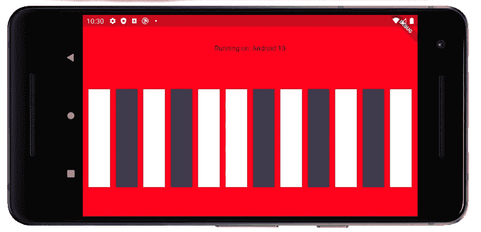
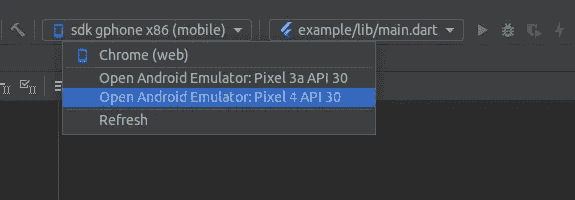
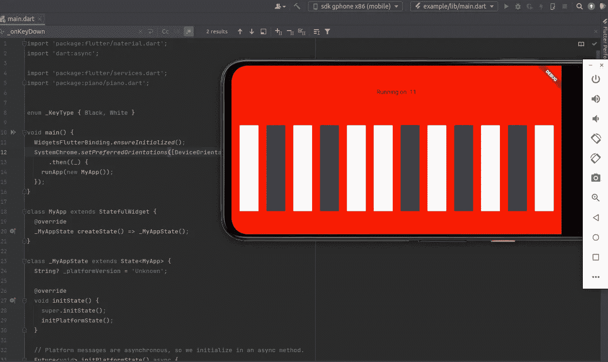

# 使用 Android 原生 Kotlin 构建你自己的 Flutter 插件——第二部分

> 原文：<https://medium.com/geekculture/build-your-own-flutter-plugin-using-android-native-kotlin-part-ii-c4d1403fc91d?source=collection_archive---------12----------------------->

在本教程的第一部分，我们已经解释了如何在 IntelliJ IDEA 中启动一个 Flutter 插件项目，以及 Flutter 插件模板是什么样子的。

接下来，我们将完成代码内容，使 **Flutter API** 和 **MIDI 键盘应用**投入使用。文件结构已在第一部分教程中介绍，请参考[第一部分教程](/geekculture/build-your-own-flutter-plugin-for-android-native-kotlin-part-i-daed88eb706e)。



# 钢琴.飞镖

先从`lib`下的**颤振 API** `piano.dart`说起吧。同样，这将是您的 Flutter API 接口，它定义了供您的客户端调用的所有可调用函数:

```
import 'dart:async';
import 'package:flutter/services.dart';class Piano {
  static const **MethodChannel _channel** =                     // 1
      const MethodChannel("**piano**");static Future<String?> **get platformVersion** async {          // 2
    final String? version = await _channel**.invokeMethod**('getPlatformVersion');                // 3
    return version;                                         // 4
  }static Future<int?> **onKeyDown**(int key) async {              // 2
    final int? numNotesOn = await _channel**.invokeMethod**('onKeyDown', [key]);                  // 3
    return numNotesOn;                                      // 4
  }static Future<int?> **onKeyUp**(int key) async {                // 2
    final int? numNotesOn = await 
_channel**.invokeMethod**('onKeyUp', [key]);                    // 3
    return numNotesOn;                                      // 4
  }
}
```

***注***:dart 语法中的*问号*支持[空安全](https://dart.dev/null-safety) dart 版本。基本上是比较严格的类型检查，需要你明确的识别类型可以是'***【int】'***或者'***' null '***，比如 ***int？***

如果您想将您的 Dart 迁移到 null 安全版本，只需转到一个 Flutter 项目的每个顶层文件夹，并在终端中执行`dart migrate --apply-changes`。例如，在我们的插件项目中，有 2 个 Flutter 项目，即**插件**文件夹本身，以及**示例**文件夹。

```
>> cd <*your-project-dir*>
>> dart migrate --apply-changes
>> cd <*your-project-dir*>/example 
>> dart migrate --apply-changes
```

这个 API 相当简单:

1.  首先，它创建一个 MethodChannel 实例`_channel`，将通道名注册为`piano`。
2.  定义了可供客户端调用的函数和 Getter:`platformVersion`(Getter)、`onKeyDown` (function)、`onKeyUp` (function)。
3.  这些功能`***invokeMethod***( <plugin-method-name>, [args])`具有在`pianoPlugin.kt`中确定的方法名称
4.  只需将从`invokeMethod`返回的内容返回给客户端。

所以这个 API 只是为你的客户端提供了一个调用 android 原生函数的接口，用 Kotlin 编写:

您的**客户端**向 API，即 T0 中的*请求方法调用，API 会将方法调用转发给 **MethodChannel 工厂**，即从`*pianoPlugin.kt*`中，然后**将 MethodChannel 返回的内容返回给客户端**。这就是 API 接口所做的一切。*

# PianoPlugin.kt

**PianoPlugin** 类继承了 **FlutterPlugin** 类并扩展了 **MethodCallHandler** 接口。

```
package com.example.piano

import androidx.annotation.NonNull
import io.flutter.embedding.engine.plugins.FlutterPlugin;
import io.flutter.plugin.common.BinaryMessenger;
import io.flutter.plugin.common.MethodCall
import io.flutter.plugin.common.MethodChannel
import io.flutter.plugin.common.MethodChannel.MethodCallHandler
import io.flutter.plugin.common.MethodChannel.Result
import io.flutter.plugin.common.PluginRegistry.Registrar

import com.example.piano.Synth

*/** PianoPlugin */* class **PianoPlugin**: **FlutterPlugin**, **MethodCallHandler** {/////////////////////// Part 1 ///////////////////////////// private lateinit var **channel** : MethodChannel
  private lateinit var **synth** : Synth/////////////////////// Part 2 /////////////////////////////override fun **onAttachedToEngine**(@NonNull flutterPluginBinding: FlutterPlugin.FlutterPluginBinding) {
    **channel** = **MethodChannel**(flutterPluginBinding.binaryMessenger, "**piano**")
    **channel.setMethodCallHandler**(this)
    Factory.setup(this, flutterPluginBinding.binaryMessenger)
  }

/////////////////////// Part 3 /////////////////////////////    override fun **onMethodCall**(@NonNull call: MethodCall, @NonNull result: Result) { if (**call.method** == "**getPlatformVersion**") {
      result.success(android.os.Build.VERSION.RELEASE)
    } else if (**call.method** == "**onKeyDown**"){
      try {
        val arguments: ArrayList<Int> = call.arguments as ArrayList<Int>
        val numKeysDown: Int = **synth.keyDown**(arguments.get(0) as Int)
        result.success(numKeysDown)
      } catch (ex: Exception) {
        result.error("1", ex.message, ex.getStackTrace())
      }
    } else if (**call.method** == "**onKeyUp**") {
      try {
        val arguments: ArrayList<Int> = call.arguments as ArrayList<Int>
        val numKeysDown: Int = **synth.keyUp**(arguments.get(0) as Int)
        result.success(numKeysDown)
      } catch (ex: Exception) {
        result.error("1", ex.message, ex.getStackTrace())
      }
    } else {
      result.notImplemented()
    }
  }/////////////////////// Part 4/////////////////////////////override fun **onDetachedFromEngine**(@NonNull binding: FlutterPlugin.FlutterPluginBinding) {
    channel.setMethodCallHandler(null)
  }/////////////////////// Part 5/////////////////////////////private **companion object Factory** {
    fun **setup**(plugin: PianoPlugin, binaryMessenger: BinaryMessenger) {
      plugin.synth = Synth()
      plugin.synth.start()
    }
  }
}
```

它做几件事:

覆盖 fun**onattacheddotengine(***来自 FlutterPlugin 的覆盖)

*   从 ***方法通道*** 构造器生成一个`*channel*` 与 Flutter 通信。注意，通道名“*钢琴*”与`*piano.dart*`中的 step //1 相同。
*   将通道的***MethodCallHandler***设置为当前类实例(在`o*verride fun* ***onMethodCall***`下实现)
*   初始化`*Synth*`类的单例对象，即`*synth*`(参见`*Synth.kt*`中的 Synth 类)

(可选:从[官方文件](https://flutter.dev/docs/development/platform-integration/platform-channels?tab=android-channel-kotlin-tab)中阅读如何设置方法通道的示例。)

覆盖 fun**ondatedfroengine(***来自 FlutterPlugin 的覆盖)

*   将 ***方法调用处理程序*** 注销为`null`

覆盖 fun**onMethodCall**(*从 MethodCallHandler 覆盖)

*   if(call . method = = "**getPlatformVersion**")
*   if(call . method = = "**onKeyDown**")，从`*synth*`调用`*keyDown*`方法
*   if(call . method = = "**onKeyUp**")，从`*synth*`调用`*keyUp*`方法

**伴侣** **对象*工厂***

*   “伴侣对象”是在类中创建一个**单例**对象。
*   定义 *Synth* 类的初始化(它是一个 ***可运行的*** )。

# Synth.kt

```
package com.example.piano

import android.media.AudioFormat
import android.media.AudioManager
import android.media.AudioTrack

*/** A synthesizer that plays sin waves for Android.  */* class **Synth** : **Runnable** {
    private lateinit var mThread: Thread
    private var mRunning = false
    private var mFreq = 440.0
    private var mAmp = 0.0
    private var mNumKeysDown = 0

    **fun** **start**() {
        **mThread = Thread(this)**
        mRunning = true
        mThread.start()
    }

    **fun** **stop**() {
        mRunning = false
    }

    **fun keyDown**(key: Int): Int {
        mFreq = Math.pow(1.0594630f.toDouble(), key.toDouble() - 69.0) * 440.0
        **mAmp** = 1.0
        mNumKeysDown += 1
        return mNumKeysDown
    }

   ** fun keyUp**(key: Int): Int {
        **mAmp** = 0.0
        mNumKeysDown -= 1
        return mNumKeysDown
    }

   ** override fun run()** {
        val sampleRate = 44100
        val **bufferSize = 1024**
        val buffer = ShortArray(bufferSize)
        val audioTrack = AudioTrack(
            AudioManager.STREAM_MUSIC,
            sampleRate,
            AudioFormat.CHANNEL_OUT_MONO,
            AudioFormat.ENCODING_PCM_16BIT,
            bufferSize,
            AudioTrack.MODE_STREAM
        )
        val fSampleRate = sampleRate.toDouble()
        val pi2: Double = 2.0 * Math.PI
        var counter = 0.0
        audioTrack.play()
        **while (mRunning)** {
            val tau = pi2 * mFreq / fSampleRate
            val maxValue = Short.MAX_VALUE * **mAmp**
            for (i in 0 until bufferSize) {
                **buffer[i]** = (**Math.sin**(tau * counter) * maxValue).toInt().toShort()
                counter += 1.0
            }
            **audioTrack.write(buffer, 0, bufferSize)**
        }
       ** audioTrack.stop()
        audioTrack.release()**
    }
}
```

这个类调用 Android Media API:***Android . Media***

**好玩的开始()**

*   启动一个新线程，运行 **run()** 中定义的程序。

**好玩的 keyDown()**

*   将音频*振幅*设置为 1.0
*   计算与关键音符对应的正弦波的*频率*。
    (可选:阅读声音的*音高*与正弦波[文章](https://www.perfectcircuit.com/signal/difference-between-waveforms)的关系。)

**好玩的 keyUp()**

*   将音频*振幅*设置为 0.0

**覆盖 fun run()**

*   它将正弦波值生成到缓冲数组中。
*   将缓冲值写入`audioTrack`以播放声音。
*   停止播放，释放内存。
*   注意，这个 ***线程*** 是不断运行的，并且不断向缓冲区数组生成值。然而，当*击键*时，振幅被设置为 *0.0* ，因此写入的值为 0，所以听不到声音。

# 示例/lib/main.dart

现在，我们已经完成了 API 功能，以及相应的原生 android 代码。接下来，我们将添加一个 **Flutter 前端 UI** `/example/lib/main.dart`来显示钢琴键盘，并在按键被按下( *onKeyDown* )和抬起( *onKeyUp* )时调用 Flutter API `piano.dart`。

```
import 'package:flutter/material.dart';
import 'dart:async';

import 'package:flutter/services.dart';
**import 'package:piano/piano.dart';**

enum _KeyType { Black, White }

**void main()** {
  WidgetsFlutterBinding.*ensureInitialized*();
  SystemChrome.*setPreferredOrientations*([DeviceOrientation.landscapeRight])
      .then((_) {
    **runApp(new MyApp());**
  });
}

**class MyApp extends StatefulWidget** {
  @override
  _MyAppState createState() => _MyAppState();
}
 **class _MyAppState extends State<MyApp>** {
  String? _platformVersion = 'Unknown';

  @override
  **void initState()** {
    super.initState();
    initPlatformState();
  }

  // Platform messages are asynchronous, so we initialize in an async method.
 ** Future<void> initPlatformState() async** {
    String? platformVersion;
    try {
      platformVersion = await Piano.*platformVersion*;
    } on PlatformException {
      platformVersion = 'Failed to get platform version.';
    }

    if (!mounted) return;

    setState(() {
      _platformVersion = platformVersion;
    });
  }

  **void _onKeyDown**(int key) {
    print("key down:$key");
    **Piano.*onKeyDown***(key).then((value) => print(value));
  }

 ** void _onKeyUp**(int key) {
    print("key up:$key");
    **Piano.*onKeyUp***(key).then((value) => print(value));
  }

  **Widget _makeKey**({required _KeyType keyType, required int key}) {
    return AnimatedContainer(
      height: 200,
      width: 44,
      duration: Duration(seconds: 2),
      curve: Curves.*easeIn*,
      child: Material(
        color: keyType == _KeyType.White
            ? Colors.*white* : Color.fromARGB(255, 60, 60, 80),
        child: InkWell(
          onTap: () => **_onKeyUp**(key),
          onTapDown: (details) => **_onKeyDown**(key),
          onTapCancel: () => **_onKeyUp**(key),
        ),
      ),
    );
  }

  @override
 **Widget build(BuildContext context)** {
    return **MaterialApp(**
      home: Scaffold(
        backgroundColor: Color.fromARGB(255, 250, 30, 0),
        body: Center(
          child: Column(
            mainAxisAlignment: MainAxisAlignment.spaceEvenly,
            children: <Widget>[
              Text('Running on: **$_platformVersion**\n'),
              Row(
                mainAxisAlignment: MainAxisAlignment.spaceEvenly,
                children: <Widget>[
                  _makeKey(keyType: _KeyType.White, key: 60),
                  _makeKey(keyType: _KeyType.Black, key: 61),
                  _makeKey(keyType: _KeyType.White, key: 62),
                  _makeKey(keyType: _KeyType.Black, key: 63),
                  _makeKey(keyType: _KeyType.White, key: 64),
                  _makeKey(keyType: _KeyType.White, key: 65),
                  _makeKey(keyType: _KeyType.Black, key: 66),
                  _makeKey(keyType: _KeyType.White, key: 67),
                  _makeKey(keyType: _KeyType.Black, key: 68),
                  _makeKey(keyType: _KeyType.White, key: 69),
                  _makeKey(keyType: _KeyType.Black, key: 70),
                  _makeKey(keyType: _KeyType.White, key: 71),
                ],
              )
            ],
          ),
        ),
      ),
    );
  }
}
```

这个演示应用是一个直接的 Flutter 前端小部件，它通过`_makeKey()`小部件创建键盘布局，并定义调用`piano.dart`中相应 Flutter API 函数的`_onKeyUp()`和`_onKeyDown()`行为。

# 在模拟器或手机上构建和运行



现在，您可以选择一个仿真器，并选择`example/lib/main.dart`作为在虚拟仿真器上运行的入口配置。点击“构建”(左边的锤子图标)，然后运行(右边的三角形按钮)。

您将看到演示在虚拟设备上运行。



如果你想在你的*手机上测试这个应用程序，你可以按照这个 [***指令***](https://developer.android.com/studio/run/device) 把这个应用程序下载到你的手机上，并从那里运行它。*

*在本教程中，我们浏览了这个 **PianoPlugin** 的代码实现，它通过 **MethodChannel** 在 **Flutter** (用 Dart 编写)和**原生 Android** 代码(用 Kotlin 编写)之间进行通信。我们还将介绍 **Flutter 前端应用**如何调用 **Flutter API** 来访问 PianoPlugin 中定义的方法。*

*原教程可以在[这里](https://codelabs.developers.google.com/codelabs/write-flutter-plugin#0)找到。当前的教程是原教程(Java)的 Kotlin 等价物。*

*感谢您通读本教程！欢迎在评论中分享你的想法！编码快乐！*