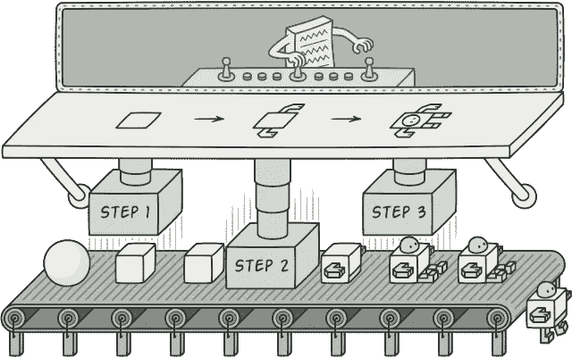
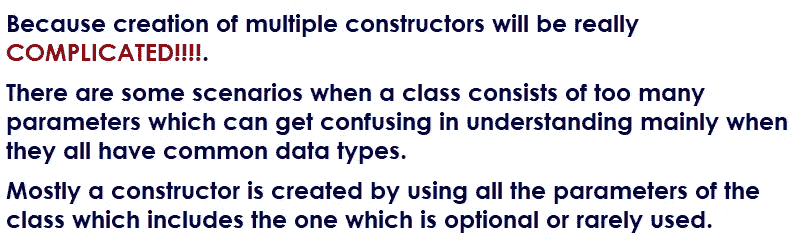
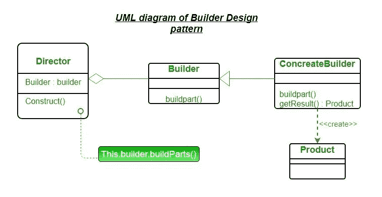
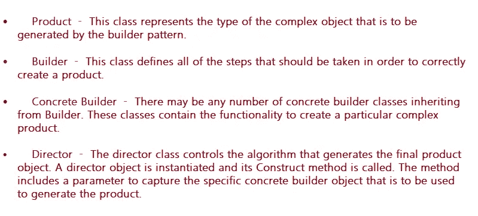
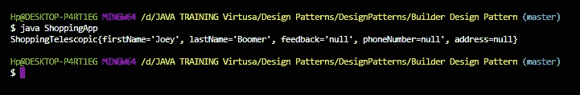
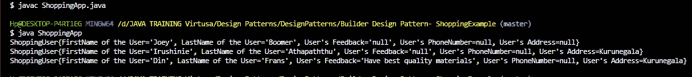

# 生成器设计模式✨😎

> 原文：<https://medium.com/geekculture/builder-design-pattern-406c167ba154?source=collection_archive---------10----------------------->



📍生成器设计模式属于创造性设计模式。

📍构建器设计模式处理由于复杂的多个构造器导致的对象创建问题。

📍有时我们需要在程序中使用多个构造函数。想起了下面的 example➜

> *假设在租车系统中有一个“Vehicle”类。所以当有人出租车辆时，你需要给予保险、道路援助、紧急援助、高速公路电动通行证等等。因此，根据这些特性，由于有多种组合，您可能需要创建多个构造函数。*

(这里的多重组合指的是，让我们采取保险援助，道路援助，高速公路电动通行证。因此，有些人将只需要保险援助和道路援助。同时，有些人将只需要高速公路电动通行证。类似地，您可能需要对这些构造函数进行多种组合。)

🚫使用多个构造函数的传统实现不适合解决这类问题。为什么？



📍有些人使用 do ***伸缩构造函数*** ，有些人使用***【setters】***来设置处理这类问题时的对象状态。

✸使用“setters”时出现的问题是，我们不能让它不可变。因为任何人都可以在对象创建后对其进行更改。(因此，有时对于某些项目来说，这可能不是更好的方法)

> 在创建不可变对象时，构建器设计模式非常有用。这种模式有助于解决许多带有大量附加/可选参数和不一致状态的问题，它给出了一个逐步构建对象的路径，并提供了一个可以直接返回最终对象的方法

> ***伸缩构造函数****——一个类有多个构造函数，每个构造函数根据参数使用其他构造函数。*

# 何时使用 Pattern🧐生成器设计

⚡️当涉及复杂的构造函数时，可以使用这种设计模式。

⚡️当我们想让类不可变的时候。

⚡️When 我们必须制作一个包含多个可选参数的对象。

# 生成器设计模式的 UML 表示



Ref:[https://www.geeksforgeeks.org/builder-design-pattern/#:~:text=Builder%20pattern%20aims%20to%20%E2%80%9CSeparate,step%20will%20return%20the%20object](https://www.geeksforgeeks.org/builder-design-pattern/#:~:text=Builder%20pattern%20aims%20to%20%E2%80%9CSeparate,step%20will%20return%20the%20object).



# 让我们通过一个真实的场景来理解构建器设计模式的使用🚀

# 💥方案

> “快乐购物店”是一个网上购物系统。当注册客户从商店购买商品时，它需要提供五个属性，如名字、姓氏、年龄、电话和地址，作为交付细节，以便将商品交付给特定的客户。这里我们只需要注册客户的名字和姓氏，其他字段是可选的。因为系统已经有了所有注册客户的交货细节。所以让我们来解决这个现实世界的问题 *🕵🏼*

## 让我们用望远镜 Constructors➜来解决这个问题

> *✨购物伸缩类*

> *✨ ShoppingApp 类*

输出:



虽然我们能够使用伸缩构造函数来解决这个问题，但这在编码中实际上并不是一个好的实践，而且会变得复杂。只要只有几个属性，一切都会显得。。但是如果数量增加，问题就会出现。所以在这种时候，构造函数很难读懂，因为它们有太多的参数。有时你可能会意外地改变他们的值，即使没有任何错误，但最终一切都会导致巨大的问题。

在这里，构建器模式将帮助我们解决这类问题。🤩

## 让我们使用构建器设计 Pattern➜来解决这个问题

> *✨购物用户类*

根据上面的代码片段，它创建了五个不同的方法，每个方法将设置一个特定的参数并返回相同的对象。

```
**public Builder firstName(), public Builder lastName(),public Builder feedback(),public Builder phoneNumber()** and  **public Builder address()** are those 5 methods here.
```

这里的 **Builder()** 方法支持我们使用所有强制参数&构建所需的用户对象，以及其他所需的可选属性组合，而不会丢失不变性。

> *ShoppingApp.java✨*

下面显示的代码是我们在主类中使用生成器的方式:

输出:



> ***请点击下面的 GitHub 链接查看该场景的源代码***

[](https://github.com/Irushinie/Krish-LP-Training/tree/main/Builder%20Design%20Pattern-%20ShoppingExample) [## irushinie/Krish-LP-培训

### 在 GitHub 上创建一个帐户，为 Irushinie/Krish-LP-Training 的发展做出贡献。

github.com](https://github.com/Irushinie/Krish-LP-Training/tree/main/Builder%20Design%20Pattern-%20ShoppingExample) 

# **使用构建器模式设计的优势**

⚡️生成器设计模式提供了对构造过程的良好控制。

⚡️允许改变产品的内在表现。

⚡️减少了构造函数的参数。

⚡️这种设计模式提供了设计的灵活性。

⚡️封装了表示和构造的实现。

⚡️The 生成器模式扩展了健壮性或强度，因为只有完全构造的对象对用户可用。

# 使用构建器模式设计的缺点

⚡️这种设计模式的主要危害是需要为每种类型的期望产品创建一个单独的构建器。

⚡️:程序中的行数可能会增加，因为与其他模式相比，最初你必须在这种设计模式中进行大量编码。

# 生成器设计模式示例

⭐️斯特林堡

⭐️·斯特林堡

是这种模式的一些很好的例子

# 参考

生成器设计模式— GeeksforGeeks”， *GeeksforGeeks* ，2021。【在线】。可用:[https://www . geeks forgeeks . org/Builder-design-pattern/#:~:text = Builder %20 pattern % 20 aims % 20 to % 20% E2 % 80% 9c 单独，步骤% 20 将% 20 返回% 20 对象。](https://www.geeksforgeeks.org/builder-design-pattern/#:~:text=Builder%20pattern%20aims%20to%20%E2%80%9CSeparate,step%20will%20return%20the%20object.)

设计模式—构建器模式— Tutorialspoint”，*Tutorialspoint.com*，2021。【在线】。可用:[https://www . tutorialspoint . com/design _ pattern/builder _ pattern . htm](https://www.tutorialspoint.com/design_pattern/builder_pattern.htm.)

生成器设计模式—Java point”、[T5、、](http://www.javatpoint.com,) 2021。【在线】。可用:[https://www.javatpoint.com/builder-design-pattern.](https://www.javatpoint.com/builder-design-pattern.)