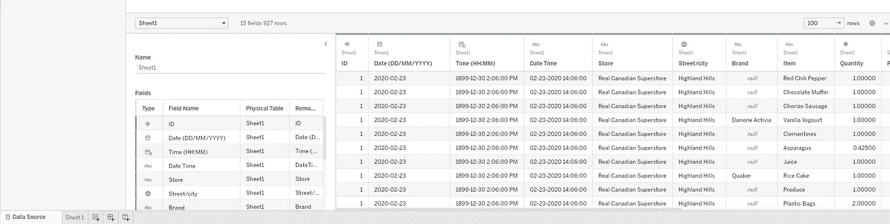
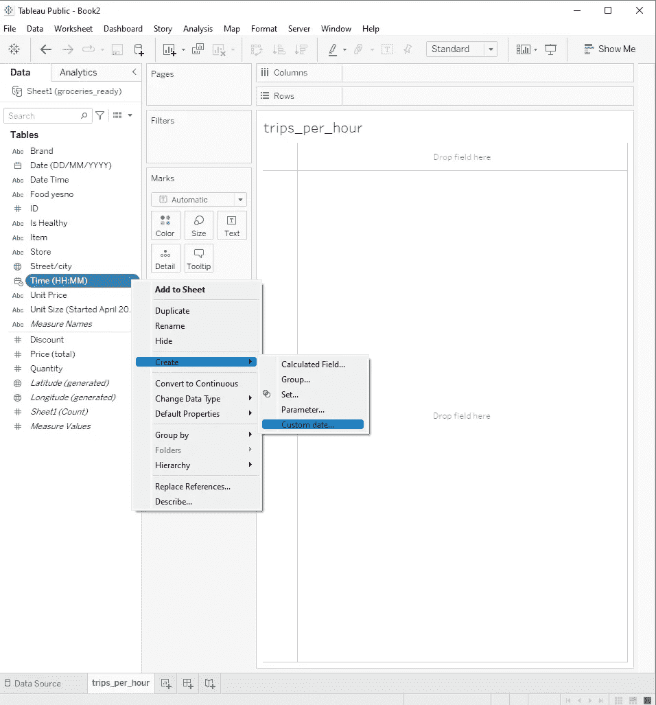
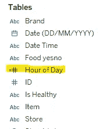
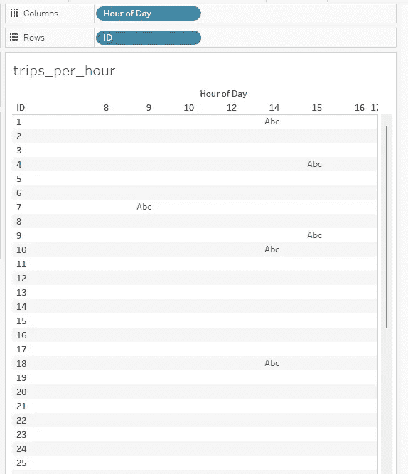
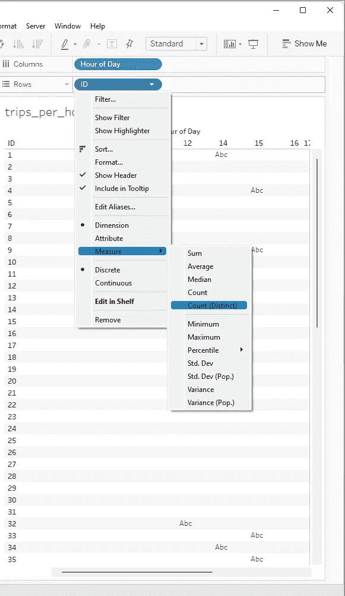
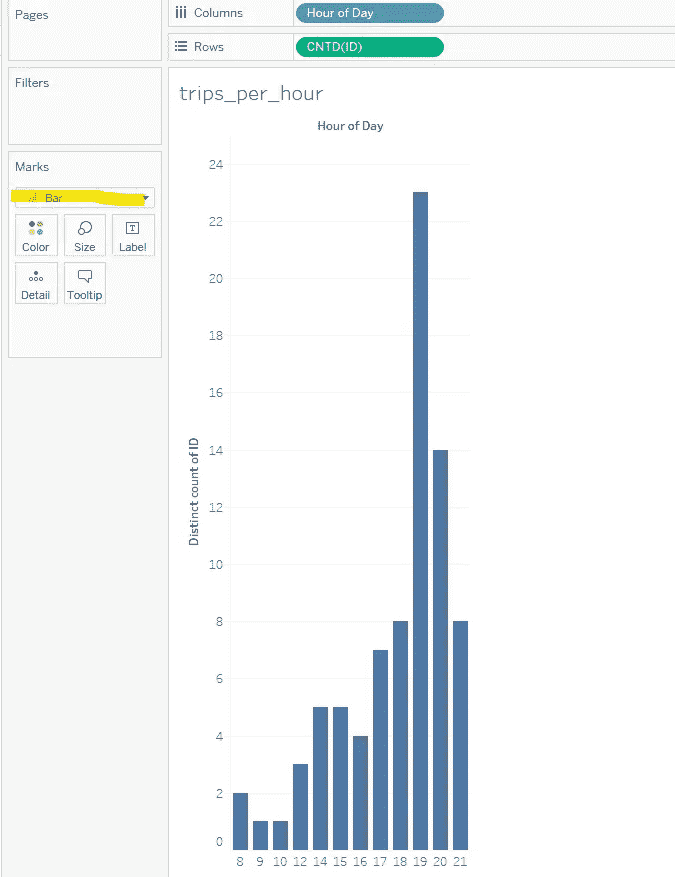
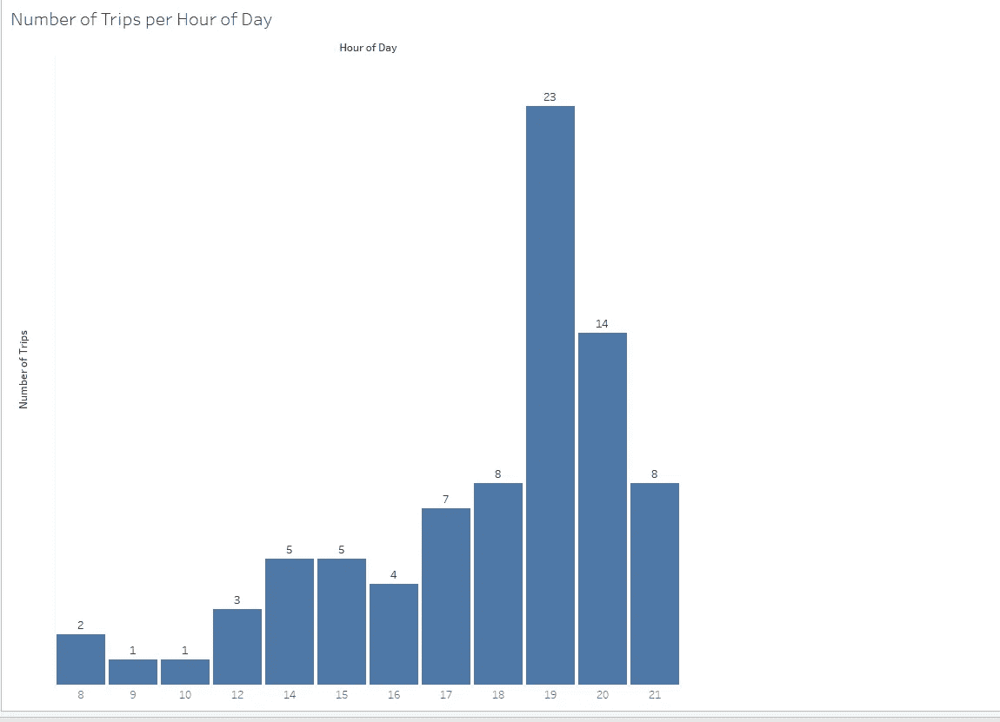
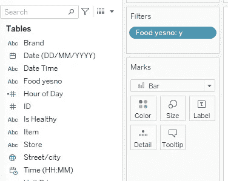
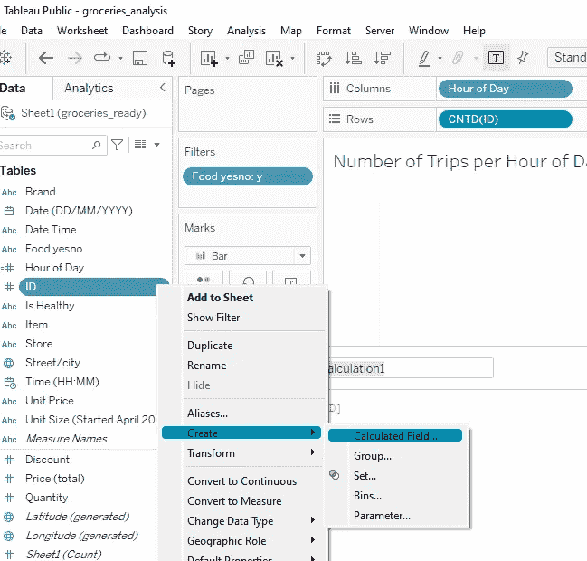
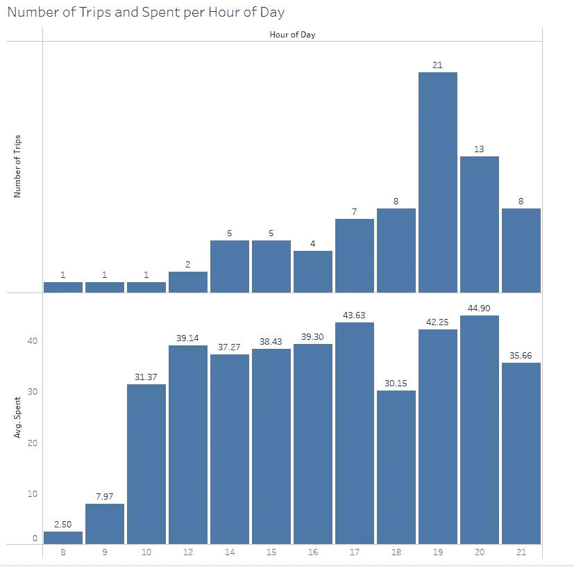

# 在 Tableau 中构建条形图:一天中每小时的食品杂货行程数

> 原文：<https://medium.com/geekculture/building-a-bar-chart-in-tableau-number-of-grocery-trips-per-hour-of-day-494dc7eb6df4?source=collection_archive---------13----------------------->

从 2020 年 1 月 8 日到 2021 年 2 月 21 日，我试图记录我去杂货店的每个人，试图了解我作为顾客的行为。我希望这能让我发现那些让我倾向于花更多钱或购买“坏”食物的习惯。通过了解它们，我可以避免它们，并希望过上更健康的生活方式。我在这里讨论更多关于它的[。](/@alexistats/groceries-insights-trying-to-improve-my-life-through-data-analysis-738a976074ee)

今天，我们将使用流行的数据可视化工具 Tableau。目标？构建一个条形图来表示一天中每小时的旅行次数，以及一天中每小时每次旅行的平均花费金额。或许是我基于时间不自觉的改变了购买习惯。

让我们开始吧。

# 步骤 1:加载数据

数据是 excel 格式的。我们可以简单地将文件拖到 Tableau，它将正确地加载数据。



Loading the data

Tableau 会自动检测列和数据类型，所以这里不需要做任何事情。让我们将“Sheet 1”重命名为“trips_per_hour ”,并单击工作表开始构建可视化。

# 步骤 2:构建“小时”维度

我们正在寻找建立一个条形图，其中“一天中的时间”将是一个核心维度。然而，这个特定的数据集不包含“一天中的小时”维度，只有“日期”和“时间”维度。所以，我们来提取一下吧！

幸运的是，这在画面中很简单。

单击时间维度旁边的箭头，然后将鼠标悬停在“创建”上，单击“自定义日期”(见下面的截图)



我们将该字段命名为“一天中的某个小时”，对于细节，我们使用“小时”。最后选择“日期部分”。我们的新维度已经可以使用了！



在 Tableau 中，将新创建的维度“一天中的小时”拖到“列”字段中。将“ID”维度引入“行”字段。以下是结果输出:



这没有什么意义，因为我们需要计算不同 ID 的数量。为此，单击 ID 维度并将鼠标悬停在“Measure”上，单击“Count (Distinct)”。



现在，我们可以看到我们真正想要的，那就是一天中每小时的出行次数！让我们确保显示的是一个条形图。为此，在“标记”下，选择“栏”可视化。



现在，我们有了一个条形图，它代表了我们想要的东西！不过有点丑，还是美化一下吧。

# 第四步:条形图的美化

第一步，在标记菜单中，将尺寸调整到你喜欢的尺寸。我个人喜欢酒吧靠近在一起，但不完全接触。

第二，再次在标记菜单下，我选择了“标签”并选中了“显示标记标签”,以直接查看每个条形上方的旅行计数。

第三，在纵轴上，我右键点击“编辑轴”。在该菜单下，我选择了“Tick Marks”子菜单，并选择“None”作为主要刻度。因此，消除了垂直轴上的冗余数字(它们已经出现在条形的顶部)。

在该菜单中，我返回到“常规”子菜单，将我的轴的标题修改为“旅行次数”。

第四，在 Tableau 的格式菜单下，我浏览了“工作表”、“行”和“列”子菜单，将网格线设置为“无”。

开始了。一个漂亮的酒吧推车，显示每天每小时去杂货店的次数。我真的很喜欢下午 6 点以后去杂货店！



# 额外:每天每小时的平均花费

我们现在有一个漂亮的条形图，但这不是很可行。当然，我晚上去杂货店，但是有一个小时我比另一个小时花更多的钱吗？

首先，让我们只过滤食物。让我们将“Food yesno”字段拖到 filters 框中，并只选择“y”。



其次，从“ID”维度创建一个计算字段。



在出现的框中，输入以下代码:

```
SUM([Price (total)])/COUNTD([ID]) 
```

也就是说，价格的总和除以 ID 的不同计数。

我把这个新的衡量标准称为“平均”。耗尽”并将其拖到不同 id 的计数旁边。

这两个图表一个在另一个上面是很有趣的，因为旅行的次数让我了解了可用数据的数量，而每天每小时的平均花费让我了解了 y 习惯。



该分布明显缺乏数据量，但可视化表明我在一天的晚些时候花费更多，除了下午 6 点和 9 点这两个明显的例外。

但是，看起来我可以在下午 5 点前购物节省 4-5 美元。

下一次，我将探索如何在 Tableau 中执行“前 10 名”,尝试并发现我最喜欢的产品/物品或商店！