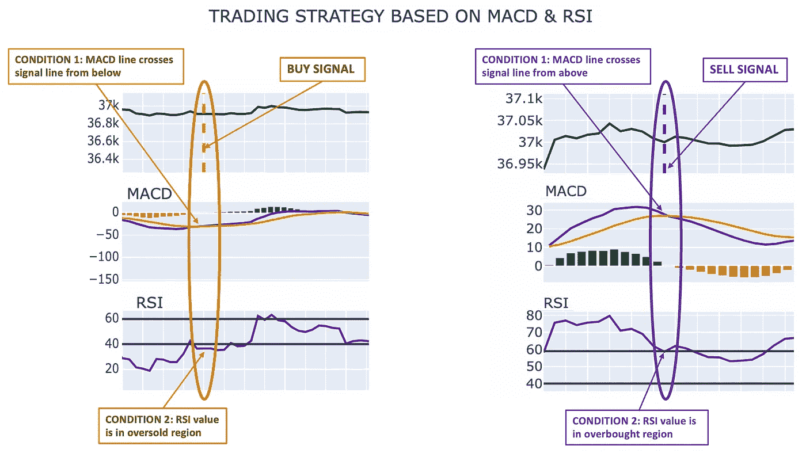
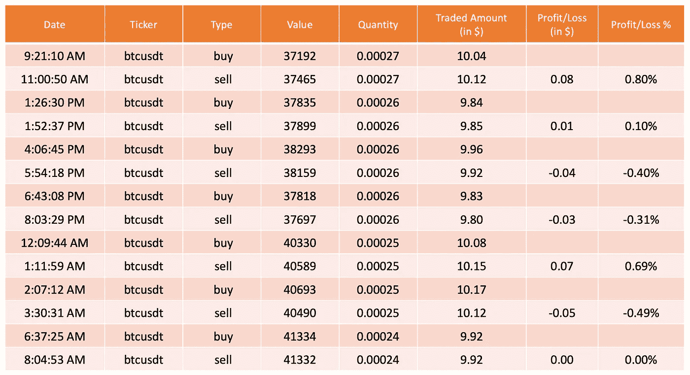
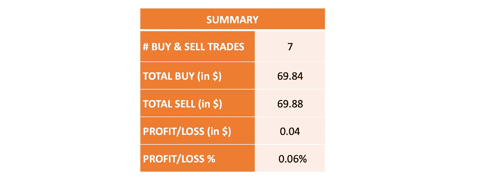

# 用 Python 构建一个基本的加密交易机器人

> 原文：<https://medium.com/geekculture/building-a-basic-crypto-trading-bot-in-python-4f272693c375?source=collection_archive---------0----------------------->

应用技术分析，用大约 125 行代码通过 3 个简单的步骤构建一个交易机器人

**Source**: [Unsplash](https://unsplash.com/photos/fsSGgTBoX9Y)

加密货币是一种基于区块链技术的数字资产或数字货币形式。与证券交易所类似，也有加密交易所，通过这些交易所可以交易加密货币。

在本文中，我们将构建一个简单的 bot 框架，通过使用一些常用的技术指标，如相对强度指数(RSI)和 MACD，实现加密货币交易的自动化。

虽然本文关注的是加密货币，但类似的方法也可以应用于其他交易工具(股票、外汇等)。本文中使用 crypto 的几个原因，加密货币市场全天候运行，因此 bot 可以保持运行。此外，加密货币通常非常不稳定，这使得它成为尝试交易算法的理想候选。

*免责声明:本文的目标是分享一些关于构建一个基本的机器人框架来执行算法交易的经验。这篇文章只是一个编程教程，并不打算成为任何类型的投资建议。*

# 构建交易机器人——3 步流程

**步骤 1:** 连接到一个交换机以获取实时数据

**第二步:**对数据应用交易算法

**第三步:**执行交易

**Flow diagram for the trading bot** (Image by Author)

在两种情况下，我们需要与交易所进行互动。首先，获取数据并在其上运行交易算法。第二，下买入/卖出订单来交易资产。

在本文中，有两个不同的包用于与交换交互。ccxt 包用于从交换机获取数据。交易算法在这些数据上运行，当必须下交易订单时，我使用了我拥有交易账户(WazirX)的交易所提供的 API。

如果您在任何其他提供公共 API 来获取数据和下单的交易所拥有帐户，那么也可以使用相同的 API。

# 步骤 1:获取实时数据

CCXT(加密货币交易所交易库)是一个用于连接和交易全球加密货币交易所和支付处理服务的库。

我们将使用这个库和币安交易所来获取密码的价格数据。任何其他交换或 api 也可以用于此目的。

参考[此处](https://docs.ccxt.com/en/latest/manual.html)查看 ccxt 的最新手册，该手册详细介绍了其提供的接口。

# 第二步:运用交易策略

这里我们将应用一个非常基本的交易策略。请注意，本文的目标只是获得创建交易机器人的诀窍，重点不是构建强大的交易算法。

这里应用的策略使用了两个技术指标，即 RSI 和 MACD 指标。要了解这些指标的更多信息，请参考本文:[技术分析基础](/geekculture/beginners-guide-to-technical-analysis-in-python-for-algorithmic-trading-19164fb6149)

## 交易策略

> 在超卖区域，买入→ MACD 与买入信号和 RSI 交叉
> 
> 卖出→ MACD 交叉，在超买区有卖出信号和相对强弱指标
> 
> 等待→否则

**Illustration of the trading strategy** (Image by Author)

可以基于从交易算法接收的信号来执行交易。实现了连续的购买-销售循环。因此，一旦发出买入指令，它将不会发出另一个买入指令，直到卖出指令被执行。

# 第三步:执行交易

以下是以编程方式执行交易的一些先决条件:

1.  交易交易所需要提供 API 来下订单。
2.  我们需要在这样的交易交易所开一个账户。
3.  我们需要创建一个 API 密钥和密码来访问交易账户。
4.  交易账户中应有足够的资金来执行订单。

作为一个例子，我使用了 WazirX，这是一个加密交易交易所。他们提供 API 来执行交易，因为我在 WazirX 有一个帐户，我用这个帐户来演示。

可以使用任何提供 API 的加密交换提供者，总体流程将保持不变，只有 API 可能略有不同。

下面是提供的 API 的文档参考: [WazirX API 参考](https://docs.wazirx.com/#public-rest-api-for-wazirx)

# 包装在一起

把上面解释的所有步骤放在一起，我们就有了一个交易机器人。这里我们以比特币对抗 USDT 为例。

就这样，用不到 125 行代码，我们就准备好了一个交易机器人，万事俱备！！

完整的代码参考请参考 git repo。

# 盈利还是亏损？

鉴于我们没有设定任何最低利润，买卖决定仅基于指标，这是一个非常基本的交易方法。盈利或亏损将取决于特定密码在当天的交易情况。

以下是在对 USDT 交易的比特币上运行该机器人 24 小时后的示例输出。投资金额设置为 10 美元，在此测试中使用 1 分钟蜡烛。

**Details of the trades executed in the 24-hour test run**

**Sample summary of running the bot for 24 hours on Bitcoin** (Image by Author)

鉴于交易算法逻辑的简单性，结果可能不会很有利可图。在许多实际的交易机器人中，成千上万的这种低利润交易被完成，以获得大量的累积利润。

# 限制

这里显示的交易策略是一个非常简单的算法来产生买卖信号。它可以通过以下方式进一步改进:

*   添加更多技术指标
*   添加烛台图案以做出更好的决定
*   除了指标之外，设定最低利润%来下单卖出，同时设定止损
*   目前，该机器人将处于两种状态之一——购买或出售。可以把它改成下多单平均盈亏。

# 代码参考

参考下面的 github repo 获取完整的源代码— [简单交易机器人](https://github.com/Lakshmi-1212/SimpleTradingBot)

# 结论

这个框架将帮助你开始建立自己的交易机器人。随意探索，在上面即兴发挥，让算法更强大。

鉴于影响股票/密码的技术分析范围之外的其他外部因素，此应用程序的结果可能不总是以正数结束。

请将这篇文章仅用于学习和实验。如果机器人能让我们成为亿万富翁，那么现在应该有很多这样的亿万富翁了:-)

## 如果“PYTHON+TRADING”让你着迷，那就看看这些吧…

*   [*算法交易 Python 技术分析入门*](/geekculture/beginners-guide-to-technical-analysis-in-python-for-algorithmic-trading-19164fb6149)
*   *用 Python 构建一个基本的加密交易机器人【你在这里】*
*   [*4 步自动三角套利密码*](/geekculture/automated-triangular-arbitrage-of-cryptos-in-4-steps-a678f7b01ce7)
*   [*识别交易模式—交易者行为分析*](/geekculture/identifying-trading-patterns-behavioural-analysis-of-traders-5184dfa0350b)
*   [*股票基本面分析使用 Python*](/geekculture/fundamental-analysis-of-stocks-using-python-d5ad050e6372)