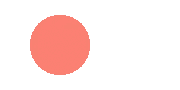
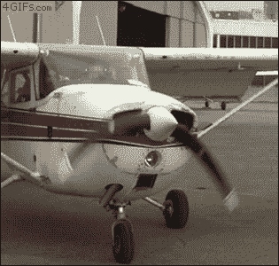
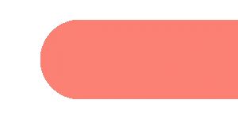
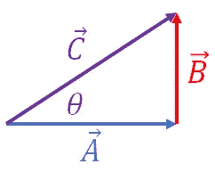

# 构建浏览器游戏第 2 部分:我喜欢你用 requestAnimationFrame()移动的方式

> 原文：<https://medium.com/geekculture/building-a-browser-game-part-2-i-like-the-way-you-move-with-requestanimationframe-99fcf27fddfa?source=collection_archive---------33----------------------->

所以，[上次](https://dannyirwin.medium.com/building-a-browser-game-part-1-rendering-to-a-canvas-f946b4a94af3)我们想出了如何给 HTML 画布元素添加一些简单的形状。但也许后来我们觉得有点乏味；白色屏幕上的橙红色矩形不是 AAA 视频游戏。在本文中，我们将研究如何通过使用 requestAnimationFrame()添加一些动作来给这个小盒子注入一些活力。

## 该设置

在我们深入研究 requestAnimationFrame()做什么以及如何利用它的能力来呈现动画之前，我们有一些工作要做。如果您按照教程进行操作，我们将使用上次创建的目录*。首先，我们将删除 script.js 文件中呈现盒子和圆圈的所有代码行。现在我们应该有以下内容:

```
const canvas = document.getElementById("canvas");
const ctx = canvas.getContext("2d");
```

**如果你不明白，你只需要在你的 HTML 主体中添加一个< canvas >元素，并给它一个 id“canvas”*

快速回顾一下，ctx 代表上下文，是我们如何使用其内置方法将一切呈现在 HTML 画布上的。

让我们去掉一些变量。

```
const radius = 50; *//The radius of the circle we'll be drawing*
const xPosition = 100; *//The x position of our circle*
const yPosition = 85; *//The y position of our cirlce*
```

接下来，让我们构建一个函数来绘制我们的圆。我将使用 [ES6](https://developer.mozilla.org/en-US/docs/Web/JavaScript/Reference/Functions/Arrow_functions) 箭头函数，但这将使用经典函数声明以同样的方式工作。我们的目标是在画布上画一个圆。这个函数将画一个以我们的(x，y)位置为中心的圆。

```
const drawCircle = () => {
    ctx.fillStyle = "salmon";
    ctx.beginPath();
    ctx.arc(xPosition, yPosition, radius, 0, 2 * Math.PI);
    ctx.fill();
};
drawCircle(); //*We'll remove this line after testing
                      //and put it somewhere else later*
```



给定 x 和 y 坐标，这个函数将在我们想要的任何地方画出可爱的鲑鱼圈。继续，试着移动和调整大小，在我们的位置和半径变量中玩数字。

## 动画循环



Some weirdness can occur when a video camera taking pictures at 24fps tries to capture objects moving at different rates. That's how we get a video of this propeller appearing to slowly flop around despite being rigid and moving very quickly.

每台计算机通过不断更新数据和渲染，更新和渲染，一遍又一遍地在屏幕上渲染所有的图像。我们用来谈论循环重复频率的度量标准称为每秒帧数或 FPS。典型的卡通通常以 12 FPS 渲染，电影和电视以 24 FPS 渲染，视频游戏通常以 60+FPS 为目标，这样他们可以渲染尽可能多的细节。对于我们的目的来说，我们有多少 FPS 并不重要，我们只是希望有一个函数在每一帧都被调用来渲染我们的画布并更新我们的位置。

当试图解决动画循环问题时，我的第一反应是使用 [setTimeout()](https://developer.mozilla.org/en-US/docs/Web/API/WindowOrWorkerGlobalScope/setTimeout) 函数。这是个很好的功能。它接收一个*回调函数*和一个以毫秒为单位的*延迟*，并将在指定的延迟后调用该函数。但是，如果我们的 draw 函数花费的时间比延迟时间长，会发生什么呢？它将被调用两次，我们的画布将试图同时在两个位置绘制我们的小圆。相反，我们将使用 [requestAnimationFrame()](https://developer.mozilla.org/en-US/docs/Web/API/window/requestAnimationFrame) 构建一个递归函数

MDN 说得好(就像他们通常做的那样):

> `**window.requestAnimationFrame()**`方法告诉浏览器你想要执行一个动画，并请求浏览器在下一次重画之前调用一个指定的函数来更新动画。

这意味着我们可以回避试图同时渲染不同帧的问题。让我们来看看代码。只是为了看看它是否在工作，我们将添加一个增量器并在控制台记录它。

```
let i = 0; *//Just for testing, get rid of it when we move on*const loop = () => { console.log(i++) *//Just for testing* *// Here we will update and draw 
    // whatever we need to during each frame*    requestAnimationFrame(loop);
}
loop();
```

这是最基本的版本。在您的控制台中，每次调用该函数时，您都会看到一个不断增加的数字。你可以添加额外的控制，帧速率选项和处理延迟的方法，但是现在，我们现在有一个工作的动画循环！

## 四处走动

我们差一点就能让那个漂亮的球弹得到处都是了。真正需要做的是构建我们的 updatePosition()函数。这个函数将运行每一帧，并将改变我们的位置变量，以反映运动。我们将开始简单地了解这个想法，然后随着我们的进行变得更加有趣。为了弄清楚我们要去哪里，我们需要一些额外的变量来处理速度和方向。我们将把方向分成 x 和 y 值。不要太担心这些，现在，我们马上会用它们做更多的事情。现在，我们将通过设置它们等于速度来初始化它们。

```
let speed = 3;
let xDirection = speed;
let yDirection = speed;const updatePosition = () => {
    xPosition += xDirection;
};
```

每次我们调用这个函数，x 位置将向右更新(1 倍速度)像素。我们现在正在改变演示，这样我们就可以看到一切是如何工作的。让我们将 updatePosition()和 drawCircle()函数插入到 loop()中。

```
const loop = () => {
    updatePosition();
    drawCircle();
    requestAnimationFrame(loop);
};
loop();
```



好的，那是...有意思。这是怎么回事？首先，我们的圆永远向右，所以它很快离开了我们的绘图区域。也许在它绕地球一圈回来后，我们会再看到它。与此同时，为什么它看起来像一个冰棒棒的结束？

到目前为止，我们只告诉画布重新绘制我们的圆，其他都没有。在之前的帧中绘制的每个像素将保持其原有的颜色，除非我们再次覆盖它。简而言之，我们将不得不为每一帧重新绘制整个画布，而不仅仅是我们的圆圈。为此，我们将使用 [ctx.clearRect()](https://developer.mozilla.org/en-US/docs/Web/API/CanvasRenderingContext2D/clearRect) 。这是一个清除画布区域的方法。它使用了与我们在第 1 部分中使用的 [fillRect()](https://developer.mozilla.org/en-US/docs/Web/API/CanvasRenderingContext2D/fillRect) 相同的参数。在我们的 loop()函数中，我们将整个画布设置为在绘制任何其他内容之前被清空。

```
const loop = () => { ctx.clearRect(0, 0, canvas.width, canvas.height);
 *// We can get the width and height properties
    // of our canvas element and use them as the 
    // width and height in clearRect().* updatePosition();
    drawCircle();
    requestAnimationFrame(loop);
};
loop();
```

我们做到了！我们的冰棍棍没了，我们的圆球迅速向右侧逃窜。最后一步是稍微改变一下我们的 updatePosition()函数。

## 花式运动

在本练习中，让我们使 updatePosition()的工作方式稍有不同。我们打算做两件不同的事情:

1:沿给定方向移动圆圈。

2:如果圆的边缘接触到画布的边缘，反转方向。

记住，我们的 x 位置和 y 位置在我们圆的中心，所以如果我们想知道边何时与画布碰撞，我们必须考虑半径。让我们来看看如何做到这一点:

```
const updatePosition = () => {
    if (xPosition + xDirection > canvas.width - radius ||
        xPosition + xDirection < 0 + radius) {
        xDirection *= -1;
    }
    if (yPosition + yDirection > canvas.height - radius ||
        yPosition + yDirection < 0 + radius) {
        yDirection *= -1;
    } xPosition += xDirection;
    yPosition += yDirection;
};
```

这段代码首先检查下一个位置是否会超出画布的边缘(考虑圆的半径)。如果是这样，它会反转方向。无论哪种方式，它都会将方向添加到当前位置。

嘭嘭嘭嘭，我们有了一个蹦蹦跳跳的小球。如果我们回去改变半径，一切都还会工作！如果我们愿意，我们甚至可以设置一个速度变量并动态地改变速度。

## 数学时间到了

我们现在看起来很好。我们有一个会永远跳动的圆圈，我们可以很容易地选择颜色、大小和速度，没有什么会破碎。让我们给这个等式增加一点随机性。现在，我们的圆圈开始以 45 度角发射，并一直以相同的相对角度反弹。还记得高中时，一位数学老师拼命想让你觉得学三角学有用吗？开你玩笑，我们现在就在用。让我们用一些老派的几何学和向量数学来开始我们的圆以一个随机的角度移动。别担心，这并不像听起来那么复杂。

首先，我们将声明一个方向变量，并生成一个 0 到 360 度之间的随机数。 [Math.random()](https://developer.mozilla.org/en-US/docs/Web/JavaScript/Reference/Global_Objects/Math/random) 是一个内置函数，将返回一个介于 0 和 1 之间的浮点数。我们把它乘以 360，就得到我们的随机起始角度。

```
let direction = Math.random() * 360;
```



接下来，我们将创建一个函数，将我们的速度和方向转换成 x 和 y [向量](https://en.wikipedia.org/wiki/Vector_(mathematics_and_physics))。矢量用来表示某一方向的速度(或速度、加速度、力等)。在图像中，我们的矢量将由 C 表示。C 的长度等于我们的速度，θ (theta)表示我们方向的角度。现在我们用[和](https://www.mathsisfun.com/algebra/sohcahtoa.html)求解 A 和 B。为了好玩，我们将把它们都包装在一个函数中。我们将再次使用内置的 [Math](https://developer.mozilla.org/en-US/docs/Web/JavaScript/Reference/Global_Objects/Math) 对象、 [Math.cos()](https://developer.mozilla.org/en-US/docs/Web/JavaScript/Reference/Global_Objects/Math/cos) 和 [Math 的方法。Sin()](https://developer.mozilla.org/en-US/docs/Web/JavaScript/Reference/Global_Objects/Math/sin)

```
const calculateVectors = () => {
    xDirection = speed * Math.cos(direction);
    yDirection = speed * Math.sin(direction);
};
```

该功能将根据我们的目标速度和方向设置我们的 x 方向和 y 方向。也就这样了！现在我们只需要调用它。在我们第一次调用 loop()函数之前，先弹出 calculateVectors()函数。

到处玩！从这里开始，可能性变得几乎无穷无尽。你可以用同样的想法画出复杂的形状，并随意移动它们。你怎么能把两个球放进去，然后让它们互相弹开呢？你如何在重力中建造？你能建立一个滑块来动态控制速度和方向吗？戴上乒乓球拍，你几乎就能重现游戏历史。

想看看我们今天学到的方法的其他例子吗？看看我在学习如何使用这种技术制作动画时创作的一些艺术涂鸦。[这里是一个](https://dannyirwin.github.io/Wind-Sculptures/)，[这里是另一个。](https://dannyirwin.github.io/Flower-Seeds/)

这是构建动画循环的基础。在下一期，我们将告别我们的鲑鱼圈，开始适当地构建我们的游戏。