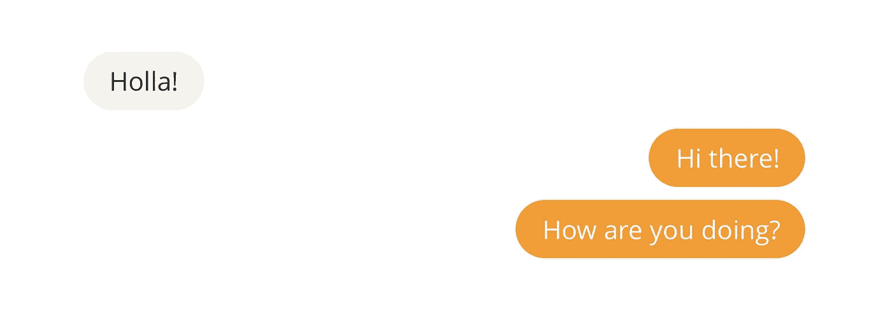

# 在 React 和 AWS Amplify 上构建聊天应用程序(第 2 部分)

> 原文：<https://medium.com/geekculture/building-a-chat-app-on-react-and-aws-amplify-part-2-b6a44158e7ac?source=collection_archive---------0----------------------->

这是一个迷你系列的第 2 部分，我们试图在 React 和 AWS Amplify 上构建一个简单的聊天应用程序。

如果你没有读过第 1 部分，你可以[在这里](/@jaunesarmiento/building-a-chat-app-on-react-and-aws-amplify-1-c96d456dffc1)查看。

# 概述

在上一篇文章中，我们和 AWS Amplify 握了手，了解了它作为移动或前端开发人员的强大之处。我们已经…