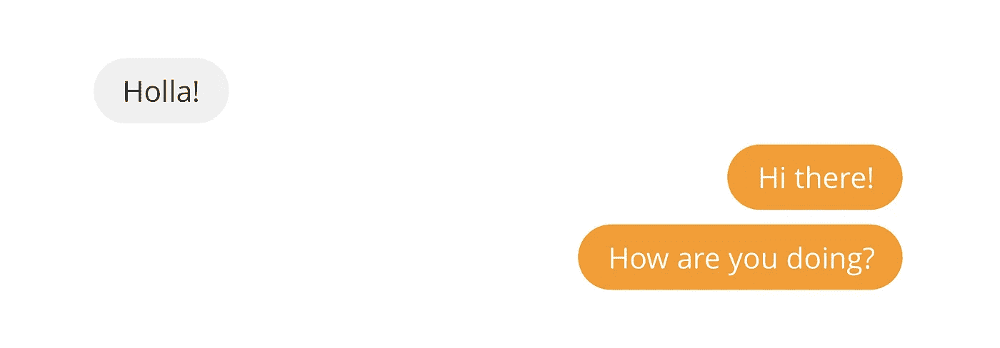

# 在 React 和 AWS Amplify 上构建聊天应用程序(第 3 部分)

> 原文：<https://medium.com/geekculture/building-a-chat-app-on-react-and-aws-amplify-part-3-c651fc4f5a8e?source=collection_archive---------3----------------------->

这是一个迷你系列的第 3 部分，我们试图在 React 和 AWS Amplify 上构建一个简单的聊天应用程序。

如果你没有看过第一部和第二部的《T2》，你一定要去看看。

# 概述

在迷你系列的第 2 部分中，我们将我们的应用程序做得更漂亮了，并增加了使用 AWS Amplify 和…