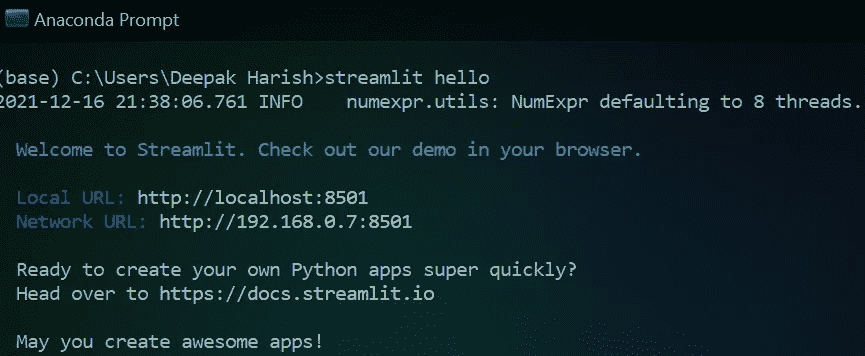
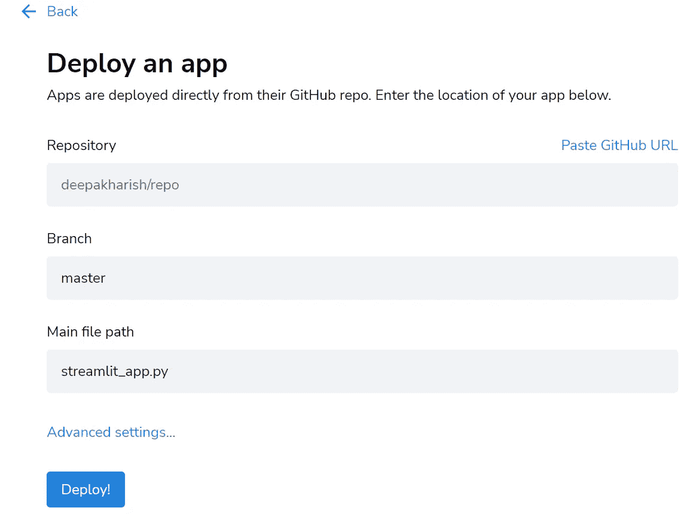

# 使用 python-Streamlit 构建数据可视化 web 应用程序

> 原文：<https://medium.com/geekculture/building-a-data-visualization-web-app-using-python-streamlit-c1efd1bed7a?source=collection_archive---------2----------------------->

## 使用 python streamlit 库构建数据可视化 ML web 应用程序的简单、直观方式。

Photo by [Carlos Muza](https://unsplash.com/@kmuza?utm_source=medium&utm_medium=referral) on [Unsplash](https://unsplash.com?utm_source=medium&utm_medium=referral)

通常，当我们考虑用 python 在线构建和共享可视化仪表板或 ML 应用程序(比方说)给我们的同事/队友/利益相关者或作为我们的投资组合时，我们依赖 Django 或 Flask 这样的老牌巨头。

使用这样的框架显然有很多好处。但是这里的问题是，对于低代码开发人员来说，它们是否足够用户友好、快速、直观？？我的意思是，为什么我们需要一个 Django/Flask 开发人员单独为一个小团队或一个 ML 应用程序的快速展示。当考虑上述参数时，“Streamlit”轻而易举地击败了它们。

## 什么是 Streamlit？

> [Streamlit](https://www.streamlit.io/) 是一个开源的 Python 库，可以轻松创建和共享漂亮的、定制的机器学习和数据科学 web 应用。只需几分钟，您就可以构建和部署强大的数据应用程序。

## Streamlit 的优势:

*   简单易学——几乎没有学习曲线
*   用户友好(开发人员友好)
*   构建耗时更少
*   图形的第三方集成
*   还有更多…

既然我们已经看到了 streamlit 的优势，那么让我们从使用它构建一个简单的数据可视化 web 应用程序是多么容易开始吧。请注意，所有这些都是在短短几个小时内完成的。因为我既没有任何关于 streamlit 的知识，也没有丰富的编码经验。我知道在系统中设置和学习“姜戈”有多难。所以，就难度而言，我给这个评分如下:`Django >> Flask >> Streamlit`。姜戈是最难的，斯特里特是最简单的。

## 项目概述:

我使用了一个公共 API 来提取构建可视化所需的数据。像往常一样，做了一些小的数据转换，以便根据需求只获得必要的数据。使用“Plotly”构建基本图形。尝试使用大部分功能，并使其简单快捷。

> 为了使这篇博文简短，我将全部代码保存在我的 [GitHub](https://github.com/DeepakHarish/python_scripts/tree/master/streamlit_apps) 上。请随便拿。这里看一下 web app [。](https://share.streamlit.io/deepakharish/python_scripts/streamlit_apps/tfl_streamlit_app.py)

## 基础知识:

*   `streamlit`的安装(windows)是通过正常的`pip`完成的。`pip install streamlit`。对于其他平台，请查看[文档页面](http://docs.streamlit.io/library/get-started/installation#install-streamlit-on-macoslinux)。
*   为了测试我们的安装，在命令提示符下运行`streamlit hello`。它在默认浏览器`localhost:8501`中打开。文档页面打开，带有一些示例演示。(我建议尝试一下，因为它有很多很棒的演示)

image by author: using streamlit hello

## 建筑应用程序:

一旦安装成功，运行该命令后，您将会看到如上图所示的内容。现在是时候构建实际的东西并见证 streamlit 的魔力了。我用了“sublime_text”编辑器来编码。这是一个人的选择。

这是我用的[数据集](https://tfl.gov.uk/info-for/open-data-users/)。基本上，TFL 数据集是一个开源的实时 API。只是给出了从 API 中提取数据的简单步骤。

***步骤 1:*** 使用`requests`库进行 API 数据提取。

***第二步:*** 其次，在将 URL 和提取的 API 数据转换为 JSON 格式，然后转换为 dataframe 之后，进行所需的数据转换。下面是基本数据转换的代码。

***第三步:*** 现在数据转换已经完成，是时候使用实际的`streamlit`函数了。如图表的“容器”、“侧栏”、“plotly”，字体工具如“副标题”、“降价”、“标题”等。

> 注意:这只是几个例子，这里的是各种功能的完整列表，这些功能可以用来使我们的 web 应用程序更美观&功能性更强。

让我向您展示创建一个容器有多简单。容器实际上帮助我们的内容在网页上完美的排列。

从上面的代码片段可以看出，`streamlit`已经被导入。创建了一个容器，其中有“title”(页面的标题，用粗体大字号表示)、“subheader”、“header”、“markdown”、“text”、“write”内置函数来满足大多数需求。在这里，我们能够直接在网页上以`dataframe`的形式查看我们的数据集。因为有很多行，所以不建议查看整个数据集，我使用了`.head()`只显示前 5 行数据。

因此，要在开发时在网页上看到我们的内容，我们所要做的就是在命令提示符下运行`stream run app_name.py`,同时位于应用程序所在的同一文件夹中。它将在默认浏览器的 localhost: 8501 中打开。每次你对 web 应用程序代码进行修改时，你可以选择`run`或`rerun always`，每当你进行修改时，它们会自动重新运行页面。它们出现在 web 应用程序的右上角。

类似地，我已经创建了其他容器，其中有用“Plotly”制作的图形。它的集成也非常简单直接。只好用`st.plotly_chart()`了。以下是构建在容器中的 plotly 可视化示例。

我还使用内置的 map 函数在地图上显示经度、纬度数据。

我还使用了一个侧边栏来欢迎用户进入页面。`st.sidebar.header('*Hey, Hello there!!!*')`

最后，我使用了一个名为`@st.cache`的特殊函数，它实际上有助于为我们的 web 应用程序创建一个缓存，否则它会消耗能量，消耗时间来在每次运行我们的应用程序时加载数据集。这也是最简单的方法。

***第四步:*** 最后，还有一个很小但相当重要的步骤。这是一个 web 应用程序的部署。我的意思是，使用库的全部意义和构建 web 应用程序的目的是为了共享。如果你对此有自己的计划，那完全没问题。如果不是，那也不用担心。Streamlit 通过允许在他们的服务器上托管 web 应用程序来支持你，而且还是免费的！！！多神奇啊！

你所要做的就是用谷歌或 Github 账户注册他们的网站。最好是 Github，因为那是你的代码应该在的地方。

*   首先，使用`[pipreqs](https://pypi.org/project/pipreqs/)`创建一个`requirements.txt`文件。
*   将应用程序和`requirements.txt`一起上传到 Github。
*   单击 streamlit 部署页面右侧的“新建应用程序”按钮。
*   将 Github repo 的链接粘贴到 app 代码所在的位置。
*   单击“部署”。喔呼，就这样。几分钟后，应用程序就部署好了。

最终，数据科学家应该专注于分析和从数据中获得洞察力，以将其呈现给利益相关者进行决策。花更少的时间考虑各种软件开发活动，如应用程序的前端/后端。

image by author, web app deployment page in streamlit.io

*下面是我做的* [*web app*](https://share.streamlit.io/deepakharish/python_scripts/streamlit_apps/tfl_streamlit_app.py) *。提供您的建议&关于我如何能更好地进一步设计它的反馈。*

*谢谢！！！*

有关此主题的更多参考资料:

*   Misra Turp 的博客文章
*   [Youtube](https://www.youtube.com/playlist?list=PLM8lYG2MzHmTATqBUZCQW9w816ndU0xHc) 库由 Misra Turp
*   [官方 Streamlit 网页](https://docs.streamlit.io/)