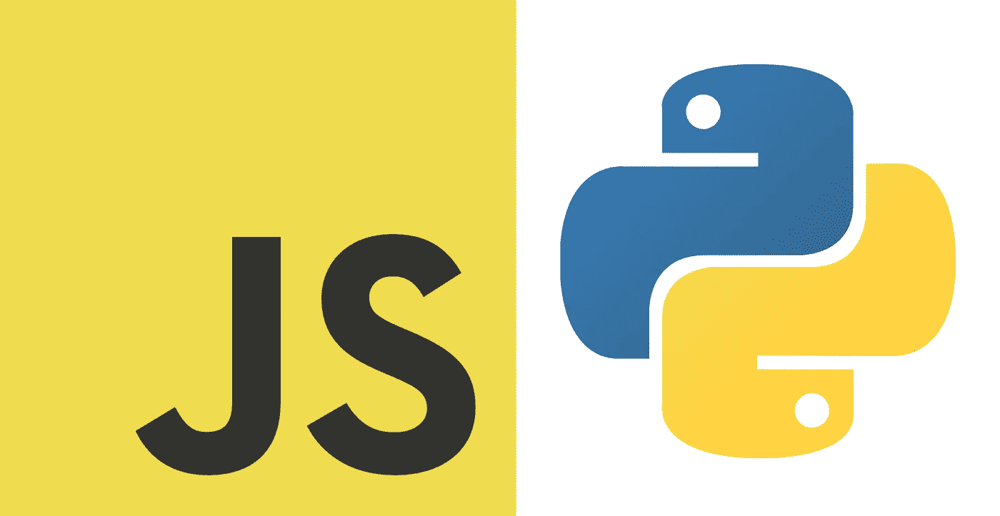
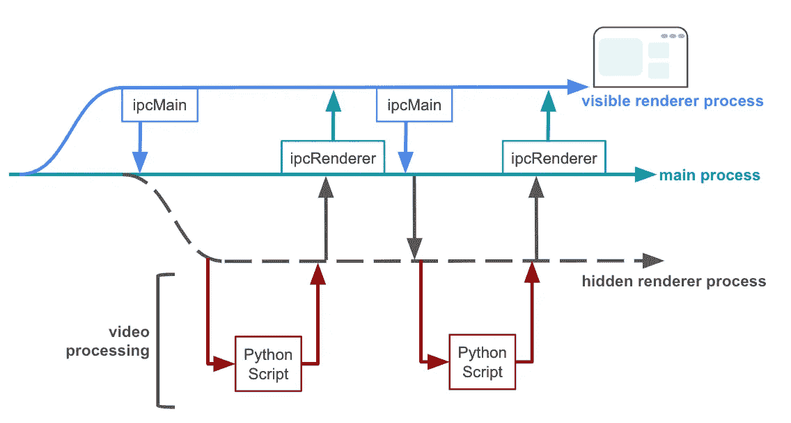

# 用 Electron、Create-React-App 和 Python 构建桌面应用

> 原文：<https://medium.com/geekculture/building-a-desktop-app-with-electron-create-react-app-and-python-e02bb1c47227?source=collection_archive---------9----------------------->

## 用你现有的技能构建一个强大且外观精美的桌面应用



虽然在当今的 web 和移动优先的应用程序世界中这不太可能，但一些用例需要桌面应用程序。也许您需要访问本机操作系统功能，或者经常访问本地系统上的大文件。或者你的客户只是要求一个桌面应用程序。对于我们从事计算机工程高级设计项目的团队来说，是后者。在研究这个项目时，我们很难找到一个桌面应用程序架构，允许团队成员利用他们现有的技能集，并使用现代的、记录良好的工具。我们应用程序的最终设计在很大程度上基于 Aakash Mallik 的博客，我在下面链接了它的第一部分，但是我们想写这篇文章来澄清这个过程的一些关键细节。

[](/heuristics/electron-react-python-part-1-introduction-b228ccf8e889) [## 电子+反应+ Python(第 1 部分)—简介

### 从开发到生产

medium.com](/heuristics/electron-react-python-part-1-introduction-b228ccf8e889) 

我们应用程序的完整回购可以在这里找到:[https://github.com/gracejennings/radpixel](https://github.com/gracejennings/radpixel)

# 技术选择

我们为这个项目选择的技术始于 Python。Python 有一个直观的语法，学习起来很容易，但是使用像 NumPy 这样强大的库，也可以有效地用于计算任务。我们的应用程序的主要功能是视频分析，我们的客户希望能够在未来维护分析脚本，因此 Python 是一个不错的选择。然而，虽然有像 PyQt 和 Tk 这样的 Python 前端框架，但它们相对来说并不流行，而且用这些工具构建一个漂亮的、现代的、响应迅速的 UI 可能很困难。许多开发人员现在都有使用 JavaScript 构建 web 和移动应用程序的前端经验，特别是使用 React 库。我们的团队就是这种情况，我们希望重用这些技能，而不是学习一个我们将来不太可能再次使用的旧框架。幸运的是，Electron 使得用 JavaScript 构建桌面应用变得很容易。使用我上面链接的优秀的博客文章，我们能够使用 Electron 快速地将一个 React 前端与一个 Python 后端捆绑在一起，以进行繁重的计算。

我们发现，在我们的大学同龄人中，使用 Python 和 JavaScript 的经验非常普遍。如上所述，当大多数现代应用程序在 web 或移动设备上与用户见面时，很少为桌面开发。因此，如果您确实需要创建一个桌面产品，您希望能够快速迭代到一个工作 MVP。我们的团队发现，这个 Python-JavaScript 框架允许开发人员构建一个强大的应用程序，同时尽可能保持技术学习曲线平坦。

# 高层架构

我强烈建议阅读 Aakash Mallik 的博客文章，以获得对该架构的深入解释。基本想法如下:

Electron 由一个主进程构成，该进程可以派生出一个或多个呈现器进程。通常，这用于为用户创建不同的窗口和模态；想想 MATLAB，当你在主窗口中运行一个脚本后，绘图会在新窗口中“弹出”。然而，由于我们使用的是 React，这是一个用于单页应用程序(SPAs)的库，我们只需要这些渲染器进程中的一个。Electron 只需加载 React URL 来显示窗口，React 正常工作，要么从开发服务器服务页面，要么在生产中服务构建的页面。我们还从主进程创建了一个“隐藏的”呈现器进程，它只是一个 HTML 脚本元素。这个流程中的 JavaScript 使用 [python-shell](https://www.npmjs.com/package/python-shell) 库来实例化 python 流程。

JavaScript 开发人员将习惯于使用 HTTP 连接他们 web 应用程序中的前端和后端。然而，对于我们的桌面应用程序，我们使用 Electron 内置的进程间通信协议(IPC)。该协议只能在主进程和呈现器进程之间使用，即不能在呈现器进程之间使用，因此主进程方便了所有通信。请参见下图:



Inter-process communication

# 数据传送

JavaScript 前端和 Python 后端的通信方式如下。首先，在主进程中创建了三个 ipcMain 事件侦听器。他们在监听:隐藏的渲染器说它已经准备好运行 Python，前端请求启动 Python 进程，隐藏的渲染器进程发回一些数据。在前端，一个用户交互启动该进程，并使用其 ipcRenderer 实例来调用“send”一些数据。主进程正在监听这个消息；当它被接收时，隐藏的渲染器窗口被创建，传入的前端数据被缓存。一旦加载了隐藏的渲染器窗口，它就向主进程发回一条消息，主进程用缓存的数据进行回复。隐藏渲染器接收该消息并启动 Python 进程。当进程完成或终止时，它将数据发送回主进程，主进程将这些数据传递给前端，以便向用户显示。

顾名思义，python-shell API 就像从命令行运行 python 脚本一样。Python 进程接收数据作为命令行参数；实际上，我们将它们作为字符串数组传递给 PythonShell 构造函数。要返回数据，我们只需将其打印出来。对于结构化数据，我们可以用 json.dumps()打印编码的 JSON。当接收到 JavaScript 中的数据时，我们可以用 JSON.parse()对其进行解码。

可以从 Python 脚本中多次打印。我们的应用程序使用一个单片脚本来打印一些初始数据，在处理过程中输出实时数据，最后在处理完成后发送聚合批处理数据。

# 计算机编程语言

## 解释者

我们团队面临的最大挑战之一是决定如何在生产中处理 Python 解释器。Electron 通过在二进制文件中捆绑 Chromium JavaScript 运行时，使得打包和分发变得容易。最初，我们考虑捆绑一个 Python 解释器。然而，这是有问题的，原因有二。首先，它会显著增加我们已经臃肿的应用程序的大小(Electron 并不以小巧轻便著称)。第二，它使得管理包的依赖关系变得很困难，包的依赖关系经常变化，可能会导致冲突。

我们最终决定将 Python 环境的负担转移给用户。用户可以从他们的本地机器中选择一个 Python 二进制文件(以及隐含的相关环境)，然后我们将它作为 pythonPath 选项传递给 python-shell。虽然这一过程增加了用户体验的摩擦，但它限制了包冲突的问题，并且更多的技术用户可以利用他们现有的虚拟环境结构。我们建议我们的用户使用 pipenv，并且我们提供了一个 Pipfile 来简化这个过程。对于我们的技术水平较低的用户，我们提供了一个只使用系统 Python 的选项。如果您正在使用 VM 或容器，并且只想在根级别安装 Python、pip 和相关的包，这是一个不错的选择。

## 错误处理

当然，我们的应用程序应该让用户知道 Python 后端发生的任何问题，但是错误处理非常重要，因为我们强迫用户自己设置 Python。我们想要捕捉的第一种错误是用户选择了一个无效的解释器。实例化 pythonShell 后，我们可以获得脚本的进程 ID。在主进程中，如果 PID 是 none，我们通知用户脚本没有启动。

```
let pyshell = new PythonShell(      
  path.join(__dirname, "/../scripts/startup_aggregate.py"),
  {        
    pythonPath: pythonPath,        
    args: data,      
  }    
);
lastPid = pyshell.childProcess.pid;    
log.info("starting process with pid: ", lastPid);
```

我们想要捕捉的第二种错误是 Python 错误，通常是 ModuleNotFound，因为用户没有正确设置他们的环境。我们可以使用 python-shell 捕获这个错误，并将其发送回主流程。注意使用 JSON.stringify()而不是 JSON . parse()；有时 Python 错误可能包含导致 JSON.parse()失败的异常字符。美化这些错误信息是这个项目未来的任务。

```
pyshell.on("error", function (err) {
  ipcRenderer.send("MESSAGE_FROM_BACKGROUND", { 
    error: JSON.stringify(err, null, 2) 
  });       
  log.info("python script error", err);    
});
```

# 本地文件访问

我们的应用程序的一个关键功能是用户可以查看和分析本地 mp4 视频文件。在 React 中，像这样的静态文件需要在/public 目录中可用，或者通过 HTTP 从服务器端点加载。在 Electron 中，我们可以通过在主 electron.js 文件中创建自定义的[协议](https://www.electronjs.org/docs/api/protocol)来访问本地文件。在我们的应用程序中加载视频的自定义协议如下。

```
protocol.registerFileProtocol("local-video", (req, callback) => {
  const url = req.url.replace("local-video://", "");    
  const decodedUrl = decodeURI(url); // in case URL contains spaces     
  try {      
    return callback(decodedUrl);    
  } catch (err) {      
    log.error('Invalid video file selected:', err);      
    return callback(404);    
  }  
});
```

我们的应用程序让用户使用电子[对话框](https://www.electronjs.org/docs/api/dialog)选择一个文件，然后使用这个协议(例如`<video src="local-video://video.mp4 />`)从一个视频 HTML 标签访问该文件路径。请注意，为了提高应用程序的安全性，您可能希望解析恶意内容的输入；在这里，我们仅仅删除协议规范并传回文件路径。

# 包装

为了打包应用程序，我们使用了[电子生成器](https://www.electron.build/)。这是一个很棒的工具，不仅可以打包源代码并生成可执行文件，还可以生成特定于平台的安装程序。我们建议从阅读 electron-builder 文档开始，但是为了成功地打包一个 electron，React，Python 应用程序，您需要记住一些额外的事情。

首先，您需要在打包之前构建 React 前端。构建包括将 React JSX 转换成普通的 JavaScript，捆绑代码以便可以在浏览器中运行(在本例中是 Chromium)，以及缩小代码以便可以有效地提供服务。这些步骤由 Create React App 样板脚本`npm run build`为我们处理。然后在“文件”标签中将电子生成器指向这些文件；没有理由包含原始的 React 源代码。

请看下面`build linux`脚本如何按顺序构建前端和应用程序。

```
"react-build": "react-scripts build",    
"electron-build-linux": "electron-builder --linux -  c.extraMetadata.main=build/electron.js",
"build-linux": "npm run react-build && npm run electron-build-linux"
```

我们正在为 Linux 目标而构建。`c.extraMetadata.main`标志覆盖 package.json 中的“main”标记，告诉它使用构建目录中的 electron.js 文件。

在您的构建配置中还需要考虑一些事项。首先，确保你的 package.json 中有 homepage 标签，像这样设置:`"homepage": "./"`。这确保了 React 中的任何导入都将使用相对路径来查找相关的 JS 和 CSS 文件。其次，确保在构建配置中禁用了 ASAR。ASAR 是一个混淆源代码的打包器，可以提高应用程序的安全性。然而，由于我们的 Python 脚本将在运行时被解释，它们需要保持原样。当您打包应用程序时，关闭 ASAR 会在控制台中产生一个警告，但是如果您的代码已经在 GitHub 上公开发布(就像我们的一样),这应该没有任何问题。第三，需要设置`"extends": null`。这可以防止 electronic-builder 默认 React-specific 设置，并强制它使用我们的自定义配置。这里可以阅读更多[。最后，设置“files”标签来包含您想要包含在包中的所有文件。除了位于“src”目录中的 React JSX 之外，这几乎是所有的内容(回想一下，我们已经构建了生产就绪版本)。](https://stackoverflow.com/questions/61098553/how-to-modify-the-folder-structure-of-app-asar-when-using-electron-builder/61119994#61119994)

这是我们应用的 package.json 中完整的“build”标签。虽然这只是为基于 RedHat 的 Linux 发行版构建的，但是 electronic-builder 使得用一个脚本输出多个工件变得很容易。

```
"build": {    
  "appId": "RadPixel",    
  "asar": false,    
  "linux": {      
    "target": [        
      "rpm"      
    ]    
  }, 
  "rpm": {      
    "artifactName": "RadPixel.rpm",      
    "icon": "public/RadPixelLogo.png"    
  },    
  "files": [      
    "background/**/*",      
    "build/**/*",      
    "public/RadPixelLogo.png",      
    "node_modules/**/*",      
    "scripts/startup_aggregate.py"    
  ],    
  "extends": null  
}
```

# 结论

这个应用程序是为一个大学项目创建的，本质上是一个 MVP 它不应该被认为是健壮的。然而，我们的团队对这种架构以及它如何有效地结合一些我们最喜欢的技术感到非常兴奋。在进行这个项目时，我们面临的许多问题在网上都没有现成的答案。我们希望这篇文章能填补一些空白，并能帮助团队更快地构建强大的桌面应用程序！