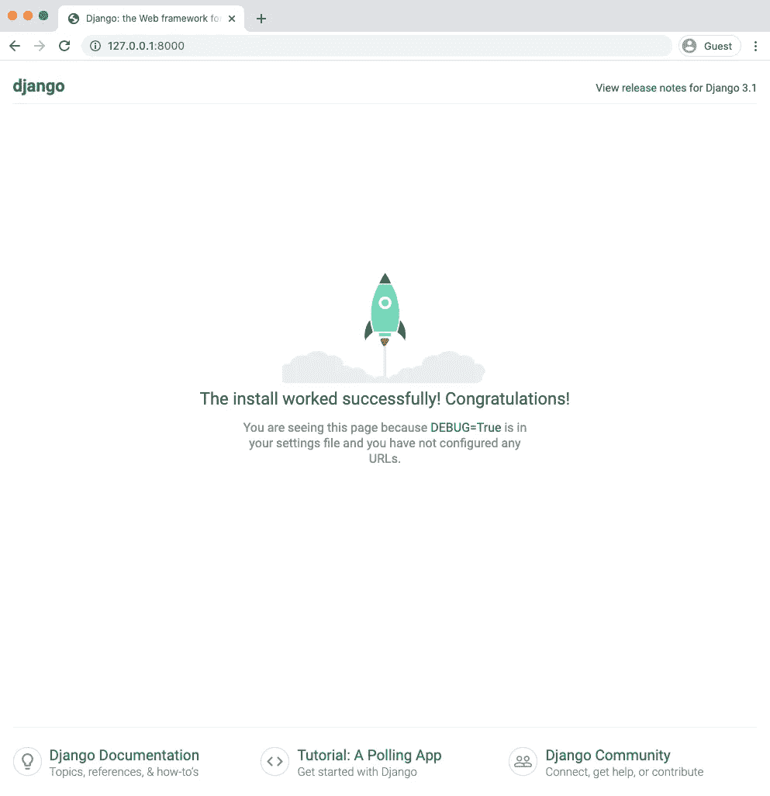
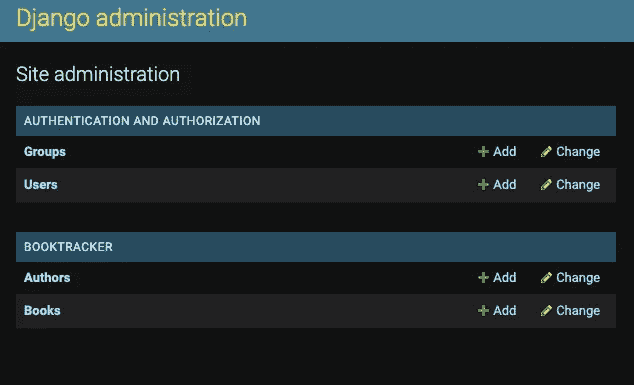

# 构建 Django-React 图书跟踪应用程序:后端设置

> 原文：<https://medium.com/geekculture/building-a-django-react-book-tracking-app-the-backend-setup-5405c49191dd?source=collection_archive---------23----------------------->

*如何使用 Django REST 框架设置 Django 后端以与 React 前端集成的分步指南*


Photo by [Florencia Viadana](https://unsplash.com/@florenciaviadana?utm_source=medium&utm_medium=referral) on [Unsplash](https://unsplash.com?utm_source=medium&utm_medium=referral)

在通过使用 React 制作一个简单的待办事项应用程序熟悉了 Django 之后，我想稍微提高一下水平，学习如何使用多种模型——开始理解如何处理具有更多关系数据表的大型项目。继续学习如何使用一对多模型关系来启动和运行 Django API。

# 你需要什么

您需要安装 Python 3 和 Node.js 根据您的本地环境，通过下面的链接下载这两个版本:

[Python](https://www.python.org/downloads/) 安装

[Node.js](https://nodejs.org/en/download/) 安装

# 创建项目

首先，导航到您想要托管整个应用程序的目录，并输入以下命令来创建一个新项目:

```
mkdir django-react-booktracker
```

导航到该目录:

```
cd django-react-booktracker
```

然后，根据您的下载使用`pip`或`pip3` 安装 Pipenv:

```
pip install pipenv 
```

**Pipenv** 自动为您的项目构建和管理一个虚拟环境，因此您构建的每个 Python 项目都可以有自己的依赖项(比如 Django)，您不必全局安装。

要激活虚拟环境，请始终使用以下命令:

```
pipenv shell
```

接下来，使用 pipenv 在您的虚拟环境中安装 Django:

```
pipenv install django
```

现在，您可以创建一个新项目，并将其命名为 backend:

```
django-admin startproject backend
```

然后，导航到后端文件夹:

```
cd backend
```

接下来，在后端项目中创建一个名为 booktracker 的新应用程序:

```
python manage.py startapp booktracker
```

** *应用程序和项目在定义或实践中不可互换；一个项目可以有多个应用程序。例如，一个项目可以有一个博客和一个图书追踪器，但两者都应该作为独立的应用程序创建。*

运行初始迁移:

```
python manage.py migrate
```

最后，通过在虚拟环境中输入以下内容，您的服务器可以随时启动:

```
python manage.py runserver
```

如果一切按预期进行，您应该会看到下图—



source: [https://djangoforbeginners.com/hello-world/](https://djangoforbeginners.com/hello-world/)

你可以在任何时候用`CONTROL+C`退出服务器。

## 注册应用程序

尽管已经安装了 booktracker 应用程序的必要文件和依赖项，Django 还没有注册它，除非我们将它添加到位于后端文件夹的`settings.py`文件夹的`INSTALLED_APPS`列表中。

# 创建模型

模型提供了整个应用程序的逻辑结构，由数据库表示。每个模型映射到一个数据库表。对于一个简单的图书跟踪应用程序来说，两个最明显或者说最必要的数据表包括图书和作者。

## 作者模型

导航到 booktracker 应用程序文件夹中的`models.py`文件。

*   `first_name`和`last_name`是作者模型的属性或字段，它们被特殊化为类属性并映射到数据库中它们各自的列。
*   每个字段都是相关字段类的一个实例，用于确定列的数据类型和任何验证要求。`**CharField**`选项表示列的数据类型是字符串，需要一个`max_length`参数。

创建此模型后，创建一个迁移文件，然后为作者模型运行迁移:

```
python manage.py makemigrations author
python manage.py migrate author
```

## 书籍模型

这些迁移完成后，在同一个`models.py`文件中建立图书模型，如下所示

这堂课有几件事需要注意:

*   因为一本书有/属于一个作者，而一个作者可以有很多本书，所以我们可以用`**ForeignKey**`类来表示这种多对一的关系，以引用相关的 author 实例。这个类需要两个参数:与模型相关的类和`[**on_delete**](https://docs.djangoproject.com/en/3.2/ref/models/fields/#django.db.models.ForeignKey.on_delete)`选项，如果相关的模型实例(作者)被删除，这个选项将删除模型实例(即书籍)。
*   `**TextField**`也是一个字符串字段，但是用于更大量的数据
*   `read`字段需要`**BooleanField**`类类型，它可以接受默认参数。如果没有给出默认值，`**BooleanField**`的默认值为`**None**`

同样，您需要创建一个迁移文件，并为第二个模型运行迁移:

```
python manage.py makemigrations book
python manage.py migrate book
```

# 创建管理界面

Django 的一个附加特性是它的管理界面，它本质上是一个内部管理工具，可信用户可以使用它来处理数据库。管理界面提供了对核心 CRUD 功能的自动访问，以管理数据。

设置这个服务很简单:打开`admin.py`文件(booktracker/admin.py)并添加以下代码:

*   将`list_display`设置为模型属性，以控制在管理员的更改列表页面上显示哪些字段。

要访问管理站点，请使用以下命令创建超级用户:

```
python manage.py createsuperuser
```

该命令将提示您输入电子邮件，并为管理员用户创建用户名和密码。完成后，启动服务器(`python manage.py run server`)并导航到[http://localhost:8000/admin](http://localhost:2000/admin/)；系统将提示您登录，然后您应该会看到如下页面:



您现在可以添加新的作者和图书实例，以及查看、编辑或删除现有实例。

# 设置 API

为了允许用户通过浏览器端的请求来检索和管理数据，我们需要建立一个 API 来允许与数据库的交互。

在 Django 虚拟环境中运行以下命令，开始构建 Web API:

```
pipenv install djangorestframework django-cors-headers
```

一旦你从命令行安装了它，将`‘corsheaders’`和‘`rest_framework’`’添加到`settings.py`文件的`INSTALLED_APPS`列表中。

然后，为了告诉前端(服务于端口 3000)与这个 API 交互，将以下内容添加到`settings.py`文件的底部:

## 序列化程序

序列化器对于将模型实例和 SQL 转换成 JSON 是必要的，JSON 是通过前端和后端之间的 HTTP 请求发送的数据的表示。

在 **booktracker 应用程序目录**中创建一个新文件，并将其命名为`serializers.py`(因此从项目的根目录来看，应该位于`booktracker/serializers.py`)。

从 Django REST 框架以及所有模型中导入 serializer 基类，并为每个模型创建一个 serializer 类。

*   确保在定义字段时包含`id`属性，因为这对于最终访问、更新或删除客户端的资源是必需的。
*   我们希望相关的 author 实例以 JSON 格式出现在图书资源中。为此，设置一个等于已经定义的`AuthorSerializer`类的 author 变量，带有两个参数:`many=False` (author 实例是*one*to-many books)和`read_only=True`(这里我们不需要更改作者的选项)。作者的数据将是 JSON 格式的对象/字典，并将嵌套在特定图书的资源中，如下所示:


[http://localhost:8000/api/books/](http://localhost:2000/api/books/)

## 视图

视图文件的目的是接收一个传入的 Web 请求并返回一个 Web 响应，它可以是 Web 页面可以显示的任何内容，比如 HTML 内容、重定向等。

再次在 booktracker 应用程序目录中，打开`views.py`文件并编写以下代码:

`viewsets`基类默认提供了 CRUD 操作的实现，并指定了`serializer_class`和`queryset`。视图集有助于快速启动和运行应用程序，因为重复的逻辑可以合并到一个类中。

## 资源定位符

为了处理传入的请求，REST 框架增加了对自动 URL 路由的支持，提供了一种快速且一致的方式将视图逻辑 ***连接到一组 URL(这在语义上对请求有意义)。***

导航到后端项目目录(`backend/urls.py`)中的`urls.py`文件，导入以下模块，注册每个模型路由器，并设置`urlpatterns`变量:

*   `register()`方法需要两个参数:前缀**(用于这组路由的 URL 前缀)，以及相关的**视图集**类。它可以接受第三个可选参数，即 **basename** ，这是创建的 URL 名称的基础(因为管理站点是一个内置特性，所以我们已经包含了`admin`路径)。**
*   **`urlpatterns`变量充当 URL 分派中的一个步骤，帮助将 URL 路径表达式映射到 Python 函数(您的视图)。**

**现在，我们已经为浏览器请求设置了完整的 CRUD 功能。router 类允许用户在以下端点对 api 进行查询:**

*   **`[localhost:8000/api/books](http://localhost:2000/api/books/)`和`[localhost:8000/api/authors](http://localhost:2000/api/authors/)`分别返回所有书籍和作者的列表。`READ`和`CREATE`动作发生在该端点**
*   **`/api/books/id`和`/api/authors/id`分别返回一本书和作者条目。`PUT/PATCH`和`DELETE`动作发生在该端点。**

****就是这样！**API 设置现在已经完成，您可以开始构建前端了，让用户可以调用 API 来检索和管理他们自己的暑期阅读列表！**