# 在 30 天内建立一个面部识别考勤系统

> 原文：<https://medium.com/geekculture/building-a-facial-recognition-attendance-system-in-30-days-d4fceafbfba1?source=collection_archive---------0----------------------->

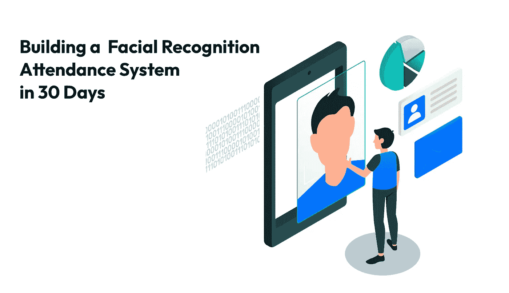

This article was written by Yasser Elsayed and Mohammed Fituri (and reviewed by Yusuf Musleh).

这个月，我们的考勤管理系统在启用仅一年后就达到了 900，000 次考勤。当我们沉浸在自己的成就中时，很容易忘记创始人(Mohammed Fituri)和我在启动这个项目时的艰难起步。

只有两名工程师(和一个梦想中的✨),我们能够在不到一个月的时间里构建出我们考勤管理系统的工作原型，并在不到三个月的时间里扩展到超过 1000 名员工。

这篇文章讲述了该产品的初始启动阶段，深入探讨了我们在构建产品时所面临的技术挑战。

***这个故事是写给 hack-y 解决方案的情书，讲述了在时间和资源有限的情况下，这些解决方案是如何创新的。***

# 背景

如果不解释事情的业务方面，很难讲述这个故事，因为它与我们在系统上拥有的用户数量直接相关。

> 毕竟，没有需求，你就无法恰当地扩展技术。

**SierraOne** 是 Mohammed Fituri 在 2019 年创立的一家公司，利用人工智能和计算机视觉来解决商业运营问题。2021 年初，卡塔尔最大的房地产公司 Regency Group Holding (RGH)接触了该公司，试图用云面部识别系统取代 RGH 的内部指纹系统。

## 要求

这笔交易取决于 30 天内在总部交付一个工作原型。交付物很简单，它必须具备:

*   一种高度可用的设备，可以在系统上注册员工，并每天检查员工的出入情况
*   运行面部识别和处理事件的云系统
*   实时显示所有活动的仪表板

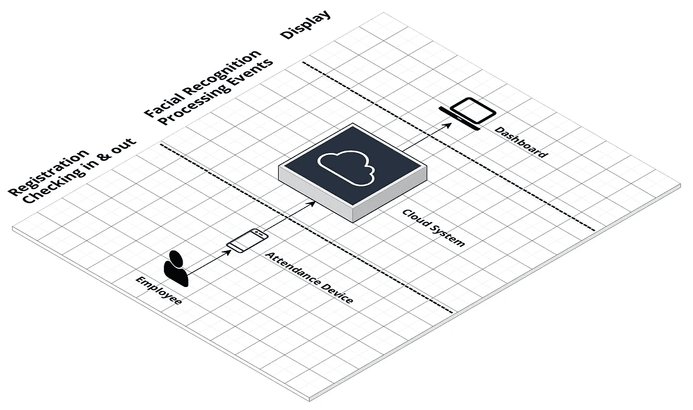

Simple in theory.

我们的团队由两名软件工程师组成(当时只有 Mohammed Fituri 和我)，所以，正如你所想象的，这对我们来说是一个巨大的挑战。事实上，起初这似乎是不可能的，但我们不能拒绝我们的第一个正式的，可能有利可图的交易。

*作者的一个小提示:*现在回想起来，接受这个挑战是不明智的，因为它违背了一个工程师的本能。作为一个领域，工程更倾向于可预测性、可重复性和可靠性，而这是没有保证的。我们时间有限，专业知识有限，资源有限；但我认为创新就在于此。

不用说，我们卷起袖子，冒着极不可能成功的风险。

# 后端、人工智能和仪表板

## 后端

由于时间紧迫，我们不想从头开始构建任何东西，除非我们真的不得不这么做。幸运的是，在我们之前的工作中，我们已经有一台本地服务器在多哈的一座大楼中运行。这台服务器负责运行我们为建筑监控开发的一些人工智能服务(车辆分类、物体检测等)。我们的计划是在前端和后端已经运行的系统之上构建一个“考勤”模块。

新模块共享了网络配置、部署周期、数据库模式、仪表板 UI，最重要的是来自已经运行的系统的 **AI 作业管理器**。这节省了我们很多时间。

> **注意:**这也很好地充当了样板设置，节省了我们选择技术的时间。

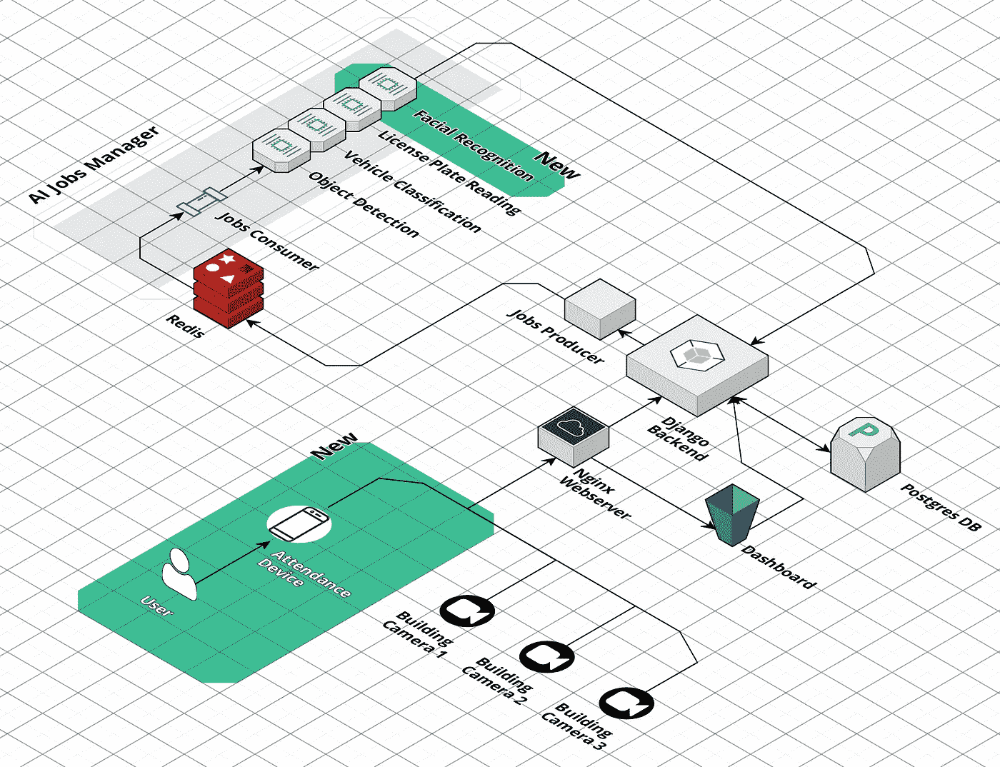

The green sections are the things we added to our infrastructure to support attendance.

考勤模块刚刚向后端系统添加了 3 样东西:

*   一种接收出勤事件的方式。
*   一个面部识别人工智能模型。
*   一种展示这些事件的方式。

整个系统已经设置好了，我们只需要在 [**Django**](https://www.djangoproject.com/) 后端和 [**ReactJS**](https://reactjs.org/) 仪表板中添加一个考勤模块。后端负责接收出勤事件，将其存储在我们的数据库中，并提示**作业生产者**为人工智能做好准备。仪表板只需在事件发生时实时显示这种交互的结果；为此，我们不得不使用由[**Django Channels**](https://channels.readthedocs.io/en/stable/)**管理的 [WebSocket API](https://developer.mozilla.org/en-US/docs/Web/API/WebSockets_API) 。**

Screenshot of our old dashboard. You can see that it’s shoved in with all the other modules.

Jobs Producer 将创建一个作业，将其保存在由[**redis**](https://redis.io/)**管理的队列中，并在途中发送到我们(全新的✨)的面部识别服务上运行。**

**现在我们需要建立的只是面部识别服务，并在我们的人工智能作业管理器中运行它。**

## **人工智能服务**

**我们需要一个人工智能模型从人脸图像中识别一个人。为此，我们使用了一个自定义实现的 [**FaceNet**](https://www.geeksforgeeks.org/facenet-using-facial-recognition-system/#:~:text=FaceNet%20is%20the%20name%20of,for%20Face%20Recognition%20and%20Clustering.) ，这是我们过去一直在做的(更多重用让我们开始！).**

**该模型有一项工作，它拍摄一张人脸的图像，并返回该人脸的嵌入图。嵌入基本上是由我们的模型创建的单个面的数学(矢量)表示。**

**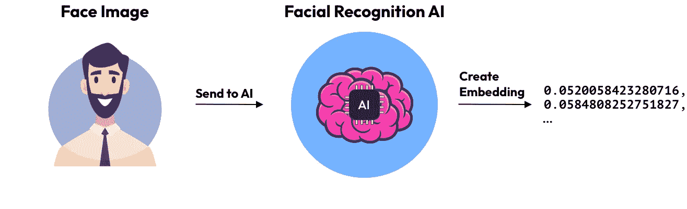**

**Creating embeddings from face images.**

**对于每个出席事件，我们将创建一个**新嵌入**，并将其与由同一人工智能创建的嵌入数据库进行比较。我们使用两个函数来比较嵌入: [**余弦相似度**](https://en.wikipedia.org/wiki/Cosine_similarity) 和 [**欧氏距离**](https://en.wikipedia.org/wiki/Euclidean_distance) 。**

**这些函数中的每一个都从新嵌入和旧嵌入的比较中返回一个分数。在两个函数中得分最高的数据库嵌入高于某个阈值，是与新嵌入最接近的匹配，因此被认为是来自数据库嵌入的同一个人。**

**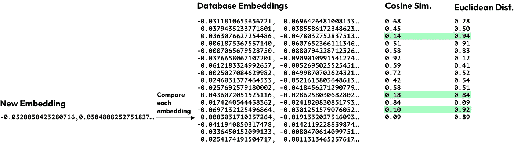**

**The comparison system. The green represents the embeddings past our threshold.**

**这种方法非常有效，我们相信，给定任何人脸，我们都能够找到最匹配的人，然后从数据库中检索这个人的其余信息。**

**现在我们已经得到了我们的结果，让我们在仪表板上显示它。**

# **移动应用程序**

**一切都准备好了，现在我们需要一种方法将注册和出勤图像发送回后端，并让它们反映员工的出勤情况。**

**我们用拇指指纹设备替换的主要问题是*不方便*，因此构建一个使用起来又慢又麻烦的应用程序完全是浪费时间。**

> **该设备以及与该设备的任何交互都必须流畅无缝。**

**该应用程序必须做好两件事:**准确捕获事件**，以及**快速方便地注册员工**；如果我们完成了这两个规范，我们的 MVP 将会是一个成功。我们选择了**反应型**，因为我们此时还不知道我们硬件的性质。**

## **捕捉事件**

**每天进行两次(有时更多次)登记/注销；如果我们的解决方案是一种缓慢或笨拙的体验，用户不会很快对它感到不满。我们设计的应用程序只需要用户最少的输入就能运行。**

**根据一天中的时间和用户的班次(在仪表板中输入)，我们的系统会自动猜测是签入还是签出，并向用户确认他们已经成功签入或签出。谢天谢地，我们开发的人工智能快如闪电，你可以在下面的 gif 中看到单次识别有多快。**

**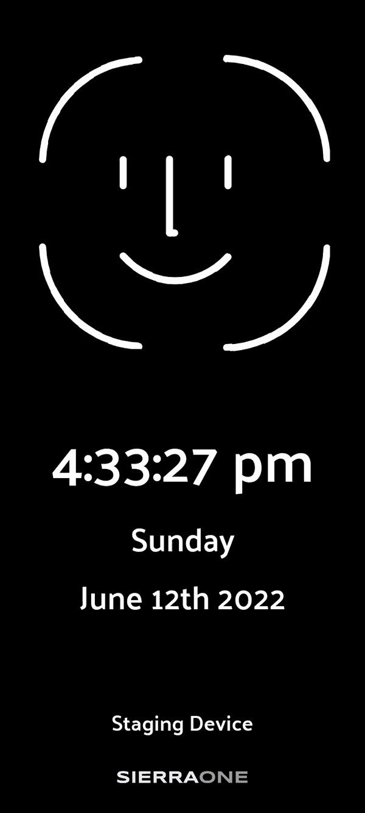**

**The process for checking in is super quick, and shows all the information the user needs to know.**

## **登记**

**当每天入住/退房时，一个人的面部图像会有变化。因此，一个人的注册图像必须能够很好地代表该人的面部，并且与他/她的日常变化有尽可能多的共同点。为了实现这一点，我们必须设置一些限制，我们可以将这些限制应用于系统上的所有注册图像。我们想出了 3 条规则:**

1.  **面部不应该离镜头太远或太近。**
2.  **脸应该是直的，不能向任何方向倾斜。**
3.  **面部要光线充足，不要在黑暗的地方拍摄。**

****实现#1 & #2** 我们使用 [**谷歌的人脸检测**](https://developers.google.com/ml-kit/vision/face-detection) 在设备本身上获取人脸。面部检测 API 为我们提供了每个面部的 [*滚动、俯仰和偏航*](https://www.researchgate.net/figure/The-head-pose-rotation-angles-Yaw-is-the-rotation-around-the-Y-axis-Pitch-around-the_fig1_281587953) 信息，这些信息告诉我们面部是否倾斜，是否没有直视，或者是否离摄像机太近/太远。我们使用此信息向当前在系统上注册的用户发送适当的消息。**

**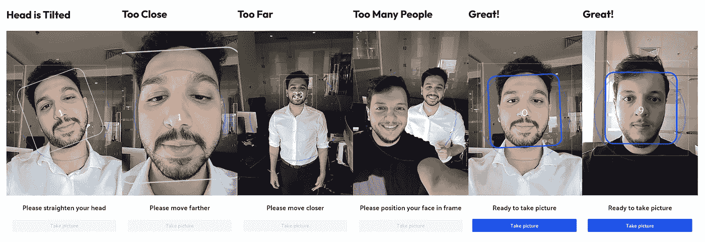**

**Our application gives messages to the user to adjust the face on screen.**

**反馈速度非常快，因为它都是在设备本身上运行的，这为用户提供了快速而简单的体验。**

****实现#3** 我们必须建立一个新的人工智能模型，它将照亮不同的面部特征……我只是在开玩笑。那将是合适的解决办法，但我们就是没有时间。**

**这不仅仅是一个工程问题，更重要的是找到一个合适的光线充足的位置来放置设备。将非工程解决方案作为问题解决过程的一部分，这是一个小小的教训。**

**这三个规则给了我们高质量的注册图像，并且没有太多的限制以至于注册体验很糟糕。**

**有了这两个功能，是时候开发我们的硬件了。**

# **硬件和安装**

**创始人和我都是软件工程师，对硬件开发知之甚少甚至一无所知，我们也没有钱雇佣或承包一家公司来开发和制造这些设备。**

**另外(我讨厌提醒读者)*我们时间不够了！*关键是要尽快开始，所以我们花在选择设备上的时间正好是: *0 秒。两个开发人员当时都有一台 iPad，所以他们做出了决定。***

**经过一周的开发，我们在 iPad 上实现了基本的面部识别。**

**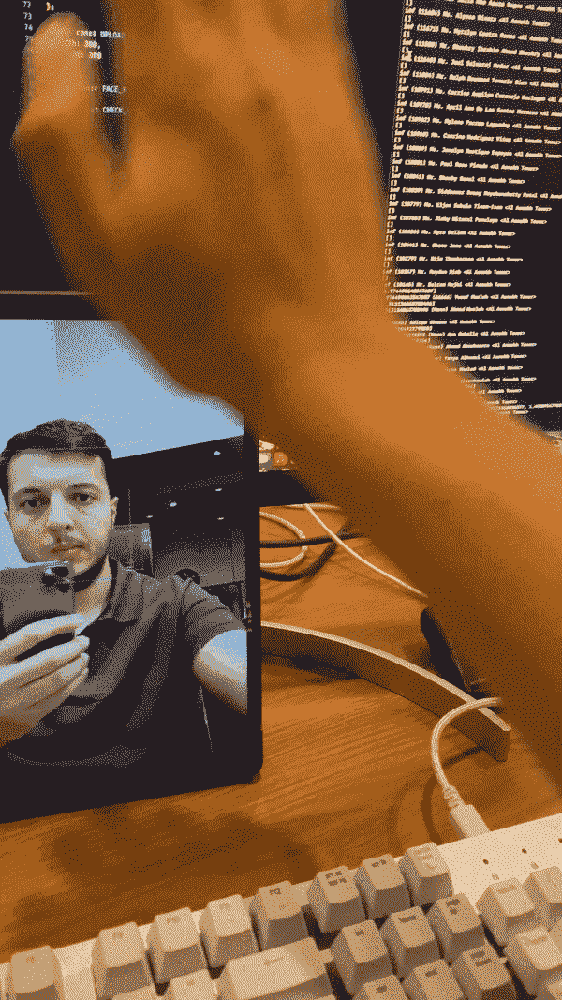**

**Mohammed Fituri testing a working implementation on his iPad.**

**在这一点上，我们知道如果我们成长的话，我们不可能把 iPad 卖给我们的每一个客户。我们不得不转向更便宜的设备，所以我们选择了更便宜的设备:安卓平板电脑。感谢 ReactNative，这不是一个非常昂贵的举动。**

**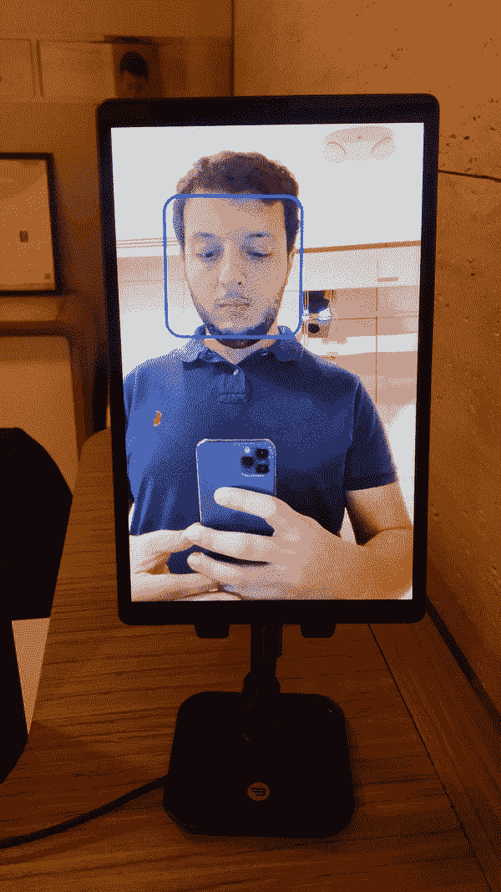**

**Mohammed Fituri testing a working implementation on an Android tablet.**

**安卓平板没砍。该设备的价格仍然太高，我们无法找到一个不是非常笨重和足够便宜的安装。这时候我们突然想到:**

> **我们就 3D 打印平板电脑外壳吧🤯**

**不幸的是，3D 打印一个大箱子太复杂了；我们需要打印多份并把它们放在一起，如果我们真的想出来了，打印一个案例的时间太长了。然后我们想到了另一个主意:**

> **我们还是用安卓手机吧🤯**

**手机的 3D 打印比平板电脑简单得多，更不用说我们在一台设备上可以节省这么多。这是应该走的路！**

**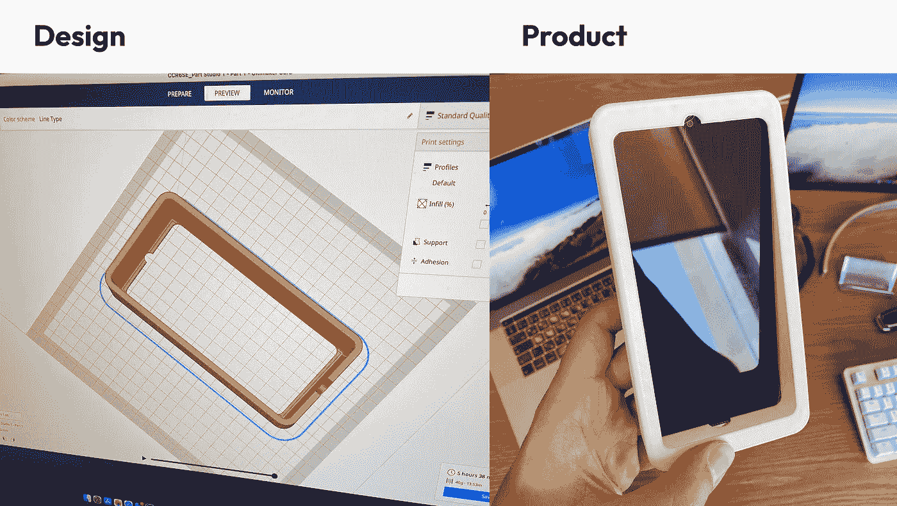**

**The Initial 3D design and product.**

**当然，使用电话也有不好的一面，但这没关系。这都是为了我们月底要交付的原型。我们知道最终我们会转向更强大的东西(我们做到了)。**

**这就是我爱上这个项目的点。我突然想到，我们正在开发整个考勤系统，各种各样的人可以使用我们长期以来学到的技巧从不同的设备上签到和签出。**

**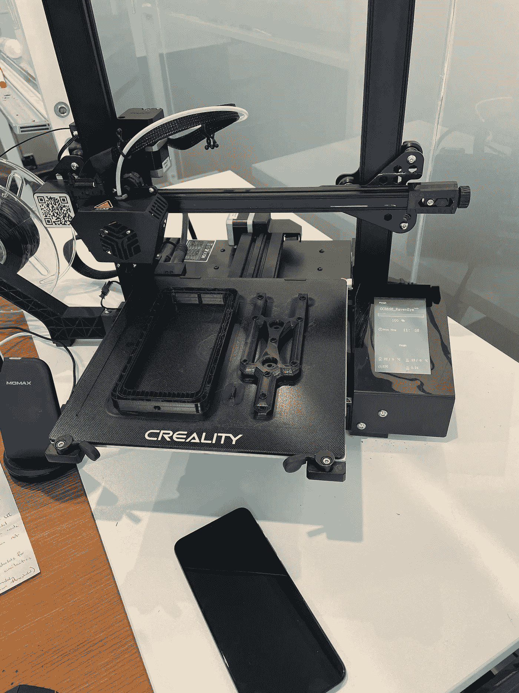**

**We also made it in black!**

**这种方法非常有效，我们能够按照约定在总部安装我们的第一台设备。**

**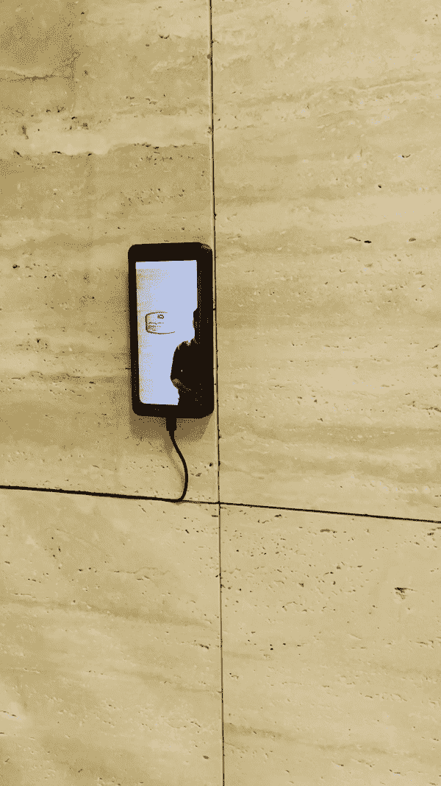**

**Our first installation (sorry for the bad quality)**

**事情进展顺利！我们的原型已经安装完毕，该系统能够无缝地注册 40 名员工。他们还能够非常顺利地办理入住和退房手续，我们的内部服务器毫不费力。**

# **结论**

**尽管在接下来的几个月中，我在本文中概述的许多内容都被更强大、更好的解决方案所取代，但这个管道系统能够承受卡塔尔 15 个地点的 1000 名员工每天进出的压力。**

**Hacky 解决方案对技术发展大有帮助。当面临非常困难的挑战时，有时需要一种斗志昂扬的态度。**

**我希望你喜欢这个故事。**