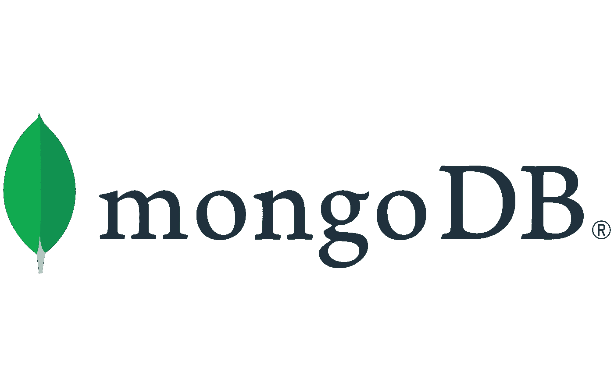

# 构建场堆栈应用程序—第 1 部分—安装和配置

> 原文：<https://medium.com/geekculture/building-a-farm-application-part-1-installation-and-configuration-ad730756e1fa?source=collection_archive---------29----------------------->

欢迎来到这个关于构建农场堆栈应用程序的系列教程。本教程结束时，您将学习开发、测试和部署场堆栈应用程序的所有必要步骤。

MongoDB is one of the components of FARM stack

# 什么是农场栈？

FARM 栈是 **FastAPI、React 和 MongoDB。**