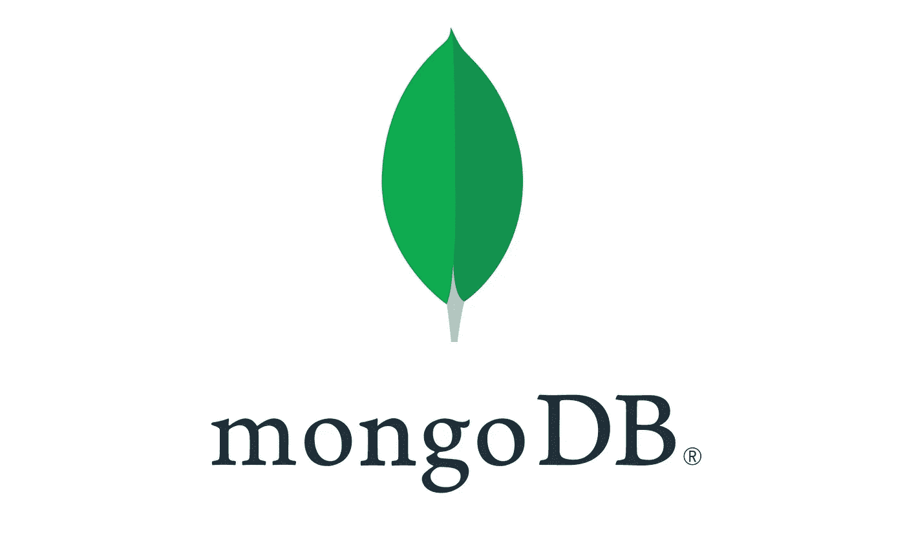

# 构建农场堆栈应用程序—第 3 部分— MongoDB 集成

> 原文：<https://medium.com/geekculture/building-a-farm-stack-application-part-3-mongodb-integration-2dd09d357ae3?source=collection_archive---------15----------------------->

本教程结束时，您将学习开发、测试和部署场堆栈应用程序的所有必要步骤。

欢迎来到这个关于构建农场堆栈应用程序的系列教程。本教程结束时，您将学习开发、测试和部署场堆栈应用程序的所有必要步骤。

MongoDB